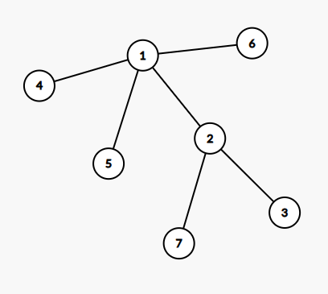
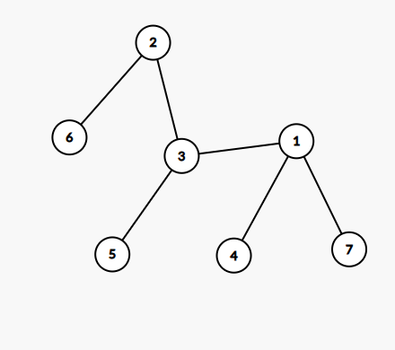
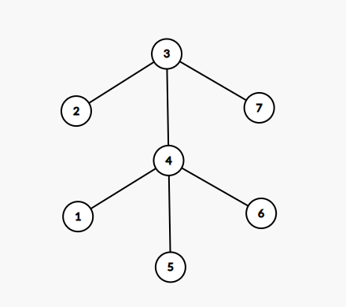
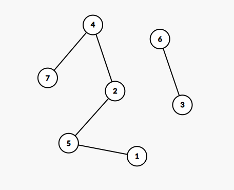
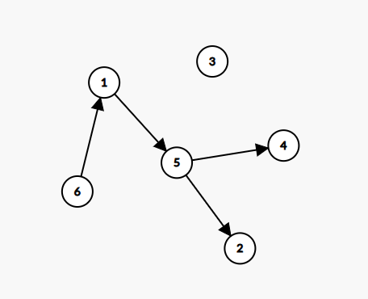

# Sesiunea 1

## Topicuri
- Rezolvare Subiect I - Bac 2023 Iunie
- Recapitulare functii
    - Oleaca de teorie
    - Exemple functii
- Resurse
- Antrenament


## Rezolvare Subiect I - Bac 2023 Iunie
1. Rezolvare:
    - a => valoarea 115
    - b => valoarea 115
    - c => valoarea 230
    - d => valoarea 460
    - Raspuns corect: `D`
2. Rezolvare
    ```c++
        n = 23 =>f(11) = 
           n = 11 => f(5) = 
                n = 5 => f(2) = 
                    n = 2 => f (1) = 
                        n = 1 => f (0)
                                - Aici am atins conditia de iesire din functie insa trebuie mare atentie la faptul ca trebuie sa ne intoarcem la instructiunea de afisare de la fiecare pas, in ordine inversa.
                                cout << 0
                        cout << 1
                    cout << 0
                cout << 1
            cout << 1
        cout << 1
    ```
    - Raspuns corect: 010111 -> `C`

3. 
- Rezolvare:
    ```c++
        strcpy(s, "bac2023") => s contine bac2023
        s[s[2]-'a'] = '\0'; => s contine = ba
        k = strlen(s) => k = 2
    ```
- Explicatie:
    - Avem expresia s[s[2]-'a'] = '\0', si acum o sa o spargem pe bucati, interior spre exterior
        1. `s[2]` = `c` deoarece variabila `s` contine cuvantul `bac2023` si al 3-lea caracter e `c`.
        2. Ne aducem aminte ca in ASCII codul aferent lui `c` mic este `99`
            - Link cu tabelul ASCII: https://www.commfront.com/pages/ascii-chart
        3. Stiind ca `s[2]` este egal cu `c` si stiind ca un caracter alfabetic poate fi scris ca si numar (in cazul nostru `99`), avem voie sa efectuam operatia `c`- `a` care este echivalenta cu `99 - 97`, adica `2`
            - Nu e neaparat nevoie sa stim codul din spatele caracterelor in situatiile de genul. Asta deoarece stim ca `c` si `a` se afla la 2 pozitii distanta unul de celalalt.
        4. Avand valoarea dinauntrul expresiei, ajungem la varianta simplificata: `s[2] = '\0'`
            - Asta inseamna ca la a 3-a pozitie a lui `s` noi o sa adaugam acel `'\0'` care inseamna "AICI se termina stringul/sirul tau"
        5. Avand doar 2 caractere in `s`, rezulta ca `strlen(s) = 2`
            - `IMPORTANT`: functia `strlen` nu va numar si caracterul ce marcheaza sfarsitul stringului (a.k.a `null terminating character` sau `'\0'`) 
- Raspuns corect: `C`

4. 
- Nota: Ca si resursa pentru viitoarele exercitii, recomand urmatoarele 3 pagini
    1. https://csacademy.com/app/graph_editor/ => Aici poti desena foarte usor grafurile astfel incat sa vezi ce rezolvi
    2. https://www.pbinfo.ro/articole/810/grafuri-neorientate
    3. https://www.pbinfo.ro/articole/509/grafuri-orientate
    - Ultimele 2 reprezinta o resursa suficienta pentru a intelege marea majoritate a exercitiilor cu grafuri.
        - E fain sa le parcurgi ca sa vezi care e treaba cu ele dupa care te duci punctat gen:
            - Ce e ala un grad
            - Ce e ala arbore de tati
            - Ce e aia matricea de adiacenta
            - Ce e ala lant
            - ...
            - etc.
- Rezolvare:
    - Mai jos avem poze cu arborii rezultati din fiecare vector de tati:
    - De retinut faptul ca nodul care are ca si tata valoarea `0` este radacina
    - a. 
        - Avem urmatorul vector de tati:
            ```c++
            Parinte: 0 1 2 1 1 1 2
            Copil    1 2 3 4 5 6 7
            ``` 
        - Vectorul se traduce prin:
            - Nodul `1` este `Radacina`
            - Nodul `1` este parinte pentru nodurile
                - `2`, `4`, `5`, `6`
            - Nodul `2` este parinte pentru nodurile
                - `3` si `7`
        - Arborele corespunzator

            
        

    - b. 
        - Avem urmatorul vector de tati:
        ```c++
            Parinte: 3 0 2 1 3 2 1
            Copil    1 2 3 4 5 6 7
        ``` 
        - Vectorul se traduce prin:
            - Nodul `2` este `Radacina`
            - Nodul `2` este parinte pentru nodurile:
                - `3` si `6`
            - Nodul `3` este parinte pentru nodurile:
                - `1` si `5`
            - Nodul `1`  este parinte pentru nodurile:
                - `4` si `7`
        - Arborele corespunzator:

            
    
    - c. 
        - Avem urmatorul vector de tati:
        ```c++
            Parinte: 4 3 0 3 4 4 3
            Copil    1 2 3 4 5 6 7
        ``` 
        - Vectorul se traduce prin:
            - Nodul `3` este `Radacina`
            - Nodul `3` este parinte pentru nodurile:
                - `2`, `4` si `7`
            - Nodul `4` este parinte pentru nodurile:
                - `1`, `5`, `6`

        - Arborele corespunzator:

            
    
    - d. 
        - Avem urmatorul vector de tati:
        ```c++
            Parinte: 5 4 3 0 2 3 4
            Copil    1 2 3 4 5 6 7
        ``` 
        - Vectorul se traduce prin:
            - Nodul `4` este `Radacina`
            - Nodul `4` este parinte pentru nodurile:
                - `2` si `7`
            - Nodul `2` este parinte pentru nodul:
                - `5`
            - Nodul `5` este parinte pentru nodul:
                - `1`
            - Nodul `3` este un nod izolat dar care are totusi un copil, anume nodul `6`

        - Arborele corespunzator:

            
    - Raspuns:
        - Problema ne cere sa cautam un arbore in care cel putin un nod are 3 ascendenti, adica exista alte 3 noduri care sunt legate direct cu nodul in sine (sensul fiind "in sus", mergand spre radacina)
        - Din poze, observam ca in arborele corespunzator punctului `b` avem 2 noduri cu cel putin 3 ascendenti:
            - Nodurile `4` si `7`
        - Totodata si la `D` putem gasi un nod cu 3 ascendenti doar ca arborele rezultat nu este valid
        - Raspuns corect: `B`


5. 
    - Rezolvare:
        - Inainte de a trece la rezolvarea propriu zisa, trebuie sa amintim unele lucruri:
            - Prin faptul ca avem banda unidirectionala, asta inseamna ca avem un graf orientat
            - Prin componenta tare conexa intelegem un subgraf in care intre oricare doua noduri distincte exista cel putin un drum:
                - Vezi: https://www.pbinfo.ro/articole/509/grafuri-orientate#intlink-13
            - Graful nostru initial arata precum mai jos:
                            
            - Problema ne cere sa spunem  numarul minim de benzi de transport pe care sa le adaugam astfel incat graful sa aiba 3 componente tare conexe, fiecare avand doar varfuri care reprezinte depozite cu acelasi tip de fructe.
            - Stim ca nodurile:
                - `1`,`3` si `5` au mere
                - `2` si `4` au pere
                - `6` are piersici
                - Astfel stim ce varfuri trebuie sa contina cele 3 componente tare conexe
                - Prin urmare daca trasam muchiile:
                    - `[5->3]`, `[1->3]`, `[2->4]` si `[4->2]` obtinem cele 3 componente tare conexe cerute.
                    - Raspuns corect: `A` 


## Recapitulare functii

### Oleaca de teorie
- O funcție definește o anumită sarcină pe care dorim să o îndeplinim, cum ar fi:
    - calcularea pătratului unui număr-
    - afișarea unui mesaj gen: "Hello world"
    - afișarea numelui complet al unei persoane
    - etc.
- Daca luam de exemplu o functie care calculeaza media geometrica a 3 numere:
    - Te poti gandi ca in loc sa copiezi undeva la 4,5 linii de cod de fiecare data, o sa ai doar o linie de cod.
    - O sa fie ceva gen: `calculeazaMedie(x,y,z)` sau `calculeazaMedie(a,b,c)`
    - daca nu ai fi avut functii, trebuie sa copiezi peste tot, toata logica ce iti calcula media.
- Un avantaj mare al functiilor este ca daca avem o problema de logica in calculul/operatiile pe care il/le face functia noastra (si prespunem ca e chemata in muuuulte locuri) noi vom avea de corectat intr-un singur loc, anume unde am definit functia si solutia probleme se va propaga automat peste tot unde e folosita.

- Pentru definirea unei funcții, vom utiliza următorul șablon:
    ```c++
        <tip întoarcere> <nume funcție> (<listă de parametri>){
        <corpul funcției>
    }
    ```
    - exemplu cu functie care intoarce o valoare:
        ```c++
            int computeAverage(int x, int y) {
                int average = ( x + y ) / 2;

                return average;
            }
        ```
     - exemplu cu functie care nu intoarce o valoare:
        ```c++
            void displayAverage(int x, int y) {
                int average = ( x + y ) / 2;

                cout << "Media celor doua numere este: " << average;
            }
        ```
- Acum, sa disecam fiecare parte din sablonul functiei:
- `<tip întoarcere>` 
    - O funcție poate întoarce una sau zero valori.
    - Daca intoarce o valoare aceasta poate fi de tipul `int`, `float`, `double`, etc.
    - Dacă nu întoarce o valoare, ar trebui să folosim cuvântul cheie `void` înainte de a declara numele funcției.

- `<nume funcție>` 
    - reprezintă numele pe care îl dăm acelei bucăți de cod care gestionează o sarcină specifică pentru noi. Acest lucru este util atunci când dorim să apelăm funcția ulterior.
        - Apelul unei funcții este ca o scurtătură, dorim doar să aducem funcționalitatea implementata in functie, pentru a o folosi în logica noastră, fără a o recrea.
            - De multe ori, functiile pe care le folosim, nici nu sunt scrise de noi. De exemplu, folosim funcția `cout`, dar aceasta este o bucată de cod care nu a fost creată de noi.
- `<listă de parametri>` 
    - reprezintă datele de intrare folosite de funcția noastră pentru a-și îndeplini responsabilitățile.
    - Putem extrapola putin si sa vedem functia ca pe o reteta de prajituri
        - `parametrii` sunt ingredientele pentru rețeta noastră (de exemplu, zahăr, lapte, etc.)
        - rețeta este logica care amestecă ingredientele (a.k.a. parametrii)
        - prajitura va fi rezultatul final al funcției noastre atunci când este apelată.

Nota: 
- Cu excepția funcției principale (adica `main`), fiecare funcție trebuie să fie definită înainte de a fi folosită.
Atunci când definim o funcție, trebuie doar să specificăm tipul întoarcerii, numele și lista de parametri, de exemplu:
    - `void afișareAdresă();`
    - `int calculDistanță(int x, int y);`
- De retinut ca o functie poate sa cheme o alta functie (sau mai multe). A se vedea exercitiul `6`.
- Cand o sa folosesti functiile pentru manipularea sirurilor (strcpy, strcat, strchr, strtok, etc), in visual studio, acesta se va plange ( pe buna dreptate :D) ca sunt invechite si trebuie inlocuite cu varianta `_s` adica `strcpy` devine `strcpy_s`, `strcat` devine `strcat_s`. Insa, se poate face modificarea ca acesta sa accepte si versiunea invechita (Sau, daca te plictisesti, pune direct in codeblocks, el accepta)


### Exemple functii
1. Scrieti o functie care transforma secundele, primite ca si parametru, in ore, minute si secunde, dupa care afisaza rezultatul in formatul: `HH:MM:SS`.
- Solutie:
    ```c++
        #include <iostream>
        using namespace std;

        void convertSecondsToFriendlyFormat(int secunde);

        int main() {
            int secunde;
            cout << "Introduceti numarul total de secunde: ";
            cin >> secunde;
            convertSecondsToFriendlyFormat(secunde);

            return 0;
        }

        void convertSecondsToFriendlyFormat(int secunde) {
            int ore = secunde / 3600;
            int minute = (secunde % 3600) / 60;
            int secundeRamase = secunde - (ore * 3600) - (minute * 60);

            cout << ore<<":"<<minute<<":"<<secundeRamase;
        }
    ```
2. Scrieti o functie care primeste ca si parametru un numar natural `n`. unde `n` > 100 si `n` <= 99999. Functia va returna cate cifre ale numarului sunt impare, -1 in cazul in care niciuna nu indeplineste conditia.
-  Date de intrare: `n` = 123456
-  Date de iesire: 3
-  Date de intrare: `n` = 2468
-  Date de iesire: -1
-  Solutie:
    ```c++
    #include <iostream>
    using namespace std;

    int numaraImpare(int n);

    int main() {
        int n;
        cout << "Introduceti n: ";
        cin >> n;
        cout << numaraImpare(n);

        return 0;
    }

    int numaraImpare(int n) {
        int contor = 0;
        while (n > 0) {
            int ultimaCifra = n % 10;
            if (ultimaCifra % 2 != 0) {
                contor++;
            }
            n = n / 10;
        }
        if (contor == 0) {
            return -1;
        } else {
            return contor;
        }
    }
    ```

3. Subprogramul `DoiTrei` are un parametru, `n`, prin care primeste un numar natural (n apartine intervalului [0, 10^9]). Subprogramul returneaza valoarea 1 daca toate cifrele lui `n` sunt din multimea `{2,3}` sau valoarea 0 in caz contrar. Scrieti definitia completa a programului.
- Date de intrare: `n` = 22323
- Date de iesire: 1
- Date de intrare: `n` = 2023
- Date de iesire: 0
- Solutie:
    ```c++
    #include <iostream>
    using namespace std;

    int DoiTrei(int n);

    int main() {
        int n;
        cout << "Introduceti n: ";
        cin >> n;
        cout << DoiTrei(n);

        return 0;
    }

    int DoiTrei(int n) {
        int rezultat = 1;
        while (n > 0) {
            int ultimaCifra = n % 10;
            if (ultimaCifra != 2 && ultimaCifra != 3) {
                rezultat = 0;
                break;
            }

            n = n / 10;
        }

        return rezultat;
    }
    ```

4. Scrieti un program care sa contina un subprogram ce va primi ca si parametru un numar `n`. Subprogramul va afisa toti divizorii numarului, separati prin spatiu.
- Date de intrare: `n` = 15
- Date de iesire: 1,3,5,15
- Solutie:
    ```c++
    #include <iostream>
    using namespace std;

    void afiseazaDivizori(int n);
    int main() {
        int n;
        cout << "Introduceti n: ";
        cin >> n;
        afiseazaDivizori(n);

        return 0;
    }

    void afiseazaDivizori(int n) {
        for (int i = 1; i <= n; i++) {
            if ( n % i == 0) {
                cout << i << " ";
            }
        }
    }
    ```

5. Scrieti un program care sa contina un subprogram ce va primi ca si parametru un numar `n`. Subprogramul va returna `1` daca numarul este `prim` sau `0` in caz contrar.
- Date de intrare: `n` = 21
- Date de iesire: 0
- Date de intrare: `n` = 13
- Date de iesire: 1
- Solutie: 
    ```c++
        #include <iostream>
        using namespace std;

        int estePrim(int n);

        int main() {
            int n;
            cout << "Introduceti n: ";
            cin >> n;
            cout << estePrim(n);

            return 0;
        }

        int estePrim(int n) {
            int rezultat = 1;
            for (int i = 2; i < n/2; i++) {
                if (n % i == 0) {
                    rezultat = 0;
                    break;
                }
            }

            return rezultat;
        }
    ```

6. Scrieti un program C++ care citeste de la tastatura un sir de caractere de maximum 50 de caractere. Programul va numara cate consoane si cate vocale sunt in sir. Atentie la faptul ca sirul de caractere poate contine caractere alfanumerice si literele vor fi toate litere mici ale alfabetului.
- Date de intrare: "ana are ac cu ata de 2 metri."
- Date de iesire:
    - `Consoane: 9`: 
    - `Vocale: 11`
- Solutie:
    ```c++
    #include <iostream>
    #include <string.h>

    using namespace std;

    int esteVocala(char ch);
    int esteConsoana(char ch);

    int main() {
    char propozitie[50];
    cout << "Introduceti maximum 50 de caractere de la tastatura: ";
    cin.getline(propozitie, 50);

    int totalConsoane = 0;
    int totalVocale = 0;
    for (int i = 0; i < strlen(propozitie); i ++) {
        if (esteVocala(propozitie[i]) == 1) {
            totalVocale++;
        } else if (esteConsoana(propozitie[i])) {
            totalConsoane++;
        }
    }

    cout << "Consoane: " << totalConsoane << endl;
    cout << "Vocale: " << totalVocale;

        return 0;
    }

    int esteVocala(char ch) {
        return strchr("aeiou", ch) != nullptr;
    }

    int esteConsoana(char ch) {
        if (ch >= 'a' && ch <= 'z' && !esteVocala(ch)){
            return 1;
        } else {
            return 0;
        }
    }
    ```

## Resurse
- https://www.pbinfo.ro/articole/810/grafuri-neorientate
- https://www.pbinfo.ro/articole/509/grafuri-orientate
- https://csacademy.com/app/graph_editor/
- https://cplusplus.com/reference/cstring/strcpy/
- https://cplusplus.com/reference/cstring/strchr/


## Antrenament
Nota: 
- o sa folosesc interschimbabil cuvintele `functie/subprogram`. Asta doar ca sa te obsinuiesti ca is una si acelasi lucru. Plus, pe net daca vei cauta detalii, e util sa folosesti cuvantul functii (`function`)
- de asemenea daca vezi ca folosesc un cuvant pe care nu il intelegi, nu te sfii sa il cauti pe internet.

1. Scrieti un program care sa contina o functie ce va calcula restul impartirii a doua numere primite ca si parametru.
- Date de intrare: `13`, `7`
- Date de iesire: `6`

2. Scrieti un program care sa contina un subprogram ce va primi ca parametru un numar `n` si o cifra `k`, unde `n` cuprins in intervalul `[999, 999999]` si  `k` cuprins in intervalul `[0, 9]`. Functia va intoarce numarul de aparitii ale cifrei `k` in numarul `n` sau `-1` daca nu se gaseste nici macar o aparitie.
- Date de intrare: `n` = 545343, `k` = 3
- Date de iesire: `2` 

3. Subprogramul `calcul` are un singur parametru, `n`, prin care primeste un numar natural (n apartine intervalului [2, 1000]). Subprogramul returneaza suma divizorilor proprii lui `n` care sunt numere prime. Scrieti definitia completa a subprogramului.
Exemplu: Daca `n`=15, dupa apel, subprogramul va return valoarea `8`. Numerele prime care sunt divizori proprii ai lui `15` sunt `3` si `5`.


