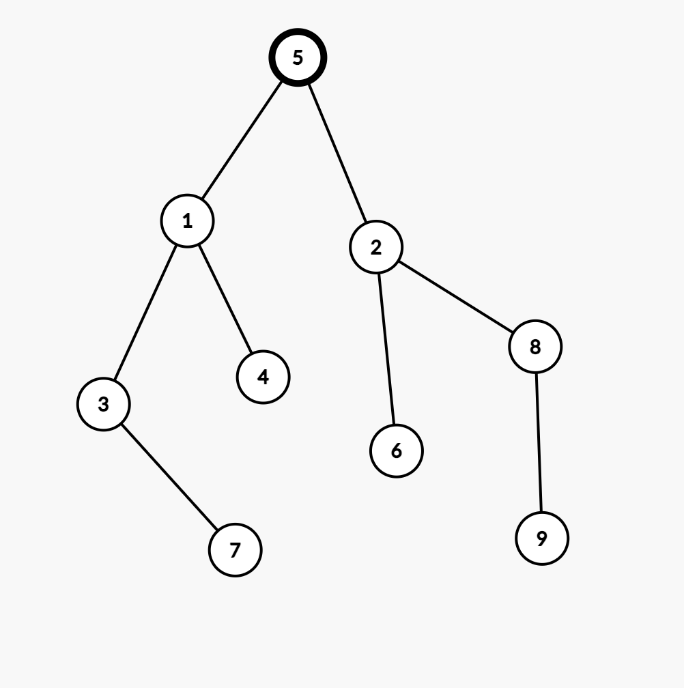

# Rezolvare Subiect #5

## Subiectul I

1. 
    - Rezolvare:
        - Prima expresie ne spune ca prima cifra a lui x este egala cu ultima cifra a lui y
        - A doua expresie ne spune prima cifra a lui y este egala cu ultima a lui x
        - Prima cifra a lui este egala cu ultima sa cifra + 1
        - Acum sa ne gandim la posibile valori:
            (x, y) => (21,12), (43, 34), (54, 45), (65,56), (76, 67), (87, 78),(98, 89)
        - Rezulta ca x-y, in toate cazurile va fi 9. 
        - Raspuns corect: `d`
2. 
    - Rezolvare:
        ```json
            n = 2022, i = 5 => f(404, 6)
                n = 404, i = 6 => f(67, 7)
                    n = 67, i = 7 => f(9, 8)
                        n = 9, i = 8 => f(1, 9)
                            n = 1, i = 9 => f(0, 10)
                                n = 0 => cout 10
        ```
        - Raspuns corect: `b`
3. 
    - Rezolvare:
        - Primele 4 sunt:
            `6 5 4 3 2 1`,
            `6 5 4 3 1 2`,
            `6 5 4 2 3 1`,
            `6 5 4 2 1 3`,
        - Urmatoarele 2 sunt:
            `6 5 4 1 3 2`,
            `6 5 4 1 2 3`
        - Raspuns corect: `c`
4. 
    - Rezolvare:
        - Daca luam prin eliminare variantele:
            - a => pentru 6 varfuri, avem o matrice de adiacenta cu 36 de elemente si conform cerintei am avea 12 valori de 1 si 24 de 0.
            - b => pentru 10 varfuri, avem o matrice de adiacenta cu 100 de elemente, insemnand ca nu putem sa indeplinim conditiile cerintei
            - c => pentru 2 varfuri, avem o  matrice de adiacenta cu 4 elemente, si din nou, nu putem sa indeplinim conditiile cerintei
            - d =>  pentru 9 varfuri, avem o  matrice de adiacenta cu 81 de elemente, si conform cerintei am avea 54 de valori de 0 si 27 de valori de 1
            - Aici putem observa ca `b` si `c` sunt eliminate din start. Mai ramane `a` si `d` ca posibile variante. Insa, stiind ca e vorba de graf neorientat, trebuie ca numarul de valori sa fie par asta deoarece, de exemplu, daca varful (x) mere catre varful (y), fiind neorientat, si varful (y) va mere catre varful (x) rezulta raspuns corect `a`
5.  - Rezolvare:
        - In acest caz trebuie sa luam valorile si pentru fiecare sa generam un arbore:
            * a => x=3 si y = 5 rezulta vectorul de tati: `[5 5 1 1 0 3 5 3 8]`
            ```json
                1 2 3 4 5 6 7 8 9
                5 5 1 1 0 3 5 3 8
                - De aici avem:
                    - nodul 5 radacina
                    - 5 parinte pentru 1, 2 si 7.
                    - Din start cade deoarece nu mai este un arbore binar
            ```
            * b => x = 8 si y = 3 => rezulta vectorul de tati: `[5 5 1 1 0 8 3 8 8]`
            ```json
                1 2 3 4 5 6 7 8 9
                5 5 1 1 0 8 3 8 8
                - De aici avem:
                    - nodul 5 radacina
                    - 5 parinte pentru 1 si 2.
                    - 1 parinte pentru 3 si 4
                    - 8 parinte pentru 7, 8, 9.
                    - Si aceasta varianta cade deoarece nu mai este un arbore binar
            ```
            * c => x = 4 si y = 2 => rezulta vectorul de tati: `[5 5 1 1 0 4 2 4 8]`
            ```json
                1 2 3 4 5 6 7 8 9
                5 5 1 1 0 4 2 4 8
                - De aici avem:
                    - nodul 5 radacina
                    - 5 parinte pentru 1 si 2.
                    - 1 parinte pentru 3 si 4
                    - 4 parinte pentru 6 si 8
                    - 2 parinte pentru 7
                    - 8 parinte pentru 9
                    - Mai jos avem arborele de unde se observa lantul de lungime 4
            ```
            
            * d => x = 2 si y = 3 => rezulta vectorul de tati: `[5 5 1 1 0 2 3 2 8]`
            ```json
                1 2 3 4 5 6 7 8 9
                5 5 1 1 0 2 3 2 8
                - De aici avem:
                    - nodul 5 radacina
                    - 5 parinte pentru 1 si 2.
                    - 1 parinte pentru 3 si 4
                    - 2 parinte pentru 6 si 8
                    - 3 parinte pentru 7
                    - 8 parinte pentru 9.
                    - Mai jos avem arborele specific acestei cerinte de unde se observa ca nu avem un lant de lungime 4
            ```
            
            - Raspuns corect: `c`
## Subiectul II
1. 
    * a 
        - Rezolvare
            ```json
                n = 375629
                max = 0
                    n = 37562
                    max < 2 true
                        max = 2
                    n = 3756
                    max < 6
                        max = 6
                    n = 375
                    max < 5 false
                    n = 37
                    max < 7
                        max = 7
                    n = 3
                    max < 3 false
                    n = 0
                scrie 7
            ```
    * b
        - Programul calculeaza cifra maxima, din numar, cu exceptia ultimei cifre care nu este luata in calcul
        - Tinand cont ca avem un numar de 3 cifre si maxima in primele 2 sa fie 7 avem asa:
            - 10 numere care incep cu 1
                - 1 7 x
                    - unde x poate fi orice numar din `[0,1,2,3,4,5,6,7,8,9]`
            - 10 numere care incep cu 2
                 - 2 7 x
                    - unde x poate fi orice numar din `[0,1,2,3,4,5,6,7,8,9]`
            - 10 numere care incep cu 3
                 - 3 7 x
                    - unde x poate fi orice numar din `[0,1,2,3,4,5,6,7,8,9]`
            - 10 numere care incep cu 4
                 - 4 7 x
                    - unde x poate fi orice numar din `[0,1,2,3,4,5,6,7,8,9]`
            - 10 numere care incep cu 5
                 - 5 7 x
                    - unde x poate fi orice numar din `[0,1,2,3,4,5,6,7,8,9]`
            - 10 numere care incep cu 6
                 - 6 7 x
                    - unde x poate fi orice numar din `[0,1,2,3,4,5,6,7,8,9]`
            - 80 numere care incep cu 7 adica avem un numar de forma:
                 - 7 x y
                    - unde x poate fi orice numar din `[0,1,2,3,4,5,6,7]`
                    - si y poate fi orice numar din `[0,1,2,3,4,5,6,7,8,9]`
                - care se traduce prin 1 * 8 * 10 = 80
            
        - In total avem 140 de numere
    * c 
        ```c++
            #include <iostream>
            using namespace std;

            int main()
            {
                int n;
                cin >> n;
                int max = 0;
                do {
                    n = n /10;
                    if (max < n % 10) {
                        max = n % 10;
                    }
                } while (n != 0);
                cout << max;
            }
         ```
         - Si mai jos un program care ne valideaza cerinta de la punctul b:
            ```c++
                #include <iostream>
                using namespace std;

                int main()
                {
                    int contor = 0;
                    for (int i = 100; i <= 999; i++) {
                        int n = i;
                        int max = 0;
                        do {
                            n = n /10;
                            if (max < n % 10) {
                                max = n % 10;
                            }
                        } while (n != 0);
                        if (max == 7) {
                            cout << i << endl;
                            contor++;
                        }
                    }
                    cout << "Avem " << contor << " numere intre 100 si 999 care afiseaza 7 in urma algoritmului";
                }
            ```       
    * d
        ```json
            citeste n (numar natural nenul de cel mult 8 cifre)
            max <- 0
            n = n / 10;
            daca (max < n % 10) atunci
                    max <-  n % 10
            cat timp (n != 0) executa
                n = n/10
                daca (max < n % 10) atunci
                    max <-  n % 10
            scrie max
        ```
2. 
    - Rezolvare:
        ```c++
            cout << sqrt(z.re*z.re + z.im*z.im)
        ```
3. 
    - Rezolvare:
        - nota: autorul a uitat sa introduca secventa..  dar hai sa ne imaginam noi ca avem un sir care contine caracterele `A, B, C, D` si nu avem voie sa folosim alte variabile afara de `a` (sir), `i` si `j`  pentru a afisa matricea din poza din carte
        - putem observa ca pe diagonala principala avem litera `A` si cand mergem la stanga sau la dreapta scriem in ordine alfabetica. De exemplu, linia 2, avem pe pozitia 2 litera `A`, putem merge un caracter la dreapta ca sa nu depasim intervalul specificat deci punem urmatoarea litera, adica `B`. La stanga insa, putem merge doua pozitii, pe prima punem `B` si pe a doua, punem `C`.
        - Practic, putem spune ca daca suntem pe diagonala principala, punem caracterul `A` si in rest punem caracterul care se afla la aceeasi distanta de `A` egala cu distanta dintre pozitia curenta si pozitia diagonalei principale (in modul, desigur)
        ```c++
            #include <iostream>
            using namespace std;

            int main()
            {
                char a[4][4];
                for (int i = 0; i < 4; i++) {
                    for (int j = 0; j < 4; j++) {
                        if ((j - i) >= 0) {
                            a[i][j] = 'A'+ (j-i);
                        } else {
                            a[i][j] = 'A' + (i-j);
                        }
                    }
                }

                // Afisam matricea. Practic solutia este reprezentata de for-urile de mai sus
                cout << endl;
                for (int i = 0; i < 4; i++) {
                    for (int j = 0; j < 4; j++) {
                        cout << a[i][j] << " ";
                    }
                    cout << endl;
                }

            }
        ```
        - Deoarece solutia noastra este muult mai simpla decat ce ofera cartea insa fiind mai compacta poate genera probleme la intelegere asa ca hai sa o explicam
            - Un element se afla pe diagonala principala daca i = j. Asta inseamna ca in cazul nostru, daca i ar fi egal cu j, am pune `A`+ 0, adica `A`
            - Daca un element sa zicem se afla la dreapta de diagonala principala, atunci `j` va fi  mai mare decat `i` si diferenta dintre ele va reprezenta distanta dintre `A` si caracterul ce va trebui sa scriem
                - Exemplu j = 3 si i = 0 inseamna ca va trebui sa scriem al 3-lea caracter de dupa A, adica `D`
            - Insa, daca un element se afla la stanga de diagonala principala, atunci `j` va fi mai mic decat `i` si deoarece nu avem voie sa avem distante negative, scadem pe `j` din `i` pentru a afla elementul care se afla la o anumita distanta fata de `A`
                - Exemplu i = 2 si j = 0 inseamna ca va trebui sa scriem al i - j element de dupa `A`, adica `C`
            - Dupa cum se vede in cod, nu am declarat alte variabile, deci am respectat cerinta si nici nu ne-am batut capul cu indexi asa tare
## Subiectul III

1. 
    - Rezolvare:
        ```c++
            #include <iostream>
            using namespace std;

            int calcul(float numere[], int n);

            int main(){
                float numere[] = {2.14, 4.5, 23.5, 40.5, 65.4, 12.5};
                cout << calcul(numere, 6);
            }

            int calcul(float numere[], int n) {
                float medie = 0.0;
                float suma = 0.0;
                for (int i = 0; i < n; i++) {
                    suma += numere[i];
                }
                medie = suma / n;
                int contor = 0;
                for (int i = 0; i < n; i++) {
                    if (numere[i] <= medie) {
                        contor++;
                    }
                }

                return contor;
            }
        ```

2. 
    - Rezolvare:
        ```c++
            #include <iostream>
            #include <fstream>

            using namespace std;

            int esteVocala(char ch);

            int main(){
            ifstream fin("bac.txt");

            char propozitiaCeaMaiLunga[201];
            int numarVocaleMaxim = 0;

            char propozitiaCurenta[201];
            while (fin.getline(propozitiaCurenta, 201)) {
                int numarVocale = 0;
                for (int i = 0; i < strlen(propozitiaCurenta); i++) {
                    if (esteVocala(propozitiaCurenta[i])) {
                        numarVocale++;
                    }
                }
                if (numarVocale >= numarVocaleMaxim) {
                    numarVocaleMaxim = numarVocale;
                    strcpy(propozitiaCeaMaiLunga, propozitiaCurenta);
                }
            }

            cout << propozitiaCeaMaiLunga;

            fin.close();
            }

            int esteVocala(char ch) {
            return strchr("aeiou", ch) != NULL;
            }
        ```
3. 
    - Rezolvare:
        * a
            ```json
                Programul se reduce la a avea numerele sortate crescator (formandu-se un set cu ele, anume daca 0 apare de 3 ori, il luam o singura data sau mai bine zis, ca apare o data sau de 100 de ori, nu ne pasa asa mult) si afisarea lor, doua cate 2, cu conditia ca diferenta intre ele sa fie mai mare decat 1.
                In algoritmul de mai jos, avem o solutie eficienta din punct de vedere al timpului de executie deooarece parcurgem fisierul o singura data, timp in care si populam un vector de aparitii (sau frecventa).
                Dupa aceea, ne uitam la elementele din vectorul de aparitii care au cel putin o aparitie si afisam elementele, 2 cate doua, cu proprietatea ca intre ele exista o diferenta mai mare decat 1. Facem lucrul acesta cu ajutorul unei variabile prin care stim unde incepe intervalul, variabila pe care o actualizam cu fiecare element care are cel putin o aparitie.
            
            ```
        * b
            ```c++
                #include <iostream>
                #include <fstream>

                using namespace std;

                int main(){
                ifstream fin("bac.txt");
                int numere[100]= {0};
                int numar = 0;
                while (fin >> numar) {
                    numere[numar]++;
                }

                int pozitieInceputInterval = -1;
                int existaPerechi = 0;
                for (int i = 0; i < 100; i++) {
                    if (numere[i] != 0 ) {
                        if (pozitieInceputInterval == -1) {
                            pozitieInceputInterval = i;
                        } else if (i > (pozitieInceputInterval+1)) {
                            cout << pozitieInceputInterval << " " << i << endl;
                            existaPerechi = 1;
                        }
                        pozitieInceputInterval = i;
                    }
                }

                if (existaPerechi == 0) {
                    cout << "NU EXISTA";
                }
                fin.close();
                }

            ```