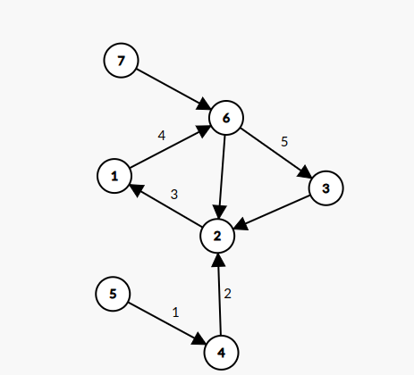
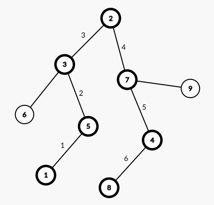
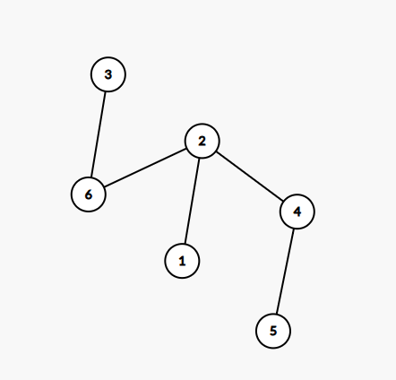

# Rezolvare test 6 si test 7

## Test 6

## Subiectul I
1. 
    - Rezolvare:
        * a -> `% este operator aritmetic` [`ADEVARAT`]
        * b -> `> este operator relational` [`ADEVARAT`] 
        * c -> `<= este operator logic` [`FALS`] -> Este operator relational. Putem observa si din exemplul de la varianta `b`
        * d -> `&&  este operator logic` [`ADEVARAT`]
        * Raspuns corect: `c`
2. 
    - Rezolvare:
        ```json
            f('B') = f('A') [la intoarcere trebuie sa afisam `B` dar si sa calculam din nou f('A')]
                = Afisam 'A'
            = Afisam 'B' si Afisam 'A'
        ```
    - Raspuns corect `ABA` -> `b`

3. 
    - Rezolvare: 
        * Notam elementele multimii astfel:
            ```json
                0       1       2       3    
                ghiocel zambila narcisa lalea
            ```
        * Primele 6 submultimi generate sunt:

            `ghiocel` -> `[0]`

            `ghiocel zambila` -> `[0 1]`

            `ghiocel zambila narcisa` -> `[0 1 2]`

            `ghiocel zambila narcisa lalea` -> `[0 1 2 3]`

            `ghiocel zambila lalea` -> `[0 1 3]`

            `ghiocel narcisa` -> `[0 2]`
        * Putem observa ca ultima submultime  trebuie sa contina elementul `lalea` deci prin eliminare optiunea `b` este adevarata
            * intr-o alta ordine de idei, se poate observa cum numarul de elemente este crescator in prima faza, dupa care scade deci vom avea ceva de genul 1 element, 2 elemente, 1 element, exact cum avem si in optiunea `b`
4. 
    - Rezolvare:
        * conform cerintei avem urmatorul graf:
            * Tineti cont ca:
                * 1 -> nu este prim
                * 2 -> este prim
                * 3 -> este prim
                * 4 -> nu este prim
                * 5 -> este prim
                * 6 -> nu este prim
                * 7 -> este prim
            * drum elementar: este un drum(lant) in care nu se repeta noduri. Lungimea unui drum este data de numarul de arce.
            * teorie drum elementar: https://www.pbinfo.ro/articole/509/grafuri-orientate#intlink-11
        
        * Se observa ca cel mai lung drum elementar este: [5, 4, 2,1, 6, 3] care are lungimea 5. Raspuns corect: `b`

5. 
    - Rezolvare:
        * Conform vectorului de tati avem:
            ```json
                1 2 3 4 5 6 7 8 9
                5 0 2 7 3 3 2 4 7
            ```
            * Radacina: nodul 2
            * 2 parinte pentru 3 si 7
            * 7 parinte pentru 4 si 9
            * 3 parinte pentru 5 si 6
            * 4 parinte pentru 8
            * 5 parinte pentru 1
        * Arborele corespunzator vectorului de tati este:
        
        * Raspuns corect: 6 -> `d`

## Subiectul II
1. 
    * a
        ```json
            n = 720
            f = 2
            720 > 1
                p = 0
                n % f == 0 true
                    n = 360
                    p = 1
                n % f == 0 true
                    n = 180
                    p = 2
                n % f == 0 true
                    n = 90
                    p = 3
                n % f == 0 true
                    n = 45
                    p = 4
                n % f == 0 fals
                Afiseaza: "2^4*"
                f = 3
            45 > 1
                p = 0
                n % f == 0 true
                    n = 15
                    p = 1
                n % f == 0 true
                    n = 5
                    p = 2
                n % f == 0 fals
                Afiseaza: "3^2*"
                f = 4
            5 > 1
                p = 0
                n % f == 0 fals
                f = 5
            5 > 1
                p = 0
                n % f == 0 true
                    n = 1
                    p = 1
                Afiseaza "5^1*"
        ```
        - Programul afiseaza: `2^4*3^2*5^1*`

    * b -> `1`
    * c
        ```c++
            #include <iostream>

            using namespace std;
            int main() {

                int n;
                cin >> n;
                int f = 2;
                while (n > 1) {
                    int p = 0;
                    while (n % f == 0) {
                        n = n / f;
                        p = p + 1;
                    }
                    if (p != 0) {
                        cout << f <<"^"<<p<<"*";
                    }
                    f= f + 1;
                }
                return 0;
            }
        ```
    * d 
        ```json
            citeste n (numar natural nenul)
            f = 2
            daca n > 1 atunci
            executa
                p <- 0
                daca (n%f) = 0 atunci
                    executa
                        n <- [n/f]
                        p <- p+1
                    cat timp (n % f = 0)
                daca (p!= 0) scrie f, "^",p,"*"
                f <- f+1
            cat timp (n > 1)
        ```
2. 
    - Rezolvare:
        ```c++
            C.x = (A.x+B.x) / 2;
            C.y = (A.y + B.y) / 2;
        ```
3. 
    - Rezolvare:
        ```c++
            i = 0;
            j = strlen(s) - 1;
            while (i < j) {
                char temp = s[i];
                s[i] = s[j];
                s[j] = temp;
                i++;
                j--;
            }
        ```
## Subiectul III
1.
    - Rezolvare:
        ```c++
            #include <iostream>

            using namespace std;

            int numarare(int[], int);

            int main() {
                int v[] = {1234, 2342, 3453, 5678, 8768};
                int n = 5;
                cout << numarare(v, n);
                return 0;
            }

            int numarare(int v[], int n) {
                int contor = 0;
                for (int i = 0; i < n; i++) {
                    int primaCifra = v[i] / 1000;
                    int ultimaCifra = v[i] % 10;
                    if (primaCifra == ultimaCifra) {
                        contor++;
                    }
                }
                return contor;
            }

        ```
2.   
    - Rezolvare:
        ```c++
        #include <iostream>
        #include <cstring>

        using namespace std;

        int numarare(int[], int);

        int main() {
            char s[101];
            cin.getline(s, 101);
            int contor = 0;
            char* token = strtok(s, " ");
            while (token != NULL) {
                int i = 0;
                int j = strlen(token)-1;
                int estePalindrom = 1;
                while (i < j) {
                    if (token[i] != token[j]) {
                        estePalindrom = 0;
                        break;
                    }
                    i++;
                    j--;
                }
                if (estePalindrom == 1) {
                    contor++;
                }
                token = strtok(NULL, " ");
            }

            cout << contor;
            return 0;
        }
        ```
    - Nota: o buna parte din logica se regasea la subiectul II, exercitiul 3. Practic, un cuvant este palindrom daca literele aflate pe pozitii simetrice sunt identice.
3. 
    - Rezolvare:
        * a
            O sa implementam un algoritm care va parcurge fisierul si va salva numerele citite intr-un vector de frecvente ce va avea 101 elemente, maximum. Dupa care, vom parcurge vectorul de frecventa, incepand cu pozitia 0 si vom afisa doar numerele ce vor avea frecventa 1. Algoritmul este eficient din punct de vedere al timpului de executie deoarece  parcurgem o singura data fisierul, si din punct de vedere al memoriei, este eficient deoarece din maximum de 1_000_000 de numere cate pot fi, noi o sa avem maximum 101 numere in memorie.
        * b
            ```c+
                #include <iostream>
                #include <fstream>

                using namespace std;


                int main() {
                    int frecventa[101] = {0};
                    ifstream fin("date.in");
                    int numar;
                    while (fin>> numar) {
                        frecventa[numar]++;
                    }

                    for (int i = 0; i < 101;i++) {
                        if (frecventa[i] == 1) {
                            cout << i <<" ";
                        }
                    }
                    fin.close();
                    return 0;
                }
            ```

--------------------------

## Test 7


## Subiectul I
1. 
    - Rezolvare:
        - Nota: in exercitiile de acest gen, incercam sa eliminam din variante. Conform cerintei, trebuie sa avem valoarea adevarat (`1`) daca si numai daca x si y reprezinta numere naturale consecutive. Deci daca reusim sa obtinem `1` pentru numere care nu sunt consecutive, inseamna ca trebuie sa eliminam optiunea respectiva. De asemenea, o optiune este eliminata daca nu obtinem 1 pentru numere naturale consecutive
        - Acum sa le luam pe rand:
            * a -> pentru x = 3 si y = 4, obtinem 1 insa obtinem 1 si daca am avea x = 3 si y = 7 deci a pica
            * b -> pentru x = 3 si y = 4, obtinem fals deci pica si optiunea b
            * c -> pentru x= 3 si y = 4, obtinem adevarat. Si pare ca nu obtinem valoarea de adevar pentru alte numere afara de cele consecutive. Momentan e candidata la a fi raspunsul corect.
            * d -> cade din start. Nu obtinem 1 doar pentru numere consecutive. Expresia va fi adevarata si pentru:
                * x = 3, y = 4
                * x = 3, y = 5
                * x = 4, y = 5
                * x = 4, y = 6
                * etc
            - Raspuns corect: `c`

2. 
    - Rezolvare:
        ```json
            f(2023, 2022) =
                1 + f(2023, 2023) = 
                    1 + f(2022, 2023) =
                        = 0
                    = 1
                = 2
        ```
    - Raspuns corect: `b`

3. 
    - Rezolvare:
        - Pentru a fi mai usor de rezolvat, o sa notam cu cifre de la 0 la 6 cele 7 rase de caini astfel:
            * Ciobanesc Anatolian -> `0`
            * Ciobanesc Australian -> `1`
            * Ciobanesc Belgian -> `2`
            * Ciobanesc Carpatin -> `3`
            * Ciobanesc Caucazian -> `4`
            * Ciobanesc de Bucovina -> `5`
            * Ciobanesc German -> `6`
        - Prin urmare, primele 3 solutii date in enunt sunt:
            * `0 1 2 3 4 5 6`
            * `0 1 2 3 4 6 5`
            * `0 1 2 3 5 4 6`
        - Urmatoarele 2 solutii sunt:
            * `0 1 2 3 5 6 4`
            * `0 1 2 4 3 5 6`
        - Nota: logica pare destul de ciudatica, conform raspunsului lor.. ceva de genul (consideram prima cifra, ultima de la dreapta pt a intelege mai usor):
            - la al doilea pas, se muta prima pe a doua pozitie
            - la al treilea pas, se muta prima pe a 3-a pozitie
            - la al patrulea pas, se muta din nou prima pe a doua pozitie
            - la al 5-lea pas, se muta prima pe a 4-a pozitie


        - Raspuns corect: `a`
            ```json
                * Ciobanesc Anatolian
                * Ciobanesc Australian
                * Ciobanesc Belgian
                * Ciobanesc Caucazian
                * Ciobanesc Carpatin
                * Ciobanesc de Bucovina
                * Ciobanesc German
            ```
4. 
    - Rezolvare:
        * `strstr` -> va intoarce pozitia de unde se gaseste un sir de caractere in alt sir. De exemplu daca vom face urmatorul apel: `strstr("ana are ac cu ata", "ac")` se va returna `"ac cu ata"`
        * prin urmare, raspunsul este: `vidi,vici` => `b`

5. 
    - Conform cerintei, mai jos avem graful ce rezulta din enunt:
         
    - Rezulta ca nodurile care indeplinesc cerinta sunt:
        * 2
        * 4
        * 6
    - Raspuns corect: `b`
## Subiectul II
1.
    * a
        ```json
            x = 52, y = 64
            c = 0
            repeta
                i = 0
                j = 0
                i+j = 0 -> true
                    c = 1
                x = 26*1+0 = 26
                y = 32*1+0 = 32
            i*j = 1 fals -> repetam instructiunea
                i = 0
                j = 0
                i+j = 0 -> true
                    c = 2
                x = 13*1+0
                y = 16*1+0
            i*j = 1 fals -> repetam instructiunea
                i = 1
                j = 0
                i+j = 0 fals
                x = 6*0+13*1 = 13
                y = 8*1+0 = 8
            i*j = 1 fals -> repetam instructiunea
                i = 1
                j = 0
                i+j = 0 -> fals
                x = 6*0+13*1 = 13
                y = 4*1+0 = 4
            i*j = 1 fals -> repetam instructiunea
                i = 1
                j = 0
                i+j = 0 -> fals
                x = 6 * 0+13*1 = 13
                y = 2*1+0 = 2
            i*j = 1 fals -> repetam instructiunea
                i = 1
                j = 0
                i+j = 0 -> fals
                x = 6 * 0+ 13 * 1 = 13
                y = 1*1+0 = 1
            i * j = 1 fals -> repetam instructiunea
                i = 1
                j = 1
                i+j = 0 dals
                x = 13
                y = 1
            i * j = 1 deci ne oprim
            afisam c -> afisam 2
        ```
    * b
        - Programul afiseaza cea mai mica putere a lui 2, din descompunerea in factori primi a celor doua numere
        - Prin urmare, trebuie sa dam doua valori care atunci cand le descompunem in factori primi, sa nu contina 2
        - 243 si 125 (am "trisat" putin, am luat doar numere care nu au 2 in descompunerea in factori, ca sa fie mai usor)
    * c
        ```c++
            #include <iostream>

            using namespace std;

            int main() {
                int x, y;
                cin >> x;
                cin >> y;
                int c = 0;
                int i,j;
                do {
                    i = x % 2;
                    j = y % 2;
                    if (i+j == 0) {
                        c = c+1;
                    }
                    x = x/2 * (1 - i) + x * i;
                    y = y /2 * (1 - j) + y * j;
                } while (i*j != 1);
                cout << c;
                return 0;
            }

        ```
    * d
        ```json
            citest x, y ( numere naturale nenule)
            c <- 0
            cat timp (i * j != 1) executa
                i <- x%2
                j <- y%2
                daca i+j = 0 atunci c<- c+1
                x <- [x/2]*(1-i) + x * i
                y <- [y/2] * (1-j) + y * j
            scrie c
        ```
2. 
    - Rezolvare:
        * nota:
            * observam urmatoarele:
                * elementele de pe diagonala principala sunt toate egale cu 0
                * elementele de pe diagonala secundara sunt egale cu numarul linii + 1
                * restul elementelor sunt egale cu diferenta dintre 4 si numarul coloanei
                * asta daca plecam de la 0.daca plecam de la 1, trebuie o mica adjustare..insa nu e nevoie.
        * solutie:
            - Mai intai solutia pentru oameni normali..care incep de la 0...
        ```c++
            #include <iostream>
            #include <fstream>

            using namespace std;

            int main() {
                int matrice[4][4] ={0};
                for (int i = 0; i < 4; i++) {
                    for (int j = 0; j < 4; j++) {
                    if (i == j) {
                        matrice[i][j] = 0;
                    } else if (i+j == 4-1) {
                        matrice[i][j] = i+1;
                    } else {
                        matrice[i][j] = 4 - j;
                    }
                    }
                }

                // Aici afisam. Este doar pentru noi. Pe foaia de examen nu trebuie sa o scrii.
                for (int i = 0; i < 4; i++) {
                    for (int j = 0; j < 4; j++) {
                        cout << matrice[i][j]<< " ";
                    }
                    cout << endl;
                }
                return 0;
            }

        ```

        * si aici solutia pentru cei cu nevoi speciale care incep de la 1..adica exact cum iti cere problema..
            ```c++
                #include <iostream>
            #include <fstream>

            using namespace std;

            int main() {
                int matrice[4][4] ={0};
                for (int i = 1; i <= 4; i++) {
                    for (int j = 1; j <= 4; j++) {
                    if (i == j) {
                        matrice[i-1][j-1] = 0;
                    } else if (i+j-2 == 4-1) {
                        matrice[i-1][j-1] = i;
                    } else {
                        matrice[i-1][j-1] = 4 - j + 1;
                    }
                    }
                }

                // Aici afisam. Este doar pentru noi. Pe foaia de examen nu trebuie sa o scrii.
                for (int i = 0; i < 4; i++) {
                    for (int j = 0; j < 4; j++) {
                        cout << matrice[i][j]<< " ";
                    }
                    cout << endl;
                }
                return 0;
            }           
            ```
3. 
    - Rezolvare:
        ```c++
            #include <iostream>
            #include <cstring>

            using namespace std;

            int main() {
                char s[100] = "Ana are MeEe si mioare";
                int i = 0;
                while (i < strlen(s)) {
                    if (s[i]>= 65 && s[i]<= 90) {
                        strcpy(s+i, s+i+1);
                    }
                    i++;
                }
                cout << s;
                return 0;
            }
        ```
## Subiectul III

1. 
    - Rezolvare:
        ```c++
            #include <iostream>

            using namespace std;

            float medie(int, int[]);

            int main() {
                int x[] = {4, 3, 4, 3, 4, 3, 10};
                int n = 7;

                cout << medie(n,x);
                return 0;
            }

            float medie(int n, int x[]) {
                float suma = 0.0;
                int contor = 0;
                for (int i = 0; i < n; i++) {
                    if ((i+1) % 2 == 1 && x[i] % 2 == 0) {
                        suma+=x[i];
                        contor++;
                    }
                }
                if (suma > 0) {
                    return suma/contor;
                } else {
                    return 0.0;
                }
            }
        ```

2. 
    - Rezolvare:
        ```c++
            #include <iostream>

            using namespace std;

            int sumaCifre(int n);
            int areSumaCifrelorPara(int n);

            int main() {
                // Am hardcodat valorile pentru vector pentru a testa mai repede.
                // Tu va trebui sa citesti de la tastatura elementele
                int n = 6;
                int v[] = {11, 25, 66, 132, 57, 16};


                for (int i =0; i < n-1; i++) {
                    for (int j = i+1; j < n; j++) {
                        if (areSumaCifrelorPara(v[i]) && areSumaCifrelorPara(v[j])) {
                            // sortam descrescator
                            if (v[i] < v[j]) {
                                int temp = v[i];
                                v[i] = v[j];
                                v[j] = temp;
                            }
                        } else if (!areSumaCifrelorPara(v[i]) && !areSumaCifrelorPara(v[j])) {
                            if (v[i] > v[j]) {
                                int temp = v[i];
                                v[i] = v[j];
                                v[j] = temp;
                            }
                        }
                    }
                }

                for (int i =0; i < n; i++) {
                    cout << v[i] << " ";
                }
                return 0;
            }

            int areSumaCifrelorPara(int n) {
                int suma = sumaCifre(n);
                if (suma % 2 == 0) {
                    return 1;
                } else {
                    return 0;
                }
            }

            int sumaCifre(int n) {
                int sum = 0;
                while (n) {
                    sum += n % 10;
                    n /= 10;
                }

                return sum;
            }
        ```
    
3. 
    - Rezolvare:
        * a
            ```json
                Algoritmul de mai jos parcurge numar cu numar, din fisierul dat si cu ajutorul unei functii auxiliare, vedem daca numarul de divizori este impar, caz in care vom incrementa un contor.
                Daca, la final, cand am terminat de evaluat numerele din fisierul de intrare, valoarea contorului va fi tot 0, vom scrie "NU EXISTA", altfel vom scrie valoarea propriu zisa.
                Algoritmul este eficient din punct de vedere al timpului de executie deoarece se executa o singura parcurgere a elementelor din fisier, timp in care si incrementam un contor. In acelasi timp, algoritmul este eficient din punct de vedere al memoriei deoarece din toate cele maximum 1 milion de numere cate pot fi in fisier, noi o sa avem in memorie, maximum 1 element si nu vom declara alte structuri pentru a manipula datele.
            ```
        * b
            ```c++
                #include <iostream>
                #include <fstream>

                int numarDivizori(int n);

                using namespace std;
                int main() {

                    ifstream fin("numere.in");
                    ofstream fout("numere.out");
                    int contor = 0;
                    int numar;
                    while (fin >> numar) {
                        if (numarDivizori(numar) % 2 == 1) {
                            contor++;
                        }
                    }

                    if (contor == 0) {
                        fout << "NU EXISTA";
                    } else {
                        fout << contor;
                    }

                    fin.close();
                    fout.close();
                    return 0;
                }

                int numarDivizori(int n) {
                    int contor = 0;
                    for (int i = 1; i <=n; i++) {
                        if (n % i == 0) {
                            contor++;
                        }
                    }
                    return contor;
                }

            ```