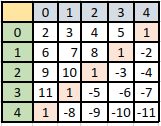

# Recapitulare Matrici / Vectori 2D / Vectori Bidimensionali

## Agenda
* Introducere in Matrici
* Declarare si initializare
* Accesare elemente din matrice
* Formule importante
* Exercitii "clasa"
* Exercitii de antrenament

## Introducere in Matrici
* Matricile pot fi vazute ca o extensie a vectorilor 1D. Dupa cum stii, intr-un vector, elementele sunt aranjate pe aceeasi linie. Si pentru a accesa un element din vector putem folosi un singur index care ne spune pozitia la care se afla elementul dorit. De retinut ca index-ul porneste de la 0, ceea ce inseamna, de exemplu ca al doilea element va avea index-ul 0.

* Pentru a accesa un element dintr-o matrice avem nevoie de doua valori, spre deosebire de un vector 1D, anume:
    - Index-ul pentru linie
    - Index-ul pentru coloana
        - De exemplu, casuta marcata mai jos cu rosu se gaseste pe linia 3 si coloana 2
        * 
            * NOTA: numarul de linii nu trebuie sa fie egal cu numarul de coloane insa o sa vedem putin mai incolo.
* Acum, sa complicam putintel lucrurile, am zis mai sus ca un vector 2D este o extensie a unui vector 1D, ce am vrut sa spun prin asta este ca putem vedea un vector 2D, ca pe un  vector normal, unde fiecare dintre elementele sale sunt un vector la randul lor
    * Desigur, acum putem sa mergem mai departe si sa ne gandim la un vector 3D, asa, de dragul artei insa nu este acesta scopul dar feel free sa iti imaginezi cum ar arata un vector 3D
        * Hint: Search google for 3D Matrix

## Declarare si initializare
* In sectiunea asta o sa ne focusam pe modul in care putem declara si initializa o matrice in C/C++.
* Ca si orice variabila pe care o declaram in C/C++, trebuie sa ii specificam tipul. De exemplu, pentru a declara un vector 1D in care vrem sa stocam elemente de tipul `char`, scriem ceva similar cu:
    ```c++
        char vectorCaractere[n] // unde n reprezinta numarul maxim de elemente pe care vrem sa le stocam in vector
    ```
    * Ca o mica recapitulare, intr-un vector, toate elementele AU ACELASI TIP de date, asta inseamna ca nu putem sa stocam, in acelasi vector, de exemplu,elemente care au si tipul `char` si tipul `float`

    Tot la fel trebuie sa procedam si cu o matrice doar ca aici vom avea de specificat doua valori, anume cate linii si cate coloane va avea matricea noastra:
    ```c++
        char matriceCaractere[linii][coloane];
    ```
    * Tine minte faptul ca prima oara specifici liniile si pe urma coloanele.
* Foarte important este faptul ca avem doua tipuri de matrici:
    - Matrici oarecare
        - Adica matrici unde numarul de linii si cel de coloane sunt diferite. De exemplu: `int matrice[3][4]`
    - Matrici patratice
        - Adica matrici unde numarul de linii este egal cu numarul de coloane. De exemplu: `int matrice[5][5]`

* Pentru a initializa o matrice, o sa comparam din nou cu felul in care initializam un vector normal. De exemplu, mai jos o sa vedem un set de instructiuni unde mai intai initializam un vector  odata cu declararea lui dupa care vedem si cum am putea sa il initializam de la tastatura:
    ```c++
        // Declarare si initializare
        int numere[4] = {1,2,3,4};
        
        int n;
        cin >> n;
        int numere2[n];
        // Initializare
        for (int i = 0; i < n; i++) {
            cin >> numere2[i];
        }
    ```
    Acum sa vedem cum facem acelasi lucru doar ca de data asta pentru o Matrice (Vector2D)
    ```c++
        // Declarare si initializare
        int matrice[3][4] = {
                {1,2,3,4},
                {6,7,8,9},
                {10, 11, 12, 13}
        };
        
        // Declarare:
        int linii, coloane;
        cin >> linii >> coloane;
        int matrice2[linii][coloane];
        
        for (int i = 0; i < linii; i++) {
            for (int j = 0; j < coloane; j++) {
                cin >> matrice2[i][j];
            }
        }
    ```
* De asemenea un lucru foarte important, daca iti aduci aminte, atunci cand voiam sa setam toate elementele dintr-un vector sa aibe valoare 0 (sau o alta valoare arbitrara) scriam ceva de genul: `int numere[n] = {0}`. La fel putem proceda si pentru cand vrem ca toate elementele dintr-o matrice sa aibe aceeasi valoare: `int matrice[4][4] = {0}` si putem observa ca nu trebuie sa specificam doua valori in acest caz.

## Accesare elemente din matrice
* Am vorbit ca matricile sunt o extensie a vectorilor 1D si ca pentru a manipula elementele din ele, trebuie sa folosim doua valori, prima va specifica numarul linii si a doua va specifica numarul coloanei. De retinut faptul ca ambele pleaca de la 0. Asta inseamna ca elementul care se gaseste pe prima linie si prima coloana va putea fi accesat folosind `[0][0]`.
    - Nota `[]` se numeste operatorul pentru indexare, asa, pentru tine :D
* Acum, hai sa facem un mic programel in care initializam noi direct o matrice si programelul va trebui sa afiseze elementele care sunt impare:
    ```c++
        #include <iostream>

        using namespace std;

        int main() {

            int matrice[3][4] = {
                    {1,2,3,4},
                    {6,7,8,9},
                    {10, 11, 12, 13}
            };


            for (int i = 0; i < 3; i++) {
                for (int j = 0; j < 4; j++) {
                    if (matrice[i][j] % 2 == 1) {
                        cout << matrice[i][j] << " ";
                    }
                }
            }
            return 0;
        }
    ```
## Formule importante
* Unele dintre cele mai populare exercitii cu matrici pe care o sa le intalnesti o sa presupuna manipularea intr-un anumit fel al elementelor de pe diagonala principala si/sau secundara.
    * NOTA: pentru a vorbi despre diagonala principala si/sau secondara, neaparat matricea TREBUIE SA FIE PATRATICA

* Mai jos vedem cu rosu care sunt elementele de pe diagonala principala si cu albastru care sunt elementele de pe diagonala secunda
    * 
    * 

* Acum, haide sa disecam putin fiecare dintre cazuri
    * ca si mic sfat, de fiecare data cand iti este greu sa iti dai seama cam cum trebuie sa faci ca sa obtii o matrice sau ca sa o creezi, tinand cont de un exemplu dat, noteaza-ti indecsii elementelor si incearca sa vezi o corelare intre ei si linie, coloana, numarul de elemente, etc

### Pentru diagonala principala
* o sa scriem pozitiile la care se gasesc elementele de pe diagonala principala:
    * `[0,0]`,
    * `[1,1]`,
    * `[2,2]`,
    * `[3,3]`,
    * `[4,4]`,
* Putem observa ca o caracteristica a elementelor de pe diagonala principala este faptul ca ele se gasesc pe pozitiile unde index-ul liniei este egal cu index-ul coloanei. Mai jos avem si un cod care afiseaza elementele de pe diagonala principala a unei matrici.
    ```c++
        #include <iostream>

        using namespace std;

        int main() {

            int matrice[4][4] = {
                    {1,2,3,4},
                    {6,7,8,9},
                    {10, 11, 12, 13},
                    {14, 15, 16, 17}
            };


            for (int i = 0; i < 4; i++) {
                for (int j = 0; j < 4; j++) {
                    if (i == j) {
                        cout << matrice[i][j] << " ";
                    }
                }
            }
            return 0;
        }

    ```
### Pentru diagonala secundara
* o sa scriem pozitiile la care se gasesc elementele de pe diagonala principala:
    * `[0,4]`,
    * `[1,3]`,
    * `[2,2]`,
    * `[3,1]`,
    * `[4,0]`,
* Aici putem observa o corelare intre indecsii coloanelor si numarul de elemente de pe linie, anume putem vedea ca fiecare element de pe diagonala secundara  se afla pe o pozitie unde suma indexilor este egala cu numarul total de elemente de pe aceea linie -1, mai precis: `i+j = n-1`. Acum haide sa vedem cum scriem un cod care afiseaza elementele de pe diagonala secundara de aceasta data:
    ```c++
        #include <iostream>

        using namespace std;

        int main() {

            int matrice[4][4] = {
                    {1,2,3,4},
                    {6,7,8,9},
                    {10, 11, 12, 13},
                    {14, 15, 16, 17}
            };


            for (int i = 0; i < 4; i++) {
                for (int j = 0; j < 4; j++) {
                    if ((i+j) == 4-1 ) {
                        cout << matrice[i][j] << " ";
                    }
                }
            }
            return 0;
        }

    ```

### Alte situatii intalnite
* De asemenea, mai sunt populare exercitiile in care se cere sa se afiseze sau prelucreze elementele care se afla fie deasupra\dedesubt-ul diagonalei principale si/sau secundare sau elementele care se afla intr-unul sau mai multe dintre cele 4 cadrane formate odata cu intersectia celor doua diagonale.

* Mai jos, o sa vedem cum putem face sa ajungem la elementele din fiecare din situatiile exemplificate mai sus

#### Afisare elemente de-o parte si de alta a diagonalei principale
* Vom folosi matricea din imaginea de mai jos
    * 
* Acum haideti sa le luam pe rand, toate elementele de deasupra diagonalei principale sa vedem cam ce indexi au ele:
    ```json
        2 -> [0, 1]
        3 -> [0, 2]
        4 -> [0, 3]
        5 -> [0, 4]
        6 -> [1, 2]
        7 -> [1, 3]
        8 -> [1, 4]
        9 -> [2, 3]
        10 -> [2, 4]
        11 -> [3, 4]
    ```
    * Un prim lucru pe care il putem observa este faptul ca, intotdeauna, indexul coloanei este mai mare decat cel al liniei, prin urmare haideti sa scriem o bucatica de cod care va face fix asta:
        ```c++
            #include <iostream>

            using namespace std;

            int main() {

                int matrice[5][5] = {
                        {1,  2,  3,   4,   5},
                        {-2, 1,  6,   7,   8},
                        {-3, -4, 1,   9,   10},
                        {-5, -6, -7,  1,   11},
                        {-8, -9, -10, -11, 1},
                };


                cout << "Afisare elemente de deasupra diagonalei principale: " <<endl;
                for (int i = 0; i<5; i++) {
                    for (int j = 0; j < 5; j++) {
                        if (j > i) {
                            cout << matrice[i][j] << " ";
                        } else {
                            // Am pus tab doar de dragul de a le afisa mai frumos
                            // Ca si cum am fi extras doar numerele de deasupra diagonelei principale
                            cout << "\t";
                        }
                    }
                    cout << endl;
                }

                return 0;
            }
        ```
    * Mai departe haideti sa ne uitam la elementele de sub diagonala principala sa vedem ce putem observa din indecsii lor:
        ```json
            -2 -> [1, 0]
            -3 -> [2, 0]
            -4 -> [2, 1]
            -5 -> [3, 0]
            -6 -> [3, 1]
            -7 -> [3, 2]
            -8 -> [4, 0]
            -9 -> [4, 1]
            -10 -> [4, 2]
            -11 -> [4, 3]
        ```
    * Dupa cum poate te asteptai, aici lucrurile sunt in oglinda, anume, pentru fiecare element, indexul liniei este mai mare decat cel al coloanei. Mai jos avem bucatica de cod care va afisa strict elementele de sub diagonala principala
        ```c++
            #include <iostream>

            using namespace std;

            int main() {

                int matrice[5][5] = {
                        {1,  2,  3,   4,   5},
                        {-2, 1,  6,   7,   8},
                        {-3, -4, 1,   9,   10},
                        {-5, -6, -7,  1,   11},
                        {-8, -9, -10, -11, 1},
                };


                cout << "Afisare elemente de sub diagonala secundara: " <<endl;
                for (int i = 0; i<5; i++) {
                    for (int j = 0; j < 5; j++) {
                        if (i > j) {
                            cout << matrice[i][j] << " ";
                        } else {
                            // Am pus tab doar de dragul de a le afisa mai frumos
                            // Ca si cum am fi extras doar numerele de deasupra diagonelei principale
                            cout << "\t";
                        }
                    }
                    cout << endl;
                }

                return 0;
            }

        ```

#### Afisare elemente de-o parte si de alta a diagonalei secundare

* Vom folosi matricea din imaginea de mai jos
    * 
* Acum haideti sa le luam pe rand, toate elementele de deasupra diagonalei secundara sa vedem cam ce indexi au ele:
    ```json
        2 -> [0, 0]
        3 -> [0, 1]
        4 -> [0, 2]
        5 -> [0, 3]
        6 -> [1, 0]
        7 -> [1, 1]
        8 -> [1, 2]
        9 -> [2, 0]
        10 -> [2, 1]
        11 -> [3, 0]
    ```
* Aici e mai complicat putin, nu mult, va trebui sa ne folosim de formula pe care o folosim ca aflam numerele de pe diagonala secundara, anume `i+j = n-1` si totodata putem observa ca numerele de deasupra diagonalei secundare sunt numerele care sunt in stanga ei de aici, corelat cu indexii de mai sus putem spune ca pentru numerele de deasupra diagonalei secundare putem folosi formula `(i+j) < (n-1)` unde `n` reprezinta numarul de elemente de pe linie
* Mai jos avem codul c++ care va afisa doar elementele de deasupra diCadranele se noteaza in sensul acelor de ceasornic, similar cu poza de mai jos:agonalei secundare
    ```c++
        #include <iostream>

        using namespace std;

        int main() {

            int matrice[5][5] = {
                    {2,  3,  4,   5,   1},
                    {6, 7,  8,   1,   -2},
                    {9, 10, 1,   -3,   -4},
                    {11, 1, -5,  -6,   -7},
                    {1, -8, -9, -10, -11},
            };


            cout << "Afisare elemente de deasupra diagonalei secundare: " <<endl;
            for (int i = 0; i<5; i++) {
                for (int j = 0; j < 5; j++) {
                    if ((i +j) < (5-1)) {
                        cout << matrice[i][j] << " ";
                    } else {
                        // Am pus tab doar de dragul de a le afisa mai frumos
                        // Ca si cum am fi extras doar numerele de deasupra diagonelei principale
                        cout << "\t";
                    }
                }
                cout << endl;
            }
    ```

* Acum haide sa vedem elementele de sub diagonala secundara ce indecsi au:
    ```json
        -2 -> [1, 4]
        -3 -> [2, 3]
        -4 -> [2, 4]
        -5 -> [3, 2]
        -6 -> [3, 3]
        -7 -> [3, 4]
        -8 -> [4, 1]
        -9 -> [4, 2]
        -10 -> [4, 3]
        -11 -> [4, 4]
    ```
* Dupa cum poate te asteptai, aici lucrurile sunt in oglinda, anume, pentru fiecare element, stiind ca este in dreapta diagonalei secundare si stiind totodata formula elementelor de pe diagonala secundara + indecsii lor, avem: `(i+j) > (n-1)`
* Codul c++ de mai jos evidentiaza acest lucru:
    ```c++
        #include <iostream>

        using namespace std;

        int main() {

            int matrice[5][5] = {
                    {2,  3,  4,   5,   1},
                    {6, 7,  8,   1,   -2},
                    {9, 10, 1,   -3,   -4},
                    {11, 1, -5,  -6,   -7},
                    {1, -8, -9, -10, -11},
            };


            cout << "Afisare elemente de sub diagonala secundara: " <<endl;
            for (int i = 0; i<5; i++) {
                for (int j = 0; j < 5; j++) {
                    if ((i +j) > (5-1)) {
                        cout << matrice[i][j] << " ";
                    } else {
                        // Am pus tab doar de dragul de a le afisa mai frumos
                        // Ca si cum am fi extras doar numerele de deasupra diagonelei principale
                        cout << "\t";
                    }
                }
                cout << endl;
            }

            return 0;
        }    
    ```

## Exercitii "clasa"

* Nota: exercitiile sunt extrase de pe site-ul pbinfo de la link-ul: 
1. https://www.pbinfo.ro/probleme/313/diagonale
- Solutie:
    ```c++
        #include <iostream>

        using namespace std;

        int main() {

            int n;
            cin >> n;
            int matrice[n][n];

            for (int i = 0; i < n; i++) {
                for (int j = 0; j < n; j++) {
                    cin >> matrice[i][j];
                }
            }

            int sumaDiagonalaPrincipala = 0;
            int sumaDiagonalaSecundara = 0;

            for (int i = 0; i < n; i++) {
                for (int j = 0; j < n; j++) {
                    if (i == j) {
                        sumaDiagonalaPrincipala += matrice[i][j];
                    }
                    if ((i+j)== n-1) {
                        sumaDiagonalaSecundara += matrice[i][j];
                    }
                }
            }

            if (sumaDiagonalaPrincipala > sumaDiagonalaSecundara) {
                cout << sumaDiagonalaPrincipala - sumaDiagonalaSecundara;
            } else {
                cout << sumaDiagonalaSecundara - sumaDiagonalaPrincipala;
            }
            
            return 0;
        }

    ```
2. 
    - Link: https://www.pbinfo.ro/probleme/780/cmmdcsum
    - Solutie:
        ```c++
            #include <iostream>

            using namespace std;

            int gcd(int x, int y);

            int main() {

                int n;
                cin >> n;
                int matrice[n][n];

                for (int i = 0; i < n; i++) {
                    for (int j = 0; j < n; j++) {
                        cin >> matrice[i][j];
                    }
                }

                int sumaDeasupraDiagonalaPrincipala = 0;
                int sumaSubDiagonalaPrincipala = 0;

                for (int i = 0; i < n; i++) {
                    for (int j = 0; j < n; j++) {
                        if (j > i) {
                            sumaDeasupraDiagonalaPrincipala += matrice[i][j];
                        }
                        if (i > j) {
                            sumaSubDiagonalaPrincipala += matrice[i][j];
                        }
                    }
                }

                cout << gcd(sumaSubDiagonalaPrincipala, sumaDeasupraDiagonalaPrincipala);

                return 0;
            }

            int gcd(int x, int y) {
                while(y != 0) {
                    int temp = y;
                    y = x % y;
                    x = temp;
                }
                return x;
            }
        ```

## Exercitii de antrenament

1. Scrieti un program care citeste de la tastatura un numar din intervalul [1, 4] si matricea din poza de mai jos. In functie de numarul introdus de la tastatura, programul va afisa numerele din cadranul respectiv, si numerotarea cadranelor se face astfel:
    - `1` cadranul ce se afla in partea de sus a matricei, cadran ce va contine elementele care se afla deasupra ambelor diagonale
    - `2` cadranul ce se afla in partea dreapta a matricei, cadran ce va contine numerele care se afla deasupra diagonalei principale dar care sunt sub diagonala secundara
    - `3` cadranul ce se afla in partea de jos a matricei, cadran ce va contine numerele care se afla sub ambele diagonale
    - `4` cadranul ce se afla in partea stanga a matricei, cadran ce va contine numerele care se afla deasupra diagonalei secundare dar sub diagonala principala

- Exemplu:
    - Input: 2
    - Output: 
        ```json
                      1
                   1 -2
                1 -3 -4
                  -6 -7
                      11
        ```
        - Nota: felul in care le afisezi nu conteaza, conteaza doar numerele
        
2. Exercitiul ce se afla la adresa: https://www.pbinfo.ro/probleme/1749/zona4 si care se bazeaza pe aceeasi idee ca exercitiul de mai sus