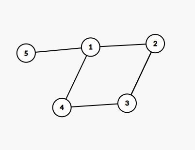

# Sesiunea 15

## Agenda
- Rezolvare subiecte ramase din simulare
- Rezolvare subiect Bacalaureat 2020 iunie

## Rezolvare subiecte ramase din simulare
2. 
    - Enunt: varianta in care cautam sufixul, in problema initiala se cerea prefixul insa acela e deja rezolvat.
    - Solutie:
        ```c++
            #include <iostream>
            #include <cstring>

            using namespace std;

            int main() {
                char text[201];
                char s[16];
                cin.getline(text, 201);
                cin >> s;

                char *cuvant = strtok(text, " ");
                while(cuvant != NULL){
                    int estePrefix = 1;
                    if(strlen(s) > strlen(cuvant)){
                        // nu are rost sa parcurgem daca prefixul este mai lung decat cuvantul
                        estePrefix =  0;
                    } else {
                        for(int i = strlen(s)-1, j=strlen(cuvant)-1; i >=0; i--,j--) {
                            if(s[i] != cuvant[j]) {
                                estePrefix = 0;
                                break;
                            }
                        }
                    }

                    if (estePrefix) {
                        cout << cuvant << " ";
                    }
                    cuvant = strtok(NULL, " ");
                }

                return 0;
            }
        ```
3. 
    - Enunt: vezi screenshot
    - Solutie:
        ```c++
            #include <iostream>
            #include <fstream>

            using namespace std;
            int estePrim(int n);
            int suntImpare(int x, int y);
            int suntGemene(int x, int y);
            int auModul2(int x, int y);
            int suntPrime(int x, int y);

            int main() {
                ifstream fin("numere.txt");
                int numarAnterior, numarCurent;
                int avemGemene =0;
                fin >> numarCurent;
                numarAnterior = numarCurent;
                while(fin >> numarCurent) {
                    if (numarAnterior-numarCurent == 1) {
                        continue;
                    }
                    if (suntGemene(numarAnterior, numarCurent)) {
                        avemGemene = 1;
                        cout << numarCurent << " " << numarAnterior << endl;
                    }

                    numarAnterior = numarCurent;
                }

                if (!avemGemene) {
                    cout << "nu exista";
                }
                fin.close();
                return 0;
            }

            int estePrim(int n) {
                if (n < 2) {
                    return 0;
                }
                int rezultat = 1;
                for(int i = 2; i*i < n;i++) {
                    if(n % i == 0) {
                        rezultat = 0;
                        break;
                    }
                }
                return rezultat;
            }

            int suntGemene(int x, int y) {
                if (suntImpare(x, y) && auModul2(x, y) && suntPrime(x, y)) {
                    return 1;
                } else {
                    return 0;
                }
            }

            int suntPrime(int x, int y) {
                return estePrim(x) && estePrim(y);
            }

            int suntImpare(int x, int y) {
                return x % 2 == 1 && y % 2 == 1;
            }

            int auModul2(int x, int y) {
                if (x > y) {
                    return x -y == 2;
                } else {
                    return y - x == 2;
                }
            }
        ```

## Rezolvare subiect Bacalaureat 2020 iunie

### Subiectul I
1. d
    - Nota: atentie la operatiile de impartire/inmultire, trebuie vazut ce tip de date au numerele
2. 
    - Rezolvare: trebuie sa incercam toate variantele ca sa fim siguri:
    ```json
    a. 
        v={-1,1,0,2}
        f(0, v) = f(1, v) [tinem minte sa afisam v[i] adica -1] 
        // din moment ce vom afisa -1 stim ca nu e varianta corecta
    b.
        v={0,2,0,1}
        f(0, v) = f(1, v) [tinem minte sa afisam v[i], adica 0]
                = f(2, v) [tine minte sa afisam v[1], adica 2]
                = f(3, v) [tinem minte sa afisam v[2] adica 0]
                = v[3] = v[3]+1 = 2 si afisam 2
            afisam 0
            afisam 2
            afisam 0
        // varianta corecta
    c.
        v={1,-1,0,1}
        f(0, v) = f(1, v) [tinem minte sa afisam v[0] adica 1]
        // nu este varianta corecta deoarece raspunsul nostru nu trebuie sa contina 1
    d.
        v = {2, 0, 1, 0}
        f(0,v) = f(1, v) [tinem minte sa afisam v[0], adica 2]
                = f(2, v) [tinem minte sa afisam v[1] adica 0]
                = f(3, v) [tinem minte sa afisam v[2] adica 1]
        // din start stim ca nu e un raspuns valid 
    ```
    - Raspuns corect: b
3. 
    - Rezolvare:
        ```json
            primele 4 solutii:
                70 60 40 30
                70 60 50 20
                80 50 40 30
                80 60 40 20
            5-> 80 60 50 10
            6-> 80 70 30 20
        ```
    - Raspuns corect: c
4. 
    - Rezolvare:
        ```json
            Din vectorul de tati de mai jos avem urmatoare:
            1 2 3 4 5 6 7 8 9 10
            7 5 6 5 7 0 6 3 3 8
            - Radacina: 6
            - 6 parinte pentru -> 3, 7
            - 7 parinte pentru -> 1, 5
            - 5 parinte pentru -> 2, 4
            - 3 parinte pentru -> 8, 9
            - 8 parinte pentru -> 10
        ```
        Rezulta arborele de mai jos:
         si frunzele: 4,2, 1,9, 10
    - Raspuns corect: c
5. 
    - Rezolvare:
        - Conform matricii de adiacenta avem urmatorul graf:
        
        - Sa nu uitam ca un graf partial este un graf care are aceleasi muchii ca si graful initial si doar muchiile difera.
        - Observam ca de muchia [5,1] nu ne putem atinge, caci astfel 5 ar deveni izolat deci incalcam cerinta si ce putem face este sa eliminam cate o muchie pe rand dintre cele ramase.

    - Raspuns corect: a
### Subiectul II
1. 
    - a
        ```json
            a = 240107
            c = 0
            repeta
                b = 240107, x = 0
                daca 240107  % 10 = 0 => false
                b = b/10 => b = 24010
                repeta
                    b = 24010, x = 0
                    daca 24010 % 10 = 0 => true => x = 1
                    b = b/10 => b = 2401
                deoarece x = 1, oprim loop-ul
                afisam 1, " "
                c = 2
            repeta
                b = 240107, x = 0
                daca 240107 % 10 = 2 => false
                b = 24010
                repeta
                    b = 24010, x = 0
                    daca 24010 % 10 == 2 => false
                    b = 2401
                repeta
                    b = 2401, x = 0
                    daca 2401 % 10 == 2 -> false
                    b = 240
                repeta
                    b = 240, x = 0
                    daca 240 % 10 == 2 -> false
                    b = 24
                repeta
                    B = 24, x =0
                    daca 24 % 10 == 2-> false
                    b = 2
                repeta
                    b = 2, x = 0
                    daca 2 % 10 ==2 -> true
                        x =1
                    b= 0 -> se opreste iteratia
                    scrie 1, " "
                    c = 4
            --- etc
            - putem observa ca algoritmul afiseaza cate 1 daca numarul contine 0, 2, 4, 6, 8 in cifrele sale sau 0 in caz contrar
            - practic algoritmul va afisa: 1 1 1 0 0
        ```
    - b
        - Rezolvare:
            ```json
                - trebuie sa cautam numere in intervalul [100000, 1000000)
                - Pentru a afisa doar 1, inseamna ca trebuie sa avem toate cifrele: 0,2,4,6,8.
                - Cel mai mic numar din intervalul specificat care respecta cerinta esta
                102468
                - cel mai mare numar din intervalul specificat care respecta cerinta este:
                986420
            
            ```
    - c
        ```c++
            #include <iostream>
            #include <fstream>

            using namespace std;

            void f(int i, int v[4]);

            int main() {
                int a;
                cin >> a;
                int c = 0;
                do {
                    int b = a;
                    int x = 0;
                    do {
                        if (b % 10 == c) {
                            x = 1;
                        }
                        b = b/10;
                    } while (b != 0 && x != 1);
                    cout << x <<" ";
                    c = c+2;
                } while(c < 9);

                return 0;
            }
        ```
    - d 
        ```json
            citește a (număr natural) 
            c←0 
            ┌repetă
            │ b←a; x←0 
            │┌cat timp (b != 0 si x < 1)
            ││┌dacă b%10=c atunci 
            │││ x←1 
            ││└■ 
            ││ b←[b/10] 
            │
            │ scrie x,’ ’ 
            │ c←c+2 
            └până când c>9 
        
        ```
2. 
    - Rezolvare: 
        ```c++
            struct memorieCalculator {
                int interna;
                int externa;
            };

            struct calculator {
                char monitor;
                memorieCalculator memorie;
            }c;
        ```
3. 
    - Rezolvare:
        ```c++
            #include <iostream>
            #include <fstream>

            using namespace std;


            int main() {
                char a[9][9] = {
                        {'=', '=', '=', '=', '=', '=', '=', '=', '='},
                        {'=', '=', '=', '=', '=', '=', '=', '=', '='},
                        {'=', '=', '=', '=', '=', '=', '=', '=', '='},
                        {'=', '=', '=', '=', '=', '=', '=', '=', '='},
                        {'=', '=', '=', '=', '=', '=', '=', '=', '='},
                        {'=', '=', '=', '=', '=', '=', '=', '=', '='},
                        {'=', '=', '=', '=', '=', '=', '=', '=', '='},
                        {'=', '=', '=', '=', '=', '=', '=', '=', '='},
                        {'=', '=', '=', '=', '=', '=', '=', '=', '='},
                };


                for(int i =0; i <9; i++) {
                    for (int j = 0; j < 9; j++) {
                        if (j > (9-i-1) &&  i > j) {
                            a[i][j] = '<';
                        } else {
                            a[i][j] = '>';
                        }
                    }
                }

                for(int i =0; i <9; i++) {
                    for (int j = 0; j < 9; j++) {
                        cout << a[i][j] << " ";
                    }
                    cout << endl;
                }

                return 0;
            }
        ```
### Subiectul III
1. 
    - Rezolvare:
        ```c++
            #include <iostream>
            #include <fstream>

            using namespace std;

            int suma(int a, int b);

            int main() {
                int a = 20;
                int b = 12;
                cout << suma(a, b);
            }

            int suma(int a, int b) {
                int suma = 0;
                int min;
                if (a < b) {
                    min = a;
                } else {
                    min = b;
                }
                for (int i = 1; i <= min; i++) {
                    if (a % i == 0 && b % i == 0) {
                        suma += i;
                    }
                }

                return suma;
            }
        ```

2. 
    - Rezolvare
        ```c++
            #include <iostream>
            #include <cstring>

            using namespace std;

            int main() {
                char text[101];
                char rezultat[101];
                rezultat[0] = '\0';
                cin.getline(text, 101);
                int existaCuvinteValide = 0;
                char * cuvant = strtok(text, " ");
                while(cuvant != NULL) {
                    if (strlen(cuvant) >= 3) {
                        existaCuvinteValide = 1;
                        char primaLitera = cuvant[0];
                        for(int i = 0; i < strlen(cuvant)-1; i++) {
                            cuvant[i] = cuvant[i+1];
                        }
                        cuvant[strlen(cuvant)-1] = primaLitera;
                    }
                    strcat(rezultat, cuvant);
                    strcat(rezultat, " ");
                    cuvant = strtok(NULL, " ");
                }
                if (!existaCuvinteValide) {
                    cout << "nu exista";
                } else {
                    cout << rezultat;
                }
            }

        ```

3. 
    - Rezolvare:
        - a
            ```json
                Algoritmul de mai jos, va parcurge fisierul o singura data si in timp ce il vom parcurge, vom popula un vector de frecventa. In timp ce citim numerele din fisier, vom stii care este numarul cel mai mare astfel incat sa optimizam vectorul de frecventa deoarece este posibil sa nu avem nevoie de toate cele 1000 de numere posibile pentru vectorul de frecventa, astfel avand un algoritm eficient din punct de vedere al vitezei. Dupa ce avem vectorul de frecventa initializat, vom cauta sa vedem daca exista mai mult de 1 numar ce are frecventa egala cu 1, caz in care sirul nu poate fi finit, altfel avem un sir finit.
            ```
        - b
            ```c++
                #include <iostream>
                #include <fstream>

                using namespace std;

                int main() {
                    ifstream fin("bac.in");
                    int frecventa[1001] = {0};
                    int numarMaxim= 0; // ca sa stim pana unde vom parcurge vectorul de frecventa;
                    int numar;
                    while(fin >> numar) {
                        frecventa[numar]++;
                        if (numar > numarMaxim) {
                            numarMaxim = numar;
                        }
                    }
                    int contorFrecventa1 = 0;
                    int esteSirFinit = 1;
                    for(int i = 0; i <=numarMaxim;i++) {
                        if (frecventa[i] == 0) {
                            continue;
                        } else {
                            if (contorFrecventa1 == 0 && frecventa[i] == 1) {
                                contorFrecventa1++;
                            } else if (frecventa[i] == 1) {
                                esteSirFinit =0;
                                break;
                            }
                        }
                    }

                    if (esteSirFinit) {
                        cout << "DA";
                    } else {
                        cout << "NU";
                    }


                    fin.close();
                }
            ```