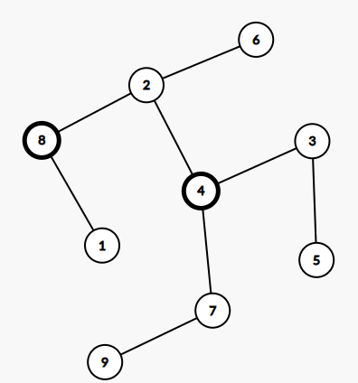
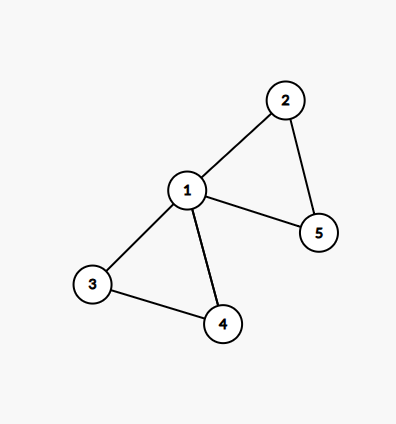

# Sesiunea 15

## Agenda
- Rezolvare subiecte ramase din simulare
- Rezolvare subiect Bacalaureat 2020 iunie
- Rezolvare subiect Bacalaureat 2020 august

## Rezolvare subiecte ramase din simulare
2. 
    - Enunt: varianta in care cautam sufixul, in problema initiala se cerea prefixul insa acela e deja rezolvat.
    - Solutie:
        ```c++
            #include <iostream>
            #include <cstring>

            using namespace std;

            int main() {
                char text[201];
                char s[16];
                cin.getline(text, 201);
                cin >> s;

                char *cuvant = strtok(text, " ");
                while(cuvant != NULL){
                    int estePrefix = 1;
                    if(strlen(s) > strlen(cuvant)){
                        // nu are rost sa parcurgem daca prefixul este mai lung decat cuvantul
                        estePrefix =  0;
                    } else {
                        for(int i = strlen(s)-1, j=strlen(cuvant)-1; i >=0; i--,j--) {
                            if(s[i] != cuvant[j]) {
                                estePrefix = 0;
                                break;
                            }
                        }
                    }

                    if (estePrefix) {
                        cout << cuvant << " ";
                    }
                    cuvant = strtok(NULL, " ");
                }

                return 0;
            }
        ```
3. 
    - Enunt: vezi screenshot
    - Solutie:
        ```c++
            #include <iostream>
            #include <fstream>

            using namespace std;
            int estePrim(int n);
            int suntImpare(int x, int y);
            int suntGemene(int x, int y);
            int auModul2(int x, int y);
            int suntPrime(int x, int y);

            int main() {
                ifstream fin("numere.txt");
                int numarAnterior, numarCurent;
                int avemGemene =0;
                fin >> numarCurent;
                numarAnterior = numarCurent;
                while(fin >> numarCurent) {
                    if (numarAnterior-numarCurent == 1) {
                        continue;
                    }
                    if (suntGemene(numarAnterior, numarCurent)) {
                        avemGemene = 1;
                        cout << numarCurent << " " << numarAnterior << endl;
                    }

                    numarAnterior = numarCurent;
                }

                if (!avemGemene) {
                    cout << "nu exista";
                }
                fin.close();
                return 0;
            }

            int estePrim(int n) {
                if (n < 2) {
                    return 0;
                }
                int rezultat = 1;
                for(int i = 2; i*i < n;i++) {
                    if(n % i == 0) {
                        rezultat = 0;
                        break;
                    }
                }
                return rezultat;
            }

            int suntGemene(int x, int y) {
                if (suntImpare(x, y) && auModul2(x, y) && suntPrime(x, y)) {
                    return 1;
                } else {
                    return 0;
                }
            }

            int suntPrime(int x, int y) {
                return estePrim(x) && estePrim(y);
            }

            int suntImpare(int x, int y) {
                return x % 2 == 1 && y % 2 == 1;
            }

            int auModul2(int x, int y) {
                if (x > y) {
                    return x -y == 2;
                } else {
                    return y - x == 2;
                }
            }
        ```

## Rezolvare subiect Bacalaureat 2020 iunie

### Subiectul I
1. d
    - Nota: atentie la operatiile de impartire/inmultire, trebuie vazut ce tip de date au numerele
2. 
    - Rezolvare: trebuie sa incercam toate variantele ca sa fim siguri:
    ```json
    a. 
        v={-1,1,0,2}
        f(0, v) = f(1, v) [tinem minte sa afisam v[i] adica -1] 
        // din moment ce vom afisa -1 stim ca nu e varianta corecta
    b.
        v={0,2,0,1}
        f(0, v) = f(1, v) [tinem minte sa afisam v[i], adica 0]
                = f(2, v) [tine minte sa afisam v[1], adica 2]
                = f(3, v) [tinem minte sa afisam v[2] adica 0]
                = v[3] = v[3]+1 = 2 si afisam 2
            afisam 0
            afisam 2
            afisam 0
        // varianta corecta
    c.
        v={1,-1,0,1}
        f(0, v) = f(1, v) [tinem minte sa afisam v[0] adica 1]
        // nu este varianta corecta deoarece raspunsul nostru nu trebuie sa contina 1
    d.
        v = {2, 0, 1, 0}
        f(0,v) = f(1, v) [tinem minte sa afisam v[0], adica 2]
                = f(2, v) [tinem minte sa afisam v[1] adica 0]
                = f(3, v) [tinem minte sa afisam v[2] adica 1]
        // din start stim ca nu e un raspuns valid 
    ```
    - Raspuns corect: b
3. 
    - Rezolvare:
        ```json
            primele 4 solutii:
                70 60 40 30
                70 60 50 20
                80 50 40 30
                80 60 40 20
            5-> 80 60 50 10
            6-> 80 70 30 20
        ```
    - Raspuns corect: c
4. 
    - Rezolvare:
        ```json
            Din vectorul de tati de mai jos avem urmatoare:
            1 2 3 4 5 6 7 8 9 10
            7 5 6 5 7 0 6 3 3 8
            - Radacina: 6
            - 6 parinte pentru -> 3, 7
            - 7 parinte pentru -> 1, 5
            - 5 parinte pentru -> 2, 4
            - 3 parinte pentru -> 8, 9
            - 8 parinte pentru -> 10
        ```
        Rezulta arborele de mai jos:
         si frunzele: 4,2, 1,9, 10
    - Raspuns corect: c
5. 
    - Rezolvare:
        - Conform matricii de adiacenta avem urmatorul graf:
        
        - Sa nu uitam ca un graf partial este un graf care are aceleasi muchii ca si graful initial si doar muchiile difera.
        - Observam ca de muchia [5,1] nu ne putem atinge, caci astfel 5 ar deveni izolat deci incalcam cerinta si ce putem face este sa eliminam cate o muchie pe rand dintre cele ramase.

    - Raspuns corect: a
### Subiectul II
1. 
    - a
        ```json
            a = 240107
            c = 0
            repeta
                b = 240107, x = 0
                daca 240107  % 10 = 0 => false
                b = b/10 => b = 24010
                repeta
                    b = 24010, x = 0
                    daca 24010 % 10 = 0 => true => x = 1
                    b = b/10 => b = 2401
                deoarece x = 1, oprim loop-ul
                afisam 1, " "
                c = 2
            repeta
                b = 240107, x = 0
                daca 240107 % 10 = 2 => false
                b = 24010
                repeta
                    b = 24010, x = 0
                    daca 24010 % 10 == 2 => false
                    b = 2401
                repeta
                    b = 2401, x = 0
                    daca 2401 % 10 == 2 -> false
                    b = 240
                repeta
                    b = 240, x = 0
                    daca 240 % 10 == 2 -> false
                    b = 24
                repeta
                    B = 24, x =0
                    daca 24 % 10 == 2-> false
                    b = 2
                repeta
                    b = 2, x = 0
                    daca 2 % 10 ==2 -> true
                        x =1
                    b= 0 -> se opreste iteratia
                    scrie 1, " "
                    c = 4
            --- etc
            - putem observa ca algoritmul afiseaza cate 1 daca numarul contine 0, 2, 4, 6, 8 in cifrele sale sau 0 in caz contrar
            - practic algoritmul va afisa: 1 1 1 0 0
        ```
    - b
        - Rezolvare:
            ```json
                - trebuie sa cautam numere in intervalul [100000, 1000000)
                - Pentru a afisa doar 1, inseamna ca trebuie sa avem toate cifrele: 0,2,4,6,8.
                - Cel mai mic numar din intervalul specificat care respecta cerinta esta
                102468
                - cel mai mare numar din intervalul specificat care respecta cerinta este:
                986420
            
            ```
    - c
        ```c++
            #include <iostream>
            #include <fstream>

            using namespace std;

            void f(int i, int v[4]);

            int main() {
                int a;
                cin >> a;
                int c = 0;
                do {
                    int b = a;
                    int x = 0;
                    do {
                        if (b % 10 == c) {
                            x = 1;
                        }
                        b = b/10;
                    } while (b != 0 && x != 1);
                    cout << x <<" ";
                    c = c+2;
                } while(c < 9);

                return 0;
            }
        ```
    - d 
        ```json
            citește a (număr natural) 
            c←0 
            ┌repetă
            │ b←a; x←0 
            │┌cat timp (b != 0 si x < 1)
            ││┌dacă b%10=c atunci 
            │││ x←1 
            ││└■ 
            ││ b←[b/10] 
            │
            │ scrie x,’ ’ 
            │ c←c+2 
            └până când c>9 
        
        ```
2. 
    - Rezolvare: 
        ```c++
            struct memorieCalculator {
                int interna;
                int externa;
            };

            struct calculator {
                char monitor;
                memorieCalculator memorie;
            }c;
        ```
3. 
    - Rezolvare:
        ```c++
            #include <iostream>
            #include <fstream>

            using namespace std;


            int main() {
                char a[9][9] = {
                        {'=', '=', '=', '=', '=', '=', '=', '=', '='},
                        {'=', '=', '=', '=', '=', '=', '=', '=', '='},
                        {'=', '=', '=', '=', '=', '=', '=', '=', '='},
                        {'=', '=', '=', '=', '=', '=', '=', '=', '='},
                        {'=', '=', '=', '=', '=', '=', '=', '=', '='},
                        {'=', '=', '=', '=', '=', '=', '=', '=', '='},
                        {'=', '=', '=', '=', '=', '=', '=', '=', '='},
                        {'=', '=', '=', '=', '=', '=', '=', '=', '='},
                        {'=', '=', '=', '=', '=', '=', '=', '=', '='},
                };


                for(int i =0; i <9; i++) {
                    for (int j = 0; j < 9; j++) {
                        if (j > (9-i-1) &&  i > j) {
                            a[i][j] = '<';
                        } else {
                            a[i][j] = '>';
                        }
                    }
                }

                for(int i =0; i <9; i++) {
                    for (int j = 0; j < 9; j++) {
                        cout << a[i][j] << " ";
                    }
                    cout << endl;
                }

                return 0;
            }
        ```
### Subiectul III
1. 
    - Rezolvare:
        ```c++
            #include <iostream>
            #include <fstream>

            using namespace std;

            int suma(int a, int b);

            int main() {
                int a = 20;
                int b = 12;
                cout << suma(a, b);
            }

            int suma(int a, int b) {
                int suma = 0;
                int min;
                if (a < b) {
                    min = a;
                } else {
                    min = b;
                }
                for (int i = 1; i <= min; i++) {
                    if (a % i == 0 && b % i == 0) {
                        suma += i;
                    }
                }

                return suma;
            }
        ```

2. 
    - Rezolvare
        ```c++
            #include <iostream>
            #include <cstring>

            using namespace std;

            int main() {
                char text[101];
                char rezultat[101];
                rezultat[0] = '\0';
                cin.getline(text, 101);
                int existaCuvinteValide = 0;
                char * cuvant = strtok(text, " ");
                while(cuvant != NULL) {
                    if (strlen(cuvant) >= 3) {
                        existaCuvinteValide = 1;
                        char primaLitera = cuvant[0];
                        for(int i = 0; i < strlen(cuvant)-1; i++) {
                            cuvant[i] = cuvant[i+1];
                        }
                        cuvant[strlen(cuvant)-1] = primaLitera;
                    }
                    strcat(rezultat, cuvant);
                    strcat(rezultat, " ");
                    cuvant = strtok(NULL, " ");
                }
                if (!existaCuvinteValide) {
                    cout << "nu exista";
                } else {
                    cout << rezultat;
                }
            }

        ```

3. 
    - Rezolvare:
        - a
            ```json
                Algoritmul de mai jos, va parcurge fisierul o singura data si in timp ce il vom parcurge, vom popula un vector de frecventa. In timp ce citim numerele din fisier, vom stii care este numarul cel mai mare astfel incat sa optimizam vectorul de frecventa deoarece este posibil sa nu avem nevoie de toate cele 1000 de numere posibile pentru vectorul de frecventa, astfel avand un algoritm eficient din punct de vedere al vitezei. Dupa ce avem vectorul de frecventa initializat, vom cauta sa vedem daca toate numerele au o frecventa para sau avem cel mult un numar cu frecventa impara, atunci este finit, altfel nu.
            ```
        - b
            ```c++
                #include <iostream>
                #include <fstream>

                using namespace std;

                int main() {
                    ifstream fin("bac.in");
                    int frecventa[1001] = {0};
                    int numarMaxim= 0; // ca sa stim pana unde vom parcurge vectorul de frecventa;
                    int numar;
                    while(fin >> numar) {
                        frecventa[numar]++;
                        if (numar > numarMaxim) {
                            numarMaxim = numar;
                        }
                    }
                    int contorFrecventaImpara = 0;
                    int contorFrecventaPara = 0;
                    for(int i = 0; i <=numarMaxim;i++) {
                        if (frecventa[i] % 2 == 0) {
                            contorFrecventaPara++;
                        } else {
                            contorFrecventaImpara++;
                        }
                    }

                    // Daca au toate un numar par de aparitii sau cel mult una are numar impar de aparitii, este ok
                    if (contorFrecventaImpara == 0 || contorFrecventaImpara == 1) {
                        cout << "DA";
                    } else {
                        cout << "NU";
                    }


                    fin.close();
                }
            ```### Subiectul III

## Rezolvare subiect Bacalaureat 2020 august

### Subiectul 1.
1. 
    - Rezolvare
        ```json
            Atunci cand facem  x % y, valoarea maxima pe care o poate avea rezultatul este y-1, deoarece de fiecare data cand ajungem la un multiplu de al lui y, valoarea va fi 0.
        ```
    - Raspuns corect: 2019 -> b

2. 
    - Rezolvare:
        - Aici trebuie sa avem exact 3 apeluri recursive pentru a afisa de 3 ori '*' si totodata, la al treilea sa ne si oprim. Acum sa le luam pe rand:
        - a
            ```json
                f(30) =
                        cout << "*" [prima steluta]
                        30 > 5 => f (31/2) = f(15)
                      = 
                        cout << "*" [a doua steluta]
                        15 > 5 -> f(16/2) = f(8)
                      = 
                        cout << "*" [a treia steluta]
                        8 > 5 -> f(9/2) = f(4)
                    -> Va mai fi cel putin o steluta deci a nu este o optiune valida
            ```
        - b
            ```json
               f(21) =
                        cout << "*" [prima steluta]
                        21 > 5 => f(22/2) = f(11)
                     =
                        cout << "*" [a doua steluta]
                        11 > 5 => f(12/2) = f(6)
                    =
                        cout << "*" [a treia steluta]
                        6 > 5 => f(7/2) = f(3)
                    -> va mai fi cel putin o steluta deci nici b nu este o optiune valida
            ```
        - c
            ```json
                f(17) =
                        cout << "*" [prima steluta]
                        17 > 5 => f(18/2) = f(9)
                    
                      = 
                        cout << "*" [a doua steluta]
                        9 > 5 => f(10/2) => f(5)
                
                      = 
                        cout << "*" [a treia steluta]
                        5 > 5 false si ne oprim
                    -> Acesta este raspunsul corect
            ```
    - Raspuns corect: c

3. 
    - Rezolvare:
        ```json
            Pentru a ne usura treaba o sa mergem mai departe cu urmatoarele notatii:
                0       1       2       3       4
                capsune mere    pepene  pere    portocale
            
            Primele 4 solutii sunt:
                0 1 2
                0 1 2 3
                0 1 2 4
                0 1 3
            Urmatoarele 2 sunt:
                0 1 3 4
                0 1 4 => Capsune Mere Portocale
        ```
    - Raspuns corect: c

4. 
    - Rezolvare:
        - Din vectorul de tati avem urmatoarele:
            ```json
                1 2 3 4 5 6 7 8 9
                8 6 4 2 3 0 4 2 7
                Deci:
                    Nodul 6 este radacina
                    6 parinte pentru: 2
                    2 parinte pentru: 4 si 8
                    4 parinte pentru: 3 si 7
                    8 parinte pentru: 1
                    3 parinte pentru: 5
                    7 parinte pentru 9
            ```
        - Doar din explicatia de mai sus ne putem da seama ca 8 este un frate al nodului 4. Insa mai jos avem si o poza care repreezinta arborele de mai sus
        
    - Raspuns corect: d

5. 
    - Rezolvare:
        - Mai intai ce inseamna un graf eulerian: 
            Definiție: Se numește graf eulerian un graf care conține un ciclu eulerian. Se numește ciclu eulerian un ciclu care conține toate muchiile grafului. [https://www.pbinfo.ro/articole/810/grafuri-neorientate#intlink-12]
        - Stim ca avem un nod cu gradul 4
        - Rezulta ca un numar minim de muchii ale grafului pentru a fi eulerian este 6
        - Ca si exemplu putem considera graful de mai jos
        
    - Raspuns corect: b

### Subiectul 2.
1. 
    * a
        - Rezolvare:
            ```json
                n = 247388
                m = 0
                repeta
                    c = 8
                    n = 24738
                    c < 5 false => m = m+c = 0 + 8 = 8
                pana cand n = 0
                repeta
                    c = 8
                    n = 2473
                    c < 5 false => m = m + c = 8 + 8 = 16
                pana cand n = 0
                repeta
                    c = 3
                    n = 247
                    c < 5 true => m = 16 - 6 = 10
                pana cand n = 0
                repeta
                    c = 7
                    n = 24
                    c < 5 false => m = 17
                pana cand n = 0
                repeta
                    c = 4
                    n = 2
                    c < 5 true => m = 17 - 8 = 9
                pana cand n = 0
                    c = 2
                    n = 0
                    c < 5 true => m = 9 - 4 = 5
                pana cand n =0 [ne oprim]
                m !=0 => Afisam "NU"
            ```
    * b
        - Rezolvare:   
            ```json
                - Trebuie sa dam 2 numere din intervalul [100, 1000]
                - Observam ca algoritmul intoarce "DA" atunci cand suma cifrelor mai mari decat 5 este egala cu dublul sumei cifrelor mai mici decat 5
                - Ca si posibilitati avem:
                    - 126
                    - 138
                    - 162
                    - 183
                    - 216
                    - 228
                    - 261
                    - 282
                    - 306
                    - 318
                    - 360
                    - 381
                    - 408
                    - 480
                    - 603
                    - 612
                    - 621
                    - 630
                    - 804
                    - 813
                    - 822
                    - 831
                    - 840

            ```
    * c
        ```c++
            #include <iostream>

            using namespace std;

            int main() {
                int n;
                cin >> n;
                int m = 0;
                do {
                    int c = n % 10;
                    n = n / 10;
                    if (c < 5) {
                        m = m - 2 * c;
                    } else {
                        m = m + c;
                    }
                } while (n != 0);
                if ( m == 0) {
                    cout << "DA";
                } else {
                    cout << "NU";
                }
            }

        ```
    * d
        ```json
            citește n (număr natural) 
            m <- 0 
            ┌cat timp n > 0 executa
            │ c<-n%10; n<-[n/10] 
            │┌dacă c<5 atunci m<-m-2*c 
            ││altfel m<-m+c 
            │└■
            └■
            ┌dacă m=0 atunci scrie ‘DA’ 
            │altfel scrie m, ‘NU’ 
            └■
        ```
2. 
    - Rezolvare:
        ```c++
            struct procesor {
                char producator;
                int frecventa;
                float pret;
            };

            struct procesor p[20];
        ```
3. 
    ```c++
        #include <iostream>

        using namespace std;
        int main() {
            int a[6][4] = {
                    {2, 3, 4, 5},
                    {8, 7, 8, 5},
                    {1, 3, 5, 7},
                    {3, 0, 2, 9},
                    {3, 5, 1, 6},
                    {7, 3, 0, 2}
            };
            int coloana3[6];
            for (int i = 0; i < 6; i++) {
                coloana3[i] = a[i][2];
            }

            for (int i = 0; i < 6; i++) {
                for (int j = 0; j < 6; j++) {
                    if (coloana3[i] % 2 == 0 && coloana3[j] % 2 == 0) {
                        if (coloana3[i] < coloana3[j]) {
                            int aux = coloana3[i];
                            coloana3[i] = coloana3[j];
                            coloana3[j] = aux;
                        }
                    }
                }
            }

            for (int i = 0; i < 6; i++) {
                a[i][2] = coloana3[i];
            }

            for (int i = 0; i < 6; i++) {
                for (int j = 0; j < 4; j++) {
                    cout << a[i][j] << " ";
                }
                cout << endl;
            }

            return 0;
        }

    ```
### Subiectul 3
1. 
    - Rezolvare:
        ```c++
            #include <iostream>
            using namespace std;

            int estePNumar(int n);
            int kpn(int a, int b, int k);

            int main() {
                cout << kpn(27, 50, 3);
                return 0;
            }

            int kpn(int a, int b, int k){
            int contor = 0;
            int rezultat = -1;
            for(int i = a; i<=b; i++){
                if (estePNumar(i)){
                    contor++;
                    if (contor == k){
                        rezultat = i;
                        break;
                    }
                }
            }
            return rezultat;
            }

            int estePNumar(int n) {
                int sumaDivizori = 0;
                for (int i = 1; i <= n; i++) {
                    if (n % i == 0) {
                        sumaDivizori+= i;
                    }
                }

                if (sumaDivizori % 2 == n % 2) {
                    return 1;
                } else {
                    return 0;
                }
            }
        ```
* 2
    - Solutie:
        ```c++
            #include <iostream>
            #include <cstring>

            using namespace std;

            int main() {
                char text[101], rezultat[101];
                // Ne asiguram ca nu o sa citim garbage din memorie
                text[0] = '\0';
                rezultat[0] = '\0';
                cin.getline(text, 101);
                int contor = 0;
                char *cuvant = strtok(text, " ");
                while (cuvant != NULL) {
                    if (strlen(cuvant) % 2 == 0) {
                        // il copiem direct in rezultat
                        strcat(rezultat, cuvant);
                        strcat(rezultat, " ");
                    } else {
                        int lungimeCuvant = strlen(cuvant);
                        char oglindit[lungimeCuvant+1];
                        for(int i = 0; i < lungimeCuvant; i++) {
                            oglindit[i] = cuvant[lungimeCuvant - 1 - i];
                        }
                        oglindit[lungimeCuvant] = '\0';
                        if (strcmp(oglindit, cuvant) != 0) {
                            contor++;
                        }
                        strcat(rezultat, oglindit);
                        strcat(rezultat, " ");
                    }
                    cuvant = strtok(NULL, " ");
                }
                if (contor == 0) {
                    cout << "nu exista";
                } else {
                    cout << rezultat;
                }
                return 0;
            }
        ```

* 3
    - Explicatie
        ```json
            O sa scriem un algoritm in care vom cauta cel mai mic si cel mai mare numar de doua cifre. In cazul in care nu vom gasi cel putin un astfel de numar,se va afisa "NU EXISTA". Algoritmul va fi eficient din punct de vedere al timpului de executie deoarece se va face o singura parcurgere a numerelor din fisier. In acelasi timp, algoritmul este eficient din punct de vedere al memoriei utilizate deoarece nu se foloseste alte structuri de date pentru stocarea si  manipularea numerelor, practic, din maximum de 10^6 numere cate pot fi in fisier, noi in memorie o sa avem maximum 3, in acelasi moment: min, max si numarul curent pe care il citim.
        
        ```
    - Solutie:
        ```c++
            #include <iostream>
            #include <fstream>

            using namespace std;

            int main() {
                ifstream fin("bac.txt");

                int minimDouaCifra=-1;
                int maximDouaCifre=-1;
                int numar;
                while(fin >> numar) {
                    // aici verificam daca are doua cifre
                    if (numar >= 10 && numar <= 99) {
                        // daca suntem la inceput, initializam ambele cu aceeasi valoare
                        if (minimDouaCifra == -1 && maximDouaCifre == -1) {
                            minimDouaCifra = numar;
                            maximDouaCifre = numar;
                        } else {
                            // altfel updatam cele doua numere, min, max
                            if (numar < minimDouaCifra) {
                                minimDouaCifra = numar;
                            } else if (numar > maximDouaCifre) {
                                maximDouaCifre = numar;
                            }
                        }
                    }
                }

                // aici putem lua oricare dintre minime
                // daca valoarea oricareia este -1 inseamna ca nu am gasit un numar cu 2 cifre
                if (minimDouaCifra == -1) {
                    cout << "nu exista";
                } else {
                    cout << minimDouaCifra-1 << " " << maximDouaCifre +1;
                }

                fin.close();
                return 0;
            }
        ```
