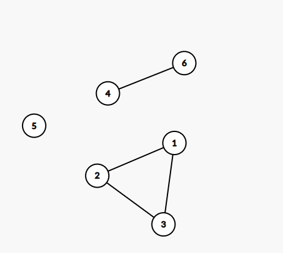
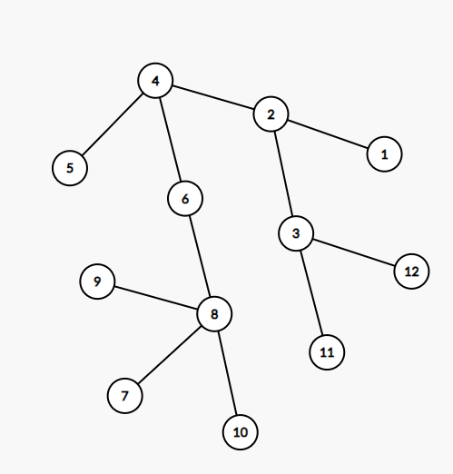
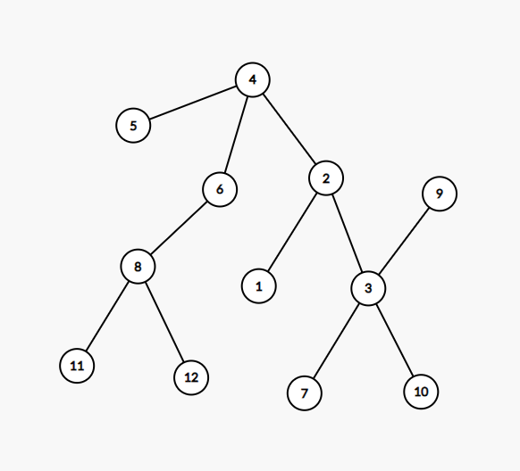

# Sesiunea 16

## Agenda
- Rezolvare varianta BAC Iunie 2022

## Rezolvare varianta BAC Iunie 2022

### Subiectul I
1. 
    - Rezolvare:
        - Se respecta precedenta operatorilor si se acorda atentie casting-ului
    - Raspuns corect: 10 -> `C`
2.  
    - Rezolvare:
        - Din punct de vedere sintatic, metoda corecta de atribuire este: `valoare=2*x.cantitate*x.pret`
    - Raspuns corect: `D`
3. 
    - Rezolvare:
        ```json
            Pentru usurinta rezolvarii notam sporturile astfel:
              0       1      2       3        4
            tenis, fotbal, volei, handbal, baschet

            Din enunt stim ca nu avem voie cu fotbal si baschet in acelasi pachet si ca primele 5 solutii sunt:
            {tenis, fotbal}
            {tenis, fotbal, volei}
            {tenis, fotbal, handbal}
            {tenis, volei}
            Adica:
            0 1
            0 1 2
            0 1 3
            0 2
            0 2 3
            0 2 4
            1 2
            1 2 3
            1 3 [Fotbal Handbal]
            2 3 [volei handbal ]
        ```
    - Raspuns corect:  `A`
4. 
    - Rezolvare:
        - Conform enuntului avem graful de mai jos:
         
        Deci avem 3 componente conexte
    - Raspuns corect:  `B`
        
5. 
    - Rezolvare:
        ```json
        Pentru a rezolva exercitiul trebuie sa generam arborele pentru fiecare dintr cazuri, din vectorul de tati obtinut prin inlocuirea lui x si y
        ```
    - a
        ```json
            x=11 y=12
            2 4 2 0 4 4 x  6 x  x  y  y DEVINE
            2 4 2 0 4 4 11 6 11 11 12 12
            Astfel avem urmatorul vector de tati:
            1 2 3 4 5 6 7  8 9  10 11 12
            2 4 2 0 4 4 11 6 11 11 12 12
            unde:
            4: radacina
            4 parinte pentru: 2 5 6
            2 parinte pentru: 1 3
            6 parinte pentru: 8
            11 parinte pentru:  7 9 10
            12 parinte pentru: 11 si 12
            *Deoarece avem un ciclu, acesta nu poate fi un arbore
        ```

    - b
         ```json
         x=8 y=3
         2 4 2 0 4 4 x 6 x x y y DEVINE
         2 4 2 0 4 4 8 6 8 8 3 3

         Astfel avem urmatorul vector de tati:
         1 2 3 4 5 6 7 8 9 10 11 12
         2 4 2 0 4 4 8 6 8 8  3  3
         unde:
         4: radacina
         4 parinte pentru: 2 5 6
         2 parinte pentru: 1 3
         8 parinte pentru: 7 9 10
         6 parinte pentru: 8
         3 parinte pentru: 11 12
         Astfel rezulta urmatorul graf:
         
         Din poza rezulta ca nu este graful pe care il cautam deoarece desi avem 5 noduri frunza pe ultimul nivel, nu avem un nod numerotat cu numarul sau de fii.
         ```
    - c
        ```json
            x=3 y=8
            2 4 2 0 4 4 x 6 x x y y DEVINE
            2 4 2 0 4 4 3 6 3 3 8 8

            Astfel avem urmatorul vector de tati:
            1 2 3 4 5 6 7 8 9 10 11 12
            2 4 2 0 4 4 3 6 3 3  8  8
            Unde:
                4: radacina
                4 parinte pentru: 2 5 6
                2 parinte pentru: 1 3
                3 parinte pentru: 7 9 10
                6 parinte pentru: 8
                8 parinte pentru 11 si 12

            Astfel rezulta urmatorul graf:
            
            De unde vedem ca ambele conditii sunt respectate, avem 5 noduri frunza pe ultimul nivel dar si un nod ce are o valoare egala cu numarul de fii (3)
        ```
    - Raspuns corect: `C`
 
### Subiectul II
### Subiectul III
