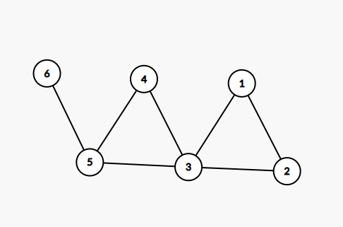

# Rezolvare subiecte BAC 2021 Iunie

## Subiectul I
1. 
    - Rezolvare:
        ```json
            a-> Este adevarat doar pentru cazul in care ambele sunt numere pare. Raspuns corect.
            b-> Este Adevarata si pentru cazuri in care unul dintre ele este impar (x = 3, y = 2) deci este o optiune invalida
            c-> Invalida deoarece obtinem adevarat si pentru numere impare (x = 5, y = 3)
            d-> Invalida deoarece obtinem adevarat si pentru cazul in care ambele sunt pare dar si pentru cazul in care ambele sunt impare.
        ```
    - Raspuns corect: `a`
2. 
    - Rezolvare:
        ```json
            In cazul de fata suntem obligati sa dam valori si sa evaluam functia.
            a => n = 2021, c = 0
                f(2021, 0) = 
                    = 1 + 10 * f(202, 0)
                        = 2 + 10 * f(20, 0)
                            = f(2, 0)
                                = 2 + 10 * f(0, 0) = 2
                            = 2
                        = 2 + 10 * 2 = 22
                    = 1 + 10 * 22 = 221
                    => Raspuns incorect
            b => n = 200211 si c = 2
                f(200211, 2) =
                    = 1 + 10 +f(20021, 2)
                        = 1 + 10 * f(2002, 2)
                            = f(200, 2)
                                = 2 + 10 * f(20, 2)
                                    = 0 + 10 * f (2, 2)
                                        = f(0, 2)
                                            = 0
                                        = 0
                                    = 0
                                = 2
                            = 2
                        = 1 + 10 * 2 = 21
                    = 1 + 10 * 21 = 211
                    => Raspuns incorect
            c => n =312032, c=3
                f(312032, 3) =
                    = 2 + 10 * f(31203, 3)
                        = f(3120, 3)
                            = 0 + 10 * f(312, 3)
                                = 2+ 10 * f(31, 3)
                                    = 1+10 * f(3, 3)
                                        = f(0, 3)
                                            = 0
                                        = 0
                                    = 1
                                = 12
                            = 120
                        =  120
                    = 122
                        -> Raspuns incorect
            d => n = 720721, c = 7
                f(720721, 7) =
                    = 1 + 10 * f(72072, 7)
                        = 2 + 10 * f(7207, 7)
                            = f(720, 7)
                                = 0 + 10 * f(72, 7)
                                    = 2 + 10 * f(7, 7)
                                        = f(0, 7)
                                            = 0
                                        = 0
                                    = 2
                                = 20
                            = 20
                        = 202
                    = 2021
        ```
    - Raspuns corect: `d`
3. 
    - Rezolvare:
        - Stim ca un element se afla pe diagonala secundara daca `i+j = n-1`
        - La d avem i = 42 si j = 57 => 42+57 = 99 = 100-1. Rezulta ca d este varianta corecta. De asemenea celalalte sunt invalide si din punct de vedere sintactic.
    - Raspuns corect: `d`
4. 
    - Rezolvare:
        - Ciclu elementar:  Se numește ciclu un lanț simplu în care primul vârf este identic cu ultimul. Dacă toate vârfurile sunt distincte, mai puțin primul și ultimul, se numește ciclu elementar.
        - Conform enuntului avem urmatorul graf
         
        - Prin urmare observam ciclul elementar `1, 2, 3, 1`
    - Raspuns corect: `b`
5. 
    - Rezolvare
        - Deoarece stim ca nodurile de pe acelasi nivel au acelasi numar de fii si ca nu exista doua nivele cu acelasi numar de noduri, putem avea urmatoarea distributie:
            - Nivelul 1 => 2 noduri
            - Nivelul 2 => 4 noduri
            - Nivelul 3 => 8 noduri
    - Raspuns corect: `c`
## Subiectul II
1. 
    - a
        ```json
        ```
    - b
    - c
    - d
2. 
3. 


## Subiectul III