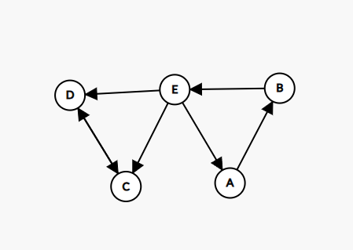
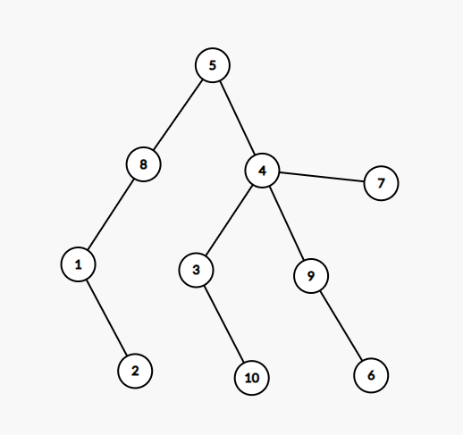

# Rezolvare simulare informatica Martie 2024

## Subiectul I
1. 
    - Rezolvare:
        ```json
            Mai intai se executa impartirea dintre un numar cu virgula si unul intreg deci rezultatul
            va fi un numar cu virgula dupa care se aduna cu 24. Raspuns corect:24.315
        ```
    - Raspuns corect: `c`
2. 
    - Rezolvare:
        ```json
            f(2024) =
                        afisam 2 si apelam f(1012)
                    =   afisam 2 si apelem f(506)
                    =   afisam 2 si apelem f(253)
                    =   f(126) si ramane sa afisam 4 la intoarcere
                    =   afisam 2 si apelam f(63)
                    =   f(31) (ramane sa afisam 4 la intoarcere)
                    =   f(15) si afisezi 4 la intoarcere
                    =  0
            = 22220444
        ```
    - Raspuns corect: `b`
3. 
    - Rezolvare:
        ```json
        Primele 4 solutii:
        (1, 6, 8, 9)
        (2, 5, 8, 9)
        (2, 6, 7, 9)
        (3, 4, 8, 9)

        Dupa
        (3 6 7 8)
        (4,5,6,9)
        ```
    - Raspuns corect: `b`
4.  - Raspuns corect: `d`
5. 
    - Rezolvare:
        - Conform enuntului avem graful orientat de mai jos:
        
        - Tare conex: intre oricare doua varfuri distincte avem cel putin drum
        - In cazul nostru, doar la o pista trebuie sa schimbam pentru a avea tare-conexitate
            - Fie facem dublu sens la D-E fie la C-E
    - Raspuns corect: `a`

## Subiectul II
1. 
    -a
        ```json
            n = 32625
            s = 0
            d = 2
            2*2 <= 32625
                p = 0
                32625 % 2 != 0
                s = 0 + 2 * 0 = 0
                d = 3
            3*3 <= 32625
                p = 0
                32625 % 3 == 0
                   n = n / d = 10875
                   p = 1
                10875 % 3 == 0
                   n = n / d =  3625
                   p = 1
                3625 % 3 != 0
                s = 0 + 3 = 3
                d = 4
                4 * 4 <= 3625
                    p = 0
                    3625 % 4 != 0
                    s = 3 + 4*0 = 3
                    d = 5
                5 * 5 <= 3625
                    p = 0
                    3625 % 5 = 0
                        n = 725
                        p = 1
                    725 % 5 == 0
                        n = 145
                        p = 1
                    145 % 5 == 0
                        n = 29
                        p = 1
                    29 % 5 != 0
                    s = 3 +5 = 8
                    d = 6
                6 * 6 > 29
                n!=
                    s = 8+29 = 37
        ``` 
        - Raspuns corect: 37
    - b
        - Orice putere de a lui 2 din intervalul de mai sus este valida
            - 16, 32, 64
    - c
        ```c++
            #include <iostream>
            #include <cstring>
            void f(int x);


            using namespace std;
            int main() {
                int n;
                cin >> n;
                int s = 0, d = 2;
                while (d*d <= n) {
                    int p = 0;
                    while(n%d == 0) {
                        n = n / d;
                        p = 1;
                    }
                    s = s+d*p;
                    d++;
                }
                if (n != 1){
                    s+= n;
                }
                cout << s;
            }
        ```
    - d
        ```json
            citește n
            (număr natural nenul)
            s<-0; d<-2
            ┌cât timp d*d≤n execută
            │ p<-0
            |┌daca n%d = 0 atunci
            │| ┌execută
            │| │ n<-[n/d]; p<-1
            │| └■ cat timp n%d = 0
            |└■
            │ s<-s+d*p; d<-d+1
            └■
            ┌dacă n≠1 atunci
            │ s<-s+n
            └■
            scrie s
        ```
2. 
    - Rezolvare:
        ```json
            Avem arborele de tati:
            1 2 3 4 5 6 7 8 9 10
            8 1 4 5 0 9 4 5 4 3

            Astfel stim ca:
            - 5 este radacina
            - 5 parinte pentru  4 si 8
            - 8 parinte pentru 1
            - 4 parinte pentru 3, 7, 9
            - 1 parinte pentru 2
            - 9 parinte pentru 6
            - 3 parinte pentru 10
        ```
        - Astfel rezulta graful de mai jos:
         
        - Nodurile cu un singur fiu:
            - 8, 1, 3, 9
3. 
    - Rezolvare:
        ```c++
            #include <iostream>

            using namespace std;
            int main() {
                int matrice[6][6];
                for(int i = 0; i < 5; i++) {
                    for (int j = 0; j < 5; j++) {
                        if (i == j) {
                            matrice[i][j] = i * 2;
                        } else if (j > i) {
                            matrice[i][j] = matrice[i][i];
                        } else {
                            matrice[i][j] = j * 2;
                        }
                    }
                }

                for(int i = 0; i < 5; i++) {
                    for (int j = 0; j < 5; j++) {
                        cout << matrice[i][j] << " ";
                    }
                    cout << endl;
                }
            }
        ```
    - Explicatie
        - Observam ca elementele de pe diagonala principala sunt numere care merg din 2 in 2, deci practic sunt egale cu `2*i`
        - De asemenea elementele din dreapta diagonalei principale sunt egale cu elementul de pe diagonala principala de pe aceeasi linie
        - In final, elementele din stangga diagonalei principale sunt egale cu indexul coloanei inmultit cu 2.
## Subiectul III
1. 
    - Rezolvare:
        ```c++
            #include <iostream>

            int Impare(int n);

            using namespace std;
            int main() {
                cout << Impare(3361);
            }

            int Impare(int n) {
                int areImpare = 0;
                int rezultat = 0;
                int p = 1;
                while (n) {
                    int ultimaCifra = n % 10;
                    if (ultimaCifra  % 2 != 0) {
                        areImpare = 1;
                        rezultat = ultimaCifra * p + rezultat;
                        p = p * 10;
                    }
                    rezultat = ultimaCifra * p + rezultat;
                    p = p * 10;
                    
                    n = n / 10;
                }

                if (!areImpare) {
                    return -1;
                } else {
                    return rezultat;
                }
            }
        ```
    - Explicatie:
        - Am mers pe ideea simpla ca daca intalnim un numar impar il mai adaugam odata si setam acel flag.
2. 
    - Rezolvare
        ```c++
            #include <iostream>
            #include <cstring>

            using namespace std;
            int main() {
                int n;
                cin >> n;
                cin.ignore();
                char cuvinte[n][11];
                for(int i = 0; i < n; i++) {
                    cin>> cuvinte[i];
                }

                char sablon[101], copieSablon[101];
                cin.ignore();
                cin.getline(sablon, 101);
                strcpy(copieSablon, sablon);
                int existaCuvinteInlocuitoare = 1;
                char* cuvant = strtok(sablon, " ");
                while(cuvant != NULL) {
                    if (cuvant[0] == '*'){
                        int lungimeGeneric = strlen(cuvant);
                        int existaInlocuitor = 0;
                        for(int i = 0; i < n; i++) {
                            if (strlen(cuvinte[i]) == lungimeGeneric){
                                existaInlocuitor = 1;
                                break;
                            }
                        }
                        if (!existaInlocuitor) {
                            existaCuvinteInlocuitoare = 0;
                            break;
                        }
                    }
                    cuvant = strtok(NULL, " ");
                }

                if (!existaCuvinteInlocuitoare) {
                    cout << "imposibil";
                } else {
                    char* cuvantDeAfisat = strtok(copieSablon, " ");
                    while(cuvantDeAfisat != NULL) {
                        if (cuvantDeAfisat[0] == '*'){
                            int lungimeGeneric = strlen(cuvantDeAfisat);
                            for(int i = 0; i < n; i++) {
                                if (strlen(cuvinte[i]) == lungimeGeneric){
                                    cout << cuvinte[i] << " ";
                                    break;
                                }
                            }
                        } else {
                            cout << cuvantDeAfisat << " ";
                        }

                        cuvantDeAfisat = strtok(NULL, " ");
                    }
                }
            }
        ```
    - Nota: momentan se repete cuvintele in aceeasi fraza insa nu este un lucru ce contrazice enuntul. Insa pentru a face mai istet programul putem sa salvam indexul cuvantului folosit deja si daca mai intalnim un generic cu acelasi numar de litere, cautam sa vedem daca mai gasim o alta solutie, in caz contrar, folosim tot cuvantul anterior.
3. 
    - Rezolvare:
        - a
            ```json
                Algoritmul de mai jos, parcurge fisierul o singura data si in timp ce il parcurge, actualizeaza vectorul de aparitii si in acelasi timp, tine minte care a fost valoarea maxima citita din fisier. Avem nevoie de valoarea maxima pentru a scurta parcurgerea vectorului de aparitii. Dupa ce am initializat vectorul de aparitii, il parcurgem pana la valoarea maxima pe care am citit-o si in cazul in care gasim un numar care nu respecta conditia din enunt, oprim parcurgerea si afisam "NU". In cazul in care niciun numar nu incalca cerinta, programul va afisa "DA". Algoritmul nostru este eficient din punct de vedere al timpului de executie din mai multe motive:
                1. Fisierul a fost citit o singura data
                2. Vectorul de aparitii, a fost parcurs doar pana la valoarea maxima (asta a ajutat cand numerele din fisier sunt mai mici decat valoarea maxima e.g 1000)
                3. Imediat ce am gasit o valoare care incalca cerinta, scurt-circuitam programul si afisam NU
            ```
        - b:
            ```c++
                #include <iostream>
                #include <fstream>

                using namespace std;
                int main() {
                    ifstream fin("bac.in");
                    int aparitii[1001] = {0};

                    int numar;
                    int max = 0;
                    while(fin>>  numar) {
                        aparitii[numar]++;
                        if (numar > max) {
                            max = numar;
                        }
                    }

                    int esteApi = 1;
                    for(int i = 1; i <= max; i++) {
                        if (aparitii[i] == 0) {
                            continue;
                        }
                        if(aparitii[i] > i || aparitii[i] % 2 != i % 2) {
                            esteApi = 0;
                            break;
                        }
                    }

                    if(esteApi) {
                        cout << "DA";
                    } else {
                        cout << "NU";
                    }
                }
            ```
