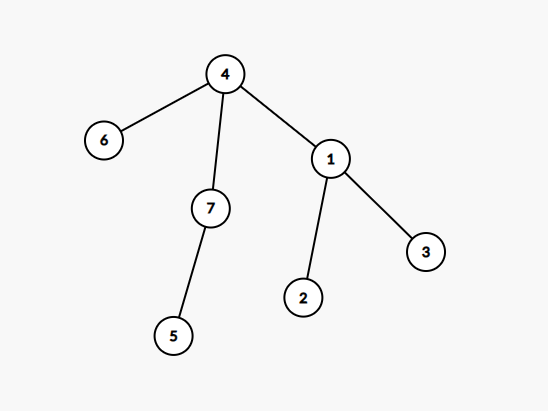
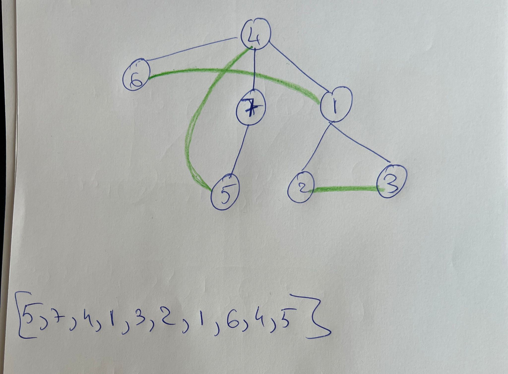

# Rezolvare subiecte simulare 2023

## Subiectul I
1. 
    - Rezolvare:
        - a -> x=8 şi y=23 => x/2+y%3 = 4 + 2 = 6
        - b -> x=20 şi y=39 => x/2+y%3 = 10 + 0 = 10
        - c -> x=23 şi y=66 => x/2+y%3 = 11 + 0 = 11
        - d -> x=43 şi y=20 => x/2+y%3 = 21 + 2 = 23
    - Raspuns corect: `d`
2. 
    - Rezolvare:
        ```json
            f(2023) = f(202) * 10 + 2
                        = f(20) * 10 + 3
                            = f(2)*10+2
                                = f(0)*10+3
                                = 3
                            = 32
                        = 323
                    = 3232
        ```
    - Raspuns corect: `b`
3. 
    - Rezolvare:
        - Prin simplul fapt ca vedem sintaxa incorecta, observam ca varianta corecta este a
    - Raspuns corect: `a`
4. 
    - Rezolvare:
        ```json
            Notam astfel:
            [  0      1       2        3      4  ]
            [matcha, mate, moringa, oolong, tulsi]

            Primele 4 solutii sunt
            [matcha, mate, moringa]
            [matcha, mate, oolong],
            [matcha, mate, tulsi],
            [matcha, moringa, oolong]

            Adica:
            [0, 1, 2],
            [0, 1, 3],
            [0, 1, 4],
            [0, 2, 3]

            Variantele care nu se pot obtine:
            (matcha, moringa, tulsi) sau (0, 2, 4) -> se poate obtine
            (moringa, oolong, tulsi) sau (2,3,4) -> se poate obtine
            (mate, moringa, oolong) sau (1,2,3) -> se poate obtine
            (oolong, tulsi, mate) sau (3,4,1) -> Nu se poate obtine deoarece deja a fost 1,3,4 si pentru ca 2 combinatii sa difere, cel putin una trebuie sa fie diferita.

        ```
    - Raspuns corect: `d`
5. 
    - Rezolvare:
        - Stiind ca avem 3 zone, si fiecare avand un numar par, putem avea urmatoarea aranjare:
            - Zona 1: 2
            - Zona 2: 2
            - Zona 3: 4
        - Este foarte greu sa exemplificam un graf deoarece sunt in total 36 de arce, destul de imbricat dar haide sa spargem pe bucati.
        - In zona 1 avem initial maximum: `2` arce
        - In Zona 2 avem initial maximum: `2` arce
        - In Zona 3 avem initial maximum: `12` arce
        - Acum pentru a pastra tare conexitatea, putem unii cele 3 zone insa doar cu un drum dus pentru a nu ne putea intoarce si astfel din prima zona pot pleca inca `4` arce pentru zona 2
        - Tot din zona 1 pot pleca inca `8` arce pentru zona 3
        - Din zona 2 pot pleca in aceeasi maniera inca `8` arce pentru zona 3
        - In total: 36 de arce
## Subiectul II
1. 
    - a
        ```json
            n = 5174
            x = 5
            repeta
                cn = 5174, n = 0, p = 1
                repeta
                    c = 4
                    4 != 5
                    n = 4 * 1+ 0 = 4
                    cn = 517
                    p = 10
                pana cand cn = 0
                repeta
                    c = 7
                    7 != 5
                    n = 7 * 10 + 4 = 74
                    cn = 51
                    p = 100
                pana cand cn = 0
                repeta
                    c = 1
                    1 != 5
                    n = 1 * 100+74 = 174
                    cn = 5
                    p = 1000
                pana cand cn = 0
                repeta
                    c = 5
                    5 =5 -> c = 0
                    n <- 174
                    cn = 0
                    p = 10000
                pana cand cn = 0 => ne oprim
                x = 4
            pana cand x = 0
            repeta
                cn = 174
                n = 0
                p = 1
                repeta
                    c = 4
                    4 = 4 => c = 5 - 4 = 1
                    n = 1
                    cn =  17
                    p = 10
                pana cand cn  = 0
                repeta
                    c = 7
                    7 != 4
                    n = 7 * 10 + 1 = 71
                    cn = 1
                    p = 100
                pana cand cn = 0
                repeta 
                    c = 1
                    1 != 4
                    n = 1 *100 + n = 171
                    cn = 0
                    p = 1000
                pana cand cn = 0
                x = 3
            pana cand x = 0
            repeta
                cn = 171
                n = 0
                p = 1
                repeta
                    c = 1
                    c != 3
                    n = 1
                    cn = 17
                    p = 10
                pana cand cn = 0
                repeta
                    c = 7
                    7 != 3
                    n = 70 + 1 = 71
                    cn = 1
                    p = 100
                pana cand cn = 0
                repeta
                    c = 1
                    1 != 3
                    n = 1 * 100 + 71 = 171
                    cn = 0
                    p = 1000
                pana cnd cn = 0
                x = 2
            pana cand x = 0
            repeta
                cn = 171
                n = 0
                p = 1
                repeta
                    c = 1
                    c != 2
                    n = 1
                    cn = 17
                    p = 10
                pana cand cn = 0
                repeta
                    c = 7
                    7 != 2
                    n = 70 + 1 = 71
                    cn = 1
                    p = 100
                pana cand cn = 0
                repeta
                    c = 1
                    1 != 2
                    n = 1 * 100 + 71 = 171
                    cn = 0
                    p = 1000
                pana cand cn = 0
                x = 1
            pana cand x=0
            repeta
                cn = 171
                n = 0
                p = 1
                repeta
                    c = 1
                    1 = 1 -> c = 4
                    n = 4 * 1 + 0 = 4
                    cn = 17
                    p = 10
                pana cand cn = 0
                repeta
                    c = 7
                    7 != 1
                    n = 7 * 10 + 4 = 74
                    cn = 1
                    p = 100
                pana cand cn = 0
                repeta
                    c = 1
                    1 = 1 -> c = 4
                    n = 4 * 100 + 74 = 474
                    cn = 0
                    p = 1000
                pana cand cn = 0 -> ne oprim
                x = 0
            pana cand x = 0 -> ne oprim
        scrie n => 474
        ```
    - b
        - Oricare dintre numerele  521,531,5021, 5031
        - Explicatie:
            ```json
                Algoritmul inlocuieste cifrele de la 5 la 1 cu complementul lor. Prin complement, in cazul
                de fata intelegem numarul care adunat la un alt numar ne da 5. Astfel avem complementele:
                5 -> 0
                4 -> 1
                3 -> 2
                2 -> 3
                1 -> 4
                0 -> 5
            ```
    - c
        ```c++
            #include <iostream>
            using namespace std;

            int main() {
                int n;
                cin >> n;
                int x = 5;
                do {
                    int cn = n;
                    n = 0;
                    int p = 1;
                    do {
                        int c = cn % 10;
                        if (c == x) {
                            c = 5-c;
                        }
                        n = c * p + n;
                        cn = cn / 10;
                        p = p * 10;
                    } while(cn != 0);
                    x = x -1;
                } while (x != 0);

                cout << n;
            }
        ```
    - d
        ```json
            citeşte n 
            (număr natural)
            ┌pentru x <- 5,0,-1 executa
            │ cn<-n; n<-0; p<-1
            │┌repetă
            ││ c<-cn%10
            ││┌dacă c=x atunci c<-5-c
            ││└■
            ││ n<-c*p+n; cn<-[cn/10]; p<-p*10
            │└până când cn=0
            │ x<-x-1
            └■
            scrie n
        ```
2. 
    - Rezolvare:
        - Vectorul de tati este corespunzator grafului de mai jos  .
        - Prin graf eulerian intelegem un graf care contine un ciclu eulerian. Prin ciclu eulerian intelegem un ciclu care contine toate muchiile grafului.
        - Avand in vedere graful din imagine si teoria de mai sus, daca adaugam muchiile [2,3], [1,6], [4,5] obtinem un graf eulerian cu ciclul eulerian [5,7,4,1,3,2,1,6,4,5] rezultand graful din poza de mai jos .

3.  
    - Explicatie:
        ```json
            - Elementele de pe diagonala secundara sunt egala cu indexul liniei
            - Elementele care sunt aflata dupa diagonala secundara, au aceeasi valoare cu cea de pe diagonala secundara
            - Elementele care se afla inainte de diagonala secundara, au valoarea egala cu n-1-j, unde n este dat (5)
        ```
    - Solutie:
    ```c++
        #include <iostream>
        using namespace std;

        int main() {
        int a [5][5];
        for(int i =0; i < 5; i++) {
            for (int j = 0; j < 5; j++) {
                if (i+j == 5-1) {
                    a[i][j] = i;
                } else if (j > 5-i-1) {
                    a[i][j] = a[i][5-i-1];
                } else {
                    a[i][j] = 5-j-1;
                }
            }
        }

        for(int i = 0; i < 5; i++) {
            for(int j = 0; j < 5; j++) {
                cout << a[i][j] << " ";
            }
            cout << endl;
        }
        }
    ```

## Subiectul III
1. 
    - Rezolvare:
    ```c++
        #include <iostream>
        using namespace std;

        void NrImp(int x, int y, int &nr);

        int main()
        {
            int nr = 0;
            NrImp(4, 50, nr);
            cout << nr;
            return 0;
        }

        void NrImp(int x, int y, int &nr) {
            int contorNumere = 0;
            for(int i = x; i <= y; i++) {
                int contorDivzori = 0;
                for (int j = 1; j <= i; j++) {
                    if (i % j == 0 && j % 2 != 0) {
                        contorDivzori++;
                    }
                }
                if (contorDivzori == 3) {
                    contorNumere++;
                }
            }
            nr = contorNumere;
        }
    ```

2. 
    - Rezolvare:
        ```c++
            #include <iostream>
            #include <string.h>

            using namespace std;

            int main()
            {
                char text[101], raspuns[101]="";
                cin.getline(text, 101);
                char *cuvant = strtok(text, " ");
                while(cuvant != NULL) {
                    if (cuvant[strlen(cuvant)-1] == '.') {
                        if (cuvant[0]=='S') {
                            strcat(raspuns, "spe. ");
                        } else if (cuvant[0] == 'F') {
                            strcat(raspuns, "fam. ");
                        } else {
                            strcat(raspuns, "gen. ");
                        }
                    } else {
                        strcat(raspuns, cuvant);
                        strcat(raspuns, " ");
                    }
                    cuvant = strtok(NULL, " ");
                }
                cout << raspuns;
                return 0;
            }

        ```
3. Solutie:
    - a. In limbaj natural:
        ```json
            In algoritmul de mai jos, parcurgem fisierul, salvand mereu numarul curent si numarul anterior. De asemenea, cu fiecare numar citit, incrementam un contor. De fiecare data cand gasim un maxim, afisam contorul ce reprezinta numarul curent. Totodata, in timp ce parcurgem, calculam valoarea maxima a numerelor citite pana intr-un punct. De fiecare data cand gasim un maxim, afisam numarul de pasi. Daca gasim o valoarea egala cu valoarea maxima existenta, o afisam daca si nu mai dac difera de numarul anterior.
            Solutia aleasa este eficienta din punct de vedere al timpului de executie deoarece algoritmul parcurge o singura data fisierul ce contine datele de intrare. In acelasi timp, algoritmul este eficient din punct de vedere al memoriei folosite, deoarece in orice moment al executiei, avem in memorie doar 2 numere din fisier si nu se folosesc alte structuri de date, afara de variabila care ne indica valoarea maxima si cea care ne indica numarul total de pasi.
        ```
    - b. C++:
        ```c++
            #include <iostream>
            #include <fstream>

            using namespace std;

            int main()
            {
                ifstream fin("bac.txt");
                int nrCitit, nrAnterior;
                int max = -1;
                int pasiTotali = 0;

                while(fin >> nrCitit) {
                    pasiTotali++;
                    if (nrCitit > max) {
                        max = nrCitit;
                        cout << pasiTotali << " ";
                    } else if (nrCitit == max && nrCitit != nrAnterior) {
                        cout << pasiTotali << " ";
                    }
                    nrAnterior = nrCitit;
                }
                fin.close();
                return 0;
            }
        ``` 