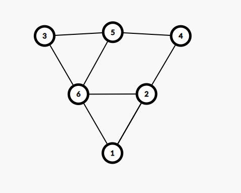

# Rezolvare Subiectul III Varianta 2022 Speciala + Test 12 2021

## Subiectul III v.2022 Speciala
1. 
    - Rezolvare:
        ```c++
            #include <iostream>
            #include <cmath>

            using namespace std;
            void patrate(int n, int &x, int &y);

            int main() {
                int x, y;
                patrate(16, x, y);
                cout << x <<" " << y;
            }

            void patrate(int n, int &x, int &y) {
                int tempX = -1, tempY = -1;
                for(int i = 2; i*i <= n; i++) {
                    if (n % (i * i) == 0) {
                        tempY = n / (i * i );
                        int radacina = sqrt(tempY);
                        if (radacina * radacina == tempY && radacina != i && radacina > 1) {
                            tempY = radacina;
                            tempX = i;
                            break;
                        } else {
                            tempX=-1;
                            tempY=-1;
                        }
                    }
                }

                if (tempX == -1 || tempY == -1) {
                    x = 0;
                    y = 0;
                } else {
                    x = tempX;
                    y = tempY;
                }
            }
        ```
2. 
    - Rezolvare:
        ```c++
            #include <iostream>
            #include <cstring>

            using namespace std;

            int main() {

                int n;
                cin >> n;
                int matrice[n][n];

                for(int i =0; i < n; i++) {
                    for (int j =0; j < n; j++) {
                        cin >> matrice[i][j];
                    }
                }

                for (int i = 0; i < n; i++) {
                    for (int j = 0; j < n; j++) {
                        if (j > i) {
                            matrice[i][j-1] = matrice[i][j];
                        }
                    }
                }

                for (int i = 0; i < n; i++) {
                    for (int j = 0; j < n-1; j++) {
                        cout << matrice[i][j] << " ";
                    }
                    cout << endl;
                }
                return 0;
            }
        ```
3. 
    - Rezolvare:
        - a
            ```json
                Mai jos avem un algoritm care parcurge fisierul o singura data si
                in timp ce parcurge, analizeaza daca are o secventa de numere
                conform cerintei probleme. Felul in care lucreaza e in felul 
                urmator, de fiecare data cand gasim un numar care este egal cu 
                numarul citit anterior, incrementam un contor de aparitii. 
                De fiecare data cand gasim un numar care difera de ultimul numar 
                citit, ne uitam sa vedem daca numarul anterior a aparut de un 
                numar de ori, egal cu valoarea sa, caz in care actualizam un contor in care
                vom tine lungimea secventei curente.
                Totodata, o sa verificam daca lungimea secventei curente, este mai mare decat
                lungimea maxima intalnita, caz in care o actualizam.
                Algoritmul este eficient din punct de vedere al timpului de executie deoarece
                se efectueaza o singura citire a numerelor din fisier. Totodata, algoritmul este
                eficient din punct de vedere al memoriei deoarece, din totalul de 1 milion
                de numere, noi avem in memorie, in orice moment doar 2 numere (numarul curent si
                ultimul numar citit) + anumite variabile auxiliare unde tine minte lungimea secventelor si
                numarul de aparitii.
            ```
        - b
            ```c++
                #include <iostream>
                #include <fstream>

                using namespace std;

                int main() {
                    ifstream fin("bac.txt");
                    int numar;
                    int lungimeMaxima = 0;
                    int lungimeCurenta = 0;
                    int ultimulTermenCitit = -1;
                    int aparitiiUltimulTermen = 0;
                    while(fin >> numar) {
                        // Daca suntem la primul numar citit, initializam primul termen si contorul de aparitii
                        if (ultimulTermenCitit == -1) {
                            ultimulTermenCitit = numar;
                            aparitiiUltimulTermen = 1;

                            // Daca numarul curent este egal cu ultimul numar citit
                            // atunci incrementam contorul de aparitii al acestuia
                        } else if (numar == ultimulTermenCitit) {
                            aparitiiUltimulTermen++;
                            // Daca numarul citit difera de ultimul numar si ultimul numar citit
                            // respecta conditia adica numar = numarDeAparitii(numar)
                            // atunci adunam la lungimea curenta, cate aparitii a avut ultimul termen si
                            // vedem daca e nevoie sa updatam si lungimea maxima de pana acum
                        } else if (numar != ultimulTermenCitit && aparitiiUltimulTermen == ultimulTermenCitit) {
                                lungimeCurenta += aparitiiUltimulTermen;
                                aparitiiUltimulTermen = 1;
                                if(lungimeCurenta > lungimeMaxima) {
                                    lungimeMaxima = lungimeCurenta;

                                }
                            // Daca numarul citit difera de ultimul numar citit si totodata
                            // ultimul numar citit nu apare de un numar de ori = cu valoarea sa
                            // resetam lungimea curenta si setam numarul de aparitii ale ultimuli numar citit la 1
                        } else {
                            lungimeCurenta = 0;
                            aparitiiUltimulTermen = 1;
                        }
                        ultimulTermenCitit = numar;
                    }

                    if (ultimulTermenCitit == aparitiiUltimulTermen) {
                        lungimeCurenta += aparitiiUltimulTermen;
                        if (lungimeCurenta > lungimeMaxima) {
                            lungimeMaxima = lungimeCurenta;
                        }
                    }

                    cout << lungimeMaxima;
                    fin.close();
                }
            ```

## Rezolvare Test 12 Bac 2021

### Subiectul I
1. 
    - Rezolvare:
        * a -> Obtinem `1` si pentru numere din afara intervalelor specificate, de exemplu:  `-2019`.
        * b -> Nu este posibil ca un numar sa fie in acelasi timp din intervalul [-2021,  2022] si [2020, 2021] deci este invalid
        * c -> ! din fata parantezelor inverseaza conditiile si obtinem practic:
            `x >= -2021 && x <= -2020 || x >= 2020 && x <= 2021` Care rezulta in `1` doar pentru numere din intervalele reunite din enunt.
        * d -> ! din fata parantezelor inverseaza conditiile si obtinem:
            `x >= -2021 || x <= 2021 || x <= -2020  && x >= 2020`
                - Aceasta varianta cade din mai multe motive:
                    1. obtinem 1 si pentru numere din afara intervalului
                    2. Daca primele doua || operatii sunt false, obtinem o conditie imposibila, anume sa fie un x care in acelasi timp e si mai mic decat 2020 si mai mare sau egal cu 2020.
    - Raspuns corect: `c`
2. 
    - Rezolvare:
        ```json
            - Din punct de vedere al sintaxei, eliminam din start: c si d
            - De asemenea si punctul b este invalid deoarece masina este numele structurii si nu al unui membru din aceea structura.
            - Rezulta ca punctul a este cel corect.
        ```
    - Raspuns corect `a`
3. 
    - Rezolvare:
        ```json
            Pentru usurinta in calcule notam:
             roșu galben verde albastru violet
               |    |      |       |       |
               0    1      2       3       4

            Primele 4 solutii sunt:
            (roșu, galben, verde)
            (roșu, galben, albastru)
            (roșu, galben,violet),
            (roșu, verde, galben)

            Adica:
            [0 1 2],
            [0 1 3],
            [0 1 4],
            [0 2 1],
            
            [0 2 3],
            [0 2 4],
            [0 3 1],
            [0 3 2],
            [0 3 4]
            si a 10 a este:
            [0 4 1] -> rosu violet galben
        ```
    - Raspuns corect: `d`
4. 
    - Rezolvare:
        - Aici vedem ca putem folosi algoritmul lui euclid, varianta recursiva.
            - Mai multe detalii aici:https://ro.wikipedia.org/wiki/Algoritmul_lui_Euclid 
        ```c++
            int f (int x, int y)
            { if(y==0) return x;
                else return f(y, x%y);
            }
        ```
    - Raspuns corect: `b`
5. 
    - Rezolvare:
        - Stim ca arborele nostru are 5 noduri dintre care 1 trebuie sa fie radacina
        - Prin urmare, gradul maxim pe care il poate avea un nod este 4 si in acelasi timp nu putem un nod cu gradul 0 pentru ca asta ar insemna sa avem un nod deconectat.
        - Acum sa verificam fiecare optiune:
            - a -> invalida datorita explicatiei de mai sus
            - b -> nu avem cum sa obtinem din 5 noduri un arbore cu 4 noduri ce au gradul 1  si unul sa aibe 3
            - c -> Aceasta este o optiune valida, deoarece daca am avea arborele din poza de mai jos:
             am avea:
                - Nodul 4 cu gradul 1
                - Nodul 5 cu gradul 1
                - Nodul 1 cu gradul 2
                - Nodul 2 cu gradul 2
                - Nodul 3 cu gradul 2
            - d -> de asemenea nu putem obtine un arbore, avand 5 noduri, unde sa avem si un nod cu gradul 3 si inca 2 noduri cu gradul 1 si alte 2 cu gradul 2]
    - Raspuns corect: `c`
### Subiectul II
1. 
    a.
        ```json
            n = 5
            k = 2
            t = 1
            pentru i = 1, i<=2 executa
                pentru j = 1, j <= 2
                    afiseaza: 2 * t => 2
                pentru j = 2, j <= 2
                    afiseaza: 2*t => 2
                t = t+1 => 2
            pentru i = 2, i<=2 executa
                pentru j = 1, j <= 2
                    afiseaza: 2 * t => 4
                pentru j = 2, j <= 2
                    afiseaza: 2 * t => 4
                t = t+1 = 3
            pentru i = 1, i >= 1, i--
                afiseaza 3 * t -> 9
        ```
        - Rezulta ca programul afiseaza: 2 2 4 4 9
    b.
        - Observam ca pentru a obtine 12, trebuie sa avem un t = 4;
        - Vom putea obtine t =4 daca primul for, va avea 3 executii fix
        - Stiind ca pentru k avem valoarea 6, pentru a obtine 3 din [n/k], luam n = 19 drept cea mai mica valoare. Nu putem alege n = 18 deoarece in acest caz, ultimul for nu se va executa. Si cea mai mare valoare pentru care putem obtine t = 4 este 23. 
        ```json
            19 si 23
        ```
    c. 
        ```c++
            #include <iostream>

            using namespace std;

            int main() {
                int n, k, t = 1;
                cin >> n >> k;
                for(int i = 1; i<=n/k;i++) {
                    for(int j = 1; j <=k;j++) {
                        cout << 2 * t << " ";
                    }
                    t = t+1;
                }
                for(int i = n%k; i >=1; i--) {
                    cout << 3 * t << " ";
                }
            }
        ```
    d. 
        
    ```json
        citește n,k
        (numere naturale nenule)
        t<-1
        ┌pentru i<-1,[n/k] execută
        │┌pentru j<-1,k execută
        ││ scrie 2*t,' '
        │└■
        │ t<-t+1
        └■
        i <- n%k
        ┌cat timp i >=1 execută
        │ scrie 3*t,' '
        | i <- i-1
        └■
    ```
2. 
    - Rezolvare:
        - Teorie: https://www.pbinfo.ro/articole/810/grafuri-neorientate#intlink-9
        - `Lant elementar`:Lanțul care conține numai vârfuri distincte, două câte două, este lanț elementar.
        - `Ciclu care nu este elementar`:Se numește ciclu un lanț simplu în care primul vârf este identic cu ultimul. De asemenea, pentru a nu fi elementar, varfurile nu trebuie sa fie distincte insa muchiile trebuie sa fie distincte.
        - Conform matricei de adiacenta obtinem graful de mai jos:
        
        - Astfel avem:
            - Lant elementar: 1 6 3 5 4 2
            - Ciclu neelemantar: 1 6 3 5 6 2 1
3. 
    - Rezolvare:
        ```c++
            #include <iostream>
            #include <cstring>

            using namespace std;

            int main() {
                char s[51] = "CALCULATOARE";
                for(int i=0;i<strlen(s);i++)
                    if(strchr("OAU", s[i])) cout<< "*";
                    else cout<< s[i];
            }
        ```
    - De scris pe hartie:
        ```c++
            for(i=0;i<strlen(s);i++)
            if(strchr("OAU", s[i])) cout<< "*";
            else cout<< s[i];
        ```
### Subiectul III
1. 
    - Rezolvare:
        ```c++
            #include <iostream>

            using namespace std;

            void frate(int x, int &y);
            int main() {
                int x = 9027, y;
                frate(x, y);
                cout << y;
            }

            void frate(int x, int &y){
                int rezultat = 0;
                int p = 1;
                while(x) {
                    int ultimaCifra = x % 10;
                    if (ultimaCifra == 9) {
                        y = -1;
                        return;
                    } else {
                        ultimaCifra += 1;
                        rezultat = ultimaCifra * p + rezultat;
                        p = p * 10;
                    }
                    x /= 10;
                }
                y = rezultat;
            }
        ```
        - De retinut, putem folosi keyword-ul `return` intr-o functie `void`, singur, fara a specifica o valoare de intors. Sensul acestuia, in cazul respectiv este de a iesi imediat din functie.
2. 
    - Rezolvare:
        ```c++
            #include <iostream>

            using namespace std;

            int main() {
                int n, k;
                cin >> n;
                cin >> k;
            // int matrice[n][n];
            //    for(int i =0; i < n; i++) {
            //        for(int j = 0; j < n; j++) {
            //            cin >> matrice[i][j];
            //        }
            //    }
                int matrice[5][5] = {
                        {2, 3, 4, 5, 6},
                        {2, 4, 6, 8, 0},
                        {7, 8, 9, 0, 1},
                        {3, 5, 7, 9, 1},
                        {7, 3, 8, 5, 6}
                };

                int lungimeSecventa = n-k;
                int sir[lungimeSecventa];
                // aici extragem numerele
                for(int i = 0; i < lungimeSecventa; i++) {
                    sir[i] = matrice[k-1][i];
                }
                for(int i = 0; i < n; i++) {
                    for(int j = 0; j < n; j++) {
                        if (j < n-1-i && (i+1) == k) {
                            matrice[i][j] = sir[]
                        }
                    }
                }

            //    for(int i =0; i < n; i++) {
            //        for(int j = 0; j < n; j++) {
            //            cout << matrice[i][j] << " ";
            //        }
            //        cout << endl;
            //    }
            }

        ```
3. 