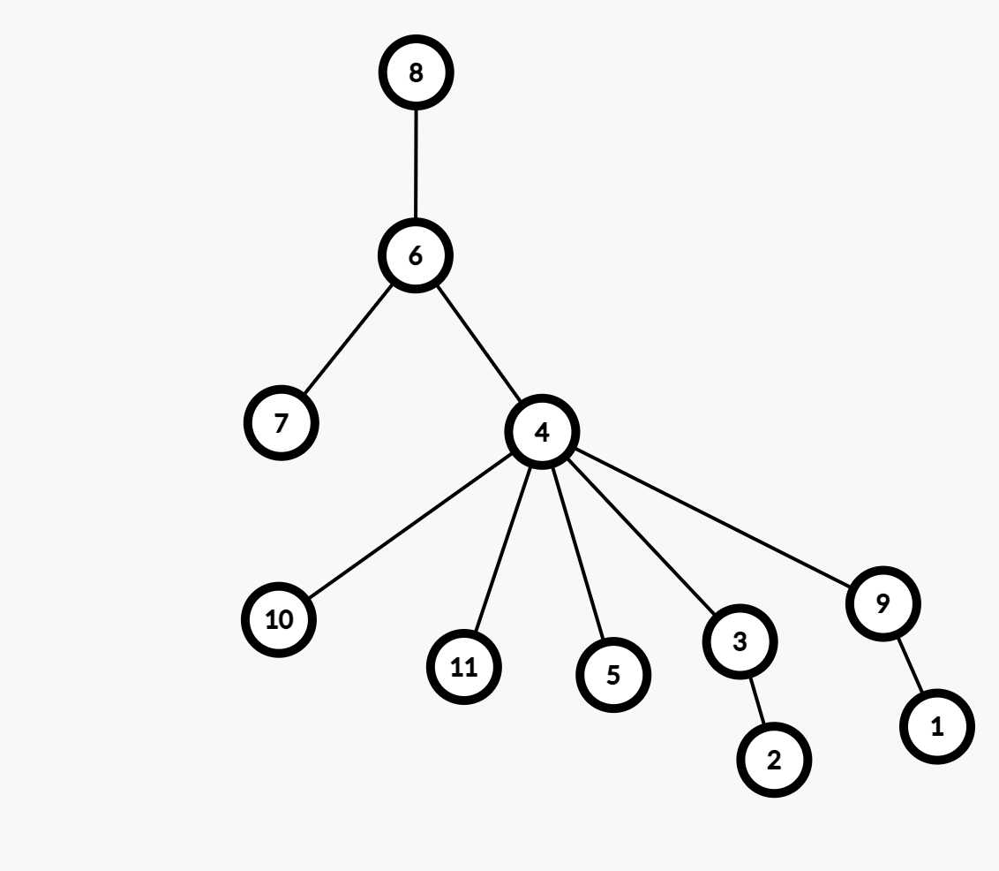

# Rezolvare subiecte propuse Testul 11 si Testul 10 2021

## Testul 11

### Subiectul I
1. 
    -  Rezolvare:
        * a ->  Aici nu putem obtine 1 daca 2021 este divizor de al lui X. De exemplu daca luam X = orice multiplu de al lui 2021, sa zicem X = 6063, avem `6063 / (6063/2021) = 2021` deci nu avem cum sa ajungem la 0
        * b -> Pentru a avea rezultatul 0, trebuie ca `x%2021` sa fie mai mare decat x. Si daca 2021 este divizor de al lui x, nu avem cum sa ajungem la cazul asta.
        * c -> Pentru un X care e multiplu de 2021, putem sa ajungem la valoarea 1. De exemplu daca luam x = 6063, obtinem `1`
        * d -> Daca avem x = multiplu de al lui 2021, nu avem cum sa obtinem 1.
    - Raspuns corect: `c`
2. 
    - Rezolvare:
        ```json
            0
            1
            10
            100
            1000
            1001
            1002
            101
            1010
            1011
            1012
            102
        ```
    - Raspuns corect: `b`
3. 
    - Rezolvare:
        - Din punct de vedere sintactic, optiunea valida este a
    - Raspuns corect: `a`
4. 
    - Rezolvare:
        - Conform vectorului de tati avem:
            ```json
                1 2 3 4 5 6 7 8 9 10 11
                9 3 4 6 4 8 6 0 4  4 4

                - Radacina: 8
                - 8 parinte pentru: 6
                - 6 parinte pentru: 4 si 7
                - 4 parinte pentru: 3 5 9 10 11
                - 3 parinte pentru: 2
                - 9 parinte pentru 1
            ```
        - Rezulta arborele de mai jos: 
        
        - Prin urmare observam ca nodul `4` are `5` descendenti directi
    - Raspuns corect: `c`
5. 
    - Rezolvare:
        - Stim ca avem un graf neorientat complet cu 210 muchii
        - Teorema: Fie G=(X, U) un graf neorientat. Graful G se numește graf complet dacă oricare două vârfuri distincte ale sale sunt adiacente. 
            - Pentru formula: https://www.pbinfo.ro/articole/810/grafuri-neorientate#intlink-7
        - Deci avem ca (n*(n-1))/2 = 210
            -> n = 21
    - Raspuns corect: `d`
### Subiectul II
1. 
    - a
        ```json
            m = 2
            n = 9
            2 > 9 false

            m % 2 == 0 adevarat
                m = m+1 = 3
            cat timp m <= n executa
                m = m+2 = 5
                scrie '*'
            cat timp m<= n executa
                m = m+2 = 7
                scrie '*'
            cat timp m<= n executa
                m = m+2 = 9
                scrie '*'
            cat timp m<= n executa
                m = 11
                scrie '*'
            ne oprim
        ```
        - Programul afiseaza: `****`
    - b:
        `1 si 158`
            - Practic trebuie sa urmarim sa fie 40 de pasi, deoarece mergem din 2 in 2.
    - c
        ```c++
            #include <iostream>

            using namespace std;

            int main() {
                int m,n;
                cin >> m >> n;

                if(m > n) {
                    int aux = m;
                    m = n;
                    n = aux;
                }
                if (m % 2 == 0) {
                    m = m+1;
                }
                while (m <=n) {
                    m = m+2;
                    cout << '*';
                }
                return 0;
            }

        ```
    - d
        ```json
            citește m,n
            (numere naturale)
            ┌dacă m>n atunci
            │ n<->m
            └■
            ┌dacă m%2=0 atunci
            │ m<-m+1
            └■
            ┌ daca m<=n atunci
            | ┌execută
            │ | m<-m+2
            │ |scrie ‘*’
            | └■ cat timp m<=n
            └■
        ```
2. 
    - Rezolvare:
        ```json
            f(2) = 2
            f(21) =
                21 - f(19)
                    = 19 - f(17) =
                        = 17 - f(15)
                            = 15 - f(13)
                                = 13 - f(11)
                                    = 11 - f(9)
                                        = 9 - f(7)
                                            = 7 - f(5)
                                                = 5 -f(3)
                                                = 2
                                            = 5
                                        = 9 - 5 = 4
                                    = 11 - 4 = 7
                                = 13 - 7 = 6
                            = 15 - 6 = 9
                        = 17 - 9 = 8
                    = 19 - 8 = 11
                = 21 - 11 = 10
        ```
3. 
    - Rezolvare:
        ```c++
            strcpy(x,"bac2021"); // x = "bac2021"
            cout<<x+3<<endl; | printf("%s\n",x+3);c//afisam 2021
            for(i=0;i<strlen(x);i++)
                if(strchr("0123456789",x[i])==0) // pentru fiecare caracter care nu e cifra afisam caracterul + !
                    cout<<x[i]<<'!'; | printf("%c! ",x[i]);
            // practic afisam:
            // 2021
            // b!a!c!
        ```
### Subiectul III
1. 
    - Rezolvare:
        ```c++
            #include <iostream>

            using namespace std;

            void imog(int x, int y, int& rez);

            int main() {
                int x = 40;
                int y = 86;
                int rez;
                imog(x, y, rez);

                cout << rez;
                return 0;
            }

            void imog(int x, int y, int& rez) {
                int xFaraPare = 0;
                int yFaraPare = 0;
                int px = 1, py = 1;
                while (x) {
                    int ultimaCifra = x % 10;
                    if (ultimaCifra % 2 != 0) {
                        xFaraPare = ultimaCifra * px + xFaraPare;
                        px = px * 10;
                    }
                    x = x/10;
                }

                while (y) {
                    int ultimaCifra = y % 10;
                    if (ultimaCifra % 2 != 0) {
                        yFaraPare = ultimaCifra * py + yFaraPare;
                        py = py * 10;
                    }
                    y = y / 10;
                }

                // Tratam cazul in care numerele nu au nici un numar impar, caz cand rez va fi 0
                if (yFaraPare == 0 || xFaraPare == 0) {
                    rez = 0;
                    return;
                }

                // calculam oglinditul oricaruia dintre cele 2 numere
                int oglindit = 0;
                while (yFaraPare) {
                    int ultimaCifra = yFaraPare % 10;
                    oglindit = oglindit * 10 + ultimaCifra;
                    yFaraPare = yFaraPare / 10;
                }

                if (oglindit == xFaraPare) {
                    rez = 1;
                } else {
                    rez = 0;
                }
            }
        ```
2. 
    - Rezolvare:
        ```c++
            #include <iostream>

        using namespace std;

        int main() {
            int n, k;
            cin >> n >> k;
            int matrice[n][n];
            for (int i =0 ; i < n; i++) {
                for (int j = 0; j < n; j++) {
                    cin >> matrice[i][j];
                }
            }

            int lungimeSecventa = k - 1; // cate elemente avem de schimbat de pe fiecare linie sau coloana;
            for(int i =0; i < lungimeSecventa; i++) {
                int aux = matrice[k-1][i];
                matrice[k-1][i] = matrice[i][k-1];
                matrice[i][k-1] = aux;
            }


            for (int i = 0; i < n; i++) {
                for(int j = 0; j < n; j++) {
                    cout << matrice[i][j] << " ";
                }
                cout << endl;
            }
            return 0;
        }
        ```
3. 
    - a
        ```json
            Mai jos avem un algoritm eficient din punct de vedere al timpului de executie si al memoriei deoarece utilizand formula din enunt, putem sa deducem usor pe ce pozitie se afla ultimul termen, si bineinteles si penultimul termen pe care il citim, astfel generand usor, numar cu numar, fara a fi nevoie ca sa le generam incepand cu 1, si sa le stocam intr-o structura de date, dupa care sa le afisam invers. 
        ```
    - b
        ```c++
            #include <iostream>
            #include <fstream>
            using namespace std;

            int main() {
            ofstream fout("bac.out");
            int x, y;
            cin >> x >> y;
            fout << y << " " << x << " ";
            // Aflam pozitia lui Y
            int pozitieY = (y-x)/2;
            // Deoarece stim pozitia lui Y, si stim ca mai citim un numar
            // putem deduce usor pozitia urmatorului termen, scazand 2 din pozitia lui Y
            int pozitieTermen = pozitieY-2;
            //Deoarece stim pozitia termenului si cat a fost termenul de dinaintea lui, deducem usor formula
            int termen = x - 2 * (pozitieY-1);
            while (pozitieTermen >= 0) {
                fout << termen <<" ";
                termen = termen - 2 * pozitieTermen;
                pozitieTermen--;
            }
            fout.close();
            }
        ```
## Testul 10

### Subiectul I
### Subiectul II
### Subiectul III