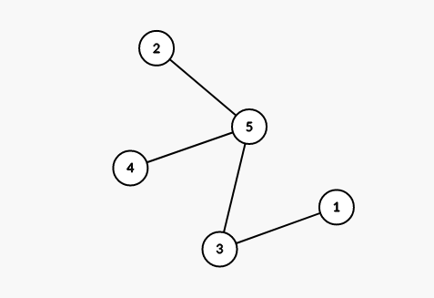
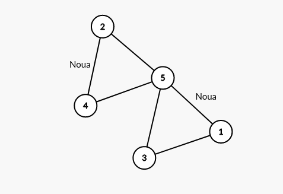

# Rezolvare testele 9 si 8 propuse pentru Bac 2021

## Testul 9

### Subiectul I
1. 
    - Rezolvare:
        * a -> Daca luam x = 25 obtinem: (24)*10+5 = 245
        * b -> Daca luam x = 25 obtinem: 2+4+5 = 11
        * c -> Daca luam x = 25 obtinem: 54*10+2 = 542
        * d -> Daca luam x = 25 obtinem: 6 * 10 + 5 = 65
    - Raspuns: `a`
2. 
    - Rezolvare:
        ```json
            Notam 
            {salcie, carpen, larice, fag, ulm}
            {  0       1       2      3    4 }

            Primele 4 solutii sunt 
            (salcie, carpen, larice, fag, ulm) 
            (salcie, carpen, larice, ulm, fag)
            (salcie, carpen, fag, larice, ulm)
            (salcie, carpen, fag, ulm, larice)

            Adica:
            (0 1 2 3 4)
            (0 1 2 4 3)
            (0 1 3 2 4)
            (0 1 3 4 2)

            Deoarece sunt multe variante de generat, putem pleca de la ultima varianta generata anume

            Ultima: -> 4 3 2 1 0
            Penultima: -> 4 3 2 0 1
            Antepenultima: -> 4 3 1 2 0 (ulm fag carpen  larice salcie)
        - Raspuns corect: `c`

        ```
3. 
    - Rezolvare:
        ```json
            Eliminam a,b,c din punct de vedere al sintaxei.
        ```
    - Raspuns corect: `d`
4. 
    - Rezolvare:
        - Dupa ce desenam arborii, observam ca pentru nodurile 3 si 5 avem numar maxim de noduri pentru nivelul 2 (3)
    - Raspuns corect: `a`
5. 
    - Rezolvare:
        - Conform enuntului avem graful de mai jos:
                

        - Lanțul care conține numai muchii distincte este lanț simplu. Dacă muchiile unui lanț nu sunt distincte se numește lanț compus.

        - Definiție: Se numește ciclu un lanț simplu în care primul vârf este identic cu ultimul. Dacă toate vârfurile sunt distincte, mai puțin primul și ultimul, se numește ciclu elementar.
        - Tinand cont de teorie, daca adaugam muchiile si obtinem ciclul: `3,5,4,2,5,1,3` conform pozei de mai jos:
            
    - Raspuns corect: `b`

### Subiectul II
1. 
    - a
        ```json
            n = 3
            i = 1
                j = 1
                    scrie "+"
                j = 2
                    scrie "+"
                j = 3
                    scrie "+"
                scrie "@"
            i = 2
                j = 2
                    scrie "+"
                j = 3
                    scrie "+"
            i = 3
                j = 3
                    scrie "+"
                scrie "@"
        ```
        - Programul afiseaza: "+++@+++@"
    - b
        ```json
            4, 5
        ```
    - c
        ```c++
            # include <iostream>

            using  namespace std;

            int main() {
                int n;
                cin >> n;
                for (int i = 1; i <=n; i++) {
                    for (int j = 1; j <= n; j++) {
                        cout << "+";
                    }

                    if (i % 2 != 0) {
                        cout << "@";
                    }
                }
            }
        ```
    - d
        ```json
            citeşte n
            (număr natural nenul)
            i <- 1
            ┌cat timp i<=n execută 
            │┌pentru j<-i,n execută
            │| scrie ’+’
            │└■
            │┌dacă i%2≠0 atunci 
            ││ scrie ’@’
            │└■
            | i<- i+1
            └■
        ```
2. 
    - Rezolvare:
        - Aici trebuie mai intai sa dam valori pentru a observa cum merge functia
        - Incepem cu x = 1 si avem:
            ```json
                f(10, 1) =
                    = 10/1 + f(9, 1) =
                        = 9/1 + f(8, 1) =
                            = 8/1 + f(7, 1) =
                                = 7 + f(6, 1) =
                                    = 6 + f(5, 1) =
                                        = 5 + f(4, 1) =
                                            = 4 + f(3, 1) =
                                                = 3 + f(2, 1) =
                                                    = 2 + f(1, 1) =
                                                        = 1
                                                    = 3
                                                = 6
                                            = 10
                                        = 15
                                    = 21
                                = 28
                            = 36
                        = 45
                    = 55
            ```
        - Deci pentru 1 am obtinut 55. Acum crestem putin si calculam f(10, 3)
            ```json
                f(10, 3) =
                = 10/3 + f(7, 3) =
                    = 7/3 + f(4, 3) =
                        = 4/3 + f(1, 3) =
                            = 3/1 + f(1, 2) =
                                = 2/1 + f (1, 1) =
                                    = 1
                                = 3
                            = 6
                        = 7
                    = 9
                = 12
            ```
        - Si observam ca pentru x = 3 nu ajungem, mai incercam cu x = 2
        - Calculam f(10, 2)
            ```c++
                f(10,2) =
                    = 10/2+ f(8, 2) =
                        = 8/2 + f(6, 2) =
                            = 6/2 + f(4, 2) =
                                = 4/2 + f(2, 2) =
                                    = 1
                                = 3
                            = 6
                        = 4+ 6 = 10
                    = 15
            ```
        - Pana acum, ce putem observa este ca cu cat e mai mare diferenta intre parametri, cu atat is sansele mai mari, deci mai ramane sa incercam cu x = 9;
        - Calculam f(10, 9)
            ```json
                f(10, 9) =
                    = 10/9 + f(1, 9)
                        = 9/1 + f(1, 8)
                            = 8/1 + f(1, 7)
                                = 7/1 + f(1, 6)
                                    = 6/1 + f(1, 5)
                                        = 5/1 + f(1, 4)
                                            = 4/1 + f(1, 3)
                                                = 3/1 + f(1, 2)
                                                    = 2/1 + f(1, 1)
                                                        = 1
                                                    = 3
                                                = 6
                                            = 10
                                        = 15
                                    = 21
                                = 28
                            = 36
                        = 45
                    = 46
            ```
        - Raspuns corect: `1, 9`
        - Din pacate aici, la bac, o sa trebuiasca sa faci pentru fiecare dintre cazuri, sa nu risti sa gresesti.
3. 
    - Rezolvare:
        ```c++
            # include <iostream>

            using  namespace std;
            int f(int a, int b);

            int main() {
                int matrice[4][5];
                for(int i = 0; i < 4; i++) {
                    for(int j = 0; j < 5; j++) {
                            matrice[i][j]= (i+j) % 3;
                    }
                }

                for(int i = 0; i < 4; i++) {
                    for(int j = 0; j<5; j++) {
                            cout << matrice[i][j] <<" ";
                    }
                    cout << endl;
                }
            }
            // Pentru bac, tot ce trebuia sa scrii in acea linie punctata este
            // matrice[i][j]= (i+j) % 3;
            // Se observa usor cum la fiecare pas, valoarea este egala cu restul impartirii la 3 a sumei indicelui liniei si coloanei.
        ```
### Subiectul III

## Testul 8

### Subiectul I
### Subiectul II
### Subiectul III