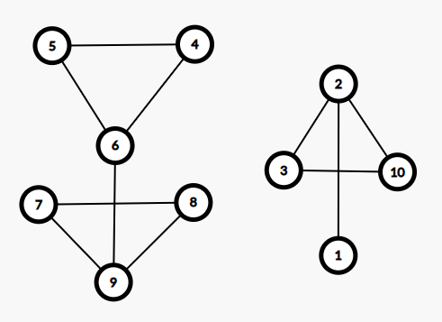
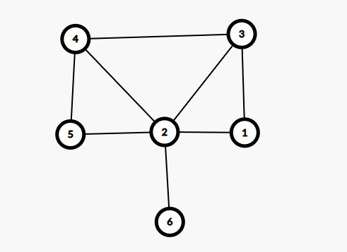

# Rezolvare testele 6 & 5 Bac 2021

## Test 6 Bac 2021

### Subiectul I
1. 
    - Rezolvare:
        - Datorita semnului `!` expresia devine: `x >= 3 || y <= 5`
        - a -> Optiune invalida, difera operatorul logic, dupa cum putem vedea mai sus (adica `&&` si ar fi trebuit sa avem `||` pentru a fi echivalenta)
        - b -> Invalida deoarece `!` este aplicat doar la prima paranteza
        - c -> Invalida nu seamana deloc cu expresia initiala
        - d -> Dupa ce aplicam operatorul `!` pentru a doua paranteza, expresia devine: `x>= 3 || y <= 5`, adica exact cu ce devine expresia initiala dupa ce aplicam operatorul `!`
    - Raspuns corect: `d`
2. 
    - Rezolvare:
        ```json
            f(2121, 19) =
                = 1 + 1 + f(212, 1)
                    = 0 + 1 + f(21, 0)
                        = 1
                    = 2
                = 4 
        ```
    - Raspuns corect: `a`
3. 
    - Rezolvare
        ```json
            Stim ca Alex are rolul principal deci restul 5 se bat pentru cele 2 pozitii
            Si ne intereseaza distributiile de genul `Alex _ Daria` si `Alex Daria _` si pentru fiecare loc lipsa, avem 4 copii din care sa alegem. Deci in total 8
        ```
    - Raspuns corect: `b`
4. 
    - Rezolvare
        ```json
            Conform pozei avem:
            1 2 3 4 5 6 7
            7 4 5 0 4 5 4
        ```
    - Raspuns corect: `d`
5. 
    - Rezolvare:
        - Conform enuntului avem graful:
        
        - Observam ca avem 4 noduri cu grad imapar: 6, 2, 9, 1
        - Numarul minim de muchii ce trebuie adaugate pentru a avea grad par cu toate este:
            - 2: 6-1 si 2-9
    - Raspuns corect: `c`
### Subiectul II
1.
    - a
        ```json
            x = 404, y = 413
            k = 0, i = 404
            cat timp i <= y
                n = 404, c = 0
                cat timp n>0 && c = 0
                    n%2 == 1 false
                    n = n/10 = 40
                cat timp n > 0 && c = 0
                    n%2 == 1 false
                    n = n/10 = 4
                cat timp n>0 && c = 0
                    n%2 == 1 false
                    n = 0
                k = 0
                i = 405
            cat timp i <= y
                N = 405, c = 0
                cat timp n > 0 && c = 0
                    n%2 == 1 adevarat
                        c = 1
                    n = 40
                k = 1
                i = 406
            cat timp i <= y
                n = 406, c = 0
                cat timp n>0 && c = 0
                    n%2 == 1 false
                    n = n/10 = 40
                cat timp n > 0 && c = 0
                    n%2 == 1 false
                    n = n/10 = 4
                cat timp n>0 && c = 0
                    n%2 == 1 false
                    n = 0
                k = 0
                i = 407
            cat timp i <= y
                N = 407, c = 0
                cat timp n > 0 && c = 0
                    n%2 == 1 adevarat
                        c = 1
                    n = 40
                k = 2
                i = 408
            cat timp i <= y
                n = 408, c = 0
                cat timp n>0 && c = 0
                    n%2 == 1 false
                    n = n/10 = 40
                cat timp n > 0 && c = 0
                    n%2 == 1 false
                    n = n/10 = 4
                cat timp n>0 && c = 0
                    n%2 == 1 false
                    n = 0
                k = 0
                i = 409
            
            cat timp i <= y
                N = 409, c = 0
                cat timp n > 0 && c = 0
                    n%2 == 1 adevarat
                        c = 1
                    n = 40
                k = 3
                i = 410
            cat timp i<= y
                N = 410, c = 0
                cat timp n > 0 && c = 0
                    n%2 == 1 false
                    n = n/10 = 41
                cat timp n>0 && c = 0
                    n%2 == 1 adevarat
                        c = 1
                    n = 4
                k = 4
                i = 411
            cat timp i<= y
                n = 411, c = 0
                cat timp n>0 && c = 0
                    n% 2 = 1 adevarat
                        c = 1
                    n = 41
                k = 5
                i = 412
            cat timp i<= y
                n = 412, c = 0
                cat timp n>0 && c = 0
                    n% 2 = 1 false
                    n = 41
                cat timp n>0 && c = 0
                    n% 2 = 1 adevarat
                        c = 1
                k = 6
                i = 413
            cat timp i<= y
                n = 413, c = 0
                cat timp n>0 && c = 0
                    n% 2 = 1 adevarat
                    n = 41
                k = 7
                i = 414
            scrie k => scrie 7
        ```
        - Programul afiseaza `7`
    - b
        - Programul numara cate numere din intervalul dat [x,y] au cel putin o cifra impara
        - 61, 62
    - c
        ```c++
            #include <iostream>

            using namespace std;

            int main() {
                int x, y;
                cin >> x >> y;
                int k = 0, i = x;
                while (i <= y) {
                    int n = i, c =0;
                    while (n >0 && c == 0) {
                        if (n % 2 == 1) {
                            c = 1;
                        }
                        n = n /10;
                    }
                    k = k + c;
                    i = i+1;
                }
                cout << k;
                return 0;
            }
        ```
    - d
        ```json
            citește x,y
                (numere naturale, x≤y)
            k<-0; 
            ┌pentru i<-x,y execută
            │ n<-i; c<-0
            │┌cât timp n>0 și c=0 execută
            ││┌dacă n%2=1 atunci c<-1
            ││└■
            ││ n<-[n/10]
            │└■
            │ k<-k+c
            │ i<-i+1
            └■
            scrie k
        ```
2. 
    - Rezolvare:
        ```c++
            struct punct {
                float x;
                float y;
            };
            struct figura {
                punct centru;
                float diametru;
                
            }c;
        ```
3. 
    - Rezolvare:
        ```json
            strcpy(s,"PRASLEA*CEL*VOINIC"); i=0; 
            while (i<strlen(s)) 
            if (strchr("ACEI",s[i])!=NULL){
                 strcpy(t,s+i+1);
                strcpy(s+i,t);
            } 
            else i=i+1;


            initial s contine "PRASLEA*CEL*VOINIC"
            Dupa care se parcurge char cu cahr si atunci cand intalnim oricare dintre literele "ACEI", programul o va sterge.
            Astfel, la final, secventa de instructiuni va afisa:
            PRSL*L*VON
        ```
### Subiectul III
1.
    - Rezolvare:
        ```c++
            #include <iostream>

            void numar(int n, int c, int& m);

            using namespace std;
            int main() {
                int n = 55;
                int c = 5;
                int m;
                numar(n, c, m);

                cout << m;
                return 0;
            }

            void numar(int n, int c, int& m) {
                int rezultat = 0;
                int valid = 0;
                int p =1;
                while (n) {
                    int ultimaCifra = n % 10;
                    if (ultimaCifra != c) {
                        valid = 1;
                        rezultat = ultimaCifra * p + rezultat;
                        p= p * 10;
                    }
                    n/= 10;
                }

                if (!valid) {
                    m = -1;
                } else {
                    m = rezultat;
                }
            }

        ```
2. 
    - Rezolvare:
        ```c++
            #include <iostream>

            using namespace std;
            int main() {

                int n;
                cin >> n;
                int matrice[n][n];
                for(int i =0; i < n; i++) {
                    for(int j = 0; j < n; j++) {
                        if (i == 0) {
                            matrice[i][j] = n-1-j;
                        } else if (i+j == n-1) {
                            matrice[i][j] = 0;
                        } else if ((i+j) < (n-1)) {
                            matrice[i][j] = n-1-i-j;
                        } else {
                            matrice[i][j] = j - (n-1-i);
                        }
                    }
                }

                for(int i =0; i < n; i++) {
                    for(int j = 0; j < n; j++) {
                        cout << matrice[i][j] << " ";
                    }
                    cout << endl;
                }
                return 0;
            }
        ```
3. 
    - Rezolvare:
        * a
            ```json
            O sa implementem un algoritm care va functiona in felul urmator: folosim un contor pentru a tine minte cate numere impare am intalnit. In acelasi timp, vom avea nevoie de alte 3 variabile:
            lungime1, lungime2, si lungimeaMaxima. Variabila lungimeaMaxima va fi folosita pentru a tine minte care este cea mai lunga secventa care indeplineste cerintele enuntului. lungime1 va tine lungimea secventei care contine cel mult 1 numar impar, si variabila lungime2 va fi folosita pentru a calcula tot secventa ce are maximum 1 numar impar insa aceasta va porni incrementarea doar dupa ce am intalnit 1 numar impar. Asta pentru a reusi sa calculam secventa cea mai lunga dintr-o singura citire.
            Practic, cat timp avem numere in fisier, citim numar cu numar si verificam urmatoarele:
                - daca numarul este impar, incrementam contorul specific
                - daca, contorul este mai mic decat 2, incrementam lungime1 si daca, in acelasi timp, contorul este mai mare de 1, o sa incrementam si lungime2.
                - atunci cand contorul ajunge sa fie egal cu 2, o sa comparam lungime1 cu lungimeaMaxima si daca este mai mare, o sa actualizam corespunzator. Dupa care, in lungime1 o sa punem ce am acumulat in lungime2 la care mai adaugam si numarul negativ curent, resetam lungime2 la 0, si contorul de numere impare la 1 ca sa tinem cont si de numarul impar curent.
                La final, mai verificam daca ce avem in lungime1 nu este mai mare decat lungimea maxima, asta pentru a evita situatiile de genul cand pana la iesirea din fisier nu mai sunt numere impare.
                Programul este eficient din punct de vedere al timpului de executie deoarece se efectueaza o singura parcurgere a fisierului si in acelasi timp, este eficient din punct de vedere al memoriei deoarece nu folosim o structura de date pentru a stoca numerele, rezultatul fiind calculat direct in timp ce parcurgem.
            ```
        * b
            ```c++
                #include <iostream>

                using namespace std;
                int main() {

                    ifstream fin("bac.in");
                    int lungimeMaxima = 0;
                    int lungime1 = 0;
                    int lungime2 = 0;
                    int contorImpare = 0;
                    int numar;
                    while(fin >> numar) {
                        if (numar < 0) {
                            contorImpare++;
                        }

                        if (contorImpare < 2) {
                            lungime1++;
                            if(contorImpare == 1 && numar > 0) {
                                lungime2++;
                            }
                        } else if (contorImpare == 2) {
                            if (lungime1 > lungimeMaxima) {
                                lungimeMaxima = lungime1;
                            }
                            lungime1 = lungime2+1; // adaugam si numarul negativ curent;
                            lungime2 = 0;
                            contorImpare = 1;
                        }
                    }

                    if (lungime1 > lungimeMaxima) {
                        lungimeMaxima = lungime1;
                    }

                    cout << lungimeMaxima;
                    fin.close();
                    return 0;
                }
            ```


## Test 5 Bac 2021

### Subiectul I
1. 
    - Rezolvare:
        * a -> Nu exista numere care sa dea 1 pentru expresia de fata
        * b -> Obtinem 1 doar daca x == 2 si y == 4 care respecta cerinta enuntului insa nu este valid pentru alte numere pare consecutive
        * c -> Obtinem valoarea 1 si pentru 2 numere impare consecutive (e.g x = 5, y = 3) deci `a` este invalid
        * d -> Obtinem 1 doar pentru numere pare consecutive
    - Raspuns corect: `d`
2. 
    - Rezolvare:
        ```json
            f(7552021, 1) =
                = f(755202, 2) // la intoarcere calculam daca ultima cifra este egala cu k (1) afisam k (1)
                    = f(75520, 3) // la intoarcere calculam daca ultima cifra este egala cu k (3) afisam k (3)
                        = f(7552, 4) // la intoarcere calculam daca ultima cifra este egala cu k (4) afisam k (4)
                            = f(755, 5) // la intoarcere calculam daca ultima cifra este egala cu k (5) afisam k (5)
                                = f(75, 6) // la intoarcere calculam daca ultima cifra este egala cu k (6) afisam k (6)
                                    = f(7, 7) // // la intoarcere calculam daca ultima cifra este egala cu k (7) afisam k (7)
                                    = afisam 7
                                = nu afisam nimic
                            = afisam 5
                        = nu afisam nimic
                    = nu afisam nimic
                = afisam 2
            = afisam 1
        ```
        - Raspuns corect: 7521 -> `a`
3. 
    - Rezolvare:
        ```json
            Solutiile pentru a genera 9 ca suma de numere prime este asa:
            2+2+2+3
            2+2+5
            2+7
            3+3+3
        ```
    - A 3-a solutie generata este `2+7`
    - Raspuns corect: `c`
4. 
    - Rezolvare:
        ```json
            [1 2 3 4 5 6 7 8 9]
            [8 7 6 5 7 7 8 0 8]
            Conform vectorului de tati stim ca:
            - 8 este radacina si parinte pentru: 1, 7, 9
            - 7 este parinte pentru: 2 5 6
            - 5 este parinte pentru 4
            - 6 este parinte pentru 3
        ```
    - Astfel, descendentii lui 7 sunt copiii directi + descendentii acestora adica: 2,5,6,4,3.
    - Raspuns corect: `d`
5. 
    - Rezolvare:
        - Conform enuntului avem graful: 
        
        - SI observam:
            - Nodul 1: gradul 2
            - Nodul 2: gradul 5
            - Nodul 3: gradul 3
            - Nodul 4: gradul 3
            - Nodul 5: gradul 2
            - Nodul 6: gradul 1
        - Avem 4 noduri cu grad impar
    - Raspuns corect: `b`

### Subiectul II
1. 
    - a
        ```json
            x = 12
            y = 0
            repeta
                daca x (12) > 9
                    repeta
                        x = x /10 = 1
                    pana cand x <= 9
                y = 1
                x = 7
                daca x(7) > 9
                y = 10+7 = 17
                x = 354
                daca x(354) > 9
                    repeta
                        x = 35
                    repeta
                        x = 3
                y = 170+ 3 = 173
                x = 9
                daca x(9) > 9
                y = 1739
                x = 630
                daca x(630) > 9
                    repeta
                        x = 63
                    repeta
                        x = 6
                y = 17396
                x =0
            scrie 17396
        ```
    - b: 
        - Observam ca algoritmul va crea un numar din prima cifra a tuturor numerelor pana la intalnirea lui 0
        - `32 29 10 0`
    - c
        ```c++
            #include <iostream>

            using namespace std;
            int main() {
                int x;
                cin >> x;
                int y = 0;
                do {
                    if (x > 9) {
                        do {
                            x = x / 10;
                        } while (x > 9);
                    }
                    y = y * 10 + x;
                    cin >> x;
                } while (x != 0);

                cout << y;
                return 0;
            }
        ```
    - d:
        ```json
            citeşte x
            (număr natural nenul)
            y<-0
            ┌repetă
            │┌dacă x>9 atunci
            ││┌cat timp x> 9 execută
            │││ x<-[x/10]
            ││└■
            │└■
            │ y<-y*10+x
            │ citeşte x  (număr natural)
            └până când x=0
            scrie y
        ```
2. 
    - Rezolvare
        ```c++
            struct carte {
                char titlu[51];
                int nrExemplare;
                char autor[10][50];
            }c;
        ```
3. 
    - Rezolvare:
        ```json
            strcpy(s,"informatica"); 
            cout<<strlen(s); | printf("%d",strlen(s)); 
            for (i=0;i<strlen(s);i++) 
            if (strchr("aeiou",s[i])!=NULL) 
                s[i]= '*'; 
            cout<<s; | printf("%s",s); 
        ```
        - Observam ca initial sirul `s` va contine `"informatica"` dupa care se va afisa lungimea lui, dupa care fiecare vocala din cuvant se va inlocui cu `*` si se va afisa. Astfel programul va afisa: `11*nf*rm*t*c*`

### Subiectul III

1. 
    - Rezolvare:
        ```c++
            #include <iostream>

            using namespace std;

            int identice(int n);

            int main() {

                int n = 212;
                cout << identice(n);
                return 0;
            }

            int identice(int n) {
                int rezultat = 1;
                int ultimaCifra = n % 10;
                n = n/10;
                while (n) {
                    if (n % 10 != ultimaCifra) {
                        rezultat = 0;
                        break;
                    }
                    n /= 10;
                }
                return rezultat;
            }
        ```
2. 
    - Rezolvare:
        ```c++
            #include <iostream>

            using namespace std;

            int main() {

                int m, n;
                cin >> m >> n;
                int matrice[m][n];
                for(int i =0; i < m;i++) {
                    for(int j = 0; j < n; j++) {
                        matrice[i][j] = ((i+1)* (j+1)) % 10;
                    }
                }

                for(int i =0; i < m;i++) {
                    for(int j = 0; j < n; j++) {
                        cout << matrice[i][j] << " ";
                    }
                    cout << endl;
                }
                return 0;
            }

        ```
3. 
    - Rezolvare:
        - a
            ```json
                O sa dezvoltam un algoritm care va citi numar cu numar din fisier si in acelasi timp va tine minte care este cel mai mare numar intalnit. Astfel, pentru fiecare numar citit, verificam daca trebuie sau nu actualizat maximul dupa care, vom afisa valoarea maxima.
                Algoritmul este eficient din punct de vedere al timpului de executie deoarece rezultatul obtinut dintr-o singura parcurgere a fisierului, si in acelasi timp, algoritmul este eficient din punct de vedere al memoriei deoarece nu se folosesc structuri de date pentru a stoca numerele si din maximum de 1_000_000 de numere, noi vom tine in memorie doar 2, valoarea maxima si numarul curent citit.
            ```
        - b
            ```c++
                #include <iostream>
                #include <fstream>

                using namespace std;

                int main() {
                    ifstream  fin("bac.txt");
                    int n;
                    fin >> n;
                    int maximSecventa;
                    int numar;
                    fin >> numar;
                    maximSecventa = numar;
                    cout << numar << " ";
                    while(fin >> numar) {
                        if (numar > maximSecventa) {
                            maximSecventa = numar;
                        }
                        cout << maximSecventa << " ";
                    }

                    fin.close();
                    return 0;
                }

            ```