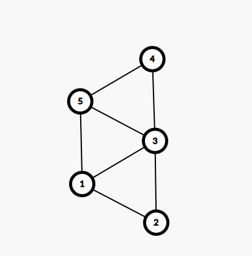
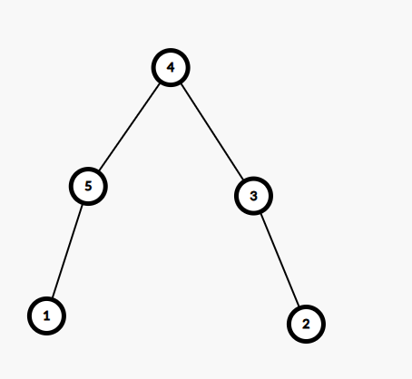
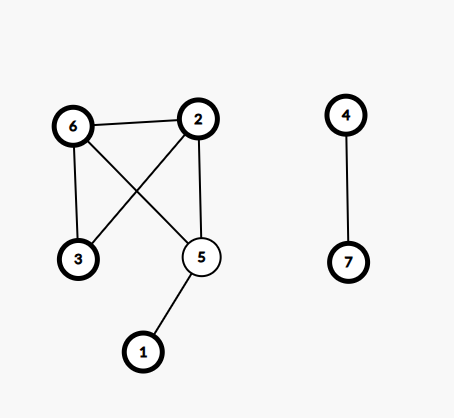
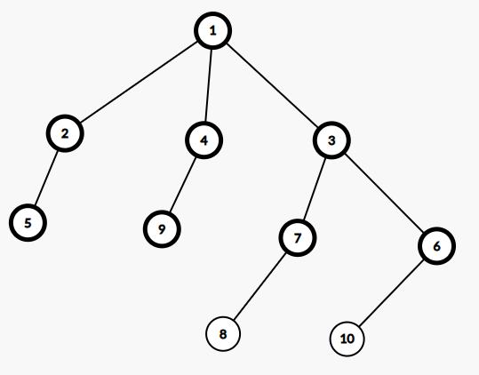
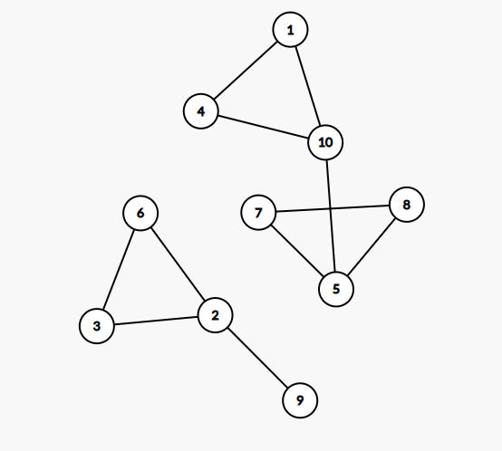

# Rezolvare subiecte Testul 3 si 2 propuse pentru BAC 2021

## Testul 3

### Subiectul I
1. 
    - Rezolvare
        * a -> Cade deoarece este imposibil sa obtinem un numar care sa satisfaca, conditia
        * b -> `!` transforma expresia in: `x >=-21 && x<= -2 || (x >= 2 && x<=21)` care respecta intervalul din enunt.
        * c -> Deoarece avem `||` obtinem 1 si pentru un numar din afara intervalului din enunt (de exemplu `1`)
        * d -> `!` transforma expresia in: `x>= -21 || x<= 21 || x<= -2 && x >= 2` Care este invalida.
    - Raspuns corect: `b`
2. 
    - Rezolvare:
        ```json
            f(54321) =
            = afisam * afisam 54321 calculam f(543) si la intoarcere afisam "/"
                = afisam * afisam 543 calculam f(5) si la intoarcere afisam "/"
                    = afisam * afisam 5 calculam f(0) si la intoarcere afisam "/"
                        = afisam * si /
                    = afisam /
                = afisam /
            = afisam /
        ```
    - Raspuns corect: "*54321*543*5*////" -> `c`
3. 
    - Rezolvare:
        ```json
              0   1    2    3    4    5
            MAVA MCA MCFR MNHCV MNLR MNT

            Primele 5 solutii:
            (0      1    2    3)
            (MAVA, MCA,MCFR, MNHCV),

            (0      1    2     4)
            (MAVA, MCA, MCFR, MNLR),

            (0      1     2    5)
            (MAVA, MCA, MCFR, MNT),

            (0      1    3       4)
            (MAVA, MCA, MNHCV, MNLR)

            (0      1     3     5)
            (MAVA, MCA, MNHCV, MNT). 

            Acum sa evaluam variantele:
            a -> (MNHCV, MNLR, MCFR, MNT)  adica (3 4 2 5) invalida, cu siguaranta am avut (2 3 4 5) inainte
            b -> (MCA, MNHCV, MNLR, MNT) adica (1 3 4 5) -> valida
            c -> (MCA, MCFR, MNHCV, MNLR, MNT) adica (1 2 3 4 5) invalida, trebuie doar 4
            d -> (MAVA, MCA, MNHCV, MCFR) adica (0 1 3 2) -> invalida, am avut (0 1 2 3) inainte
        ```
    - Raspuns corect:  `b`
4. 
    - Rezolvare:
        - Din matricea de adiacenta obtinem graful de mai jos:
        
        - Din teorie stim ca un arbore este un graf aciclic si conex maximal, adica daca mai eliminam o muchie, nu mai este conex si daca mai adaugam o muchie, nu mai este aciclic,
        - Daca stergem muchiile: [3,1], [1,2] si[3,5] obtinem arborele de mai jos: 
        
    - Raspuns corect: `a`
5. 
    - Rezolvare:
        - Conform enuntului avem graful initial: 
        
        - Acum stim ca trebui ca in subrafurile posibile sa ramanem cu nodurile 2, 3, 6
        - Prin subgraf, intelegem ca din graful initial stergem nodurile cu tot cu muchiile sale.
        - Astfel avem  grafurile din care stergem pe rand:
            - nodurile 5 si 4
            - nodurile 5 si 7
            - nodurile 5, 4, si 1
            - nodurile 5, 7, si 1
            - nodurile 5, 1, 4, si 7
            - nodurile 5, 4, si 7
        - Raspuns corect: `b`
### Subiectul II
1. 
    - a
        ```json
            n = 250887
            x = 0
            m = 0
            p = 1
            cat timp x < 10 executa
                cn = n = 250887
                cat timp cn != 0 executa
                    c = cn % 10 = 7
                    cn = 25088
                    daca c = x false
                cat timp cn != 0 executa
                    c = cn % 10 = 8
                    cn = 2508
                    daca c = x false
                cat timp cn != 0 executa
                    c = cn % 10 = 8
                    cn = 250
                    daca c = x false
                cat timp cn != 0 executa
                    c = cn % 10 = 0
                    cn = 25
                    daca c = x true
                        m = 0
                        p = 10
                cat timp cn != 0 executa
                    c = cn % 10 = 5
                    cn = 2
                    daca c = x false
                cat timp cn!= 0 executa
                    c = cn % 10 = 2
                    cn = 0
                    daca c = x false
                x = 2
            cat timp x < 10 executa
                cn = 250887
                cat timp cn != 0 executa
                    c = cn % 10 = 7
                ....
            Observam ca se va creea un numar nou, folosind doar cifrele care sunt egale cu 2, 4,6 sau 8, care sunt prezente in numar. Adica din numarul 250887, obtinem: 8820
        ```
    - b
        ```json
            - Folosind explicatia de mai sus, pentru oricare din numere de mai jos, dupa rularea programului, obtinem acelasi numere:  864, 642, 422, etc.
        ```
    - c
        ```c++
            #include <iostream>

            using namespace std;

            int main()
            {
                int n;
                cin >> n;
                int x = 0, m = 0, p = 1;
                while (x < 10) {
                    int cn = n;
                    while (cn != 0) {
                        int c = cn % 10;
                        cn = cn /10;
                        if (c == x) {
                            m = c * p + m;
                            p = p * 10;
                        }
                    }
                    x = x+2;
                }
                cout << m;
                return 0;
            }
        ```
    - d
        ```json
            citește n
            (număr natural nenul)
            x<-0; m<-0; p<-1
            ┌cât timp x<10 execută
            │ cn<-n
            |┌daca cn≠0 atunci
            │|┌execută
            ││|c<-cn%10; cn<-[cn/10]
            ││|┌dacă c=x atunci
            ││|│ m<-c*p+m; p<-p*10
            ││|└■
            ||└■cât timp cn≠0
            │└■
            │ x<-x+2
            └■
            scrie m
        ```
2. 
    - Rezolvare:
        ```c++
            struct exponate_info {
                char nume[21];
                char colectie[21];
            };

            struct muzeu{
                int numar;
                exponate_info exponat[100];
            }m;
        ```
3. 
    - Rezolvare:
        ```c++
            strcpy(s,"muzeu"); // S= "muzeu"
            s[0]=s[0]+1; // s = "nuzeu"
            cout<<s[1]<<s[0]<<endl; | printf("%c%c\n",s[1],s[0]); // afisam "un"
            strcpy(s,"muzeu"+2); // "muzeu" + 2 = "zeu", s = "zeu
            cout<<s; | printf("%s",s); afisam "zeu"
        ```
    - Programul afiseaza:
        ```json
            "un zeu"
        ```
### Subiectul III
1. 
    - Rezolvare:
        ```c++
            #include <iostream>

            using namespace std;

            int suma(int n);

            int main()
            {
                int n = 12;
                cout << suma(12);
                return 0;
            }

            int suma(int n) {
                int rezultat = 1; // initializam cu 1 pentru ca 1 sigur nu este prim

                for(int i = 1; i <=n; i++) {
                    if (n % i == 0) {
                        int estePrim = 1;
                        for(int j = 2; j * j <= i; j++) {
                            if ( i % j == 0) {
                                estePrim = 0;
                                break;
                            }
                        }
                        if (estePrim == 0) {
                            rezultat += i;
                        }
                    }
                }
                return  rezultat;
            }
        ```
2. 
    - Rezolvare:
        ```c++
            #include <iostream>

            using namespace std;

            int suma(int n);

            int main()
            {
                int m, n;
                cin >> m >> n;
                int matrice[m][n];
                for(int i = 0; i<m; i++) {
                    for(int j = 0; j < n; j++) {
                        cin >> matrice[i][j];
                    }
                }
                int exista =0;
                for(int i = 0; i<m; i++) {
                    int locColoana1 = matrice[i][0];
                    if (locColoana1 == 0) {
                        continue;
                    }
                    for(int j = 0; j < n; j++) {
                        if (matrice[j][n-1] == locColoana1) {
                            exista = 1;
                            cout << locColoana1 << " ";
                            break;
                        }
                    }
                }

                if (exista == 0) {
                    cout << "nu exista";
                };
                return 0;
            }
        ```
3. 
    - Rezolvare:
        - a
            ```json
                Deoarece avem nevoie sa salvam atat numarul de aparitii cat si pozitia la care s-a gasit un anume numar, in functie de cifra zecilor, o sa declaram o structura ce va avea 2 membri: pozitia la care s-a gasit ultimul numar cu o anumite cifra a prietenilor dar si numarul de aparitii al acestei cifre. Dupa aceea vom declara un vector ce va avea 10 elemente, fiecare fiind o structura cum am explicat mai sus. Dupa aceea, in timp ce parcurgem numar cu numar, aflam care este cifra zecilor, si bazat pe aceasta actualizam atat numarul de aparitii cat si ultima pozitie la care s-a gasit. Dupa ce am terminat de citit numerele din fisier, parcurgem vectorul de structuri sa gasim care este valoarea maxima de aparitii, dupa care vom mai face o parcurgere pentru a afisa pozitia tuturor elementelor care au un numar de aparitii egal cu valoarea maxima. Programul este eficient din punct de vedere al timpului de executie deoarece fisierul este parcurs o singura data si dupa aceea, o sa mai parcurgem de 2 ori un vector ce va avea doar 10 elemente si nu 10^6 cate pot fi in total.
            ```
        - b
            ```c++
                #include <iostream>
                #include <fstream>

                using namespace std;

                struct prieten {
                    int pozitie;
                    int aparitii = 0;
                };

                int main()
                {

                    ifstream  fin("bac.in");

                    struct prieten prieteni[10];
                    int numar;
                    int pozitie = 1;
                    while(fin >> numar) {
                        int cifraZecilor = numar / 10 % 10;
                        prieteni[cifraZecilor].aparitii++;
                        prieteni[cifraZecilor].pozitie = pozitie;
                        pozitie++;
                    } de astfel de structuri,    }
                    }

                    for(int  i = 0; i < 10; i++) {
                        if(prieteni[i].aparitii == aparitiiMaxime) {
                            cout << prieteni[i].pozitie << " ";
                        }
                    }


                    fin.close();
                    return 0;
                }
            ```

## Testul 2

### Subiectul Ia `b`
    - Raspuns corect: `a`
2. 
    - Rezolvare:
        ```json
            f(4) =
                4 > 1
                    x = 3; f(2)
                        2 > 1
                            x = 1
                            f(0)    => afisam 0
                        1 > 1 false
                        afisam 1
                3 > 1
                    x = 2; f(1) => afisam 1
    - Raspuns corect: `d`
3. 
    - Rezolvare:
        ```json
            Notam:
            {  0             1                 2              3                4         }
            {„Bono”, „Bruce Springsteen”, „Bon Jovi”, „Leonard Cohen”, „Portugal.The Man”}

            Primele 5 selectii sunt:
            
            („Bono”, „Bruce Springsteen”, „Bono”, „Bruce Springsteen”),
           
            („Bono”, „Bruce Springsteen”, „Bono”, „Leonard Cohen”),
            
            („Bono”, „Bruce Springsteen”, „Bruce Springsteen”, „Bono”),
           
            („Bono”,„Bruce Springsteen”, „Bruce Springsteen”, „Bruce Springsteen”),
            
            („Bono”,„Bruce Springsteen”, „Bruce Springsteen”, „Bon Jovi”)


            Adica: 
            { 0, 1, 0, 1 }
            { 0, 1, 0, 3 }
            { 0, 1, 1, 0 }
            { 0, 1, 1, 1 }
            { 0, 1, 1, 2 }
        ```
        - Daca ne inspiram din prima solutie, ultima va fi:
            - . („Portugal.The Man”, „Leonard Cohen”, „Portugal.The Man”, „Leonard Cohen”)
            - Adica {4,3, 4, 3}
        - Raspuns corect: `c`
4. 
    - Rezolvare:
        - Din vectorul de tati avem:
            ```json
                (1,2,3,4,5,6,7,8,9,10)
                (0,1,1,1,2,3,3,7,4,6)

                1- Radacina si tata pentru: 2,3,4
                2 - tata pentru 5
                3 - tata pentru 6,7
                4 - tata pentru 9
                6 - tata pentru 10
                7 - tata pentru 8
            ```
            - Astfel obtinem urmatorul graf: 
             de unde observam ca avem 4 frunze
        - Raspuns corect: `b`
5. 
    - Rezolvare:
        - Din muchiile sale initiale obtinem graful de mai jos:
         de unde 
        - Teorie: 
            - Definiție: Se numește ciclu un lanț simplu în care primul vârf este identic cu ultimul.
            - Definitie: Lanțul care conține numai muchii distincte este lanț simplu.
        - Daca am adauga muchiile: [5-9] si [2-10] Am obtine ciclul:
            - [1,10,5,8,7,5,9,2,6,3,2,10,4,1]
    - Raspuns corect: `b`=

### Subiectul II
1. 
    - a
        ```json
            n = 2186310
            s = 1
            c1 = 0;
            n = 218631
            c2 = 1
            s = -1

            cat timp (c1-c2)* s > 0 si n > 9 atunci
                c1 = 1;
                n = 21863
                c2 = 3
            cat timp (c1-c2)* s > 0 si n > 9 atunci
                c1 = 3
                n = 2186
                c2 = 6
            cat timp (c1-c2)* s > 0 si n > 9 atunci
                c1 = 6
                n = 218
                c2 = 8
            cat timp (c1-c2)* s > 0 si n > 9 atunci
                c1 = 8
                n = 21
                c2 = 1
            scrie -1, , 21
        ```
        - Programul afiseaza "-1 21"
    - b
        - Daca alegem 2 numere care sa aibe cifrele crescatoare de la dreapta la stanga, si in care doar primele cifre (de exemplu primele 2) sa fie identice, obtinem aceeasi valoare:
            - 12987 si 12654 pentru fiecare obtinem: "-1 12"
    - c
        ```c++
            #include <iostream>

            using namespace std;

            int main()
            {

                int n;
                cin >> n;
                int s = 1;
                int c1 = n % 10;
                n = n /10;
                int c2 = n % 10;
                if (c1 == c2) {
                    s = 0;
                } else if (c1 < c2) {
                    s = -1;
                }
                
                while ((c1-c2) * s > 0 && n > 9) {
                    c1 = n % 10;
                    n = n / 10;
                    c2 = n% 10;
                }
                cout << s << " " << n;
                return 0;
            }
        ```
    - d
        ```json
            citește n (număr natural, n>9)
            s<-1
            c1<-n%10; n<-[n/10]; c2<-n%10
            ┌dacă c1=c2 atunci s<-0
            │altfel
            │┌dacă c1<c2 atunci s-1
            │└■
            └■
            ┌ daca (c1-c2)*s>0 și n>9
            |┌ execută
            |│ c1<-n%10; n<-[n/10]; c2<-n%10
            |└■cât timp (c1-c2)*s>0 și n>9
            └■
            scrie s,' ',n
        ```
2. 
    - Rezolvare:
        ```c++
            struct polinom {
                int grad;
                float coeficient[101]; // aici nu sunt sigur, daca trebuie de [100] sau [101], nu imi aduc aminte teoria de la mate.
            }p;

        ```
3. 
    - Rezolvare:
        ```c++
            #include <iostream>
            #include <cstring>

            using namespace std;


            int main(){
                char s[21];
                cin >> s;
                char vocale[] = "aeiouAEIOU";
                char vocalePrezente[11] = "";
                int index = 0;
                for(int i = 0; i<strlen(s); i++) {
                    if(strchr(vocale, s[i]) !=NULL) {
                        vocalePrezente[index++] = s[i];
                    }
                }

                for(int i = 0; i < strlen(s);i++) {
                    if (!strchr(vocalePrezente, vocale[i])) {
                        cout << vocale[i];
                    }
                }
                return 0;
            }
        ```
    - Explicatie:
        - Mai declaram un vector in care o sa salvam vocalele intalnite in text.
        - La final, parcurgem vectorul de vocale, si afisam vocalele care nu se gasesc in cel de al doilea vector.
    
### Subiectul III
1. 
    - Rezolvare:
        ```c++
            #include <iostream>

            using namespace std;


            int factori(int n, int m);

            int main(){

                int n = 16500,m = 10780;
                cout << factori(n, m);
                return 0;
            }

            int factori(int n, int m) {
                int contor = 0;
                int putere1, putere2, divizor = 2;
                while( n> 1 && m > 1) {
                    putere1= 0;
                    while(n % divizor == 0) {
                        putere1++;
                        n = n/divizor;
                    }

                    putere2 = 0;
                    while(m % divizor == 0) {
                        putere2++;
                        m = m/divizor;
                    }

                    if (putere1 == putere2 && putere1 != 0) {
                        contor++;
                    }

                    divizor++;
                }

                return contor;
            }
        ```
2. 
    - Rezolvare:
        ```c++
            #include <iostream>

            using namespace std;

            int main(){
                int n;
                cin >> n;
                int matrice[n][n];

                for(int i = 0; i < n; i++) {
                    for(int j = 0; j < n; j++) {
                        if (i+j == n-1) {
                            matrice[i][j] = n;
                        } else if ((i+j) < (n-1)) {
                            // practic n-1-i ne da coloana unde gasim elementul de pe diagonala secundara corespunzator linii
                            // pe care ne aflam, si daca scadem j, obtinem distanta intre ele
                            int coloanePanaLaDiagSecundara = n-1-i-j;
                            matrice[i][j] = n - coloanePanaLaDiagSecundara;
                        } else {
                            // aceeasi idee ca si sus doar ca acum j-ul nostru este mai mare decat j-ul corespunzator
                            // j-ului de pe diagonala secundara
                            int coloaneDupaDiagSecundara = j - (n-1-i);
                            matrice[i][j] = n - coloaneDupaDiagSecundara;
                        }
                    }
                }

                for(int i = 0; i < n; i++) {
                    for(int j = 0; j < n; j++) {
                        cout << matrice[i][j] << " ";
                    }
                    cout << endl;
                }
                return 0;
            }

        ```
3. 
    - Rezolvare:
        - a
            ```json
                Deoarece cautam o secventa care fie incepe, fie se termina cu un numar pozitiv, algoritmul nostru va calcula lungimea secventei pana la primul numar pozitiv si lungimea secventei de dupa primul numar pozitiv. Si vom compara cu o variabila in care tinem lungimeaMaxima. Ce este important, dupa ce am terminat de citit numerele din fisier, mai verificam ce avem in  variabila care tine lungimeaCurenta pentru a vedea daca secventa care incepe dupa ce am gasit primul numar pozitiv, este mai mare decat secventa maxima intalnita.
                Programul este eficient din punct de vedere al timpului de executie deoarece fisierul este citit o singura data, si in acelasi timp, programul este eficient din punct de vedere al memoriei utilizate deoarece din maximum de 10^6 numere cate pot fi in fisier, noi in memorie tinem doar numarul curent pe care il citim, pas cu pas.
            ```
        - b
            ```c++
                #include <iostream>
                #include <fstream>

                using namespace std;

                int main(){
                    ifstream fin("bac.in");
                    int lungimeMaxima = 0;
                    int lungimeCurenta = 0;
                    int numar;
                    int amGasitPozitiv = 0;
                    while (fin >> numar) {
                        if (numar > 0 && !amGasitPozitiv) {
                            lungimeCurenta++;
                            if (lungimeCurenta > lungimeMaxima) {
                                lungimeMaxima = lungimeCurenta;
                            }
                            lungimeCurenta = 1;
                            amGasitPozitiv = 1;
                        } else {
                            lungimeCurenta++;
                        }
                    }
                    if (lungimeCurenta > lungimeMaxima) {
                        lungimeMaxima = lungimeCurenta;
                    }
                    cout << lungimeMaxima;

                    fin.close();
                    return 0;
                }

            ```