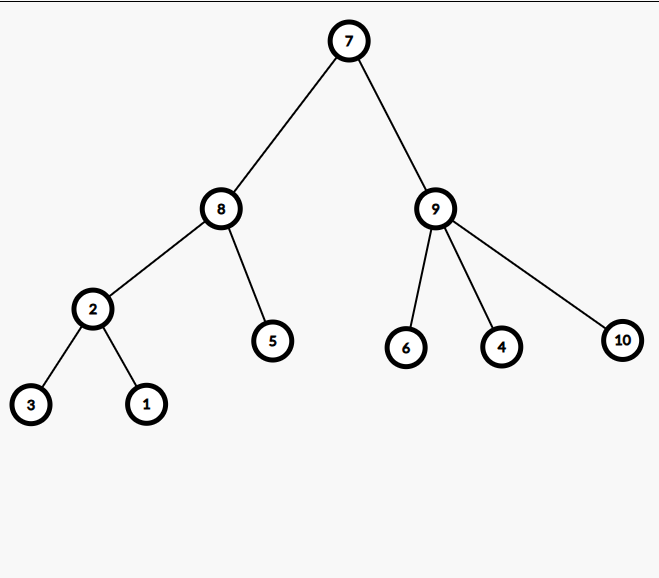
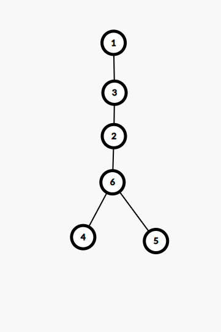
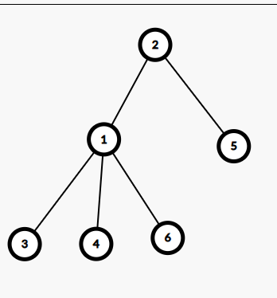
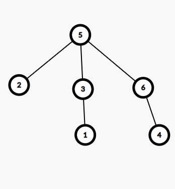
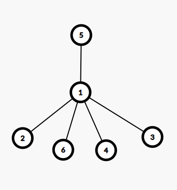
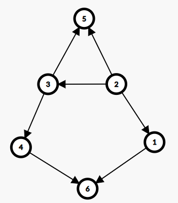

# Sesiunea 25

## Agenda

* Rezolvare test 1 propus pentru BAC 2021
* Rezolvare test 1 propus pentru BAC 2020
* Rezolvare test 2 propus pentru BAC 2020

## Rezolvare test 1 propus pentru BAC 2021

### Subiect I

1. 
    - Rezolvare:
        - a - Invalid deoarece primul || ne anuleaza conditia plus ca avem == in loc de !=
        - b - `!` din fata parantezei transforma expresia in: `(x > 5 && x < 20) || (x != y)` care este identica cu expresia din enunt
        - c - invalid deoarece primul || ne anuleaza conditia
        - d - `!` din fata parantezei transforma expresia in: `(x>= 5 && x <= 20) || (x != y)` care difera de expresia din enunt
    - Raspuns corect: `b`
2. 
    - Rezolvare:
        ```json
            f(4770777,7) =
                = 1 + f(477077, 7)
                    = 1 + f(47707, 7)
                        = 1 + f(4770, 7)
                            = 0
                        = 1
                    = 2
                = 3
        ```
    - Raspuns corect: `b`
3. 
    - Rezolvare:
        - a este corect d.p.d.v sintactic
        - b incorect, se acceseaza membrii intr-o maniera gresita d.p.d.v sintactic
        - c incorect, acelasi motiv ca la b
        - d incorect, acelasi motiv ca la b
    - Raspuns corect: `a`
4. 
    - Rezolvare:
        - Conform enuntului avem arborele de mai jos:
        
        - Astfel vedem ca nodurile de tip frunza sunt: 2,7,8
    - Raspuns corect: `d`
5. 
    - Rezolvare:
        - Graful din enunt arata similar cu cel de mai jos:
        
        - Observam ca avem 3 componente conexe
    - Raspuns corect: `c`

### Subiect II
1. 
    * a
        - Rezolvare:
            ```json
                n = 205579
                m = 10
                repeta
                    c = 9
                    n = 20557
                    c <=m true
                        m = 9
                repeta
                    c = 7
                    n = 2055
                    c <= m true
                        m = 7
                repeta  
                    c = 5
                    n = 205
                    c <= m true
                        m = 5
                repeta
                    c = 5
                    n = 20
                    c <= m true
                        m = 5
                repeta
                    c = 0
                    n = 2
                    c <= m true
                        m = 0
                repeta
                    c = 2
                    n = 0
                    c<= m false
                        m = -1
                scrie -1
            ```
    * b
        - Programul afiseaza -1 daca cifrele nu sunt in ordine descrescatoare de la dreapta a stanga, sau prima cifra a numarului in cazul in care acestea sunt in ordine descrescatoare
        - 7899, 7889, 7888
    * c
        ```c++
            #include <iostream>

            using namespace std;

            int main() {
                int n, m;
                cin >> n;
                if(n == 0) {
                    m = 0;
                } else {
                    do {
                        int c = n % 10;
                        n = n / 10;
                        if (c<= m) {
                            m = c;
                        } else {
                            m = -1;
                        }
                    } while (n != 0);
                }
                cout << m;
                return 0;
            }

        ```
    * d
        ```json
            citește n (număr natural) 
            m<-10 
            ┌dacă n=0 atunci  
            │ m<-0 
            │altfel 
            │┌execută  
            ││ c<-n%10; n<-[n/10] 
            ││┌dacă c<=m atunci m<-c 
            │││altfel m<--1    
            ││└■  
            │└cat timp n != 0 
            └■ 
            scrie m
        ```
2. 
    - Rezolvare:
        ```json
            Toate numerele care au paritate diferita si suma 14 sunt:
            1 4 9   
            1 6 7   
            1 8 5
            3 2 9   
            3 4 7   
            3 6 5   
            3 8 3  
            5 0 9 
            5 2 7   
            5 4 5   
            5 6 3   
            5 8 1   
            7 0 7
            7 2 5
            7 4 3
            7 6 1   
            9 0 5   
            9 2 3   
            9 4 1
            Cele cautate conform conditiei ca sunt crescatoare sunt:
            149 167 347   
        ```
3. 
    - Rezolvare:
        ```c++
            strcpy(s1,"bac2021"); // s = "bac2021"
            cout<<strlen(s1)<<endl; | printf("%d\n",lengtf(s1));  // afiseaza 7
            strcpy(s2,s1+3); strcpy(s2+2,"20-"); //s2 = 2021, s2 = 2020-
            strcat(s2,s1+3); // s2 = 2020-2021
            cout<<s2; | printf("%s",s2);// afiseaza 2020-2021
            // programul afiseaza:
            7
            2020-2021
            
        ```
### Subiect III
1. 
    - Rezolvare:
        ```c++
            #include <iostream>

            using namespace std;

            void divX(int n, int x);

            int main() {
                divX(4, 15);
                return 0;
            }

            void divX(int n, int x) {
                for (int i = n; i > 0; i--) {
                    cout << x * i << " ";
                }
            }

        ```
2.
    - Rezolvare:
        ```c++
            #include <iostream>

            using namespace std;


            int main() {
                int n;
                cin >> n;
                int matrice[n][n];
                for (int i = 0; i < n; i++) {
                    for (int j = 0; j < n; j++) {
                        cin >> matrice[i][j];
                    }
                }

                // afisam prima coloana
                for (int i = 0; i < n; i++) {
                    cout << matrice[i][0] <<" ";
                }

                // afisam ultima linie dar plecam de la al doilea element
                for (int i = 1; i < n; i++) {
                    cout << matrice[n-1][i]<<" ";
                }

                // afisam ultima coloana dar plecam de sus in jos, si de la penultimul element
                for (int i = n-2; i >= 0; i--) {
                    cout << matrice[i][n-1] << " ";
                }

                // afisam prima linie de la dreapta la stanga dar plecam de la penultimul si mergem pana la al doilea
                for(int i = n-2; i >= 1; i--) {
                    cout << matrice[0][i] << " ";
                }

                return 0;
            }

        ```
3.  
    - Rezolvare:
        * a
            ```json
                O sa implementam un algoritm care va parcurge fisierul si toate numerele de 2 cifre le va pune intr-un vector de frecventa. Dupa ce am parcurs fisierul, o sa parcurgem vectorul de frecventa de la capat si pentru fiecare numar ce are frecventa 0 si cifrele distincte, o sa il salvam fie in variabila pentru primul numar, or in variabila pentru al doilea numar, in functie de valoarea unui contor pe care il vom folosi sa stim daca am gasit sau nu cele 2 numere.
                
                La final, daca contorul nu va avea valoarea 2, se va afisa nu exista, altfel vom afisa valorile celor 2 numere.
            ```
        * b
            ```c++
                #include <iostream>
                #include <fstream>

                using namespace std;


                int main() {
                    ifstream fin("bac.in");
                    int frecventa[100] = {0};
                    int numar;
                    while (fin >> numar) {
                        if (numar >= 10 && numar <= 99) {
                            frecventa[numar]++;
                        }
                    }

                    int contor = 0;
                    int numar1, numar2;

                    for(int i = 99; i >= 10; i--) {
                        if (frecventa[i] == 0) {
                            int copieI = i;
                            int d2 = copieI % 10;
                            copieI = copieI / 10;
                            int d1 = copieI % 10;
                            if (d1 != d2 && contor < 2) {
                                if (contor == 0){
                                    numar1 = i;
                                } else {
                                    numar2 = i;
                                }
                                contor++;
                            }
                        }
                    }

                    if (contor < 2) {
                        cout << "nu exista";
                    } else {
                        cout << numar1 << " " << numar2;
                    }
                    fin.close();
                    return 0;
                }

            ```
## Rezolvare test 1 propus pentru BAC 2020

### Subiect I
1. 
    - Rezolvare:
        * a -> valid doar pentru numere conform cerintei
        * b -> Invalid deoarece obtinem 1 si pentru numere care nu sunt divizibil cu 2 si 5 in acelasi timp (e.g n = 7)
        * c -> Invalid din mai multe motive, in primul rand avem un `||` si nu un `&&` si acel `!` din fata parantezei accepta un numar care nu e divizibil cu 5.
        * d -> Invalid, similar cu b
    - Raspuns corect: `a`
2. 
    - Rezolvare:
        ```json
            f(102030)
            = 20 + f(10203)
                = 20 + f(1020)
                    = 20 + f(102)
                        = 20 + f(10)
                            = 2020
                        = 2040
                    = 2060
                = 2080
            = 2100
        ```
    - Raspuns corect: `c`
3. 
    - Rezolvare:
        ```json
            Primele 8 solutii: 
            1
            101
            103
            11 
            111
            113
            121
            123

            13
            131
            133
            201
        ```
    - Raspuns corect: `d`
4. 
    - Rezolvare:
        ```json
            (1,2,3,4,5,6,7,8,9,10)
            (2,8,2,9,8,9,0,7,7,9)
            Astfel avem:
            7 radacina si tata pentru: 8 si 9
            8 tata pentru: 2 si 5
            9 tata pentru: 4, 6, 10
            2 tata pentru: 1 si 3
        ```
        - Astfel obtinem arborele de mai jos:
        
            - de unde observam ca nodurile: 7, 8, 2 au exact 3 fii.
    - Raspuns corect: `b`
5.
    - Rezolvare:
        - Conform teoriei, un graf complet are `(n* (n-1))/2 muchii`(https://www.pbinfo.ro/articole/810/grafuri-neorientate#intlink-7). Noi stiind ca avem 20 de noduri, inseamna ca un graf cu 20 de noduri, pentru a fi complet trebuie sa  190 de muchii in total, noi avand deja 100 de muchii, trebuie sa mai adaugam doar 90.
    - Raspuns corect: `c`
### Subiect II
1. 
    * a
        ```json
            n = 12345
            p =1, m = 0, k = 0
            cat timp n != 0
                x = 780
                pentru i <- 1, 0
                    -
                daca x != 0
                    c = 0
                m = 0
                n = 1234
                p = 10
                k = 1
            cat timp n != 0
                x = 921
                pentru i <- 1, 1
                    x = 92
                daca x != 0
                    c = 2
                m = 20
                n = 123
                p = 100
                k = 2
            cat timp n != 0
                x = 4013
                pentru i <- 1, 2
                    x = 401
                pentru i<-2, 2
                    x = 40
                daca x!= 0
                    c = 0
                m = 20
                n = 12
                p = 1000
                k = 3
            cat timp n!= 0
                x = 75
                pentru i<1, 3
                    x = 7
                pentru i<- 2, 3
                    x = 0
                pentru i <- 3, 3>
                    x =0
                daca x!= 0 fals
                    c = 2
                m = 2000+20 = 2020
                n = 1
                p = 10000
                k = 4
            cat timp n!= 0
                x = 100214
                pentru i<- 1, 4
                    x = 10021
                pentru i<-2, 4
                    x = 1002
                pentru i<- 3, 4
                    x = 100
                pentru i<- 4, 4
                    x = 10
                daca x!= 0
                    c = 0
                m = 2020
                n = 0
                p = 100000
                k = 5
        scrie 2020
        ```
    * b
        - 49 29 41
        - 49 39 47
    * c
        ```c++
            #include <iostream>

            using namespace std;


            int main() {
                int n;
                cin >> n;
                int p = 1, m = 0, k = 0;
                while (n != 0) {
                    int x,c;
                    cin >> x;
                    for (int i = 1;i<=k; i++) {
                        x = x/10;
                    }
                    if (x!= 0) {
                        c = x%10;
                    } else {
                        c = n%10;
                    }
                    m = c*p + m;
                    n = n/10;
                    p = p * 10;
                    k = k+1;
                }
                cout << m;
                return 0;
            }
        ```
    * d
        ```json
            citeşte n (număr natural) 
            p<-1; m<-0; k<-0 
            ┌cât timp n≠0 execută 
            │ citește x (număr natural) 
            │┌pentru i<-1,k execută 
            ││ x<-[x/10] 
            │└■ 
            | x = x / p
            │┌dacă x≠0 atunci c<-x%10 
            ││altfel c<-n%10 
            │└■ 
            │ m<-c*p+m 
            │ n<-[n/10] 
            │ p<-p*10; k<-k+1 
            └■  
            scrie m
        ```
        - Observam ca instructiunea `pentru..` elimina ultimele k cifre din numar si pentru asta ne putem folosi de valoarea variabilei `p` in care tinem puteri de ale lui 10 egale cu 10^k
2. 
    - Rezolvare:
        ```c++
            struct punct {
                int x;
                int y;
            }
            struct triunghi{
                punct A;
                punct B;
                punct C;
            }t;
        ```
3. 
    - Rezolvare:
        ```c++
            k=’a’-’A’; // k = 32
            strcpy(a,”VIcToriE”); // a = ”VIcToriE”
            cout<<strlen(a); | printf(”%d”, strlen(a)); // afisam 8
            for(i=0;i<strlen(a);i++) 
                if(a[i]>=’A’ && a[i]<=’Z’) a[i]=a[i]+k; 
                else a[i]=a[i]-k; 
            cout<<a;  |  printf(”%s”,a); // a=victorie
        ```
    - Programul transforma literele mari in litere mici si literele mici in litere mari afiseaza  `8viCtORIe"
### Subiect III
1. 
    - Rezolvare:
        ```c++
            #include <iostream>

            using namespace std;

            void putere(long int n, int &d, int &p);

            int main() {
                int n = 10780;
                int d, p;
                putere(n, d, p);
                cout << d << " " << p;
                return 0;
            }

            void putere(long int n, int &d, int &p){
                int maximP = 0, maximD = 0;
                d = 2;
                while (n > 1) {
                    p = 0;
                    while (n % d == 0) {
                        p++;
                        n=n/d;
                    }
                    if (p >= maximP) {
                        maximP = p;
                        maximD = d;
                    }
                    d++;
                }
                d = maximD;
                p = maximP;
            }

        ```
2. 
    - Rezolvare:
        ```c++
            #include <iostream>

            using namespace std;

            int main() {
                int n,k;
                cin >> n >> k;
                int matrice[n][n*k];
                for (int i = 0; i < n; i++) {
                    int j = 0;
                    int valoare = i+1;
                    while(j < (n*k)) {
                        matrice[i][j] = valoare;
                        if ((j+1) % k == 0){
                            valoare++;
                        }
                        j++;
                    }
                }

                for (int i = 0; i < n; i++) {
                    for (int j = 0; j < n * k; j++) {
                        cout << matrice[i][j] << " ";
                    }
                    cout << endl;
                }
                return 0;
            }

        ```
3. 
    - Rezolvare:
        * a
            ```json
                O sa implementam un algoritm in care plecand de la primele 2 numere date(y si x pe care le scriem direct in fisier), aflam restul de numere extragand formula din relatia lor, anume, fiecare termen pe care vrem sa il afisam este egal cu `3 * numarul de dinainte - numarul de dinaintea acestuia`. In cazul nostru avem `termen = 3 * x - y` si de fiecare data cand afisam un numar, actualizam ca in y sa punem ce a fost in x, in x punem ce am afisat si calculam din nou. COntinuam acest lucru pana ajungem la un x si un y egal, deoarece stim ca primele 2 numere au valoarea 1.
                Algoritmul este eficient din punct de vedere al timpului de executie deoarece scriem in fisier direct in ordine descrescatoare, fara a manipula ordinea numerelor in prealabil. In acelasi timp, algoritmul este eficient din punct de vedere al memoriei ocupate deoarece nu se foloseste o alta structura de date pentru a stoca datele, rezultatul fiind aflat in mod direct.
            ```
        * b
            ```c++                
                #include <iostream>
                #include <fstream>

                using namespace std;

                int main() {
                    ofstream fout("bac.txt");
                    int x, y;
                    cin >> x >> y;
                    fout << y << " " << x << " ";
                    int termen = 3*x - y;
                    while(y != x) {
                        fout << termen << " ";
                        y = x;
                        x = termen;
                        termen = 3*x - y;
                    }

                    fout.close();
                    return 0;
                }
            ```


## Rezolvare test 2 propus pentru BAC 2020

### Subiect I
1. 
    - Rezolvare:
        * a -> Invalid deoarece obtinem 1 si pentru numere din afara intervalului (e.g 22)
        * b -> Invalid deoarece obtinem 1 si pentru numere din afara intervalului (e.g 22), din cauza operatorului `||`
        * c -> `!` transforma expresia in: (x+20 >= 0 || x-20<=0) care este echivalenta cu: `x >= -20 || x <= 20` care difera de ce cautam datorita `||`
        * d Expresia este echivalenta cu: `x >= -20 && x<= 20` care este exact ce cautam
    - Raspuns corect: `d`
2. 
    - Rezolvare:
        ```json
            f(2020, 15)
                = f(2005, 10)
                    = f(1995, 5)
                        = f(1990, 0)
                            = 1990
        ```
    - Raspuns corect: `c`
3. 
    - Rezolvare:
        ```json
            [   0       1      2      3       4       5        6        7  ]
            [bentiță, fileu, grip, manșete, mingi, rachetă, racordaj, șapcă]
            [  40   ,  400 ,  30 ,   30   ,  10 ,    400  ,    70   ,  60  ]
1d 2c 3b 4b 5ap, manșete),
            (bentiță, fileu, șapcă),
            (bentiță, grip, manșete, rachetă)

            Adica:
            (0, 1, 2, 3),
            (0, 1, 7),
            (0, 2, 3, 5)

            Urmatoarele 2 solutii sunt:
            (0, 5, 7)
            (1, 2, 4, 7) -> (fileu, grip, mingi, șapcă)
        ```
    - Raspuns corect: `b`
4. 
    - Rezolvare:
        - Pentru fiecare dintre variante, o sa desenam arborele corespunzator:
            * a
                ```json
                    (1,2,3,4,5,6)
                    (0,3,1,6,6,2)
                    Astfel avem:
                    - 1 radacina si tata pentru: 3
                    - 3 tata pentru: 2
                    - 2 tata pentru 6
                    - 6 tata pentru:4 si 5 
                ```
                - 
            * b
                ```json
                    (1,2,3,4,5,6)
                    (2,0,1,1,2,1)
                    Astfel avem:
                    2 radacina si tata pentru: 1 si 5
                    1 tata pentru 3, 4, si 6
                ```
                -
            * c
                ```json
                    (1,2,3,4,5,6)
                    (3,5,5,6,0,5)
                    Astfel avem:
                    5 radacina si tata pentru 2,3,si 6
                    3 tata pentru: 1
                    6 tata pentru 4 
                ```
                -
            * d
                ```json
                    (1,2,3,4,5,6)
                    (5,1,1,1,0,1)
                    Astfel avem:
                    5 radacina si tata pentru 1
                    1 tata pentru: 2,3,4,6
                ```
                -
        - Din poze observam ca arborele de la punctul `b` respecta cerinta
    - Raspuns corect: `b`
                
5. 
    - Rezolvare:
        - Mai jos avem graful specific enuntului:
        -
        - Teorie circuit: https://www.pbinfo.ro/articole/509/grafuri-orientate#intlink-12
        - Daca mai adaugam si muchia [6,2] obtinem 2 circuite:
            - 3 -> 4 -> 6 -> 2-> 3 si 2 -> 3 -> 4 -> 6 -> 2
    - Raspuns corect: `a`
### Subiect II
1. 
    - a
        ```json
            n = 25940464
            m = 0
            repeta
                c = 4
                n = 2594046
                daca c = 0 fals -> daca c % 2 = 0 => c = 0
                m = 0
            repeta
                c = 6
                n = 259404
                daca c = 0 fals -> daca c%2 = 0 => c = 0
                m = 0
            repeta
                c = 4
                n = 25940
                daca c = 0 fals -> daca c%2 = 0 => c = 0
                m = 0
            repeta
                c = 0
                n = 2594
                daca c = 0 => c = 2
                m = 2
            repeta
                c = 4
                n = 259
                daca c = 0 fals -> daca c%2 = 0 => c = 0
                m = 20
            repeta
                c = 9
                n = 25
                daca c = 0 fals -> daca c% 2 = 0 fals
                m = 209
            repeta
                c = 5
                n = 2
                daca c = 0 fals => daca c % 2 = 0 fals
                m = 2095
            repeta
                c = 2
                n = 0
                daca c = 0 fals -> daca c% 2 = 0  => c = 0
                m = 20950
        Afiseaza 20950
        ```
    - b
        - 40404
        - 40604
        - 60606
    - c
        ```c++
            #include <iostream>

            using namespace std;

            int main() {
                int n;
                cin >> n;
                int m = 0;
                do {
                    int c = n % 10;
                    n = n / 10;
                    if (c == 0) {
                        c = 2;
                    } else if (c % 2 == 0) {
                        c = 0;
                    }
                    m = m * 10+c;
                } while(n != 0);

                cout << m;
                return 0;
            }

        ```
    - d
        ```json
            citeşte n (număr natural)
            m<-0
            ┌ cat timp n!= 0 executa
            │ c<-n%10; n<-[n/10]
            │┌dacă c=0 atunci c<-2
            ││altfel
            ││┌dacă c%2=0 atunci
            │││c<-0
            ││└■
            │└■
            │ m<-m*10+c
            └■
            scrie m
        ```
2. 
    - Rezolvare:
        ```c++
            struct specie {
                int cod;
                int nrExemplare;
                int varsta[10];
            }s[20];

        ```
3. 
    - Rezolvare:
        ```
            #include <iostream>

            using namespace std;

            int main() {
                int a[5][7] = {
                        {1,1,1,1,1,1,1},
                        {1,1,1,1,1,1,1},
                        {1,1,1,1,1,1,1},
                        {1,1,1,1,1,1,1},
                        {1,1,1,1,1,1,1},
                };
                for(int i = 1; i < 5; i++) {
                    for (int j = 1; j < 7; j++) {
                        int suma = a[i][j-1] + a[i-1][j];
                        a[i][j] = suma % 10;
                    }
                }

                for(int i = 0; i < 5; i++) {
                    for (int j = 0; j < 7; j++) {
                        cout << a[i][j] << " ";
                    }
                    cout << endl;
                }
                return 0;
            }

        ```
    - De retinut ca pentru bac doar for-ul in care se asigneaza valorile trebuie scris.
### Subiect III
1. 
    - Rezolvare:
        ```c++
            #include <iostream>

            using namespace std;

            void fii(long int n);

            int main() {
                int n = 16;
                fii(n);
                return 0;
            }

            void fii(long int n) {
                for(int i = n; i >=1 ; i--) {
                    for (int j = 1; j <= n; j++) {
                        if (i > j && i * j == n) {
                            cout << "(" << i << " " << j << ") ";
                        }
                    }
                }
            }


        ```
2. 
    - Rezolvare:
        ```c++
            #include <iostream>
            #include <cstring>
            #include <cctype>

            using namespace std;

            int main() {
                char text[101];
                char rezultat[101]="";
                cin.getline(text, 101);
                char *cuvant = strtok(text, " ");
                while (cuvant != NULL) {
                    if (cuvant[0] == '-' && isdigit(cuvant[1])) {
                        strcat(rezultat, " ");
                    } else {
                        strcat(rezultat, cuvant);
                        strcat(rezultat, " ");
                    }
                    cuvant = strtok(NULL, " ");
                }

                cout << rezultat;
                return 0;
            }

        ```
3. 
    - Rezolvare:
        * a
            ```json
                O sa implementam un algoritm care va parcurge fisierul si atunci cand va intalnii un numar care se termina in 20, il va compara cu 3 variabile in care vom tine minte cele 3 maxime astfel daca este mai mare sau egal decat cel mai mare numar intalnit(ce respecta conditia) atunci punem in al 3-lea maxim ce aveam in al doilea, in al doilea ce era in primul si in primul maxim punem numarul curent. Daca nu este mai mare sau egal decat maximul intalnit, comparam sa vedem daca este mai mare decat al doilea maxim intalnit, caz in care salvam in maxim 3 al doilea maxim si in al doilea maxim punem numarul curent. In cazul in care nu este mai mare sau egal nici cu al doilea maxim, comparam cu al 3-lea maxim, si daca este mai mare decat acesta, il actualizam cu valoarea numarului curent.
                Algoritmul este eficient din punct de vedere al timpului de executie deoarece se efectueaza o singura parcurgere a fisierului. In acelasi timp, algoritmul este eficient din punct de vedere al memoriei utilizate, deoarece din maximul de 10^9 numere cate pot fi in fisier, noi in memorie tinem doar 3, anumele cele 3 maxime.
            ```
        * b
            ```c++
                #include <iostream>
                #include <fstream>

                using namespace std;

                int main() {
                    ifstream  fin("bac.in");
                    int max1 = -1;
                    int max2 = -1;
                    int max3 = -1;
                    int numar;
                    while(fin >> numar) {
                        if (numar % 100 == 20) {
                            if (numar >= max1) {
                                max3 = max2;
                                max2 = max1;
                                max1 = numar;
                            } else if (numar >= max2) {
                                max3 = max2;
                                max2 = numar;
                            } else if (numar > max3) {
                                max3 = numar;
                            }
                        }
                    }
                    cout << max3 << " " << max2 << " " << max1;
                    fin.close();
                    return 0;
                }

            ```