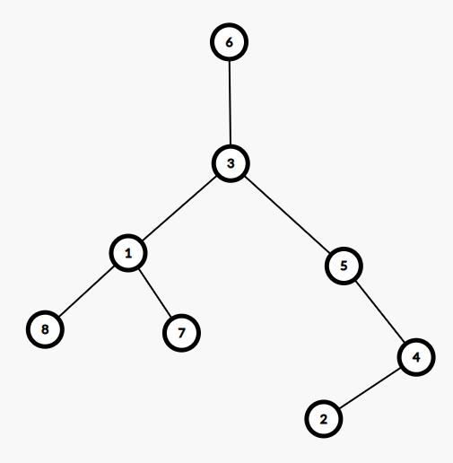
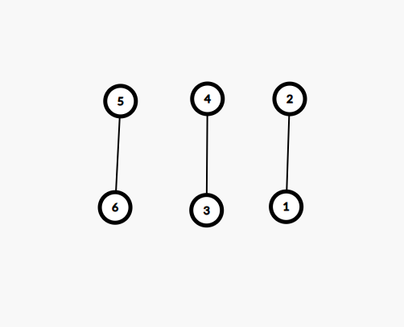

# Sesiunea 25

## Agenda

* Rezolvare test 1 propus pentru BAC 2021
* Rezolvare test 1 propus pentru BAC 2020
* Rezolvare test 2 propus pentru BAC 2020

## Rezolvare test 1 propus pentru BAC 2021

### Subiect I

1. 
    - Rezolvare:
        - a - Invalid deoarece primul || ne anuleaza conditia plus ca avem == in loc de !=
        - b - `!` din fata parantezei transforma expresia in: `(x > 5 && x < 20) || (x != y)` care este identica cu expresia din enunt
        - c - invalid deoarece primul || ne anuleaza conditia
        - d - `!` din fata parantezei transforma expresia in: `(x>= 5 && x <= 20) || (x != y)` care difera de expresia din enunt
    - Raspuns corect: `b`
2. 
    - Rezolvare:
        ```json
            f(4770777,7) =
                = 1 + f(477077, 7)
                    = 1 + f(47707, 7)
                        = 1 + f(4770, 7)
                            = 0
                        = 1
                    = 2
                = 3
        ```
    - Raspuns corect: `b`
3. 
    - Rezolvare:
        - a este corect d.p.d.v sintactic
        - b incorect, se acceseaza membrii intr-o maniera gresita d.p.d.v sintactic
        - c incorect, acelasi motiv ca la b
        - d incorect, acelasi motiv ca la b
    - Raspuns corect: `a`
4. 
    - Rezolvare:
        - Conform enuntului avem arborele de mai jos:
        
        - Astfel vedem ca nodurile de tip frunza sunt: 2,7,8
    - Raspuns corect: `d`
5. 
    - Rezolvare:
        - Graful din enunt arata similar cu cel de mai jos:
        
        - Observam ca avem 3 componente conexe
    - Raspuns corect: `c`

### Subiect II
1. 
    * a
        - Rezolvare:
            ```json
                n = 205579
                m = 10
                repeta
                    c = 9
                    n = 20557
                    c <=m true
                        m = 9
                repeta
                    c = 7
                    n = 2055
                    c <= m true
                        m = 7
                repeta  
                    c = 5
                    n = 205
                    c <= m true
                        m = 5
                repeta
                    c = 5
                    n = 20
                    c <= m true
                        m = 5
                repeta
                    c = 0
                    n = 2
                    c <= m true
                        m = 0
                repeta
                    c = 2
                    n = 0
                    c<= m false
                        m = -1
                scrie -1
            ```
    * b
        - Programul afiseaza -1 daca cifrele nu sunt in ordine descrescatoare de la dreapta a stanga, sau prima cifra a numarului in cazul in care acestea sunt in ordine descrescatoare
        - 7899, 7889, 7888
    * c
        ```c++
            #include <iostream>

            using namespace std;

            int main() {
                int n, m;
                cin >> n;
                if(n == 0) {
                    m = 0;
                } else {
                    do {
                        int c = n % 10;
                        n = n / 10;
                        if (c<= m) {
                            m = c;
                        } else {
                            m = -1;
                        }
                    } while (n != 0);
                }
                cout << m;
                return 0;
            }

        ```
    * d
        ```json
            citește n (număr natural) 
            m<-10 
            ┌dacă n=0 atunci  
            │ m<-0 
            │altfel 
            │┌execută  
            ││ c<-n%10; n<-[n/10] 
            ││┌dacă c<=m atunci m<-c 
            │││altfel m<--1    
            ││└■  
            │└cat timp n != 0 
            └■ 
            scrie m
        ```
2. 
    - Rezolvare:
        ```json
            Toate numerele care au paritate diferita si suma 14 sunt:
            1 4 9   
            1 6 7   
            1 8 5
            3 2 9   
            3 4 7   
            3 6 5   
            3 8 3  
            5 0 9 
            5 2 7   
            5 4 5   
            5 6 3   
            5 8 1   
            7 0 7
            7 2 5
            7 4 3
            7 6 1   
            9 0 5   
            9 2 3   
            9 4 1
            Cele cautate conform conditiei ca sunt crescatoare sunt:
            149 167 347   
        ```
3. 
    - Rezolvare:
        ```c++
            strcpy(s1,"bac2021"); // s = "bac2021"
            cout<<strlen(s1)<<endl; | printf("%d\n",lengtf(s1));  // afiseaza 7
            strcpy(s2,s1+3); strcpy(s2+2,"20-"); //s2 = 2021, s2 = 2020-
            strcat(s2,s1+3); // s2 = 2020-2021
            cout<<s2; | printf("%s",s2);// afiseaza 2020-2021
            // programul afiseaza:
            7
            2020-2021
            
        ```
### Subiect III

## Rezolvare test 1 propus pentru BAC 2020

### Subiect I
### Subiect II
### Subiect III

## Rezolvare test 2 propus pentru BAC 2020

### Subiect I
### Subiect II
### Subiect III