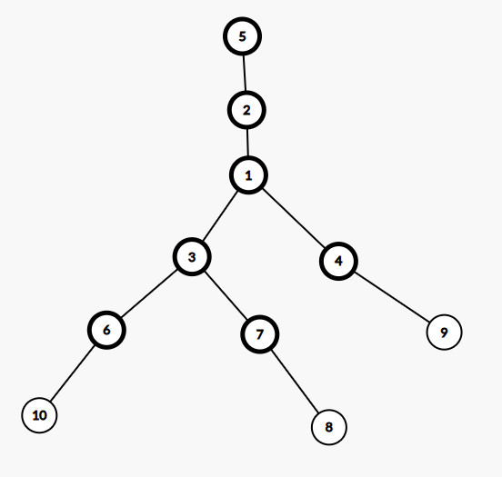
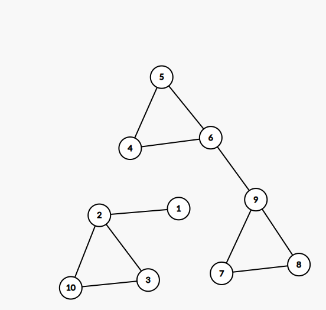
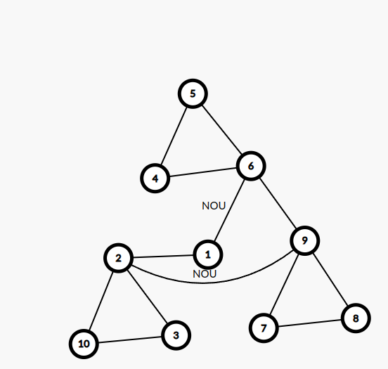
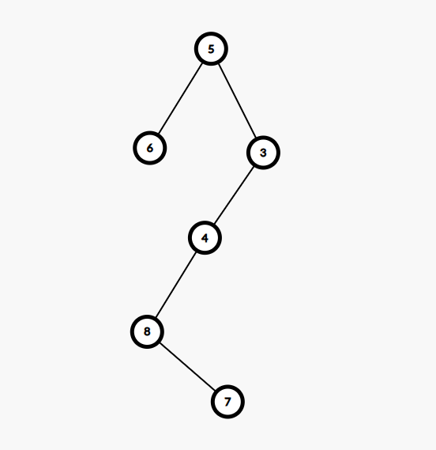
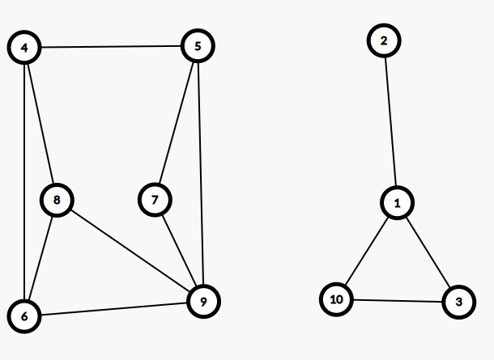

# Sesiunea 26

## Agenda

* Rezolvare test 3 propus pentru BAC 2020
* Rezolvare test 4 propus pentru BAC 2020
* Rezolvare test 5 propus pentru BAC 2020

## Rezolvare test 3 propus pentru BAC 2020

### Subiect I
1. 
    * Rezolvare
        * a -> Invalid deoarece nu se verifica conditia ca cifra unitatior sa fie 2 si mai are si un `||` in loc de `&&`
        * b -> Invalid datorita semnului `||`
        * c -> Invalid deoarece nu se verifica conditia ca cifra unitatilor sa fie 2
        * d -> Respecta cerinta din enunt.
    * Raspuns corect: `d`

2. 
    - Rezolvare:
        ```json
            f(3) =
                Afisam 3
                    while( 3 > 0)
                        Calculam f(2) si la intoarcere x = x-1 (x = 2)
                            f(2) =
                                Afisam 2
                                while(2 > 0)
                                    Calculam f(1) si la intoarcere x = 1
                                        f(1) =
                                            Afisam 1
                                            while(1 > 0)
                                                Calculam f(0) si la intoarcere x = 0
                                                f(0) =
                                                    Afisam 0
                                                    While(0 > 0) false
                                            While(0 > 0) fals
                                While(1 > 0)
                                    Calculam f(0) si la intoarcere x = 0
                                        f(0) =
                                            Afisam 0
                                            while(0 > 0) fals
                                While(0 > 0) fals
                    while(2 > 0)
                                    Calculam f(1) si la intoarcere x = 1
                                        f(1) =
                                            Afisam 1
                                            while(1 > 0)
                                                Calculam f(0) si la intoarcere x = 0
                                                f(0) =
                                                    Afisam 0
                                                    While(0 > 0) false
                                            While(0 > 0) fals
                    While(1 > 0)
                        Calculam f(0) si la intoarcere x = 0
                            f(0) =
                                Afisam 0
                                while(0 > 0) fals
                    While(0 > 0) fals
        ``` 
    - Programul afiseaza: 32100100
    - Raspuns corect: `b`
3. 
    - Rezolvare:
        ```json
            Notam:
            [  0  ,  1 ,  2  ,   3   ,  4  ]
            [rubin,opal,safir,smarald,topaz]

            Primele 8 siraguri sunt: 
            (rubin,opal,rubin,opal),
            (rubin,opal,rubin,smarald),
            (rubin,opal,opal,rubin),
            (rubin,opal,opal,opal),
            (rubin,opal,opal,safir),
            (rubin,opal,opal,smarald),
            (rubin,opal,opal,topaz),
            (rubin,opal,safir,opal)

            Adica:
            [0,1,0,1]
            [0,1,0,3]
            [0,1,1,0]
            [0,1,1,1]
            [0,1,1,2]
            [0,1,1,3]
            [0,1,1,4]
            [0,1,2,1]

            Conform sablonului de mai sus si stiind ca nu avem voie sa avem consecutiv 0,2 sau 4, ultima combinatie este:

            [4,3,4,3] Adica: [topaz, smarald, topaz, smarald]
        ```
    - Raspuns corect: `c`
4. 
    - Rezolvare:
        - Din enunt avem:
            ```json
                (1,2,3,4,5,6,7,8,9,10)
                (2,5,1,1,0,3,3,7,4,6)

                5 radacina si parinte pentru: 2
                2 parinte pentru: 1
                1 parinte pentru: 3,4
                3 parinte pentru: 6,7
                4 parinte pentru: 9
                6 parinte pentru: 10
                7 parinte pentru: 8
            ```
            Rezultand arborele:
            
            De unde observam ca avem 3 frunze: 8,9,10
    - Raspuns corect: `a`
5. 
    - Rezolvare:
        - Din enunt avem graful: 
        
        - Pentru ca un graf sa fie eulerian, acesta trebuie sa contina un ciclu eulerian
        - Un ciclu eulerian contine toate muchiile grafului (muchiile nu trebuie sa se repete, varfurile pot insa)
        - Astfel pentru a obtine ciclul eulerian:
        `1-2-10-3-2->9-8-7-9-6-5-4-6->1` trebuie sa adaugam muchiile [2,9] si [6,1]
        
    - Raspuns corect: `b`

### Subiect II
1. 
    * a
        ```json
            n = 2754578
            c1 = 8
            n = 275457
            c2 = 7
            c1 = c2 fals
            c1 > c2 => s = 1
            repeta
                c1 = 7
                n = 27545
                c2 = 5
            repeta
                c1 = 5
                n = 2754
                c2 = 4
            repeta
                c1 = 4
                n = 275
                c2 = 5
            scrie 1, " ", 275
        ```
    * b
        - Pentru a afisa `1 -0`, n trebuie sa aibe cifrele in ordine descrescatoare de la dreapta la stanga: `12345`
        - Pentru a afisa `-1 0`, n trebuie sa aibe cifrele in ordine descrescatoare de la stanga la dreapta: `54321`
    * c
        ```c++
            #include <iostream>

            using namespace std;

            int main(){
                int n,c1,c2,s;
                cin >> n;
                c1 = n % 10;
                n = n / 10;
                c2 = n % 10;
                if (c1 == c2) {
                    s = 0;
                } else {
                    if (c1 > c2) {
                        s = 1;
                    } else {
                        s = -1;
                    }
                }

                do {
                    c1 = n % 10;
                    n = n / 10;
                    c2 = n % 10;
                } while ((c1-c2) * s > 0);

                cout << s << " " << n;
                return 0;
            }
        ```
    * d
        ```json
            citeşte n (număr natural, n>9)
            c1<-n%10; n<-[n/10]; c2<-n%10
            ┌dacă c1=c2 atunci s<-0
            │altfel
            │┌dacă c1>c2 atunci s<-1
            ││altfel s<--1
            │└■
            └■
            ┌execută
            │ c1<-n%10; n<-[n/10]; c2<-n%10
            └cât timp (c1-c2)*s > 0
            scrie s,' ',n
        ```
2. 
    ```c++
        struct punct {
            float x;
            float y;
        };

        struct cerc {
            punct centru;
            float raza;
        }fig;
    ```
3. 
    ```c++
        #include <iostream>
        #include <cstring>
        using namespace std;

        int main(){
            char s[21];
            cin.getline(s, 21);
            for(int i = 0; i < strlen(s);i++) {
                if(s[i] == 'A') {
                    if (i == 0 && s[i+1] == 'I') {
                        continue;
                    } else if (i == strlen(s)-1 && s[i-1] == 'I'){
                        continue;
                    } else if (s[i+1] =='I' || s[i-1] == 'I'){
                        continue;
                    } else {
                        cout << s[i];
                    }
                } else {
                    cout << s[i];
                }

            }
            return 0;
        }

    ```
### Subiect III

1. 
    - Rezolvare:
        ```c++
            #include <iostream>
            using namespace std;

            int factori(int n, int m);

            int main(){
                int n = 750;
                int m = 490;
                cout << factori(n, m);
                return 0;
            }

            int factori(int n, int m) {
                int contor = 0;
                int divizor = 2;
                while( n> 1 && m > 1) {
                    int divideN = 0;
                    int divideM = 0;
                    while(n % divizor == 0) {
                        divideN = 1;
                        n = n/divizor;
                    }

                    while(m % divizor == 0) {
                        divideM = 1;
                        m = m/divizor;
                    }

                    if (divideN == 1 && divideM == 1) {
                        contor++;
                    }

                    divizor++;
                }

                return contor;
            }
        ```
2. 
    - Rezolvare:
        ```c++
            #include <iostream>
            using namespace std;

            int main(){
                int n;
                cin >> n;
                int matrice[n][n];
                for(int i = 0; i < n; i++) {
                    for (int j = 0; j < n; j++) {
                        if (i+j == n-1) {
                            matrice[i][j] = 0;
                        } else if(j > n-1-i) {
                            matrice[i][j] = j - (n-1-i);
                        } else {
                            matrice[i][j] = n-1-i-j;
                        }
                    }
                }

                for(int i = 0; i < n; i++) {
                    for (int j = 0; j < n; j++) {
                        cout << matrice[i][j] << " ";
                    }
                    cout << endl;
                }
                return 0;
            }
        ```
    
3. 
    - Rezolvare:
        * a
            ```json
                O sa implementam un algoritm care va parcurge numerele din fisier si va numara mai intai lungimea secventei pana la primul numar negativ, dupa care va numar lungimea secventei de dupa primul numar negativ (inclusiv acesta va fi luat in calcul) si vom afisa valoarea cea mai mare. Algoritmul este eficient din punct de vedere al timpului de executie deoarece fisierul este parcurs o singura data si in acelasi timp, algoritmul este eficient din punct de vedere al memoriei deoarece din totalul de 10^6 numere cate pot fi, noi tinem in memorie doar 1 numar (cel pe care il citim la fiecare pas) si rezultatul este aflat din mers, fara a folosi alte structuri de date pentru a stoca numerele din fisier.
            ```
        * b
            ```c++
                #include <iostream>
                #include <fstream>

                using namespace std;

                int main(){
                    ifstream  fin("bac.in");
                    int lungimeMaxima =0, lungimeCurenta = 0;
                    int numar;
                    int amGasitNegativ = 0;
                    while(fin >> numar) {
                        if (numar >= 0) {
                            lungimeCurenta++;
                        } else {
                            if (!amGasitNegativ && lungimeCurenta > lungimeMaxima) {
                                lungimeMaxima = lungimeCurenta;
                                lungimeCurenta = 1;
                                amGasitNegativ = 1;
                            } else {
                                lungimeCurenta++;
                            }
                        }
                    }

                    if (lungimeCurenta > lungimeMaxima) {
                        lungimeMaxima = lungimeCurenta;
                    }

                    cout << lungimeMaxima;

                    fin.close();
                    return 0;
                }
            ```
## Rezolvare test 4 propus pentru BAC 2020

### Subiect I

1. 
    - Rezolvare:
        * a  -> Valid deoarece respecta cerinta din enunt
        * b -> Fals deoarece `==` este un operator ce face mai intai calculul in stanga (x == y) care va da true, adica `1` si dupa aceea va face: `1 == z` care nu respecta cerinta din enunt.
        * c -> `!` transforma expresia in: `x == y || x == z` care nu respecta cerinta din enunt
        * d -> dupa ce aplicam `!` expresia devine identica cu cea de la `b`
    - Raspuns corect: `a`
2. 
    - Rezolvare:
        ```json
            f(20, 2020) =
                1 + f(20, f(20, 101))
                    = calculam f(20, 101) =>
                        1 + f(20, f(20, 5))
                            = calculam f(20, 5) =>
                                1 + f(f(4, 5), 5)
                                    => calculam f(4, 5) =>
                                        1 + f(4, f(4, 1))
                                            => calculam f(4, 1) => 0
                                        1 + f(4, 0) = 1
                                1 + f(1, 5) = 1
                        1 + f(20, 1) = 1
                1 + f(20, 1) = 1
        ```
        - In total avem: 9 executii
    - Raspuns:`b`
3. 
    - Rezolvare:
        ```json
            Aluat -> a {făină, lapte, ouă}
            Umplutura -> {ciocolată, dulceață, urdă}
            Ornare -> {cașcaval, mărar, frișcă}

            Primele 5 solutii: 
            (făină, lapte, ouă, ciocolată, frișcă),
            (făină, lapte, ouă, dulceață, frișcă),
            (făină, lapte, ouă, urdă, cașcaval),
            (făină, lapte, ouă, urdă, mărar),
            (făină, ouă, lapte, ciocolată, frișcă)

            (faina, oua, lapte, dulceata, frisca)
            (faina, oua, lapte, urda, cascval)
        ```
    - Raspuns corect: `d`
4. 
    - Rezolvare:
        ```json
            (1,2,3,4,5,6,7,8)
            (6,6,5,3,0,5,8,4)
            
            5 radacina si parinte pentru:  3 si 6
            6 parinte pentru: 1, 2
            3 parinte pentru 4
            4 parinte pentru 8
            8 parinte pentru 7
        ```
    - Astfel avem arborele: 
    
    - Observam ca arborele are inaltimea `4`
    - Raspuns corect: `c`
5. 
    - Rezolvare:
        - Din enunt obtinem graful: 
        
        - Stim ca pentru a avea un lant eulerian trebuie ca:
            - graful sa fie conex
            - sa avem exact 2 noduri cu grad impar.
        - In momentul de fata, varfurile cu grad impar sunt:
            - 1 -> grad 3
            - 2 -> grad 1
            - 4 -> grad 3
            - 5 -> grad 3
            - 6 -> grad 3
            - 8 -> grad 3
        - Acum pentru a fi conex, o sa unim nodul 1 cu nodul 5 si astfel o sa ramanem cu 4 noduri ce au grad impar.
        - Mai unim si 8 cu 2 si astfel o sa ramana doar nodurile 6 si 4 cu grad impar.

### Subiect II

1. 
    * a
        ```json
            n = 49335
            repeta
                c1 = 5
                n = 4933
                c2 = 3
                c1 > c2 true => c2 = 5, c1 = 3
                cat timp c1 < c2
                    scrie c1 => 3
                    c2 = 5/2 = 2
                cat timp c1 < c2 -> ne oprim
            pana cand n<=9
            repeta
                c1 = 3
                n = 493
                c2 = 3
                cat timp c1 < c2 fals
            pana cand n <= 9
            repeta
                c1 = 3
                n = 49
                c2 = 9
                c1 > c2 fals
                cat timp c1 < c2
                    scrie c1  => 3
                    c2 = 9/2 = 4
                cat timp c1 < c2
                    scrie c1 => 3
                    c2 = 4/2 = 2
                cat timp c1 < c2 fals
            pana cand n <= 9
            repeta
                c1 = 9
                n = 4
                c2 = 4
                c1 > c2 fals => c2 = 9, c1 = 4
                cat timp c1 < c2
                    scrie c1 => 4
                    c2 = 4
                cat timp c1 < c2 fals
            pana cand n<= 9 fals
        ```
        - Programul afiseaza: 3334
    * b
        - 1014, 1015,1016
    * c
        ```c++
            #include <iostream>

            using namespace std;

            int main(){
                int n, c1, c2;
                cin >> n;
                do {
                    c1 = n % 10;
                    n = n / 10;
                    c2 = n % 10;
                    if (c1 > c2) {
                        c2 = c1;
                        c1 = n % 10;
                    }
                    while (c1 < c2) {
                        cout << c1;
                        c2 = c2 / 2;
                    }
                } while (n >= 9);
            }

        ```
    * d
        ```json
            citeşte n (număr natural)
            ┌repetă
            │ c1<-n%10; n<-[n/10]; c2<-n%10
            │┌dacă c1>c2 atunci
            ││ c2<-c1; c1<-n%10
            │└■
            │┌ daca c1 < c2 atunci
            ||┌execută
            ││| scrie c1
            ││| c2<-[c2/2]
            ||└■cât timp c1<c2
            ||
            │└■
            └până când n≤9
        ```
2. 
    ```c++
        struct unghi {
            float FataFata;
            float FataMuchie;
        };

        struct poliedru {
        int NrVarfuri;
        float Muchie;
        unghi Unghi;
        }p;
    ```
3. 
    ```c++
        strcpy(s,"optsprezece"); i=0; j=strlen(s)-1; // s = "optsprezece", i = 0, j = 10
        while(i<j)
        { 
            if(strchr("aeiou",s[i])==NULL && strchr("aeiou",s[j]!=NULL)
            {
                s[i]=s[i]+1;
                s[j]=s[j]-1;
            }
            i=i+1;
            j=j-1;
        } 
        // i = 0; j = 10 => comparam `o` cu `e` nu facem nimic
        // i = 1; j = 9 => comparam `p` cu `c` nu facem nimic
        // i = 2; j = 8 => comparam `t` cu `e` si vom inlocui pe `t` cu  `u` si pe `e` cu`d` si sirul nostru va contine: opusprezdce
        // i = 3; j = 7 => comparam pe `s` cu `z` si nu facem nimic
        // i = 4; j = 6 => comparam pe `p` cu `e` si vom inlocui pe `p` cu `q` si pe `d` cu `r` =>
        // s = opusqrdzdce
    ```
    - S va contine: `opusqrdzdce`
### Subiect III
1. 
    - Rezolvare:
        ```c++
            #include <iostream>

            using namespace std;

            void generatoare(int n);

            int main(){
                int n = 2020;
                generatoare(n);
            }

            void generatoare(int n) {
                int contor = 0;
                for (int i = 2; i <= n / 2; i+= 2) {
                    for(int j = 1; j <= n / 2; j++) {
                        if (i != j && i * j + i / j == n){
                            contor++;
                            cout << i << "-" << j << " ";
                        }
                    }
                }
                if (contor == 0) {
                    cout << "nu exista";
                }
            }
        ```
2. 
    - Rezolvare:
        ```c++
            #include <iostream>

            using namespace std;


            int main(){
            int m, n;
            cin >> m >> n;
            int contor = 0;
            int matrice[m][n];

            for(int i = 0; i < m; i++) {
                for (int j = 0; j < n; j++) {
                    cin >> matrice[i][j];
                }
            }

            for(int i =1; i < n; i++) {
                int esteComplementar = 1;
                for(int j = 0; j < m; j++) {
                    if (matrice[j][0] == matrice[j][i]) {
                        esteComplementar = 0;
                        break;
                    }
                }
                if (esteComplementar == 1) {
                        contor++;
                }
            }

            cout << contor;
            }

        ```
3. 
    - Rezolvare:
        * a
            ```json
                O sa proiectam un algoritm care va parcurge numerele si de fiecare data cand intalnim un numar identic cu cel de dinaintea lui, o sa incrementam un contor. Cand numarul curent, este diferit de numarul anterior, verificam daca avem valoarea 2 in contor, caz in care afisam numarul anterior si vom reseta contorul la valoarea 1.
                La final, pentru a fi siguri ca traTAM si cazul cand pe ultima pozitie este un numar ce apare de fix 2 ori, mai verificam inca o data conditia si afisam daca are contorul egal cu 2. Algoritmul este eficient din punct de vedere al timpului de executie deoarece fisierul este parcurs o singura data, si in acelasi timp, programul este eficient din punct de vedere al memoriei deoarece din totalul de 10^6 numere cate pot fi, noi in memorie o sa avem maximum 2 numere, si nu vom folosi alte structuri de date pentru a salva numerele.
            ```
        * b
            ```c++
                #include <iostream>
                #include <fstream>

                using namespace std;


                int main(){
                    ifstream fin("bac.txt");
                    int numar, numarAnterior;
                    fin >> numar;
                    int aparitiiNumar = 1;
                    numarAnterior = numar;
                    while(fin >> numar) {
                        if (numar == numarAnterior) {
                            aparitiiNumar++;
                        } else if (numar != numarAnterior) {
                            if (aparitiiNumar == 2) {
                                cout << numarAnterior << " ";
                            }
                            aparitiiNumar = 1;
                            numarAnterior = numar;
                        }
                    }

                    if (aparitiiNumar == 2) {
                        cout << numarAnterior;
                    }

                    fin.close();
                }

            ```


## Rezolvare test 5 propus pentru BAC 2020

### Subiect I

1. 
    - Rezolvare:
        * a -> Valid confirm cerintei
        * b -> Invalid deoarece putem obtine 1 si pentru numere de mai mult de o cifra (e.g 20)
        * c -> invalid din acelasi motiv ca si la `b`
        * d -> invalid, obtinem 1 pentru orice numar care se termina in 0
    - Raspuns corect: `a`

2. 
    - Rezolvare:
        ```json
            f(3) =
                for(i = 3; i>= 1; i--)
                    calculam f(2) si la intoarcere afisam 3
                        f(2) = 
                            for(i = 2; i>=1; i--)
                                calculam f(1) si la intoarcere afisam 2
                                    f(1) = 
                                        for(i = 1; i>=1; i--)
                                            calculam f(0) si la intoarcere afisam 1.
                                            f(0) nu face nimic deci ne intoarcem
                                        afisam 1
                                afisam 2
                            for(i = 1; i>= 1; i--)
                                calculam f(1) si la intooarcere afisam 1
                                    f(1) =
                                        for(i = 1; i>= 1; i--)
                                            calculam f(0) si la intoarcere afisam 1
                                            f(0) nu facem nimic deci ne intoarcem
                                        afisam 1
                                afisam 1
                        afisam 3
                        ...
                                                 
        ```
    - Programul afiseaza: 12113... si observam ca raspunsul corect este `b`
3. 
    - Rezolvare:
        ```json
             {  0   ,    1   ,     2    ,    3   ,   4  ,    5  }
             {cămașă, cravată, pantaloni, pantofi, sacou, șosete}

             Primele 3 solutii:
             (cămașă, cravată, pantaloni, sacou, șosete, pantofi),
             (cămașă, cravată, pantaloni,șosete, pantofi, sacou),
             (cămașă, cravată, pantaloni, șosete, sacou, pantofi)

             (0,1,2,4,5,3)
             (0,1,2,5,3,4)
             (0,1,2,5,4,3)

             
        ```
4. 
5. 
### Subiect II
### Subiect III