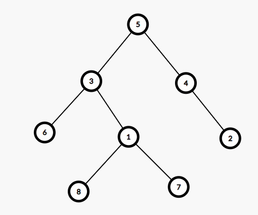
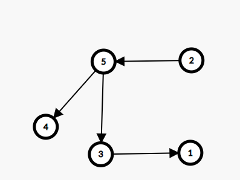

# Rezolvare test 6,7,8 propuse pentru BAC 2020

## Testul 6

### Subiectul I
1. 
    - Rezolvare
        - Daca evaluam expresia, avem: (x >=18) && (x>= 19 && x<= 20) && (x<=21>)
        - Astfel numerele care valideaza expresia sunt: 19, 20
        * a -> invalid
        * b -> invalid
        * c -> valid
        * d -> invalid
    - Raspuns corect:  `c`
2. 
    - Rezolvare:
        ```json
            Avem:
            {caprifoi, iasomie, liliac, tamarix, scumpie}
            {  0     ,    1   ,    2  ,    3   ,    4   }

            Primele 4 solutii sunt: 
            (caprifoi, iasomie, liliac, tamarix, scumpie),
            (caprifoi, iasomie, liliac, scumpie, tamarix),
            (caprifoi, iasomie, tamarix, liliac, scumpie),
            (caprifoi, iasomie, tamarix, scumpie, liliac)

            Adica:
            (0,1,2,3,4),
            (0,1,2,4,3),
            (0,1,3,2,4),
            (0,1,3,4,2)

            Ultima solutie este:
            (4,3,2,1,0)
            Penultima este:
            (4,3,2,0,1) -> (scumpie, tamarix, liliac, caprifoi, iasomie)
        ```
    - Raspuns corect: `c`
3. 
    - Rezolvare:
        - Chiar daca nu stim formula matematica, ne dam seama dupa sintaxa:
        * a -> Valid, de asemenea si singura valida din punct de vedere sintactic
        * b -> invalid
        * c -> invalid
        * d -> invalid
    - Raspuns corect: `a`
4. 
    - Rezolvare:
        - Din enunt avem arborele de mai jos:
        
        - Observam ca pe nivelul 2 gasim nodurile: 6,1,2
    - Raspuns corect: `d`
5. 
    - Rezolvare:
        - Din enunt avem graful initial:
         
        - Pentru ca un graf sa fie tare conex, trebuie sa avem drum intre oricare 2 varfuri ale grafului
        - Observam ca daca adaugam muchiile: [4,3] si [1,2] graful devine tare conex
    - Raspuns corect: `b`
### Subiectul II
### Subiectul III

## Testul 7

### Subiectul I
### Subiectul II
### Subiectul III

## Testul 8

### Subiectul I
### Subiectul II
### Subiectul III