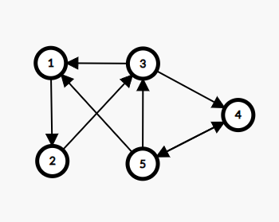

# Rezolvare test 6,7,8 propuse pentru BAC 2020

## Testul 6

### Subiectul I
1. 
    - Rezolvare
        - Daca evaluam expresia, avem: (x >=18) && (x>= 19 && x<= 20) && (x<=21>)
        - Astfel numerele care valideaza expresia sunt: 19, 20
        * a -> invalid
        * b -> invalid
        * c -> valid
        * d -> invalid
    - Raspuns corect:  `c`
2. 
    - Rezolvare:
        ```json
            Avem:
            {caprifoi, iasomie, liliac, tamarix, scumpie}
            {  0     ,    1   ,    2  ,    3   ,    4   }

            Primele 4 solutii sunt: 
            (caprifoi, iasomie, liliac, tamarix, scumpie),
            (caprifoi, iasomie, liliac, scumpie, tamarix),
            (caprifoi, iasomie, tamarix, liliac, scumpie),
            (caprifoi, iasomie, tamarix, scumpie, liliac)

            Adica:
            (0,1,2,3,4),
            (0,1,2,4,3),
            (0,1,3,2,4),
            (0,1,3,4,2)

            Ultima solutie este:
            (4,3,2,1,0)
            Penultima este:
            (4,3,2,0,1) -> (scumpie, tamarix, liliac, caprifoi, iasomie)
        ```
    - Raspuns corect: `c`
3. 
    - Rezolvare:
        - Chiar daca nu stim formula matematica, ne dam seama dupa sintaxa:
        * a -> Valid, de asemenea si singura valida din punct de vedere sintactic
        * b -> invalid
        * c -> invalid
        * d -> invalid
    - Raspuns corect: `a`
4. 
    - Rezolvare:
        - Din enunt avem arborele de mai jos:
        
        - Observam ca pe nivelul 2 gasim nodurile: 6,1,2
    - Raspuns corect: `d`
5. 
    - Rezolvare:
        - Din enunt avem graful initial:
         
        - Pentru ca un graf sa fie tare conex, trebuie sa avem drum intre oricare 2 varfuri ale grafului
        - Observam ca daca adaugam muchiile: [4,3] si [1,2] graful devine tare conex
    - Raspuns corect: `b`

### Subiectul II
1. 
   * a
        ```json
            n = 7
            nr = 0, i = 1
            cat timp 1<= 7
                x = 0
                y = 1
                j = 1
                cat timp j < i executa fals
                i = 2
                daca y > 0
                    nr = 1
            cat timp 2 <= 7
                x = 0
                y = 1
                j = 1
                cat timp j<i (1 <2)
                    r = 2*x-y = -1
                    x = 1
                    y = -1
                    j = 2
                i = 3
                daca y > 0 fals
            cat timp 3 <= 7
                x = 0
                y = 1
                j = 1
                cat timp j < i (1 < 3)
                    r = 2*x-y = -1
                    x = 1
                    y = -1
                    j = 2
                cat timp  j < i (2 < 3)
                    r = 2*x-y = 1
                    x = -1
                    y = 1
                    j = 3
                i = 4
                daca y > 0 atunci
                    nr = nr+1 = 2
            cat timp i <= n (4<= 7)
                x = 0
                y = 1
                j = 1
                cat timp j < i (1 < 4>) executa
                    r = 2*x-y = -1
                    x = 1
                    y = -1
                    j = 2
                cat timp  j<i (2 <4) executa
                    r = 2*x-y = 1
                    x = -1
                    y = 1
                    j = 3
                cat timp j<i (3 <4) executa
                    r = 2*x-y = -2-1=-3
                    x = 1
                    y - -3
                    j = j+1 =4
                i = 5
                 daca y > 0 fals
            cat timp i<= n (5 < 7)
                x = 0
                y = 1
                j = 1
                cat timp j<i (1<5) executa
                    r = 2*x-y = -1
                    x = 1
                    y = -1
                    j = 2
                cat timp j<i (2 < 5) executa
                    r = 2*x-y = 1
                    x = -1
                    y = 1
                    j = 3
                cat timp j<i (3 < 5) executa
                    r = 2*x-y = -1
                    x = 1
                    y = -1
                    j = 4
                cat timp j < i (4 < 5) executa
                    r = 2*x-y = 1
                    x = -1
                    y = 1
                    j = 5
                i = 6
                daca y > 0
                    nr = nr+1 = 3
            
            cat timp i<= n executa
                x = 0
                y = 1
                j = 1
                cat timp j<i (1 <6 ) executa
                    r = 2*x-y = -1
                    x = 1
                    y = -1
                    j = 2
                cat timp j<i (2 < 6) executa
                    r = 2*x-y = 1
                    x = -1
                    y = 1
                    j = 3
                cat timp j<i (3 < 6) executa
                    r = 2*x-y = -1
                    x = 1
                    y = -1
                    j = 4
                cat timp j < i (4 < 6) executa
                    r = 2*x-y = 1
                    x = -1
                    y = 1
                    j = 5
                cat timp j < i (5 < 6) executa
                    r = 2*x-y = -3
                    x = 1
                    y = -3
                    j = 6
                i = 7
                daca y > 0 fals
            cat timp i<=n (7<=7)
                x = 0
                y = 1
                j = 1
                cat timp j<i (1 <7 ) executa
                    r = 2*x-y = -1
                    x = 1
                    y = -1
                    j = 2
                cat timp j<i (2 < 7) executa
                    r = 2*x-y = 1
                    x = -1
                    y = 1
                    j = 3
                cat timp j<i (3 < 7) executa
                    r = 2*x-y = -3
                    x = 1
                    y = -3
                    j = 4
                cat timp j < i (4 < 7) executa
                    r = 2*x-y = 5
                    x = -3
                    y = 5
                    j = 5
                cat timp j < i (5 < 7) executa
                    r = 2*x-y = -1
                    x = 5
                    y = -1
                    j = 6
                cat timp j < i (6 < 7) executa
                    r = 2*x-y = 9
                    x = -1
                    y = 9
                    j = 7
                daca y > 0 
                    nr = nr+1 = 4
            
            scrie nr => 4
                
        ```
   * b
        - Deoarece la fiecare numar impar se incrementeaza nr, numerele cautate sunt: `19` si `20`
   * c
        ```c++
            #include <iostream>
            #include <fstream>

            using namespace std;
            int main() {
                int n;
                cin >> n;
                int nr = 0, i = 1;
                while (i<=n) {
                    int x = 0, y = 1, j = 1;
                    while (j < i) {
                        int r = 2*x-y;
                        x = y;
                        y = r;
                        j = j+1;
                    }

                    i = i+1;
                    if (y > 0) {
                        nr = nr+1;
                    }
                }

                cout << nr;
            }
        ```
   * d
        ```json
            citește n (număr natural nenul)
            nr<-0;
            ┌pentru i<-1,n execută
            │ x<-0; y<-1; j<-1
            │ ┌cât timp j<i execută
            │ │ r<-2*x-y; x<-y; y<-r
            │ │ j<-j+1
            │ └■
            │ ┌dacă y>0 atunci
            │ │ nr<-nr+1
            │ └■
            └■
            scrie nr
        ```
2. 
    - Rezolvare:
        ```json
            - O sa incercam sa dam valori pentru a ne da seama ce face aceasta functie
            Incepem cu x1 = 9 si calculam f(10, 9)
            f(10, 9) =
                = 1 + f(1, 9)
                    = 9 + f(1, 8)
                        = 8 + f(1, 7)
                            = 7 + f(1, 6)
                                = 6 + f(1, 5)
                                    = 5 + f(1,4)
                                        = 4 + f(1,3)
                                            = 3 + f(1,2)
                                                = 2 + f(1,1)
                                                    = 1
                                                = 3
                                            = 6
                                        = 10
                                    = 15
                                = 21
                            = 28
                        = 36
                    = 45
                = 46
            Incercam x1 = 7 si calculam f(10, 7)
            f(10,7) 
            = 1 + f(3, 7)
                = 2 + f(3, 4)
                    = 1 + f(3, 1)
                        = 3 + f(2, 1)
                            = 2+ f(1, 1)
                                = 1
                            = 3
                        = 6
                    = 7
                = 9
            = 10
            Pare ca trebuie un x1 si mai mic, luam x1 = 6 si calculam f(10,  6)
            f(10, 6) =
                = 1 + f(4, 6)
                    = 1 + f(4, 2)
                        = 2 + f(2, 2)
                            = 1
                        = 3
                    = 4
                = 5
            Si am gasit x1 = 6.

            Acum pentru a gasi x2 astfel incat f(x2, 10) sa fie 1, observam ca pentru un a egal cu b obtinem 1, adica luam x2 = 10;

        ```
3. 
    - Rezolvare:
        - Observam ca prima coloana are numerele in scadere, avand o diferenta de 5 intre fiecare 2 numere consecutive de pe prima coloana, iar pe linie, merg crescator
        ```c++
            #include <iostream>

            using namespace std;

            int f(int, int);
            int main() {
            int a[4][5] = {
                    {0,0,0,0,0},
                    {0,0,0,0,0},
                    {0,0,0,0,0},
                    {0,0,0,0,0},
            };
            for(int i = 0; i<4; i++) {
                for(int j = 0; j < 5; j++) {
                    // daca e prima coloana
                        if (j == 0) {
                            // si daca e prima linie, hardcodam la 16
                            if (i == 0) {
                                a[i][j] = 16;
                            } else {
                            // altfel calculam in functie de indexul liniei
                            a[i][j] = 16-5*i;
                            }
                        } else {
                            // pentru restul de elemente, fiecare numar este egal cu valoarea
                            // de pe prima coloana + indexul coloanei
                            a[i][j] = 16-5*i + j;
                        }
                }
            }

                for(int i = 0; i<4; i++) {
                    for(int j = 0; j < 5; j++) {
                        cout << a[i][j] << " ";
                    }
                    cout << endl;
                }
            }

        ```


### Subiectul III
1. 
    - Rezolvare:
        ```c++
            #include <iostream>
            #include <fstream>

            using namespace std;

            void prodprim(int n, int &p);

            int main() {
                int n = 2000;
                int p = 0;
                prodprim(n, p);
                cout << p;
            }

            void prodprim(int n, int &p) {
                int rezultat = 1;
                for(int i = 2; i <= n; i++) {
                    if (n%i == 0) {
                        int esteDivizorPrim = 1;
                        for(int j = 2; j*j <= i; j++) {
                            if (i%j == 0) {
                                esteDivizorPrim =0;
                                break;
                            }
                        }
                        if (esteDivizorPrim) {
                            rezultat = rezultat * i;
                        }
                    }
                }
                p = rezultat;
            }
        ```

2. 
    - Rezolvare:
        ```c++
            #include <iostream>
            #include <cstring>


            using namespace std;


            int main() {
                char s[101];
                cin.getline(s, 101);
                char*cuvant = strtok(s, " ");
                int exista = 0;
                while(cuvant != NULL) {
                    int contorVocale = 0;
                    int contorConsoane = 0;
                    for(int i = 0; i<strlen(cuvant);i++) {
                        if(strchr("aeiou", cuvant[i]) != NULL) {
                            contorVocale++;
                        } else {
                            contorConsoane++;
                        }
                    }
                    if(contorVocale < contorConsoane) {
                        exista = 1;
                        cout << cuvant << endl;
                    }
                    cuvant = strtok(NULL, " ");
                }
                if(!exista) {
                    cout << "nu exista";
                }
            }
        ```
3. 
    * a
        ```json
            O sa implementam un algoritm care va incepe mai intai prin a gasii primele 2 cifre descrescatoare care indeplinesc prima cerinta, anume ca produsul lui sa fie egal cu p1. Cand le-am gasit, compunem partea din mijloc, la fel, in mod descrescator, parte care va fi simpla din moment ce toate cifrele sunt egale. Imediat ce avem si partea din mijloc, compunem si ultima partea a numarului, unde trebuie sa respectam conditia ca produsul cifrelor sa fie egal cu p2. Algoritmul este eficient din punct de vedere al timpului de executie deoarece toate partile numarului cerut sunt generate in acelasi timp, si totodata eficient din punct de vedere al memoriei deoarece nu folosim alte structuri de date pentru a stoca numarul final sau partile care il constituie.
        ```
    * b
        ```c++
            #include <iostream>
            #include <fstream>


            using namespace std;


            int main() {
            ofstream fout("bac.out");
            int p1,p2;
            int cifra1,cifra2,cifra3;
            int cifra6,cifra7;
            int primaParte,aDouaParte,ultimaParte;
            int rezultat;
            cin >> p1 >> p2;
            for(cifra1 = 9; cifra1 >= 1; cifra1--) {
                for(cifra2 = 9; cifra2 >= 1; cifra2--) {
                    if(cifra1 * cifra2 == p1) {
                        primaParte = cifra1 * 10 + cifra2;
                        for(cifra3 = 9; cifra3 >= 0; cifra3--) {
                            aDouaParte = cifra3 * 100 + cifra3 * 10 + cifra3;
                            for(cifra6 = 9; cifra6 >= 1; cifra6--) {
                                for(cifra7 = 9; cifra7 >= 1; cifra7--) {
                                    if(cifra6 * cifra7 == p2) {
                                        ultimaParte = cifra6 * 10 + cifra7;
                                        rezultat = primaParte * 100000 + aDouaParte * 100 + ultimaParte;
                                        fout << rezultat << " ";
                                    }
                                }
                            }
                        }
                    }
                }
            }
            fout.close();
            }
        ```
## Testul 7

### Subiectul I
1. 
    - Rezolvare:
        - Expresia este echivalenta cu: `(x >= 2001) && (x<= 2002) || (x>=2019) && (x<=2020)`
        - De unde ne dam seama ca avem valoarea 1 pentru numerele din intervalele: `[2001,2002] reunit [2019,2020]`
        * a -> invalid 
        * b -> invalid deoarece {2019, 2020} acopera doar strict valorile 2019 si 2020 nu si valorile dintre ele
        * c -> invalid, acelasi motiv ca si la b
        * d -> valid
    - Raspuns corect: `d`
2. 
    - Rezolvare:
        ```json
            f(12345) =
            = afisam `+` calculam f(123) si la intoarcere trebuie sa afisam x(12345) si '+'
                = afisam `+` calculam f(1) si la intoarcere trebuie sa afisam x(123) si `+`
                    = afisam `+` calcuam f(0) si la intoarcere trebuie sa afisam 1 si `+`
                        = afisam `++`
                    = afisam `1+`
                = afisam `123+`
            = afisam `12345+`
        ```
        - afiseaza: `+++++1+123+12345+`
    - Raspuns corect: `a`
3. 
    - Rezolvare:
        ```json
            {   0   ,    1     ,    2    ,   3     ,    4  ,   5}
            {albizia, jacaranda, laburnum, magnolie, mimoza, sakura}

            Primele 5 solutii:
            (albizia, jacaranda, laburnum, magnolie),
            (albizia, jacaranda, laburnum, mimoza),
            (albizia, jacaranda,laburnum, sakura), 
            (albizia, jacaranda, magnolie, mimoza),
            (albizia, jacaranda,magnolie, sakura)
            Adica:

            (0,1,2,3),
            (0,1,2,4),
            (0,1,2,5),
            (0,1,3,4)
            (0,1,3,5)

            Acum sa analizam variantele:
        ```
        * a -> (magnolie, mimoza,laburnum, sakura) adica: (3,4,2,5) invalid deoarece a mai fost o varianta ce cuprindea membrii
        * b -> (jacaranda, magnolie, mimoza, sakura) adica (1,3,4,5) valid
        * c -> (jacaranda, laburnum, magnolie, mimoza, sakura) adica (1,2,3,4,5) invalid, deoarece trebuie 4 nu 5
        * d -> (albizia, jacaranda, magnolie, laburnum) adica (0,1,3,2) -> invalid deoarece a mai fost o varianta ce continea membrii
    - Raspuns corect: `b`
4. 
    - Rezolvare:
        - Din matricea de adiacenta avem graful orientat de mai jos:
        
        - Avem:
            * Varful 1 -> grad interior 2
            * Varful 2 -> grad interior 1
            * Varful 3 -> grad interior 2
            * Varful 4 -> grad interior 2
            * Varful 5 -> grad interior 1
        - Deci avem in total 3 varfuri cu grad interior 2
    - Raspuns corect: `c`
5. 
    - Rezolvare:
        - Stim ca un arbore ar n-1 muchii
        - Stiind ca avem 5 componente conexe care sunt arbori si 20 de noduri, inseamna ca avem 15 muchii, la fiecare arbore "pierdem" o muchie
    - Raspuns corecT: `c`

### Subiectul II
1. 
    * a
        ```json
            n = 253387
            x = 1, m = 0, p = 1
            cat timp x < 10
                cn = 253387
                cat timp cn != 0
                    c = 7
                    cn = 25338
                    daca c == x fals
                cat timp cn!= 0
                    c = 8
                    cn= 2533
                    daca c == x fals
                cat timp cn!= 0
                    c = 3
                    cn = 253
                    daca c == x fals
                cat timp cn != 0
                    c = 3
                    cn = 25
                    daca c == x fals
                cat timp cn != 0
                    c = 5
                    cn = 2
                    daca c == x false
                cat timp cn != 0
                    c = 2
                    cn =0
                    daca c == x false
                x = x+2 = 3
            cat timp x < 10
                cn = 253387
                cat timp cn != 0
                    c = 7
                    cn = 25338
                    daca c == x false
                cat timp cn != 0
                    c = 8
                    cn = 2533
                    daca c == x false
                cart timp cn != 0
                    c = 3
                    cn = 253
                    daca c == x
                        m = 3+0;
                        p = 10
                cat timp cn != 0
                    c = 3
                    cn = 25
                    daca c == x
                        m = 30 + 3 = 33
                        p = 100
                cat timp cn != 0
                    c = 5
                    cn = 2
                    daca c==x false
                cat timp cn != 0
                    c = 2
                    cn = 0
                    daca c == x false
                x = 5
            .... observam ca noi creem un numar format din cifrele 1, 3, 5, 7, 9 daca le gasim in numarul de intrra
        ```
        - Programul returneaza 7533
    * b
        - Cel mai mic: 20
        - Cel mai mare: 88
    * c
        ```c++
            #include <iostream>

            using namespace std;

            int main() {
            int n;
            cin >> n;
            int x = 1, m = 0, p = 1;
            while (x < 10) {
                int cn = n;
                while (cn != 0) {
                    int c = cn % 10;
                    cn = cn / 10;
                    if (c == x) {
                        m = c * p + m;
                        p = p * 10;
                    }
                }
                x = x+2;
            }
            cout << m;

            return 0;
            }
        ```
    * d
        ```json
            citește n
            (număr natural nenul)
            x<-1; m<-0; p<-1
            ┌execută
            │ cn<-n
            |┌daca x < 10 atunci
            ||┌cât timp cn≠0 execută
            ││| c<-cn%10; cn<-[cn/10]
            ││| ┌dacă c=x atunci
            ││| │ m<-c*p+m; p<-p*10
            ││| └■
            │|└■
            |└■
            │ x<-x+2
            └■cât timp x<10
            scrie m
        ```
2. 
    ```c++
        struct info_carte {
            char titlu[21];
            char autor[21];
        };

        struct biblio {
            int numar;
            info_carte carte[100];
        }c;
    ```
3. 
    - Rezolvare:
        ```c++
            strcpy(s,"stilou"); // s = stilou
            cout<<s+4<<endl; // afiseaza "ou" si endline
            s[0]=s[0]-1; // inlocuim 's' cu 'r'
            s[1]=s[0]-3; // inlocuim 't' cu 'o'
            s[2]=s[0]+1; // inlocuim 'i' cu s
            s[3]=s[0]+3; // inlocuim 'l' cu 'u'
            s[4]='\0';
            cout<<s; //rosu
        ```
### Subiectul III
1. 
    - Rezolvare:
        ```c++
            #include <iostream>

            using namespace std;
            int putere(int n, int p);

            int main() {
                cout << putere(80,2);
                return 0;
            }

            int putere(int n, int p) {
                int divizor = 2;
                int rezultat;
                while (n != 1) {
                    rezultat = 0;
                    while (n%divizor == 0) {
                        rezultat++;
                        n = n/divizor;
                    }
                    if (rezultat != 0 && divizor == p) {
                        return rezultat;
                    } else {
                        divizor++;
                    }
                }
                return -1;
            }

        ```
2. 
    - Rezolvare:
        ```c++
            #include <iostream>

            using namespace std;

            int main() {
                int m, n;
                cin >> m >> n;
                int matrice[m][n];
                for (int i = 0; i < m; i++) {
                    for (int j = 0; j < n; j++) {
                        cin >> matrice[i][j];
                    }
                }
                int existaPolarizate = 0;
                for (int i = 0; i < m; i++) {
                    for(int j = 0; j < m; j++) {
                        if (matrice[i][0] == matrice[j][n-1]) {
                            existaPolarizate = 1;
                            cout << matrice[i][0] << " ";
                        }
                    }
                }

                if (!existaPolarizate) {
                    cout << "nepolarizate";
                }
                return 0;
            }

        ```

3. 
    - Rezolvare:
        * a
            ```json
                Vom implementa un algoritm care va parcurge fisierul si in timp ce va parcurge, va aduna numarul curent la o variabila unde vom tine sumaCurenta. De fiecare data cand adaugam in sumaCurenta, comparam cu variabila unde tinem sumaMinima si daca in suma curenta avem o valoare mai mica, actualizam sumaMinima. Daca sumaCurenta este mai mare decat 0, o resetam deoarece o suma pozitiva va creste suma minima. Initializam sumaMinima cu valoarea maxima posibila pe care o poate lua un numar intreg. Algoritmul este eficient din punct de vedere al memoriei deoarece nu folosim structuri de date pentru a stoca cele 10^6 numere cate pot fi maximum, si in acelasi timp este eficient din punct de vedere al timpului de executie deoarece rezultatul este compus in timp ce parcurgem fisierul.
            ```
        * b
            ```c++
                #include <iostream>
                #include <fstream>
                #include <climits>

                using namespace std;

                int main()
                {
                    ifstream fin("bac.txt");
                    int numar;
                    int sumaMinima = INT_MAX, sumaCurenta = 0;
                    while(fin >> numar) {
                        sumaCurenta += numar;
                        if (sumaCurenta < sumaMinima) {
                            sumaMinima = sumaCurenta;
                        }

                        if (sumaCurenta > 0) {
                            sumaCurenta = 0;
                        }
                    }

                    cout << sumaMinima;


                    fin.close();
                }
            ```

## Testul 8

### Subiectul I
### Subiectul II
### Subiectul III