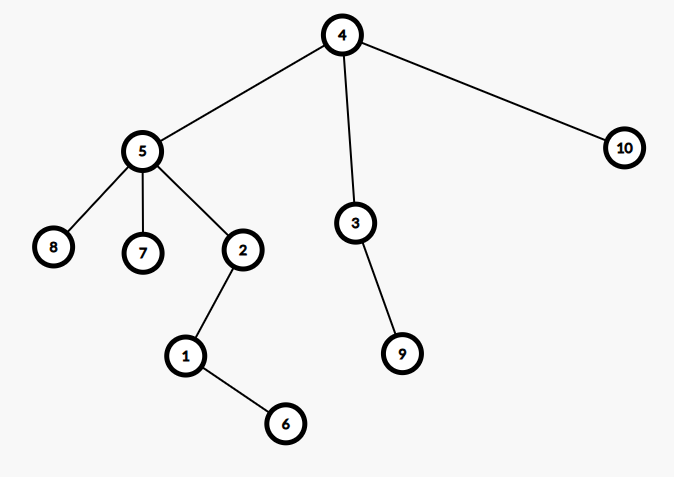
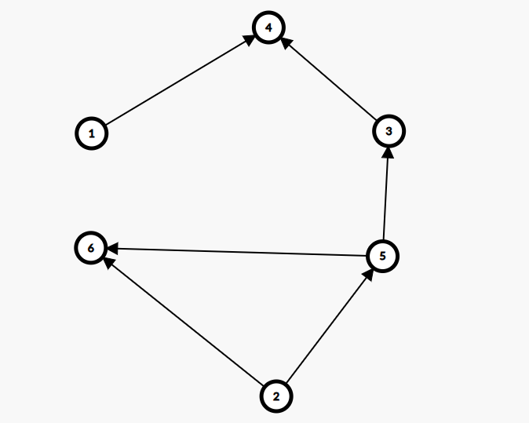
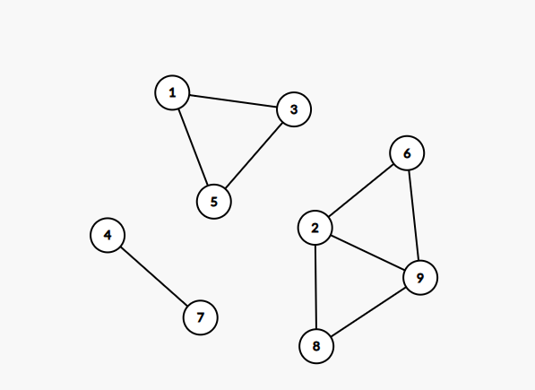
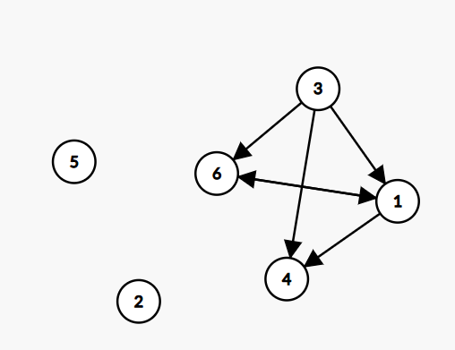

# Sesiunea 28

## Agenda

* Rezolvare Test 9 Propus BAC 2020
* Rezolvare Test 10 Propus BAC 2020
* Rezolvare Test 11 Propus BAC 2020

## Rezolvare Test 9 Propus BAC 2020

### Subiectul I

1. 
    - Rezolvare
        * a Invalid deoarece nu avem cum sa obtinem 0 dupa o impartire de genul, daca 2020 este divizor de al lui x
        * b Operatie invalida, fiind divizor de al lui X, obtinem 0 in paranteza si dupa aceea am avea x/0 care este invalid (division by zero)
        * c Invalid, similar ca la b
        * d Valid. Daca 2020 este divizor de al lui x, obtinem un alt divizor atunci cand impartim la x. Deci x % acest divizor ne va da tot 0
    - Raspuns corect: `d`
2. 
    - Rezolvare:
        ```json
            Intr-o matrice patratica cu 6 elemente, pentru diagonala secundara avem urmatoarele valori pentru i si j si pentru valoarea de la aceasta pozitie
                i = 0, j = 5 => 0
                i = 1, j = 4 => 4
                i = 2, j = 3 => 2
                i = 3, j = 2 => 2
                i = 4, j = 1 => 4
                i = 5, j = 0 => 0
        ```
    - Raspuns corect: `b` (12)
3. 
    - Rezolvare:
        ```json
            Avem:
            {roșu,galben,verde,albastru,violet}
            { 0  ,  1,     2  ,   3    ,  4}

            Primele 4 solutii sunt:
            (roșu,  galben,  verde),
            (roșu,  galben,  albastru),
            (roșu,  galben, violet),
            (roșu, verde, galben)

            Adica:
            (0, 1, 2),
            (0, 1, 3),
            (0, 1, 4),
            (0, 2, 1)

            Ultima solutie:
            (4, 3, 2)
            Penultima:
            (4,3,1) => (violet, albastru, galben)
        ```
    - Raspuns corect: `a`
4. 
    - Rezolvare:
        ```JSON
            Avem:
            (1,2,3,4,5,6,7,8,9,10)
            (2,5,4,0,4,1,5,5,3,4)

            Adica:
            4 -> Radacina si tata pentru: 3,5,10
            3 -> tata pentru: 9
            5 -> tata pentru 2,7,8
            2 -> tata pentru 1
            1 -> tata pentru 6
        ```
        - Astfel avem arborele de mai jos:
         
        - Observam ca nodul 5 are 3 descendenti directi
    - Raspuns corect: `c`
5. 
    - Rezolvare:
        - Din matricea de adiacenta putem creea graful pentru primele 5 noduri si partial cel de-al 6-lea
        
        Drum elementar: Un lanț (drum) se numește elementar dacă în el nu se repetă noduri. Un lanț (drum) se numește simplu dacă în el nu se repetă arce.
        - Trebuie sa finalizam graful astfel incat sa existe doar 3 drumuri elementare care incep din 2 si se termina in 4
        - Observam ca deja avem un drum elementar: `[2->5->3->4]` si daca legam nodule 6 de 1, si de nodul 4 mai avem inca 2 adica:
            * `[2->5->6->1->4]` si `[2->6->1->4]`
        - Insa vedem ca daca mai adaugam si legatura intre 6 si 2, avem tot 3 drumuri elementare dar un grad maxim exterior: 2
    - Raspuns corect: `b`

### Subiectul II

1. 
    * a
        ```json
            N = 8, k = 3
            t = 1
            pentru i = 1, i <= 2; i++
                pentru j = 1, j <= 3;j++;
                    scrie t => 1
                pentru j = 2; j <= 3;j++
                    scrie t => 1
                pentru j = 3; j<=3; j++
                    scrie t => 1
                t = 2
            pentru i = 2; i<=2; i++
                pentru j = 1, j <= 3;j++;
                    scrie t => 2
                pentru j = 2; j <= 3;j++
                    scrie t => 2
                pentru j = 3; j<=3; j++
                    scrie t => 2
                t = 3
            
            pentru i=2; i>=1, i--
                scrie t => 3
            pentru i=1; i>=1; i--
                scrie t => 3 
        ```
        - Programul afiseaza: 1 1 1 2 2 2 3 3

    * b
        -  Observam ca sunt n/k incrementari de t. In cazul nostru, avand k=5, avem nevoie de 46 ca si valoare pentru n, pentru a obtine ultima cifra 10, asta pentru primul numar si 50 pentru cel mai mare
        - Cea mai mica: 46
        - Cea mai mare: 50
    * c
        ```c++
            #include <iostream>

            using namespace std;

            int main() {
                int n,k;
                cin >> n >> k;
                int t = 1;
                for (int i = 1; i<= n/k; i++) {
                    for (int j = 1; j <= k; j++) {
                        cout << t << " ";
                    }
                    t = t + 1;
                }

                for (int i = n%k; i>=1; i--) {
                    cout << t << " ";
                }
                return 0;
            }

        ```
    * d
        ```json
            citește n,k  
                (numere naturale nenule) 
            t<-1 
            ┌pentru i<-1,[n/k] execută 
            | j<-1
            │┌cat timp j <=k execută 
            ││ scrie t,' ' 
            || j <- j+1
            │└■ 
            │ t<-t+1 
            └■ 
            ┌pentru i<-n%k,1,-1 execută 
            │ scrie t,' ' 
            └■ 
        ```
2. 
    - Rezolvare:
        ```json
            f(0) = 0
            f(2020)
                = 0 + f(101)
                    = 1 + f(5)
                        = 5 + f(0)
                            = 0
                        = 5
                    = 6
                = 6
            = 6
        ```
3. 
    - Rezolvare:
        - Din enunt avem graful de mai jos:
        
        - Observam ca avem 
            - 3 componente conexe
            - Nodurile din componente cu cele mai putine noduri: 4, 7

### Subiectul III

1. 
    - Rezolvare:
        ```c++
            #include <iostream>

            using namespace std;

            void suma(int, int&);

            int main() {
                int n = 4713835,p;
                suma(n, p);
                cout << p;
                return 0;
            }

            void suma(int n, int &p) {
                int frecventaImpare[10] = {0};
                int rezultat = 0;
                while(n) {
                    int ultimaCifra = n%10;
                    if (ultimaCifra % 2 == 1) {
                        if (frecventaImpare[ultimaCifra] == 0) {
                            rezultat += ultimaCifra;
                            frecventaImpare[ultimaCifra]++;
                        }
                    }
                    n= n/10;
                }
                p = rezultat;
            }
        ```
2. 
    - Rezolvare:
        ```c++
            #include <iostream>
            #include <cstring>

            using namespace std;


            int main() {
                int n;
                cin >> n;
                char cuvinte[n][21];
                for(int i = 0; i<n; i++){
                    cin >> cuvinte[i];
                }

                int existaPrefixe = 0;
                for(int i =0; i < n-1; i++) {
                    if (strlen(cuvinte[n-1]) > strlen(cuvinte[i])) {
                        continue;
                    } else {
                        int j =0;
                        int estePrefix = 1;
                        while(j < strlen(cuvinte[i]) && j < strlen(cuvinte[n-1])) {
                            if (cuvinte[i][j] != cuvinte[n-1][j]) {
                                estePrefix = 0;
                                break;
                            }
                            j++;
                        }
                        if (estePrefix) {
                            cout << cuvinte[i] << " ";
                            existaPrefixe = 1;
                        }
                    }
                }

                if (!existaPrefixe) {
                    cout << "nu exista";
                }
                return 0;
            }

        ```
3. 
    - Rezolvare:
        * a
            ```json
                O sa implementam un algoritm care va citi numar cu numar, si in timp ce citeste, daca numarul este divizibil cu k, atunci o sa incrementam un contor care va tine lungimea secventei curente. Atunci cand intalnim un numar care nu indeplineste cerinta, o sa verificam daca secventa curenta este mai mare decat lungimea secventei maxime, caz in care o sa o actualizam, si totodata o sa setam si un alt contoir ce numara cate secvente au lungimea maxima cu valoarea 1. Daca in schimb gasim o secventa egala cu secventa maxima, ca si lungime, o sa incrementam contorul care numara secventele maxime. Dupa ce am terminat citirea numerelor din fisier, mai verificam lungimea secventei curente pentru a avea acoperire in cazul in care ultimele numere citite din fisier, sunt toate divizibile cu k.
                Programul este eficient din punct de vedere al timpului de executie deoarece fisierul este citit o singura data si rezultatul este calculat in timp ce numerele sunt citite. In acelasi timp, programul este eficient din punct de vedere al memoriei deoarece nu se folosesc alte structuri de date pentru a stoca numerele, practic, din maximul de 10^6 numere cate pot fi in fisier, noi in memorie o sa tinem cel mult 1.
            ```
        * b
            ```c++
                #include <iostream>
                #include <fstream>

                using namespace std;


                int main() {
                    ifstream fin("bac.txt");
                    int secventaMaxima=0, secventaCurenta = 0, contor = 0;
                    int numar, k;
                    fin >> k;
                    while(fin >> numar) {
                        if (numar % k == 0) {
                            secventaCurenta++;
                        } else {
                            if (secventaCurenta > secventaMaxima) {
                                secventaMaxima = secventaCurenta;
                                secventaCurenta = 0;
                                contor = 1;
                            } else  if (secventaCurenta == secventaMaxima) {
                                contor++;
                            }
                        }
                    }

                    if (secventaCurenta > secventaMaxima) {
                        secventaMaxima = secventaCurenta;
                        contor = 1;
                    } else  if (secventaCurenta == secventaMaxima) {
                        contor++;
                    }

                    cout << secventaMaxima << " " << contor;

                    fin.close();
                    return 0;
                }

            ```

## Rezolvare Test 10 Propus BAC 2020

### Subiectul I

1. 
    - Rezolvare:
        * a -> invalid, nu se poate obtine 1
        * b -> invalid, nu se poate impartii la zero. x fiind divizor de al lui 20, 20%x => 0
        * c -> invalid, de asemenea impartire la zero
        * d -> valid. Pentru `20/x` obtinem un divizor de al lui `20`, deci `20%x` ne da 0.
    - Raspuns corect: `d`
2. 
    - Rezolvare:
        ```json
            f(19, 20)
            = f(18, 21)
                = f(15, 22)
                    = f(8, 23)
                        = f(-7, 24)
                            = 24
        ```
    - Raspuns corect: `b`      
3. 
    - Rezolvare:
        ```json
            { 0 ,  1  ,   2   ,    3   ,  4  }
            {cal,câine,papagal,porumbel,ponei} 

            (cal,  câine,  cal,  câine),
            (cal,  câine,  cal,  porumbel),
            (cal,  câine,  câine, cal),
            (cal,  câine,  câine,  câine),
            (cal,  câine,  câine,  papagal),
            (cal,  câine,  câine, porumbel),
            (cal,  câine,  câine,  ponei),
            (cal,  câine,  papagal,  câine)

            (0, 1, 0, 1)
            (0, 1, 0, 3)
            (0, 1, 1, 0)
            (0, 1, 1, 1)
            (0, 1, 1, 2)
            (0, 1, 1, 3)
            (0, 1, 1, 4)
            (0, 1, 2, 1)

            Enuntul ne cere sa numar cate solutii au forma urmatoare:
            1 x y 3 si nu avem voie 0,2,4 unul langa celalalt.
            Daca x ia valoarea: 0, `y` poate sa fie: 1,3
            Daca x ia valoarea: 1, `y` poate sa fie: 0,1,2,3,4
            Daca x ia valoarea: 2, `y` poate sa fie: 1,3
            Daca x ia valoarea: 3, `y` poate sa fie: 0,1,2,3,4
            Daca x ia valoarea: 4, `y` poate sa fie 1,3
            Si asa ajungem la 16 posibilitati
        ```
    - Raspuns corect: `c`
4. 
    - Rezolvare:
        - Avem arborele de tati:
            ```json
                (1,2,3,4,5,6,7,8)
                (4,4,2,7,4,8,0,7)
                Adica:
                7 radacina si tata pentru: 4 si 8
                4 tata pentru: 1,2,5
                8 tata pentru: 6
                2 tata pentru: 3
            ```
        - Frunzele sunt: 1,3,5,6
    - Raspuns corect: `a`
5. 
    - Rezolvare:
        - Din enunt avem graful
        
        Acum trebuie sa vedem numarul de subgrafuri pe care le putem obtine din graful initial astfel incat arcele de mai jos sa ramana acolo
         {(1,6), (3,1), (3,6), (6,1)}.
        Din teorie stim: Fie G=(V,U) un graf orientat. Un subgraf al grafului G, se obține ştergând eventual anumite vârfuri şi odată cu acestea şi arcele care le admit ca extremitate (nu se pot şterge toate vârfurile deoarece s-ar obține un graf cu mulțimea vârfurilor vidă).
        Astfel avem subgrafuri in care stergem nodurile:
        - 4
        - 4,2
        - 4,5
        - 4,2,5
        De retinut ca in orice configuratie trebuie sa stergem varful 4
        
    - Raspuns corect: `c`
### Subiectul II

1. 
    - Rezolvare:
        * a
            ```json
                x = 16, y = 7
                x > y => x = 7, y = 16
                i = 7, j = 16, s =0
                repeta
                    s = 0 + 1 * 16 + 0 = 16
                    i = 8, j = 15
                pana cand i > j
                repeta
                    s = 16 + 0 + 8 = 24
                    i = 9, j = 14
                pana cand i > j
                repeta
                    s = 24 + 14 + 0 = 38
                    i = 10
                    j = 13
                pana cand i > j
                repeta
                    s = 38 + 0 + 10 = 48
                    i = 11
                    j = 12
                pana cand i > j
                repeta
                    s = 48 + 12 + 0 = 60
                    i = 12
                    j = 11
                pana cand i > j
            scrie s = > 60
            ```
        * b
            - Algoritmul aduna numerele pare din intervalul[x, y]
            - Daca citim `x=10`, practic trebuie sa dam un numar astfel incat suma parelor din intervalul [10, y] sa fie 90. Astfel avem numerele:
            - 10 -> s = 10
            - 12 -> s = 22
            - 14 -> s = 36
            - 16 -> s = 52
            - 18 -> s = 70
            - 20 -> s = 90
            Deci putem seta ca valoare pentru y: 20 si 21
        * c
            ```c++
                #include <iostream>
                using namespace std;

                int main() {
                    int x, y;
                    cin >> x >> y;
                    if (x > y) {
                        int aux = x;
                        x = y;
                        y = aux;
                    }
                    int i = x, j = y, s =0;
                    do {
                        s = s + (i%2)*j + (j%2) * i;
                        i++;
                        j--;
                    } while (i <= j);
                    cout << s;
                    return 0;
                }
            ```
        * d
            ```json
                citește x,y 
                (numere naturale nenule) 
                ┌dacă x>y atunci  
                | x<-→y 
                └■ 
                i<-x; j<-y; s<-0 
                ┌cat timp i<=j executa  
                | s<-s+(i%2)*j+(j%2)*i 
                │ i<-i+1; j<-j-1 
                └■ 
                scrie s 
            ```
2. 
    - Rezolvare:
        ```c++
            #include <iostream>
            using namespace std;

            struct spectacol {
                int cod;
                int nrActori;
                int varsta[10];
            }s[20];

            int main() {

                s[0].cod;
                s[0].nrActori;
                s[0].varsta[4];
                return 0;
            }
        ```
3. 
    - Rezolvare: 
        ```c++
            #include <iostream>
            using namespace std;

            int main() {

                int a[4][5];
                for(int i = 0; i<4; i++) {
                    for(int j = 0; j<5; j++) {
                        if (i == 0 && j == 0) {
                            a[i][j] = 5*(i+1);
                        } else {
                            a[i][j] = (5 * (i+1))-j;
                        }
                    }
                }

                for(int i = 0; i<4; i++) {
                    for(int j = 0; j<5; j++) {
                        cout << a[i][j] << " ";
                    }
                    cout << endl;
                }
                return 0;
            }
        ```

### Subiectul III

1. 
    - Rezolvare:
        ```c++
            #include <iostream>
            using namespace std;

            void produs(int n, long int&p);
            int main() {
                int n = 122325;
                long int p;
                produs(n, p);
                cout << p;

                return 0;
            }

            void produs(int n, long int&p) {
                long int rezultat = 1;
                int frecventa[10] = {0};
                while(n) {
                    int ultimaCifra = n % 10;
                    if (ultimaCifra % 2 == 0 && frecventa[ultimaCifra] == 0) {
                        rezultat = rezultat * ultimaCifra;
                        frecventa[ultimaCifra]++;
                    }
                    n = n/10;
                }
                if (rezultat == 1) {
                    p =-1;
                } else {
                    p = rezultat;
                }
            }
        ```
2. 
    - Rezolvare:
        ```c++
            #include <iostream>
            #include <cstring>
            using namespace std;

            int main() {

                char text[103];
                char rezultat [200]="";
                cin.getline(text, 103);

                char* cuvantAnterior = NULL;
                char *cuvantCurent = strtok(text, " ");

                while(cuvantCurent != NULL) {
                    if (cuvantAnterior != NULL) {
                        if (cuvantCurent[strlen(cuvantCurent)-1]== cuvantAnterior[strlen(cuvantAnterior)-1]) {
                            strcat(rezultat, "succes");
                            strcat(rezultat, " ");
                        }
                        strcat(rezultat, cuvantCurent);
                        strcat(rezultat, " ");
                    } else {
                        strcat(rezultat, cuvantCurent);
                        strcat(rezultat, " ");
                    }
                    cuvantAnterior = cuvantCurent;
                    cuvantCurent = strtok(NULL, " ");
                }
                cout << rezultat;
                return 0;
            }

        ```
3. 

## Rezolvare Test 11 Propus BAC 2020

### Subiectul I

1. 
2. 
3. 
4. 
5. 

### Subiectul II

1. 
2. 
3. 

### Subiectul III

1. 
2. 
3. 