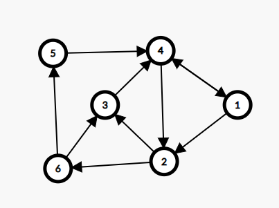
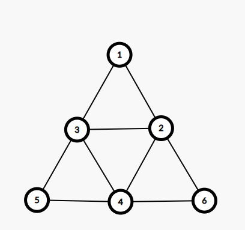
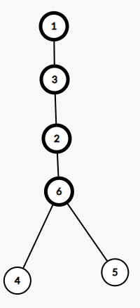
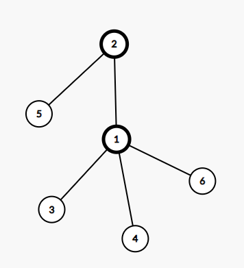
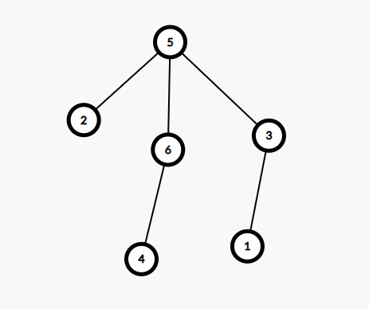
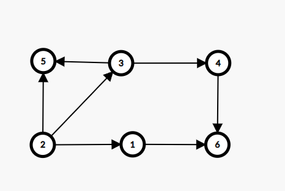

# Rezolvare variante propuse: 12,13,14 BAC 2020

## Test 12

### Subiectul I
1. 
    - Rezolvare:
        * a -> Invalid -> obtinem 1 si pentru x = -1 si y = 21 sau orice numere care inmultite nu dau 0
        * b -> Invalid, obtinem 1 si pentru orice y care este diferit de 20 si x diferit de 0
        * c -> Invalid, obtinem 1 si pentur un y care este egal cu 20 si x = 1
        * d -> `!` transforma expresia in: `x*(y-20)>0` adevarat doar pentru x, si y conform enuntului
    - Raspuns corect: `d`
2. 
    -  Raspuns corect: `a` => 20*2 = 40
3. 
    - Rezolvare:
        ```json
            f(54321)
                = calculam f(5432) si la intoarcere nu afisam nimic pentru ca `n` nu e par
                    = calculam f(543) si la intoarcere afisam `2` deoarece `n` este par
                        = calculam f(54) si la intoarcere nu afisam nimic pentru ca `n` nu e par
                            = calculam f(5) si la intoarcere afisam `4` deoarece `n` este par
                                = calculam f(0) si la intoarcere nu afisam nimic.
                            = afisam 4
                        = afisam 2
            
        ```
    - Raspuns corect: `b`
4. 
    - Rezolvare:
        - Din matricea de adiacenta avem graful de mai jos:
            
        - Si avem:
            - Varful 1: 
                - Grad interior: 1
                - Grad exterior: 2
            - Varful 2:
                - Grad interior: 2
                - Grad exterior: 2
            - Varful 3:
                - Grad interior: 2
                - Grad exterior: 1
            - Varful 4:
                - Grad interior: 3
                - Grad exterior: 2
            - Varful 5:
                - Grad interior: 1
                - Grad exterior: 1
            - Varful 6:
                - Grad interior: 1
                - Grad exterior: 2
        - Daca stergem muchiile: [1,4] si [6,3] ajungem la conditia ceruta
    - Raspuns corect: `b`
5. 
    - Rezolvare:
        - Din enunt avem graful de mai jos:
        
        - Observam ca avem nevoie de cel putin 2 muchii, sa eliminam (e.g 1-3 si 2-1) pentru a obtine graful partial neconex
    - Raspuns corect: `c`
### Subiectul II

1. 
    * a
        ```json
            n = 2592
            nr = 0
            c = 9
            cat timp c >=0
                m = 2592
                cat timp m!=0 si m%10!=c
                    m = 259
                cat timp m!= 0 si m%10 !=c fals
                daca m!= 0
                    nr = 9
                c = c-1 = 8
            cat timp c >= 0
                m <- n = 2592
                cat timp m!= 0 si m%10 != c
                    m = 259
                cat timp m!= 0 si m%10 != c
                    m = 25
                cat timp m!= 0 si m%10 != c
                    m = 2
                cat timp m!= 0 si m%10 != c
                    m = 0
                daca m!= 0 fals
                c = c-1 = 7
            cat timp c >= 0
                m <- n = 2592
                cat timp m!= 0 si m%10 != c
                    m = 259
                cat timp m!= 0 si m%10 != c
                    m = 25
                cat timp m!= 0 si m%10 != c
                    m = 2
                cat timp m!= 0 si m%10 != c
                    m = 0
                daca m!= 0 fals
                c = c-1 = 6
            cat timp c >= 0
                m <- n = 2592
                cat timp m!= 0 si m%10 != c
                    m = 259
                cat timp m!= 0 si m%10 != c
                    m = 25
                cat timp m!= 0 si m%10 != c
                    m = 2
                cat timp m!= 0 si m%10 != c
                    m = 0
                daca m!= 0 fals
                c = c-1 = 5
            cat timp c >= 0
                m <- n = 2592
                cat timp m!= 0 si m%10 != c
                    m = 259
                cat timp m!= 0 si m%10 != c
                    m = 25
                daca m!= 0
                    nr = 95
                c = c-1 = 6
                -----
            Programul creeaza un numar format din cifrele de la 9 la 0 care se gasesc in numar
            
            Si va returna 952
        ```
    * b: `2000, 2002, 2200`
    * c
        ```c++
            #include <iostream>

            using namespace std;

            int main()
            {
                int n;
                cin >> n;
                int c = 9, nr=0;
                while (c >= 0) {
                    int m = n;
                    while (m!= 0 && m%10 != c) {
                        m = m /10;
                    }

                    if(m != 0) {
                        nr = nr * 10 + m%10;
                    }
                    c = c-1;
                }
                cout << nr;
                return 0;
            }

        ```
    * d
        ```json
            citește n (număr natural nenul)
            nr<-0
            ┌pentru c<- 9,0,-1 execută
            │ m<-n
            │┌cât timp m≠0 și m%10c execută
            ││ m<-[m/10]
            │└■
            │┌dacă m<-0 atunci
            ││ nr<-nr*10+m%10
            │└■
            │
            └■
            scrie nr

        ```
2. 
    - Rezolvare
        ```c++
            #include <iostream>

            using namespace std;

            struct flori {
                int cod;
                int nrVarietati;
                int nrExemplare[11];
            }f[21];

            int main()
            {
                f[0].cod;
                f[0].nrVarietati;
                f[0].nrExemplare[3];
                
                return 0;
            }
        ```
3. 
    - Rezolvare:
        ```json
            Numerele sunt de forma: x x x x 6 si sunt crescatoare
            Ultimul: 23456
            Penultimul: 13456
            Antepenultimul: 12456
        ```
        - Raspuns: 12456, 13456, 23456

### Subiectul III

1. 
    - Rezolvare
        ```c++
            #include <iostream>

            using namespace std;

            int pDoi(int n);

            int main()
            {
                cout << pDoi(32);
                return 0;
            }

            int pDoi(int n) {
                int rezultat = 0;
                for(int i = n; i >=1; i--) {
                    int estePutere = 1;
                    int numar = i;
                    while(numar > 1) {
                        if (numar % 2 != 0) {
                            estePutere = 0;
                            break;
                        }
                        numar = numar / 2;
                    }
                    if (estePutere) {
                        rezultat = i;
                        break;
                    }
                }
                return rezultat;
            }

        ```
2. 
    - Rezolvare
        ```c++
            #include <iostream>
            #include <cstring>

            using namespace std;


            int main()
            {
                char text[101];
                cin.getline(text, 101);
                int pozitieUltimaVocala = -1;
                for(int i = strlen(text)-1; i>=0; i--) {
                    if(strchr("aeiou", text[i]) != NULL) {
                        pozitieUltimaVocala = i;
                        break;
                    }
                };

                if (pozitieUltimaVocala == -1) {
                    cout << "nu exista";
                } else {
                    strcpy(text+pozitieUltimaVocala, text+pozitieUltimaVocala+1);
                    cout << text;
                }

                return 0;
            }
        ```
3. 
    - Rezolvare
        * a
            ```json
                O sa proiectam un algoritm care va citi n de la tastatura dupa care vom avea o instructiune repetitiva, ce va rula cat timp n va fi mai mare sau egal cu 1. Imediat cum intram in while, vom scrie in fisier n dupa care vom calcula urmatoarea valoare a lui n anume: daca n e mai mic sau egal cu 10 sau va fi impar, urmatorul n va fi egal cu n-1, altfel, va fi egal cu n/2. Algoritmul este eficient din punct de vedere al memoriei deoarece nu folosim vreo structura de date pentru a stoca numerele, ele fiind calculate din mers. In acelasi timp, algoritmul este eficient din punct de vedere al timpului deoarece vom scrie direct in ordine descrescatoare, nu mai va fi nevoie de o alta prelucrare pentru a le sorta.
            ```
        * b
            ```c++
                #include <iostream>
                #include <fstream>

                using namespace std;


                int main()
                {
                    ofstream fout("bac.out");
                    int n;
                    cin >> n;
                    while(n >= 1) {
                        fout << n << " ";
                        if (n <= 10 || n % 2 == 1) {
                            n = n-1;
                        } else {
                            n = n / 2;
                        }
                    }

                    return 0;
                }

            ```

## Test 13

### Subiectul I
1. 
    - Rezolvare
        * a Dupa transformare avem: `(n%4 == 0 && n%5 == 0)` care este ce avem nevoie
        * b Dupa transformare avem: `n/4 != 1 && n/5 == 0` care este invalid, nu respecte cerinta
        * c Dupa transformare avem: `n%4 == 0 && n%5 != 0` care este invalid, a doua parte nu respecta cerinta
        * d Dupa transformare avem: `n/4 == 0 && n/5 != 0` care este invalid
    - Raspuns corect: `a`
2. 
    - Rezolvare:
        ```json
            f(200200)
                = 2*f(20020)
                    = 2 * f(2002)
                        = 2 * f(200)
                            = 2 * f(20)
                                    = 20
                            = 40
                        = 80
                    = 160
                = 320
        ```
    - Raspuns corect: `d`
3. 
    - Rezolvare:
        ```json
            Primele 8: 5, 55, 555, 557, 565, 567, 57, 575
            9:-> 585
            10: -> 587
            11: -> 588
            12: -> 65
        ```
    - Raspuns corect: `d`
4. 
    - Rezolvare:
        ```json
            Din  enunt avem:
            (1,2,3,4,5,6,7,8,9,10)
            (2,8,2,9,8,9,0,7,7,9)

            7 radacina si tata pentru: 8 si 9
            8 tata pentru: 2,5
            9 tata pentru: 4,6,10
            2 tata pentru: 1,3
            Si observam ca frunzele sunt: 1,3,5,4,6,10
        ```
    - Raspuns corect: `c`
5. 
    - Rezolvare:
        ```json
            Stim ca ni se dau 7 noduri si 20 de muchii.
            Un graf complet este un graf care are un arc intre oricare 2 varfuri.
            Un graf complet cu n varfuri are (n*n-1)/2 muchii.
            Stiind ca avem 20 de muchii, trebuie sa calculam folosind formula de sus, cate noduri putem avea pentru a folosi cele 20 de muchii.
            Un graf complet cu 7 varfuri are: 7*6/2 = 21 muchii, mai mult decat avem noi
            Un graf complet cu 6 varfuri are: 6*5/2 muchii: adica 15, ceea ce este mai putin decat avem noi. Deci daca stergem un nod, putem avea un graf complet.
        ```
    - Raspuns corect: `b`
### Subiectul II

1. 
    - Rezolvare:
        * a
            ```json
                n = 12345
                p = 1; m = 0; k = 0
                cat timp n!= 0
                    x = 25
                    i = k = 0
                    cat tomp i!= 0
                    daca x == 0 fals => c = 5
                    m = 5+0
                    n = 1234
                    p = 10
                    k = 1
                cat timp n!= 0
                    x = 2070
                    i = 1
                    cat timp i != 0 executa
                        x = 207
                        i = 0
                    daca x = 0 fals =>c = 7
                    m = 7*10+5 = 75
                    n = 123
                    p = 100
                    k = 2
                cat timp n!= 0
                    x = 49
                    i = 2
                    cat timp i!= 0
                        x = 4
                        i = 1
                    cat timp i!= 0
                        x = 0
                        i = 0
                    daca x == 0 => c = 3
                    m = 300+75 = 375
                    n = 12
                    p = 1000
                    k = 3
                cat timp n!= 0
                    x =  270135
                    i = 3
                    cat timp i!= 0
                        x = 27013
                        i = 2
                    cat timp i!= 0
                        x = 2701
                        i = 1
                    cat timp i!= 0
                        x = 270
                        i = 0
                    Daca x == 0-> c = 0
                    n = 1
                    m = 375
                    p = 10000
                    k = 4
                cat timp n!= 0
                    x = 21
                    i = 4
                    cat timp i!= 0
                        x = 1
                        i = 3
                    cat timp i!= 0
                        x = 0
                        i = 2
                    .....

                    daca x == 0 => c = > 1
                    m = 10000+375 = 10375
                    p = 100000
                    n = 0
                    k = 5
            Scrie m => 10375
            ```
        * b: 100 1000 1010 1010
        * c
            ```c++
                #include <iostream>

                using namespace std;

                int main() {

                    int n;
                    cin >> n;
                    int p = 1, m = 0, k = 0;
                    while (n != 0) {
                        int x;
                        cin >> x;
                        int i = k;
                        while (i != 0){
                            x = x /10;
                            i = i-1;
                        }
                        int c;
                        if (x == 0) {
                            c = n % 10;
                        } else {
                            c = x % 10;
                        }

                        m = c * p + m;
                        n = n /10;
                        p = p * 10;
                        k = k +1;
                    }
                    cout << m;
                    return 0;
                }

            ```
        * d
            ```json
                citeşte n (număr natural) 
                p<-1; m<-0; k<-0 
                ┌cât timp n≠0 execută 
                │ citește x (număr natural) 
                │ i<-k 
                │┌cât timp i≠0 execută 
                ││ x<-[x/10]; i<-i-1 
                │└■ 
                │┌dacă x=0 atunci c<-n%10 
                ││altfel c<-x%10 
                │└■ 
                │ m<-c*p+m; n<-[n/10] 
                │ p<-p*10; k<-k+1 
                └■ 
                scrie m
            ```
2. 
    ```c++
        #include <iostream>

        using namespace std;

        struct punct {
            float x;
            float y;
        };

        struct cerc {
        float raza;
        punct centru;
        }c;

        int main() {
            c.raza;
            c.centru.x;
            c.centru.y;
            
            return 0;
        }
    ```
3. 
    ```c++
        #include <iostream>
        #include <cstring>

        using namespace std;

        int main() {
            char s[21];
            strcpy(s,"stilou"); // s contine "stilou"
            int i = 0;
            cout<<s+4<<endl; // afiseaza "ou" si se muta pe linia urmatoare
            for(i=0;i<4;i++)
                s[i]=s[0]+(i-1)*(1-i%2)+3*(2*i/3-1)*(i%2); // inlocuieste fiecare litera din primele 4 cu 'r' 'o' 's' si 'u'
            s[4]='\0'; // incheie string-ul dupa al 4-lea caracter
            cout<<s;
            return 0;
        }
    ```

### Subiectul III

1. 
    - Rezolvare:
        ```c++
            #include <iostream>
            #include <climits>
            using namespace std;
            void putere (int n, int&d, int& p);

            int main() {
                int d, p;
                putere(10780, d, p);
                cout << d << " " << p;
                return 0;
            }

            void putere (int n, int&d, int& p) {
                int putereMin = INT_MAX, divizorMin;
                d = 2;
                while ( n > 1) {
                    p = 0;
                    while (n% d == 0) {
                        n = n / d;
                        p = p+1;
                    }

                    if (p!= 0) {
                        if (p < putereMin) {
                            putereMin = p;
                            divizorMin = d;
                        } else if (p == putereMin && d < divizorMin) {
                            divizorMin = d;
                        }
                    }

                    d = d+1;
                }
                p = putereMin;
                d = divizorMin;
            }
        ```
2. 
    - Rezolvare
        ```c++
            #include <iostream>
            using namespace std;

            int main() {

                int n, k;
                cin >> n >> k;
                int matrice[n*k][n];

                int numar = 1;
                for(int i = 0; i < n*k; i++) {
                    for(int j =0; j < n; j++) {
                        matrice[i][j] = numar + j;
                    }
                    if((i+1) % k == 0) {
                        numar++;
                    }
                }

                for(int i = 0; i < n*k; i++) {
                    for(int j =0; j < n; j++) {
                        cout << matrice[i][j] << " ";
                    }
                    cout << endl;
                }
                return 0;
            }

        ```
3. 
    - Rezolvare
        * a
            ```json
                Observam ca sirul este o progresie geometrica, valorile sirului crescand exponential, fiind puteri ale lui 2, deci ratia va fi 2.
                Algoritmul de mai jos este eficient din punct de vedere al timpului de executie dar si al memoriei ocupate deoarece rezultatul este calculat direct in ordine descrescatoare, fara a genera mai intai sirul in ordine crescatoare, si de asemenea nu tinem in memorie sirul inainte de a-l scrie.
            ```
        * b
            ```c++
                #include <iostream>
                #include <fstream>

                using namespace std;

                int main() {
                    ofstream fout("bac.txt");
                    int x;
                    cin >> x;
                    while(x >=1) {
                        if(x == 1) {
                            fout << 1 << " ";
                            x--;
                        } else if (x == 2) {
                            fout << 2 << " ";
                            x--;
                        } else {
                            fout << x << " ";
                            x = x/2;

                        }

                    }

                    return 0;
                }

            ```

## Test 14

### Subiectul I
1. 
    - Rezolvare
        * a -> Expresia este echivalenta cu: `x >= -2002 && x<=2020` care este valida
        * b -> Invalida deoarece nu se verifica ambele conditii
        * c -> Invalid
        * d -> Invalid
    - Raspuns corect: `a`
2. 
    - Rezolvare
        ```json
            f(2020, 20) =
                = f(101, 2000)
                    = f(0, -1899)
                     -1899
        ```
    - Raspuns corect: `c`

3. 
    - Rezolvare:
        ```json
            {  0  ,    1          ,   2  ,         3       ,   4  ,          5         ,    6    ,    7   }
            {cască, costum de înot, cleme, dopuri de urechi, plută, mască de snorkeling, ochelari, snorkel}
            {  40 ,      400      ,  30  ,        30       ,   10 ,         400        ,     70  ,   60   }

            Primele 3 solutii: 
            (cască,costum de înot, cleme, dopuri de urechi),
            (cască, costum de înot, snorkel),
            (cască,cleme, dopuri de urechi, mască de snorkeling)
            Adica:
            (0,1,2,3)
            (0,1,7)
            (0,2,3,5)

            A 4 a
            (0,5,7)
            A 5 a
            (1,2, 4,7)
            Adica: (costum de înot, cleme, plută, snorkel)
        ```
4. 
    - Rezolvare
        * Pentru a vedea cine satisface cerinta, desenam cei 4 arbori:
            * a 
            
                - nu respecta cerinta
            * b
            
                - nu respecta cerinta
            * c
             
                - valid


5. 
    - Rezolvare:
        * Din matricea de adiacenta avem urmatorul graf orientat:
        
        * Definiție: Se numește circuit un drum simplu în care extremitatea inițială și finală sunt egale. Se numește circuit elementar un circuit în care, cu excepția extremităților, nu se repetă noduri.
        * Daca adaugam [6->2] obtinem circuitele
            * 2 -> 3 -> 4 -> 6 -> 2
            * 6 -> 2-> 3 -> 4 -> 6
    - Raspuns corect: `a`
### Subiectul II

1. 
    * a
        ```json
            n = 1527894
            m = 0
            repeta
                c = 4
                n = 152789
                daca c == 9  fals
                    daca c% 2== 1 fals
                m = 4
            pana cand n = 0
            repeta
                c = 9
                n = 15278
                daca c == 9 => c = 1
                m = 41
            pana cand n == 0
            repeta
                c = 8
                n = 1527
                daca c == 9 fals
                    daca c%2 == 1 fals
                m = 418
            pana cand n == 0
            repeta
                c = 7
                n = 152
                daca c == 9 fals
                    daca c % 2 == 1 ->c = 8
                m = 4188
            pana cand n = 0
            repeta
                c = 2
                n = 15
                daca c == 9 fals
                    daca c % 2 == 1 fals
                m = 41882
            pana cand n == 0
            repeta 
                c = 5
                n = 1
                daca c == 9 fals
                    daca c%2 == 1 => c = 6
                m = 418826
            pana cand n = 0
            repeta
                c = 1
                n = 0
                daca c== 9 fals
                    daca c % 2 == 1
                        c = 2
                m = 4188262
            pana cand n = 0
        scrie m => 4188262
        ```
    * b: `9, 90, 900, 9000, 90000, etc.`
    * c
        ```c++
            #include <iostream>
            #include <fstream>

            using namespace std;

            int main() {
                int n;
                cin >> n;
                int m = 0;
                do {
                    int c = n % 10;
                    n = n / 10;
                    if (c == 9) {
                        c = 1;
                    } else {
                        if (c % 2 == 1) {
                            c = c+1;
                        }
                    }
                    m = m * 10 + c;
                } while (n != 0);
                cout << m;

                return 0;
            }

        ```
    * d
        ```c++
            citește n (număr natural)
            m<-0
            ┌cat timp n > 0 executa 
            │ c<-n%10; n<-[n/10]
            │┌dacă c=9 atunci c<-1
            ││altfel
            ││┌dacă c%2=1 atunci
            │││c<-c+1
            ││└■
            │└■
            │ m<-m*10+c
            └■
            scrie m
        ```
2. 
    - Rezolvare:
        ```c++
            struct rasa {
                int cod;
                int nrExemplare;
                int varsta[11];
            }r[21];
        ```
3. 
    - Rezolvare:
        ```c++
            #include <iostream>
            #include <fstream>

            using namespace std;


            int main() {

                int a[5][7] = {
                        {0,0,0,0,0,0,0},
                        {0,0,0,0,0,0,0},
                        {0,0,0,0,0,0,0},
                        {0,0,0,0,0,0,0},
                        {0,0,0,0,0,0,0},
                };
                for(int i = 0; i < 5; i++) {
                    for(int j = 7; j >= 0; j--) {
                        if (i == 0 || j == 6) {
                            a[i][j] = 1;
                        } else {
                            a[i][j] = (a[i-1][j] + a[i][j+1]) % 10;
                        }
                    }
                }


                for(int i = 0; i < 5; i++) {
                    for(int j = 0; j < 7; j++) {
                        cout << a[i][j] <<" ";
                    }
                    cout << endl;
                }

                return 0;
            }

        ```

### Subiectul III

1. 
2. 
3. 
    - Rezolvare
        * a
        * b
