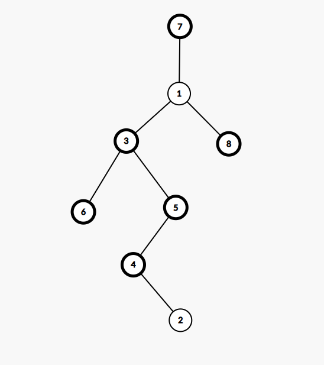
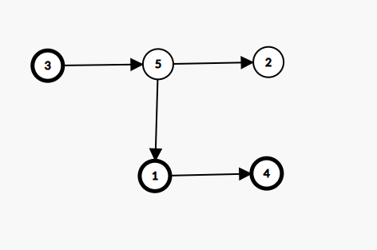

# Rezolvare variante propuse: 15,16,17 BAC 2020


## Test 15

### Subiectul I
1. 
    - Rezolvare:
        - Expresia devine: `(x >= 16) &&  (x>= 17 && x<=19) && (x <=20) `
        - Obtinem `1` doar pentru `[17,19]`
    - Raspuns corect: `b`
2. 
    - Rezolvare
        ```json
            {  0  ,   1     ,    2    ,    3  ,    4    }  
            {creți, iacobini, jucători, rotați, toboșari}

            Primele 4 solutii:
            (creți, iacobini,  jucători,  rotați,  toboșari),
            (creți,  iacobini,  jucători,  toboșari, rotați),
            (creți, iacobini, rotați, jucători, toboșari),
            (creți, iacobini, rotați, toboșari, jucători)

            Adica
            (0,1,2,3,4),
            (0,1,2,4,3),
            (0,1,3,2,4),
            (0,1,3,4,2)

            Ultima solutie:
            (4,3,2,1,0),
            Penultima solutie
            (4,3,2,0,1) -> tobosari,rotati,jucatori,creti, iacobini
        ```
    - Raspuns corect: `c`
3. 
    -  Rezolvare
        - Din sintaxa observam ca doar  `a` este valid
    - Raspuns corect: `a`
4. 
    - Rezolvare
        - Din enunt avem arborele de mai jos care are 6 niveluri:
        
    - Raspuns corect: `c`
        
        
5. 
    - Rezolvare
        - Din enunt avem graful:
        

        -  Si observam ca daca mai adaugam arcul (4,3) si (2,4) obtinem tare  conexitate
    - Raspuns corect: `b`
### Subiectul II

1. 
    - Rezolvare:
        * a
        * b
        * c
        * d
2. 
3. 


### Subiectul III
1. 
2. 
3. 

## Test 16

### Subiectul I
1. 
2. 
3. 
4. 
5. 

### Subiectul II

1. 
2. 
3. 


### Subiectul III
1. 
2. 
3. 


## Test 17

### Subiectul I
1. 
2. 
3. 
4. 
5. 

### Subiectul II

1. 
2. 
3. 


### Subiectul III
1. 
2. 
3. 