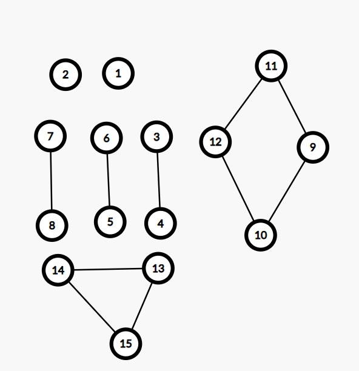
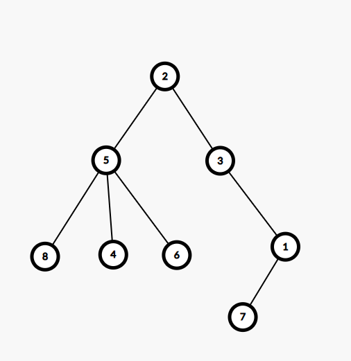

# Sesiunea 33

## Agenda

* Rezolvare subiect BAC 2024 iunie
* Exercitii cu functii recursive similare BAC

## Rezolvare subiect BAC 2024 iunie

### Subiectul I
1. 
    - Rezolvare
        * a Respecta cerinta
        * b Invalid, pentru 2 numere impare, obtinem 1 (gen x = 3, y = 1)
        * c Invalid, pentru 2 numere impare, obtinem 1 (gen x = 3, y = 1)
        * d Invalid, obtinem 1 atat pentru numere impare cat si pare, atata timp cat ambele au aceeasi paritate
    - Raspuns corect: `a`
2. 
    - Rezolvare:
        ```json
            f(2020, 0) =
                calculam f(202, 1) si la intoarcere afisam x%10 (0) dar si y adica 0
                    calculam f(20, 2) si la intoarcere afisam x%10 (2) dar si y adica 1
                        calculam f(2, 3) si la intoarcere afisam x%10(0) dar si y adica 2
                            afisam x -> 2 si afisam y adica 3
            se va afisa in final: 23022100
        ```

    - Raspuns corect: `d`
3. 
    - Rezolvare:
        ```json
            (2,4,6,1,3,5),
            (2,4,6,1,5,3),
            (2,4,6,3,1,5), 
            (2,4,6,3,5,1), 
            (2,4,6,5,1,3), 
            (2,4,6,5,3,1)
            a 7 a:
            (2,6,4, 1,3,5)
        ```
    - Raspuns corect: `c`
4. 
    - Rezolvare
        * a -> invalid din punct de vedere al sintaxei, x este vector nu structura in sine
        * b -> invalid, la fel ca la a, x este vector nu o structura
        * c -> invalid, 'ciocolata' este numele structurii si nu numele membrului
        * d -> valid
    - Raspuns corect: `d`
5. 
    - Rezolvare
        * Mai jos avem o varianta de graf care satisface cerintele
        
        * Ca si detalii:
            * stim ca avem 2 noduri cu grad 0, adica sunt izolate (nodul 1 si 2)
            * mai stim ca avem 6 noduri cu grad impar si aici am legat doar 2 cate 2, cele 6 noduri deoarece noi trebuie sa folosim cat mai multe noduri si cat mai putine din cele 10 muchii, deci cu  nodurile 3,4,5,6,7,8 am folosit 3 muchii din totalul de 10, mai raman 7
            * totodata, enuntul spune ca restul de 7 muchii trebuie sa fie date doar la varfuri cu grad par de aceea mai intai facem acel romb in care folosim 4 muchii la 4 noduri deci in total am folosit 7, si  mai folosim restul de 3 muchii, la alte 3 noduri, pentru a respecta cerinta ca gradul sa fie par si pentru a maximiza numarul de noduri.
    - Raspuns corect: `b` -> 15 noduri
        

### Subiectul II
1. 
    * a
        ```json
            n = 5
            p = 1
            pentru i = 1,n
                x = 15
                repeta
                    x = x/3 = 5
                pana cand x <=3
                repeta
                    x = x/3 = 1
                pana cand x <=3
                daca x != 0
                    p = p * x = 1 * 1
            pentru i = 2,n
                x = 27
                repeta
                    x = x/3 = 9
                pana cand x <=3
                repeta
                    x = x/3 = 3
                pana cand x <= 3
                daca x != 0
                    p = p * x = 1 * 3 = 3
            pentru i = 3, n
                x =10
                repeta
                    x = x/3 = 3
                pana cand x <=3
                daca x!= 0
                    p = p * x = 3 * 3 = 9
            pentru i = 4,n
                x = 1
                repeta
                    x = x/3 = 0
                pana cand x<= 3
                daca x!= 0 fals
            pentru i=5,n
                x = 17
                repeta
                    x = x/3 = 5
                pana cand x <=3
                repeta
                    x = x/3 =1
                pana cand x<= 3
                daca x!= 0
                    p= p * x = 9
            afiseaza 9
        ```
    * b
        ```json
            n = 2 inseamna ca mai avem nevoie de inca 2 numere
            cele 2 numere trebuie ca sa dea 2 atunci cand impartim succesiv la 3
            deci putem folosi secventa: 2,18,54
        ```
    * c
        ```c++
            #include <iostream>

            using namespace std;

            int main() {
                int n;
                cin >> n;
                int p = 1;
                for (int i = 1; i<=n; i++) {
                    int x;
                    cin >> x;
                    do {
                        x = x/3;
                    } while (x>3);
                    if (x != 0) {
                        p = p * x;
                    }
                }
                cout << p;
                return 0;
            }

        ```
    * d
        ```json
            citește n
            (număr natural nenul) 
            p<-1
            i<-1
            ┌cat timp i<=n execută
            │ citește x 
            │ (număr natural)
            │┌repetă
            ││ x<-[x/3] 
            │└până când x≤3 
            │┌dacă x≠0 atunci 
            ││ p<-p*x 
            │└■
            └■
            scrie p
        ```

2. 
    - Rezolvare
        - Din enunt avem urmatoarele date:
            ```json
                1 2 3 4 5 6 7 8
                3,0,2,5,2,5,1,5
                
                2: radacina si tata pentru 3 si 5
                3: tata pentru 1
                1: tata pentru: 7
                5: tata pentru 4,6,8

            ```
        - Astfel avem arborele:
        
        - Cel mai lung lant elementar: `2,3,1,7`
3. 
    - Rezolvare
        ```c++
            #include <iostream>

            using namespace std;

            int main() {
                int i, j;
                int a[9][9];
                for(i = 0; i < 9; i++) {
                    for (j = 0; j< 9; j++) {
                        if (i +j <= 3 || i+j >= 13 ) {
                            a[i][j] = 4;
                        } else {
                            a[i][j] = 2;
                        }
                    }
                }

                for(i = 0; i < 9; i++) {
                    for (j = 0; j< 9; j++) {
                        cout << a[i][j] << " ";
                    }
                    cout << endl;
                }
                return 0;
            }

        ```
### Subiectul III
1. 
    - Rezolvare
        ```c++
            #include <iostream>
            int majImp(int a, int b);

            using namespace std;

            int main() {
                cout << majImp(16,30);
                return 0;
            }

            int majImp(int a, int b) {
                int rezultat = 0;
                for (int i = a; i <= b; i++) {
                    int sumaPropriiImpare =0;
                    int sumaPropriiPare = 0;
                    for(int j = 2; j < i; j++) {
                        if (i % j == 0) {
                            if (j % 2 != 0) {
                                sumaPropriiImpare += j;
                            } else {
                                sumaPropriiPare += j;
                            }
                        }
                    }
                    if (sumaPropriiImpare > sumaPropriiPare) {
                        rezultat = i;
                        break;
                    }
                }

                return rezultat;
            }

        ```
2. 
    - Rezolvare
        ```c++
            #include <iostream>
            #include <cstring>

            using namespace std;

            int main() {
                char text[100];
                cin.getline(text, 100);
                char* cuvant = strtok(text, " ");
                int n = strlen(cuvant);
                cuvant = strtok(NULL, " ");
                int suntEgale = 1;
                while(cuvant != NULL) {
                    if (strlen(cuvant) != n) {
                        suntEgale = 0;
                        break;
                    }
                    cuvant = strtok(NULL, " ");
                }
                if(suntEgale) {
                    cout << "DA " << n;
                } else {
                    cout << "NU";
                }
                return 0;
            }

        ```
3. 
    - Rezolvare
        * a
            ```json
                Mai jos avem un algoritm care va pargurge fisierul, numar cu numar. Algoritmul va initia mai multe variabile in care vom stoca: valoarea de unde incepe secventa pe care o vom afisa, lungimea maxima a secventei pe care o vom afisa, lungimea secventei curente, valoarea cotei citite anterior si valoarea cotei curente. De fiecare data cand avem cota curenta egala cu cota anterioara + 1, inseamna ca respectam cerinta si o sa incrementam contorul in care stocam lungimea secventei curente. Daca avem o valoare ce nu este consecutiva, in cota curenta, atunci comparam lungimea secventei curente cu lungimea maxima pe care am intalnit-o pana acum si daca este mai mare, o sa actualizam valoarea acesteia impreuna cu variabila in care tinem minte inceputul secventei. Dupa ce am terminat de parcurs fisierul, o sa mai facem inca o data verificarea daca lungimea curenta este mai mare decat lungimea maxima, cu actualizarile aferente, pentru a verifica si cazul in care ultimele numere din fisier fac parte din secventa cea mai lunga. La final, daca avem o valoarea mai mica decat 2 in contorul ce tine lungimea secventei maxime, atunci  vom afisa "nu exista", altfel vom afisa o secventa de numere consecutive care incep de la valoarea egala cu ce avem in varibila care salveaza inceputul secventei, secventa ce va avea lungimea egala cu lungimea maxima. 
                Algoritmul este eficient din punct de vedere al timpului de executie deoarece fisierul este parcurs o singura data, si in acelasi timp este eficient din punct de vedere al memoriei deoarece rezultatul este calculat in timp ce citim din fisier si nu folosim alte structuri de date pentru a stoca numerele. Practic din totalul de 10^6 numere cate pot fi in total in fisier, noi avem maximum 2 in memorie.
            ```
        * b
            ```c++
                #include <iostream>
                #include <fstream>

                using namespace std;

                int main() {
                    ifstream fin("bac.txt");
                    int startSecventa = -1;
                    int lungimeMax = 0;
                    int cotaAnterioara;
                    int cotaCurenta;
                    fin >> cotaCurenta;
                    cotaAnterioara = cotaCurenta;
                    int lungimeCurenta = 1;
                    while(fin >> cotaCurenta) {
                        if (cotaCurenta == (cotaAnterioara + 1)){
                            lungimeCurenta++;
                        } else if (lungimeCurenta >= lungimeMax && lungimeCurenta > 1) {
                            lungimeMax = lungimeCurenta;
                            lungimeCurenta = 1;
                            startSecventa = cotaAnterioara - lungimeMax + 1;
                        }
                        cotaAnterioara = cotaCurenta;
                    }

                    if (lungimeMax < 2) {
                        cout << "nu exista";
                    } else {
                        for(int i =0; i < lungimeMax;i++) {
                            cout << startSecventa + i << " ";
                        }
                    }
                    fin.close();
                    return 0;
                }
            ```


## Exercitii cu functii recursive similare BAC

1. Funcţia F are definiţia alăturată. Ce valoare
are F(3)?
    ```c++
        int F(int n)
        {if(n == 0 || n == 1) return 1;
        else
        return 2*F(n-1)+2*F(n-2);}
    ```
2. Subprogramul f are definiţia
alăturată. Ce se va afişa în urma
apelului f(12345)?
    ```c++
         void f(long n)
        {if (n > 9)
        {cout << n/100;
        f(n/10);
        }
        }
    ```

3. Funcţia f are definiţia alăturată. Ce se
va afişa în urma apelului f(12345,0);?
    ```c++
        void f(long n, int i)
        {if (i  < n %10)
        {cout <<  n%10;
        f(n/10,i+1);
        }
        }
    ```

4. Funcţia F are definiţia alăturată. Ce valoare
are F(18)?
    ```c++
        int F(int x)
        {
        if (x < =1) return x;
        else return x+F(x-2);
        }
    ```
5. Funcţia F are definiţia alăturată. Ce valoare
are F(5)?
    ```c++
         int F(int x)
        {if(x != 0) return x+F(x-1);
        else
        return x;
        }
    ```