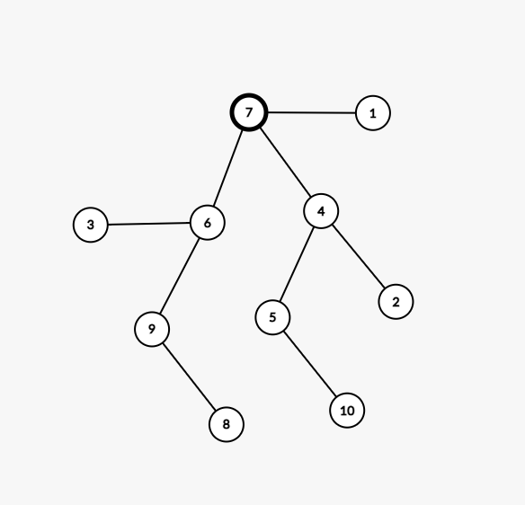
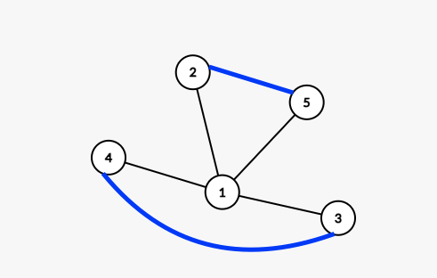

# Sesiunea 5

## Agenda
- In aceasta sesiune o sa rezolvam in totalitate modelul propus de Minister pentru Bacalaureatul din 2024.
    - Varianta se poate gasii in subiecte/bac_2024_model_propus.pdf


### Subiectul I
* 1. -> c. De fiecare data cand atingem un multiplu de al lui 2024, x%2024 va avea valoarea 0. Deci, valoarea maxima a expresiei poate fi 2023.
* 2. -> d. Toate cele 3 functii returneaza 300.
        ```json
                f1(24) = 24 * 25 / 2 = 300


                f2(24) = 
                    = 24 + f2(23)
                        = 23 + f2(22) = 
                            = 22 + f2(21) =
                                = 21 + f2(20) =
                                    = 20 + f2(19) = 
                                        = 19 + f2(18) =
                                            = 18 + f2(17)
                                            ....
                    = 24 + 23 + 22 + 21 + 20 + ... + 1 + 0 = 300
                
                f3(24) = 
                        24 * 24/4 + 2 * f3(12)= 144 + 2 * f3(12)
                            = 12 * 12/4 + 2 * f3(6) = 36 + 2 * f3(6)
                                = 6 * 6 /4 + 2 * f3(3) = 9 + 2 * f3(3)
                                    = 3 + f3(2) =
                                        = 2 * 2 /4 + 2 * f(1) = 1 + 2 * f(1)
                                            = 1 + f3(0)
                                                = 0
                                            = 1
                                        = 1 + 2 * 1 = 3
                                    = 3 + 3 = 6
                                = 21
                            = 36 + 2 * 21 = 78
                        = 144 + 2 * 78 
                    = 300

        ```
* 3. -> a
    ```json
        1-> (broccoli, cașcaval, ou, pătrunjel),
        2-> (broccoli, ou, cașcaval, pătrunjel),
        3-> (broccoli, ou, smântână, cașcaval), 
        4-> (broccoli, ou, smântână, pătrunjel),
        5-> (broccoli, smântână, cașcaval, ou)
        6-> (brocoli, smantana, cascaval,patrunjel)
        7-> (brocoli, smantana, ou, cascaval)
    ```
* 4. -> b
    * 
* 5. -> b
    ```json
        - Într-un graf neorientat, se numește lanț eulerian un lanț simplu în care apare fiecare muchie (fiind lanț simplu, fiecare muchie apare o singură dată).
        - Într-un graf neorientat, se numește ciclu eulerian un ciclu în care apare fiecare muchie.
        - Un graf neorientat se numește graf eulerian dacă conține un ciclu eulerian.
        - Un posibil graf, putem vedea mai jos, si daca e sa consideram urmatorul lant:
            - 4 1
            - 1 2
            - 2 5 [muchie de adaugata]
            - 5 1
            - 1 3
            - 3 4 [muchie de adaugat]
        putem concluziona ca avem nevoie de 2 muchii noi pentru a satisface cerinta exercitiului
    ```
    * 


### Subiectul II
1. 
    - a
        * se va afisa 2024
        * O idee de cum poti sa rezolvi astfel de subiecte:
            ```json
            n    | m  | i | i >= 1 | x   |  x%10 ≤ [x/10]%10 |
            4    | 0  | 4 | true   | 721 |      DA           |
                 |    |   |        |  72 |      DA           |
                 | 7  | 3 |        |   7 |      NU           |
                 |2009| 2 |        |20020|      DA           |
                 |2022| 1 |        | 2002|      NU           |
                 |2024| 0 |        | 1321|      DA           |
                 |    |   |        | 132 |      DA           |
                 |    |   |        |  13 |      NU           |
                 |    |   |        | 211 |      DA           |
                 |    |   |        |  21 |      DA           |
                 |    |   |        |  2  |      NU           |
            
            ```
    - b
        * Daca citim 2 de la tastatura, inseamna ca mai urmeaza sa citim inca alte 2 numere din intervalul [10, 10000]
        * pentru a se afisa egal inseamna ca la fiecare dintre cele 2 numere, trebuie ca x sa ramana egal cu 1 inainte de a face operatie m <-  m + 1 (pentru a ajunge la conditia m = n, adica m = 2)
        * astfel de numere ar putea fi:
            - 10, 11
            - 10, 100
            - 10, 1000
            - 10, 10000
            - si orice combinatie intre ele
    - c
        ```c++
            #include <iostream>

            using namespace std;

            int main() {

                int n, m = 0;
                cin >> n;
                int i = n;
                while (i >= 1) {
                    int x;
                    cin >> x;
                    while (x % 10 <= (x/10)%10) {
                        x = x / 10;
                    }
                    m = m + x;
                    i = i -1;
                }
                
                if ( m != n) {
                    cout << m;
                } else {
                    cout << "egal";
                }
                return 0;
            }
        ```
    - d
        ```c++
        citește n (număr natural nenul)
        m<-0;
        ┌pentru i<-n,1, -1 execută
        │ citește x (număr natural)
        │┌cât timp x%10 ≤ [x/10]%10 execută 
        ││ x<-[x/10]
        │└■
        │ m<-m+x;
        └■
        ┌dacă m≠n atunci scrie m
        │altfel scrie „egal”
        └■
        
        ```

2. Solutie:
    ```c++
    struct telefon {
        char producator;
        float dimensiune[3];
        int frecventa;
    }
    ```

3. Solutie:
    ```c++
        int a[24][4];
        for (int i = 0; i < 4; i++) {
            if (a[0][i] == 2024 && a[23][i] == 2024) {
                cout << i << " ";
            }
        }
    
    ```

### Subiectul III
1. Solutie:
    ```c++
        int produs(int a, int b);

        int main() {

            cout << produs(20,12);
            return 0;
        }

        int produs(int a, int b) {
            int rezultat = 1;
            int celMaiMic;
            if (a > b) {
                celMaiMic = b;
            } else {
                celMaiMic = a;
            };
            for (int i = 1; i <= celMaiMic; i++) {
                if (a % i == 0 && b % i == 0) {
                    rezultat *= i;
                }
            }
            return rezultat;
        }
    
    ```

2.  Solutie:
    ```c++
        #include <iostream>

        using namespace std;

        int produs(int a, int b);

        int main() {
            int n;
            char text[100], copieText[100];
            cin >> n;
            cin.ignore();
            cin.getline(text, 100);
            strcpy(copieText, text);
            int areCuvinteMaiLungi = 0;
            int areCuvinteMaiScurte = 0;
            
            char *cuvantScurt;
            cuvantScurt = strtok(text, " ");
            while (cuvantScurt != NULL) {
                if (strlen(cuvantScurt) <  n) {
                    areCuvinteMaiScurte = 1;
                    cout << cuvantScurt << " ";
                }
                cuvantScurt = strtok(NULL, " ");
            }
            if (areCuvinteMaiScurte == 0) {
                cout << "nu exista" << endl;
            } else {
                cout << endl;
            }
            
            char * cuvantLung;
            cuvantLung = strtok(copieText, " ");
            while (cuvantLung != NULL) {
                if (strlen(cuvantLung) >  n) {
                    areCuvinteMaiLungi = 1;
                    cout << cuvantLung << " ";
                }
                cuvantLung = strtok(NULL, " ");
            }
            
            if (areCuvinteMaiLungi == 0) {
                cout << "nu exista" << endl;
            }
            
            cout << endl;
            return 0;
        }

    
    
    ```
3.
 - a. Descriere in limbaj natural a algoritmului.
    ```json
       Mai jos avem un algoritm unde parcurgem o singura data fisierul ce contine datele de intrare, si, in timp ce le parcurgem, le inseram pe fiecare dintre numerele ce reprezinta pretul cartilor, intr-un vector de frecventa.
       Imediat ce am terminat de parcurs fisierul, urmeaza sa parcurgem vectorul de frecventa, incepand cu numarul de pe pozitia cea mai mare (1000 in cazul nostru). Aici, vom incerca sa gasim cate un numar pentru fiecare pret, astfel incat frecventa lui sa fie cel putin egala cu numarul de concurenti existenti pentru fiecare pozitie (1, 2, 3). Mai intai o sa cautam pentru locul 1, dupa aceea pentru locul 2 si intr-un final pentru locul 3. Tot pentru a scurta timpul de executie, in cazul in care, frecventa este 0 pentru un anumit numar, o sa trecem direct la pretul urmator.
        Odata ce am gasit pretul pentru cartile ce vor fi inmanate celor 3 locuri, o sa iesim mai repede din for si astfel vom scurta timpul de executie.

        In concluzie, algoritmul implementat mai jos, este eficient din punct de vedere al timpului de executie deoarece fisierul ce contine datele de intrare este parcurs o singura data si vectorul de frecvente  pe care il folosim pentru a afla preturile potrivite, este parcurs de asemenea cel mult o data (cu precizarea ca imediat ce am gasit cele 3 preturi, o sa intrerupem parcurgerea lui)
    ```
 - b. Solutie in c++:
    ```c++
    #include <iostream>
    #include <fstream>

    using namespace std;

    int produs(int a, int b);

    int main(){
        ifstream fin("./bac.txt");
        int frecventaPreturi[1001] = {0};
        int concurentiLocul1, concurentiLocul2, concurentiLocul3;
        fin >> concurentiLocul1 >> concurentiLocul2>> concurentiLocul3;
        int pretCarte;
        
        int existaCartiP1 = 0;
        int existaCartiP2 = 0;
        int existaCartiP3 = 0;
        
        // initializam cu -1 doar sa evitam plangerile compiler-ului
        int pretCarteP1 = -1;
        int pretCarteP2 = -1;
        int pretCarteP3 = -1;
        
        while (fin >> pretCarte) {
            frecventaPreturi[pretCarte]++;
        }
        
        for(int i =1000; i >=10; i--) {
            if (frecventaPreturi[i] == 0) {
                // daca nu avem niciun pret cu aceasta valoare, mergem la urmatorul numar
                continue;
            }
            
            if (existaCartiP1 == 1) {
                //verifica carti pt p2 si p3
                if (existaCartiP2 == 1) {
                    // verifica carti pt p3 si cauta pretul potrivit pt locul 2
                    if (frecventaPreturi[i] >= concurentiLocul3) {
                        existaCartiP3 = 1;
                        pretCarteP3 = i;
                        break;
                    }
                } else {
                    // cautam pretul potrivit pt locul 2
                    if (frecventaPreturi[i] >= concurentiLocul2) {
                        existaCartiP2 = 1;
                        pretCarteP2 = i;
                    }
                }
            } else {
                // cautam pretul potrivit pt locul 1
                if (frecventaPreturi[i] >= concurentiLocul1) {
                    existaCartiP1 = 1;
                    pretCarteP1 = i;
                }
            }
        }
        
        if (existaCartiP1 && existaCartiP2 && existaCartiP3) {
            cout << pretCarteP1 << " " << pretCarteP2 << " " << pretCarteP3;
        } else {
            cout << "nu exista";
        }
        
        cout << endl;
        return 0;
    }

    ```