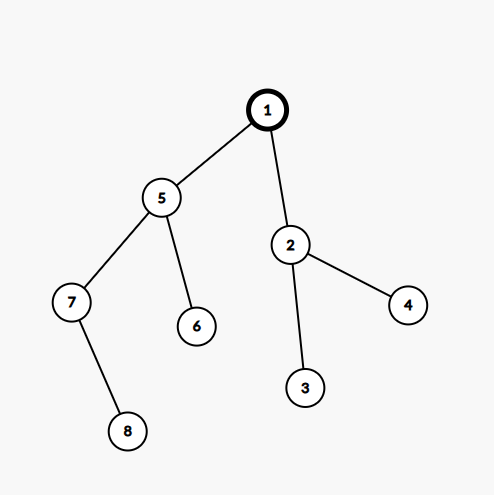

# Agenda

* Reviziuire solutii exercitii de antrenament
* Rezolvare Test 1 din culegerea cu variante


## Reviziuire solutii exercitii de antrenament

1.
    - Sursa: Bac 2012 August, Subiectul 2, exercitiul 4
    - Enunt: 
        - Se consideră două şiruri de caractere a, de lungime na şi b, de lungime nb. Şirul a este numit sufix al şirului b dacă na≤nb şi subşirul lui b determinat de ultimele sale  na caractere coincide cu a. În  secvenţa  de  instrucţiuni  de  mai  jos  variabila  i  este  de  tip  întreg,  iar  variabila  s memorează un şir cu cel mult 20 de caractere. Fără a utiliza alte variabile, scrieţi una sau mai multe instrucţiuni care pot înlocui punctele de suspensie astfel încât, în urma executării secvenţei obţinute, să se afişeze pe ecran, în ordinea  descrescătoare  a  lungimii,  separate  prin  câte  un  spaţiu,  toate  sufixele  şirului memorat în variabila s, ca în exemplu
        - 
            ```json
                Exemplu: pentru şirul elevi se afişează: elevi levi evi vi i 
                for(i=0;i<strlen(s);i++) 
                .................
            ```
    - Solutie:
        ```c++
            #include <iostream>
            #include <cstring>

            using namespace std;

            int main() {int i = 0; i < strlen(s);i++) {
                    cout << s+i << " ";
                }
                return 0;
            }
        ```

2. 
    - Sursa: Bac 2012 Iunie, Subiectul II, Exercitiul 1
    - Enunt:
        - Expresia `strlen("bine")` are valoarea:
    - Variante:
        * a. 1
        * b. 4 [`CORECT`]
        * c. 5
        * d. 6

3. 
    - Sursa: Bac 2013 August, Subiectul II, Exercitiul 5.
    - Enunt:
        - Se  consideră  un  text  cu  cel  mult  100  de  caractere  (litere  mici  ale  alfabetului  englez  şi spaţii),  în  care  cuvintele  sunt  separate  prin  unul  sau  mai  multe  spaţii.  Înaintea  primului cuvânt şi după  ultimul cuvânt nu există spaţiu. Scrieţi un program C/C++ care citeşte de la tastatură un text de tipul menţionat mai sus şi determină transformarea acestuia în memorie prin eliminarea unor spaţii, astfel încât între 
    oricare  două  cuvinte  alăturate  să  rămână  exact  un  spaţiu.  Programul  afişează  pe  ecran 
    textul obţinut.
    Exemplu:pentru textul 
        ```json
            "in  vacanta    plec la         mare"
            se obţine şi se afişează 
            "in vacanta plec la mare"

    - Solutie:
        ```c++
            #include <iostream>
            #include <cstring>

            using namespace std;

            int main() {
                // Aici initializam rezultat cu "" ca sa putem folosi direct strcat, sa concatenam
                // fiecare cuvant extras din textul initial
                char text[101], rezultat[101]="";
                cin.getline(text, 101);
                char *cuvant = strtok(text, " ");
                while (cuvant != NULL) {
                    strcat(rezultat, cuvant);
                    strcat(rezultat, " ");

                    cuvant = strtok(NULL, " ");
                }

                cout << rezultat;
                return 0;
            }

        ```

4.
    - Sursa: Bac 2014 iunie, Subiectul II, exercitiul 2
    - Enunt: 
        - Variabila `s` poate memora un sir cu maximum 20 de caractere. In urma executarii secventie de instructiuni alaturate se afiseaza:
        ```c++
            strcpy(s, "1b2d3")
            s[2] = 'a' + 2;
            strcpy(s, s+1);
            strcpy(s+3, s+4);
            cout << s; | printf("%s", s);
        ```
    - Variante:
        * a. 1b438
        * b. 1bcd8
        * c. ba2
        * d. bcd [`CORECT`] Atentie la ce anume se suprascrie si la pozitia de unde se copiaza, daca este in afara sau nu  a sirului.

5. 
    - Sursa: Bac 2014 august, Subiectul II, Exercitiul 4
    - Enunt:
        ```json
            Variabila  s  poate  memora  un  șir  cu  maximum  20  de  caractere,  iar  variabila  i  este  de  tip întreg. Scrieți ce se afișează în urma executării secvenței de instrucțiuni de mai jos.  
        ```
        ```c++
        strcpy(s,"BACALAUREAT"); 
        cout<<strlen(s);  |  printf("%d",strlen(s)); 
        i=0; 
        while (i<strlen(s)-1) 
        { if(strchr("EAIOU",s[i])!=NULL) strcpy(s+i+1,s+i+2); 
        i++; 
        } 
        cout<<s;  |  printf("%s",s);
        ```
    - Solutie:
        ```json
                -> i = 0 = consoana, merem mai departe
                -> i = 1 => vocala => S = BACALAUREAT si inlocuim de la pozitia i+1 adica 2 cu textul din s de la pozitia i+2 adica 3
                                      =>s = BAALAUREAT
                -> i = 2 = vocala => si inlocuim de la pozitia i+1 adica 3, cu textul din s de la pozitia i+2 adica 4
                                      => BAAAUREAT
                -> i = 3 => vocala => si inlocuim de la pozitia i+1 adica 4, cu textul din s de la pozitia i+2 adica 5
                ->                  => BAAAREAT
                -> i = 4 => consoana, mergem mai departe
                -> i = 5 => vocala => si inlocuim de la pozitia i+1 adica 6, cu textul din s de la pozitia i+2 adica 7
                              => BAAARET
                -> i = 6 -> ne oprim deoarece i < strlen(s)-1 devine falsa
                -> deci programul afiseaza 11BAAARET
            
        ```

## Rezolvare Test 1 din culegerea cu variante

### Subiectul I
1. 
    - Aici valoarea 1 inseamna ca expresia este adevarata daca si nu mai daca x `NU` apartine intervalului specificat si nu in alta situatie
    - Pentru punctul a, putem observa ca expresia este invalida deoarece nu exista un numar care sa fie mai mic sau egal cu 2020 si mai mare decat 2023 in acelasi timp, deci a este eliminat
    - Pentru punctul b, putem observa ca daca luam un numar din intervalul specificat, o sa obtinem adevarat lucru care elimina varianta `b`
    - Pentru punctul `c` observam ca pentru orice numar din afara intervalului specificat in enunt, vom obtine `1` deci punctul `c` este cel `corect`.
    - Doar de dragul exemplului, punctul `d` este invalid, exact din acelasi motiv specificat la punctul `a`. Nu se poate ca un numar sa fie mai mic decat 2020 SI mai mare decat 2023 in acelasi timp.
2. 
    ```json
        f(2022, 2024) =
            = 1011 + f(2023, 2024)
                = 1011 + f(2024, 2024)
                    = 1
                 = 1012
            = 2023
    ```
    - Raspuns corect `b`
3. 
    ```json
           0      1   2   3    4
        cires gutui mar par prun


        cires gutui mar par prun
        cires gutui mar prun par
        cires gutui par mar prun
        cires gutui par prun mar


        0 1 2 3 4
        0 1 2 4 3
        0 1 3 2 4
        0 1 3 4 2

        0 1 4 2 3 -> cires, gutui, prun, mar, par
    ```
    - Raspuns corect `c`
4. 
    ```json
        fii  [ 1 | 2 | 3 | 4 | 5 | 6 | 7 | 8]
        tati [ 0 | 1 | 2 | 2 | 1 | 5 | 5 | 7]

        Rezulta 1 este radacina si
        1-> Parinte pentru 2, 5
        2 -> Parinte pentru 3, 4
        5 -> Parinte pentru 6, 7
        7 -> Parinte pentru 8

        Dupa ce desenam graful, observam ca frunzele sunt 3,4,6 si 8.
    ```
    - 
    - Raspuns corect: `c`
5. 
    - Din matricea de adiacenta rezulta urmatoarele arce:
        ```json
                    - 1-3,
                    - 2-1, 2-3, 2-4
                    - 4-3, 4-5
                    - 5-2,5-3 
        ```
    - In total 8, raspun s corect: `a`

### Subiectul II
- 1.

    a.

        ```json
            n = 123454321
            123454321 > 9 adevarat
                S = 0
                123454321 != 0
                    s = 0 +1 = 1
                    n = 12345432
                12345432 != 0
                    s = 1 + 2 = 3
                    n = 1234543
                1234543 != 0
                    s = 3 + 3 = 6
                    n = 123454
                123454 != 0
                    s = 6 + 4 = 10
                    n = 12345
                12345 != 0
                    s = 10 + 5 = 15
                    n = 1234
                1234 != 0
                    s = 15 + 4 = 19
                    n = 123
                123 != 0
                    s = 19 + 3 = 22
                    n = 12
                12 != 0
                    s = 22 + 2 = 24
                    n = 1
                1 != 0
                    s = 24 + 1 = 25
                    n = 0
                0 != 0 fals! si iesim din while-ul interior
                n = 25
                25 > 9
                intram din nou in while-ul interior
                25 != 0
                    s = 0 + 5 = 5
                    n = 2
                2 != 0
                    s = 5 + 2 = 7
                    n = 0
                0 != 0 fals si iesim din while-ul interior
                n = 7
                7 > 9 fals si sarim la ultima instructiune care afiseaza n adica 7
        ```
    !!! Atentie: algoritmul de mai sus calculeaza ceea ce se numeste cifra de control a unui numar, adica se calculeaza suma cifrelor numarului, dupa care suma cifrelor sumei s.a.m.d pana cand se obtine un numar format dintr-o singura cifra

    b. 
        ```json
        - Aici efectiv incepem sa dam valori si incepem cu cel mai mic care este destul de simplu:
            cel mai mic: 10004
            cel mai mare: 
                - Incepe cu cel mai mare posibil si avem 99999
                    Aici cifra de control este => 45 => 9
                - Acum haide sa  scadem 4 din numar si obtinem => 99995
                    Unde cifra de control => 41 => 5
        ```
        - Raspuns corect: 10004 si 99995
    
    c. 
        ```c++
            #include <iostream>

            using namespace std;
            int main() {
            
                int n;
                cin >> n;
                while (n > 9) {
                    int s = 0;
                    while (n != 0) {
                        s = s + n % 10;
                        n = n / 10;
                    }
                    n = s;
                }
                cout << n;
                return 0;
            }
        ```
    
    d. Haide sa inlocuim a doua structura repetitiva cu instructiunea executa ... cat timp (do- while)

    ```json
        citeste n
        (numar natural nenul de cel mult 9 cifre)
        cat timp n > 9
            s <- 0
            daca n != 0 atunci
            executa
                s <- s + n % 10
                n <- [n/10]
            cat timp n != 0
            n <- s
        scrie n

    ```

2. 
    - Mai jos vedeti matricea obtinuta si cum evolueaza valoarea lui x
        ```json
               0  1  2  3
            0  1  1  1  1
            1  2  6  2  2
            2  3  3  11 3
            3  4  4  4 16


            i = 0
            j = 0
                -> x = 2
            i = 0
            j = 1
                -> x = 3
            i = 0
            j = 2
                -> x = 4

            i = 0
            j = 3
                -> x = 5

            i = 1
            j = 0
                -> x = 6

            i = 1            0  1  1  1  1
            1  2  6  2  2
            2  3  3  11 3
            3  4  4  4 16


            i = 0
            j = 0
                -> x = 2
            i = 0
            j = 1
                -> x = 3
            i = 0
            j = 2
                -> x = 4

            i = 0
            j = 3
                -> x = 5

            i = 1
            j = 0
                -> x = 6

            i = 1
            j = 1
                -> x = 7

            i = 1
            j = 2
                -> x = 8
            i = 1
            j = 3
                -> x = 9

            i = 2
            j = 0
                -> x = 10

            i = 26
                -> x = 12 
            i = 21  1  1  1
                -> x = 14
            i = 3
            j = 1 
                -> x = 15

            i = 3
            j = 2
                -> x = 16

            i = 3
            j = 3
                -> x = 17
                -> x = 9

            i = 2
            j = 0
                -> x = 10

            i = 2
            j = 1
                -> x = 11

            i = 2
            j = 2            0  1  1  1  1
            1  2  6  2  2
            2  3  3  11 3
            3  4  4  4 16


            i = 0
            j = 0
                -> x = 2
            i = 0
            j = 1
                -> x = 64

            i = 0
            j = 31  1  1  1
                -> x = 6

            i = 1
            j = 1
                -> x = 7

            i = 1
            j = 2
                -> x = 8
            i = 1
            j = 3
                -> x = 9

            i = 2
            j = 0
                -> x =6
            j = 1
                -> x = 11

            i = 2
            j = 2
                -> x = 12 
            i = 2
            j = 3
                -> x = 13

            i = 3
            j = 0
                -> x = 14
            i = 3
            j = 1 
                -> x = 15

            i = 3
            j = 2
                -> x = 16

            i = 3
            j = 3
                -> x = 17
                -> x = 13

            i = 3
            j = 06
                -> x = 16

            i = 3
            j = 3
                -> x = 17
        ``` 
    - In concluzie, a[3][3] = 16 si suma elementelor de pe prima linie a tabloului este: 4


3. 
    ```c++
        float med = (x.nota1 + x.nota2) / 2.0
    ```

### Subiectul III

1. 
    ```c++
        int calcul(int n) {
            int suma = 0;
            for (int i = 2; i < n; i++) {
                if (n % i == 0) {
                    int estePrim = 1;
                    for (int j = 2; j < i / 2; j++) {
                        if (i % j == 0) {
                            estePrim = 0;
                            break;
                        }
                    }
                    if (estePrim == 1) {
                        suma += i;
                    }
                }
            }
            return suma;
        }
    ```

2. 
    ```c++
        #include <iostream>
        #include <string.h>

        using namespace std;

        int esteVocala(char ch);

        int main() {
            char text[31], rezultat[31];
            cin >> text;
            int indexRezultat = 0;
            for (int i = 0; i < strlen(text); i++) {
                if (esteVocala(text[i])) {
                    rezultat[indexRezultat++] = text[i];
                }
            }
            // Trebuie sa marcam sfarsitul sirului de caractere in care vom tine rezultatul
            // Altfel ne vom trezi cu caractere intamplatoare
            rezultat[indexRezultat] = '\0';

            cout << rezultat;
            return 0;
        }

        int esteVocala(char ch) {
            return strchr("aeiou", ch) != NULL;
        }
    ```
    * Atentie foarte mare la enunt! Se cere sa se construiasca in memorie, deci e clar ca avem nevoie sa salvam undeva in memorie rezultatul pe care il construim. De aceea mai declaram inca un array.

3. 
 - a. Algoritmul este eficient din punct de vedere al timpului de executie deoarece efectuam o singura parcurgere a fisierului. In acelasi timp, algoritmul este eficient din punct de vedere al memoriei deoarece in orice moment al executiei, din toate cele 1000 de numere posibile in fisier, noi o sa tinem in memorie doar 2 (in cele 2 variabile numarCurent si numarAnterior)
 - b.
    ```c++
        #include <iostream>
        #include <fstream>

        using namespace std;


        int main() {

            ifstream fin("bac.in");
            ofstream fout("bac.out");

            int numarCurent, numarAnterior;
            int numarAparitii = 1;
            fin >> numarCurent;
            numarAnterior = numarCurent;
            while (fin >> numarCurent) {
                if (numarCurent == numarAnterior) {
                    numarAparitii++;
                } else {
                    fout << numarAnterior << " " << numarAparitii << endl;
                    numarAnterior = numarCurent;
                    numarAparitii = 1;
                }
            }

            // Avem nevoie de a afisa si dupa ce iesim din while deoarece am ajuns la finalul fisierului
            fout << numarAnterior << " " << numarAparitii << endl;

            fin.close();
            fout.close();
            return 0;
        }
    ```
    - IMPORTANT:
        - La bac, cand vezi cerinte de genul eficient din punct de vedere al timpului de executie, 99% inseamna sa parcurgi fisierul o singura data (zic 99% pentru ca efectiv nu am vazut o varianta care sa nu ceara acest lucru)
        - Si cand vezi cerinta de genul eficient din punct de vedere al memoriei, se refera la faptul ca tu  sa nu declari si alte variabile in care sa stochezi cumva toate numerele.
