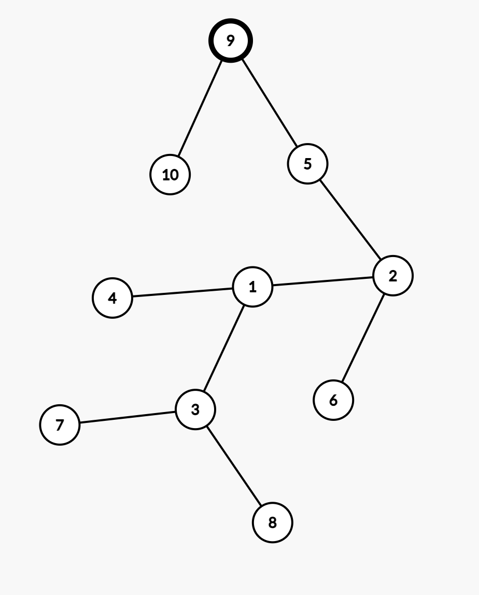

# Rezolvare test 2 si 3 din cartea de bacalaureat


## Test #2

### Subiectul I
1. 
    - Aici incercam sa vedem care expresie se potriveste cerintei noastre:
        - a. nu este ok deoarece putem obtine 1 si pt numere care nu sunt divizibile cu 5 (ex x = -1 si y = 6);
        - b. Aici pare ca obtinem un rezultat adevarat doar pentru  numere divizibile cu 5, deci b este raspunsul insa haideti sa vedem si celalalte
        - c. Aici, putem obtine 1 si pentru numere care nu sunt divizibile cu 5 (ex x = 1 si y = 9)
        - d. Aici putem obtine 1 pentru x = 3 si y=10, deci contrar cerintei noastre.
    - Raspuns corect: `b`
2. - Rezolvare:
    ```json
        f(2023) = 
                = 1 + f(505) =
                    = 1 + f(126)
                        = 1 + f(31)
                            = 1 + f (7)
                                = 0
                            = 1
                        = 2
                    = 3
                = 4 
    ```
    - Raspuns corect `d`
3. 
    - Rezolvare:
        ```json
            Numerele generate sunt
                1 2 3 4 5
                1 2 3 4 6
                1 2 3 4 7
                1 2 3 4 8
                1 2 3 4 9
                1 2 3 5 6
                1 2 3 5 7
                1 2 3 5 8
                1 2 3 5 9
                1 2 4 5 6
                1 2 4 5 7
                1 2 4 5 8
                1 2 4 5 9
                1 2 5 6 7
                1 2 5 6 8
                1 2 5 6 9
                1 2 5 7 8
                1 2 5 7 9
                1 2 5 8 9
                1 2 6 7 8
                1 2 6 7 9
                1 2 6 8 9
                1 2 7 8 9
                1 3 4 5 6
                1 3 4 5 7
                1 3 4 5 8
                1 3 4 5 9
                1 3 4 6 7
                1 3 4 6 8
                1 3 4 6 9
                1 3 4 7 8
                1 3 4 7 9
                1 3 5 6 7
                1 3 5 6 8
                1 3 5 6 9
                1 3 6 7 8
                1 3 6 7 9
                1 3 6 8 9
                1 4 5 6 7
                1 4 5 6 8
                1 4 5 6 9
                1 4 5 7 8
                1 4 5 7 9
                1 4 6 7 8
                1 4 6 7 9
                1 4 6 8 9
                1 4 7 8 9
                1 5 6 7 8
                1 5 6 7 9
                1 5 7 8 9
                1 6 7 8 9
                2 3 4 5 6
        ```
        - Raspuns corect: `b`
4. Rezolvare:
    -  Poza graf initial 
    - Poza dupa eliminare (muchie 1,7) si adaugare muchie (1,6): 
    - Inainte de a explica solutia hai sa vedem fiecare ce inseamna:
        - `Graf eulerian`: Se numește graf eulerian un graf care conține un ciclu eulerian. Se numește ciclu eulerian un ciclu care conține toate muchiile grafului.
        - `Graf hamiltonian`: Se numește graf hamiltonian un graf care conține un ciclu hamiltonian. Se numește ciclu hamiltonian un ciclu elementar care conține toate vârfurile grafului.
        - `Graf aciclic`: Un graf neorientat care nu conține niciun ciclu se numește aciclic. Se numește `ciclu` un lanț simplu în care primul vârf este identic cu ultimul
        - `Graf conex`: Un graf neorientat se numește graf conex dacă pentru oricare două vârfuri x și y diferite ale sale, există cel puțin un lanț care le leagă, adică x este extremitatea inițială și y este extremitatea finală.
    - Dupa cum putem observa, graf-ul dat este doar un grad conex, acum hai sa vedem de ce nu sunt bune celelalte variante:
        - Un graf G = (X,U), fără vârfuri izolate, este eulerian dacă şi numai dacă este conex şigradele tuturor vârfurilor sale sunt numere pare. Noi avem doua noduri cu grad impar (7 si 6)
        - De asemenea, graful nu este hamiltonian pentru ca nu avem un circuit care sa treaca prin toate node-urile fara sa repete unul dintre nod-uri
        - Graful nu este aciclic deoarece avem cel putin un ciclu: 7 -> 6 -> 5 -> 4 -> 3 -> 2 -> 1 -> 6 -> 7 
    - In concluzie, raspuns corect: `d`

5. - Rezolvare:
    - Dacă într-un arbore binar numărul nodurilor terminale este a, iar c este numărul nodurilor care au exact 2 fii, atunci a = c + 1.
    - In concluzie, raspuns corect: `2023` adica `d`
    - Nota: poti reviziui mai multe teoreme si proprietati ale arborilor binari aici: https://www.pbinfo.ro/articole/25641/arbori-binari#intlink-1
### Subiectul II
1. - Rezolvare:
    - a.
    ```json
        x = 2378, y = 503
        n = 0, p = 1
            8 > 3
                z = 8
            n = 0 + 8 * 1 = 8
            p = 10
            x = 237
            y = 50
        237 != 0 && 50 != 0
            7 > 0
                z = 7
            n = 8 + 7 * 10 = 78

            p = 100
            x = 23
            y = 5
        23 != 0 && 5 != 0
            3 < 5
                z = 5
            n = 78 + 5 * 100 = 578
            p = 1000
            x = 2
            y = 0
        2 != 0 && 0 != 0 FALS
        afiseaza n => 578
    ```
        - Algoritmul afiseaza cifra cea mai mare, dintre cele doua numere, mergand de la dreapta la stanga, cat timp sunt cifre de parcurs in ambele numere.  Adica, o sa comparam ultima cifra din x cu ultima cifra din y, o alegem pe cea mai mare, mergem si comparam penultima cifra din x cu penultima cifra din y, si alegem pe cea mai mare, etc.
    - b `223` si `10`
    - c
        ```c++
            #include <iostream>

            using namespace std;

            int main()
            {
                int x, y;
                cin >> x >> y;
                int n = 0, p = 1;
                do {
                    int z;
                    if (x % 10 > y % 10) {
                        z = x % 10;
                    } else {
                        z = y % 10;
                    }
                    n = n + z * p;
                    p = p * 10;
                    x = x / 10;
                    y = y / 10;
                } while (x != 0 && y != 0);

                cout << n;

                return 0;
            }

        ```
    - d
        ```json
            citeste x,y;
            n <- 0; p <- 1;
            repeta
                daca(x%10 > y%10)
                    atunci z <- x%10;
                altfel
                    z <- y % 10;
                n <-  n + z*p;
                p <- p * 10;
                x <-  [x/10];
                y <- [y/10]
           pana cand  (x == 0 sau y == 0);
            
            scrie n
        ```

2. 
    ```json
        c = "examen"
        i = 0
            c[0] = c[1] // c = xxamen
        i = 1
            c[1] = c[2] // c = xaamen
        i = 2
            c[2] = c[3] // c = xammen

    ```

3. 
- Rezolvare 
    ```json
        - Stiva functioneaza pe principiul ultimul venit, primul servit. 
        - Coada functioneaza pe principiul primul venit, primul servit
        - Stiva va contine: 
            2023 - varf
            2022 - pozitia 2
            2021 - pozitia 3
        - Coada va contine: 
            2026 - primul element
            2025 - al doilea element
            2024 - al treilea element
        - Dupa ce se extrag toate elementele din coada, si se pun in stiva, elementul din varful stivei va fi ultimul element din  coada, adica 2024
    ```
### Subiectul III

1. Rezolvare:
    ```c++
        int suma(int v[], int n) {
            int rezultat = 0;
            for (int i = 0; i < n; i++) {
                if (v[i] % 2022 == 0 || v[i] % 2022 == 1 || v[i] % 2022 == 2) {
                    rezultat += v[i];
                }
            }

            return rezultat;
        }
            ```
2. Rezolvare
    - Nota: cautarea binara presupune ca setul de date in care cautam sa fie  sortat crescator.
    - Ideea simplificata este ca mereu ne raportam la elementul ce se afla in mijlocul sirului.
        - Daca valoarea cautata este mai mare decat mijlocul sirului, o sa continuam sa impartim in doua partea din stanga a sirului unde vom compara din nou cu mijlocul acesteia, etc
        - Daca valoarea cautata este mai mica decat mijlocul sirului, o sa continuam sa impartim in doua partea din dreapta a sirului unde vom compara din nou cu mijlocul acestia, etc
        - Daca valoarea cautata este egala cu mijlocul, am gasit ce cautam.
    ```c++
        #include <iostream>

        using namespace std;

        int suma(int v[], int n);

        int main()
        {
            int n = 4, x = 20;
            int clase[4] = {16, 18, 20, 23};
            int stanga = 0, dreapta = n -1;
            int pozitie = -1; // initializam cu -1 pozitia unde gasim  numarul de carti potrivite pentru clasa ceruta.
            while (stanga <= dreapta) {
                int mijloc = (stanga + dreapta) / 2;
                if ( x <  clase[mijloc]) {
                    dreapta = mijloc - 1;
                } else if (x > clase[mijloc]) {
                    stanga= mijloc + 1;
                } else {
                    pozitie = mijloc;
                    break;
                }
            }

            if (pozitie == -1) {
                cout << "NU";
            } else {
                cout << "DA";
            }
            return 0;
        }
    ```
3. Rezolvare:
    - a:
        - Cautam puterile lui 3 care pana cand obtinem o putere mai mica sau egala cu 3.
        - Daca puterea gasita este mai mare sau egala cu x, atunci o afisam, altfel afisam 0.
        - Programul este eficient din puncte de vedere al timpului de executie deoarece parcurgem o singura data fisierul. In acelasi timp, programul este eficient din punct de vedere al memoriei utilizate deoarece tinem in memorie, doar capetele intervalului, cate 2 pe rand.
    - b:
        ```c++
            #include <iostream>
            #include <fstream>

            using namespace std;

            int main()
            {
                ifstream fin("bac.txt");
                int x, y;
                while (fin >> x && fin >> y) {
                    int putere = 1;
                    while (putere * 3 <= y) {
                        putere = putere * 3;
                    }
                    if (putere >= x) {
                        cout << putere << " ";
                    } else {
                        cout << 0 << " ";
                    }
                }

                return 0;
            }
        ```

## Test #3


### Subiectul I
1. Rezolvare:
    ```json
        x = 4
        y = 0
            x = 3
            y = 0 + 9
            x = 2
            y = 9+4 = 13
            x = 1
            y = 13 +1 = 14
            x = 0
            y = 14
    ```
    - Raspuns corect: `b`
2. Rezolvare:
    ```json
        x = 4
        4 != 0
            4 % 2 = 0
                afisam 2 * 4 => 8
            x = 7
        7 != 0
            7 % 2 != 0
                afisam x => 7
            x = 11
        11 != 0
            11 % 2 != 0
                afisam x => 11
            x = 6
        6 != 0
            6 % 2 == 0
                afisam 2 * x => 2 * 6 => 12
            x = 24
        24 != 0
            24 % 2 == 0
                afisam 2 * x => 2 * 24 = 48
            x = 0
        iesim din while
    ```
    - Raspuns corect: `8 7 11 12 48` adica `a`

3. Rezolvare:
    ```json
        4 la puterea 5
    ```
    - Raspuns corect: `c`

4. Rezolvare:
    ```json
        - Se observa din start ca varianta corecta este b deoarece celalalte sunt gresite din punct de vedere sintactic.
    ```
5. Rezolvare:
    ```json
        Conform enuntului avem graful din poa de mai jos:
    ```
    
    ```json
    Putem observa ca graful nu este nici eulerian, nici hamiltonian deoarece nu poti sa obtii un ciclu in care sa nu se repete unul dintre noduri (conditia pentru graf sa fie hamiltonian) si nodurile nu au toate grad par (cerinte pentru a fi graf eulerian)
    De asemenea observam ca graful nu este complet (adica nu se respecta conditia care cere ca oricare doua varfuri distincte sa fie adiacente, pentru a fi complet). Prin urmare, raspunsul corect este ca graful alaturat este conex
    ```
    - Raspuns corect: `d`
### Subiectul II
1. 
    - a. 
        ```json
            n = 144
            k = 1
            d = 2
            144 != 1
                p = 0
                144 % 2 == 0
                    p =p + 1 = 1
                    n = n/2 = 72
                72 % 2 == 0
                    p = 1 + 1 = 2
                    n = n / 2 = 36
                36 % 2 == 0
                    p = 1 + 2 = 3
                    n = n / 2 = 18
                18 % 2 == 0
                    p = 3 + 1 = 4
                    n = n / 2 = 9
                9 % 2 != 0

                4 % 2 != 1

                d = 3
            9 != 1
                p = 0
                9 % 3 == 0
                    p = 1
                    n = 9 / 3 = 3
                3 % 3 == 0
                    p = 2
                    n = 3 / 3 = 1
                2 % 2  != 1
                d = 4
            1 == 1

            Afisam k => afisam 1
        ```
    - b.
        ```json
            Daca ne uitam la program, pentru 144, mai sus am obtinut 1 deoarece am avut un numar par de impartiri la 2, ca sa obtinem un numar impar, putem sa alegem dublul numarului 144, adica 288.
        ```
    - c. 
        ```c++
            #include <iostream>
            #include <fstream>

            using namespace std;

            int main()
            {
                int n, k = 1, d = 2;
                cin >> n;
                while (n != 1) {
                    int p =0;
                    while ( n % d == 0) {
                        p = p + 1;
                        n = n / d;
                    }

                    if (p % 2 == 1) {
                        k = 0;
                    }
                    d =d + 1;
                }

                cout << k;

                return 0;
            }
        ```
    - d.
        - Inlocuim structura `cat timp` cu `executa.. cat timp.`
        ```json
            citeste n
            k < -1; d <- 2;
            daca n !=1 atunci
            executa
                p <- 0
                cat timp (n % d = 0)
                    p <- p+1; n <-  n/d
                daca (p % 2 = 1) 
                    k <- 0
                d <- d+1;
            cat timp (n != 1)
            scrie k;
        ```

2. 
    - Rezolvare
    ```json
        Daca marcam nodul cu numarul 9 ca fiind radacina, obtinem arborele binar de mai jos:
    ```
    - Raspuns corect: `Nodul 9`
    
3. Rezolvare:
    ```json
        i = 1
            j = 2
                k = 3
                    (k * k == (i * i) + (j*j)) false
                k = 4
                    (k * k == (i * i) + (j*j)) false
                k = 5
                    (k * k == (i * i) + (j*j)) false
                k = 6
                    (k * k == (i * i) + (j*j)) false
                k = 7
                    (k * k == (i * i) + (j*j)) false
            j = 3
                k = 4
                    (k * k == (i * i) + (j*j)) false
                k = 5
                    (k * k == (i * i) + (j*j)) false
                k = 6
                    (k * k == (i * i) + (j*j)) false
                k = 7
                    (k * k == (i * i) + (j*j)) false
            j = 4
                k = 5
                    (k * k == (i * i) + (j*j)) false
                k = 6
                    (k * k == (i * i) + (j*j)) false
                k = 7
                    (k * k == (i * i) + (j*j)) false
            j = 5
                k = 6
                    (k * k == (i * i) + (j*j)) false
                k = 7
                    (k * k == (i * i) + (j*j)) false
            j = 6
                k = 7
                    (k * k == (i * i) + (j*j)) false
        i = 2
            j = 3
                k = 4
                    (k * k == (i * i) + (j*j)) false
                k = 5
                    (k * k == (i * i) + (j*j)) false
                k = 6
                    (k * k == (i * i) + (j*j)) false
                k = 7
                    (k * k == (i * i) + (j*j)) false
            j = 4
                k = 5
                    (k * k == (i * i) + (j*j)) false
                k = 6
                    (k * k == (i * i) + (j*j)) false
                k = 7
                    (k * k == (i * i) + (j*j)) false
            j = 5
                k = 6
                    (k * k == (i * i) + (j*j)) false
                k = 7
                    (k * k == (i * i) + (j*j)) false
            j = 6
                k = 7
                    (k * k == (i * i) + (j*j)) false
        i = 3
            j = 4
                k = 5
                    (k * k == (i * i) + (j*j)) adevarat
                        345
                k = 6
                    (k * k == (i * i) + (j*j)) false
                k = 7
                    (k * k == (i * i) + (j*j)) false
            j = 5
                k = 6
                    (k * k == (i * i) + (j*j)) false
                k = 7
                    (k * k == (i * i) + (j*j)) false
            j = 6
                k = 7
                    (k * k == (i * i) + (j*j)) false
        i = 4
            j = 5
                k = 6
                    (k * k == (i * i) + (j*j)) false
                k = 7
                    (k * k == (i * i) + (j*j)) false
            j = 6
                k = 7
                    (k * k == (i * i) + (j*j)) false
        i = 5
            j = 6
                k = 7
                    (k * k == (i * i) + (j*j)) false
    ```
    - Raspuns corect: 345
        - Aici este vorba si despre o teorema, numerele pitagoreice. Vezi mai multe aici: https://ro.wikipedia.org/wiki/Triplet_pitagoreic 
### Subiectul III

1. Rezolvare:
    ```c++
        #include <iostream>
        #include <cmath>

        using namespace std;
        void perfect(int x[], int n);

        int main()
        {
            int n = 7;
            int x[] = {3, 9, 12, 25, 30, 45, 121};
            perfect(x, n);

            return 0;
        }

        void perfect(int x[], int n) {
            for (int i = 0; i < n; i++) {
                int radical = sqrt(x[i]);
                if (radical * radical == x[i]) {
                    cout << x[i] << " ";
                }
            }
        }
    ```
2. 
    - Pentru rezolvarea acestui exercitiu, doar de dragul de a mai exersa functiile din libraria cstring (string.h) o sa avem mai multe solutii:
    - 1.
        ```c++
            #include <iostream>

            using namespace std;
            int esteVocala(char ch);

            int main() {
                char s[31], rezultat[31];
                cin >> s;
                int pozitieVocala1 = -1;
                int pozitieVocala2 = -1;
                for (int i =0; i < strlen(s); i++) {
                    if (esteVocala(s[i])) {
                        if (pozitieVocala1 == -1) {
                            pozitieVocala1 = i;
                        } else {
                            pozitieVocala2 = i;
                        }
                    }
                }

                strcpy(rezultat, s);
                // Aici suprascriem in rezultat, incepand cu pozitia primei vocale
                strcpy(rezultat + pozitieVocala1, s+pozitieVocala1+1);
                // Aici procedam la fel doar ca ne mutam cu un caracter mai in spate deoarece deja am sters prima vocala
                strcpy(rezultat + pozitieVocala2-1, s+pozitieVocala2);

                cout << rezultat;
                return 0;
            }

            int esteVocala(char ch) {
                if (strchr("aeiou", ch) != NULL) {
                    return 1;
                } else {
                    return 0;
                }
            }

        ```
    2. 
        ```c++
            #include <iostream>

            using namespace std;
            int esteVocala(char ch);

            // In varianta asta, aflam pozitiile celor 2 vocale si evitam sa copiem din s in rezultat atunci cand ne aflam in dreptul lor.
            int main() {
                char s[31], rezultat[31];
                cin >> s;
                int pozitieVocala1 = -1;
                int pozitieVocala2 = -1;
                for (int i =0; i < strlen(s); i++) {
                    if (esteVocala(s[i])) {
                        if (pozitieVocala1 == -1) {
                            pozitieVocala1 = i;
                        } else {
                            pozitieVocala2 = i;
                        }
                    }
                }

                int indexRezultat = 0;
                for (int i = 0; i < strlen(s); i++) {
                    if (i != pozitieVocala1 && i != pozitieVocala2) {
                        rezultat[indexRezultat++] = s[i];
                    }
                }
                rezultat[indexRezultat] = '\0';

                cout << rezultat;
                return 0;
            }

            int esteVocala(char ch) {
                if (strchr("aeiou", ch) != NULL) {
                    return 1;
                } else {
                    return 0;
                }
            }

        ```
    - 3.
        ```c++
            #include <iostream>

            using namespace std;
            int esteVocala(char ch);

            int main() {
                char s[31], rezultat[31];
                cin >> s;
                int pozitieVocala = -1;
                // copiem tot ce avem in s
                strcpy(rezultat, s);
                for (int i =0; i < strlen(s); i++) {
                    if (esteVocala(s[i])) {
                        pozitieVocala = i;
                        break;
                    }
                }
                // suprascriem in rezultat, incepand cu pozitia vocalei
                strcpy(rezultat+pozitieVocala, s+pozitieVocala+1);

                // Cautam ultima vocala, pornind de la capatul sirului
                for (int i =strlen(s)-1; i >= 0; i--) {
                    if (esteVocala(s[i])) {
                        pozitieVocala = i;
                        break;
                    }
                }
                // DIn nou, tinem cont de faptul ca deja am sters o vocala, deci trebuie sa ajustam index-ul de unde stergem
                strcpy(rezultat+pozitieVocala-1, s+pozitieVocala+1);

                cout << rezultat;
                return 0;
            }

            int esteVocala(char ch) {
                if (strchr("aeiou", ch) != NULL) {
                    return 1;
                } else {
                    return 0;
                }
            }

        ```

3. Rezolvare:
    - a.
        ```json
            Din punct de vedere al timpului de executie, programul nostru este eficient deoarece citim o singura data fisierul.
            In timp ce citim din fisier, stocam intr-un vector numerele si totdata, tinem cont de care este numarul curent si numarul anterior citit.
                - Daca numarul curent este mai mare decat numarul citit, atunci incrementam contorul care va tine lungimea secventei curente.
                - Daca numarul curent nu este strict mai mare, atunci am ajuns la sfarsitul unei secvente si inceputul alteia. Acum trebuie sa comparam sa vedem daca lungimea secventei curente este mai mare decat lungimea maxima, daca da, atunci actualizam valoarea contorului care tine lungimea secventei maxime, si mai tinem minte si unde se sfarseste secventa ce are lungimea maxima.
                - Stiind cat este lungimea maxima si unde se sfarseste secventa, putem afla de unde incepe si pana unde tine secventa cu lungime maxima.
                - Scriem in fisier cu parametrul ios::app, parametru care ne permite sa adaugam in fisier, nu sa suprascriem.
        ```
    - b. 
        ```c++
            #include <iostream>
            #include <fstream>


            using namespace std;

            int main() {
                ifstream fin("date.txt");
                ofstream fout("date.txt", ios::app);
                int secventa[10000] = {0};
                int lungimeCurenta, lungimeMaxima, indexSfarsitSecventa = 0;
                int numarCurent, numarAnterior, indexSecventa = 0;
                fin >> numarCurent;
                numarAnterior = numarCurent;
                secventa[indexSecventa] = numarAnterior;
                indexSecventa += 1;
                while (fin >> numarCurent) {
                    secventa[indexSecventa] = numarCurent;
                    if (numarCurent > numarAnterior) {
                        lungimeCurenta++;
                    } else if (lungimeCurenta > lungimeMaxima) {
                        indexSfarsitSecventa = indexSecventa-1;
                        lungimeMaxima = lungimeCurenta;
                        lungimeCurenta = 1;
                    }
                    indexSecventa++;
                    numarAnterior = numarCurent;
                }


                int indexInceputSecventa = indexSfarsitSecventa - lungimeMaxima+1;
                fout << endl;
                for (int i = indexInceputSecventa; i <= indexSfarsitSecventa; i++) {
                    fout <<  secventa[i] << " ";
                }

                fin.close();
                fout.close();
                return 0;
            }
        ```
