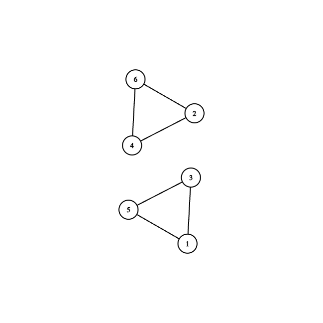

# Rezolvare test 4

## Subiectul I
1. 
    - Aici operatorii au precedenta obisnuita, adica ma intai se face inmultirea si impartirea, urmata de modulo si de operatorul de scadere
    - Rezolvare: `2022` ->  [Atentie la faptul ca se trunchiaza rezultatul]  adica `b`
2. 
    ```json
        testare(4048) =
            x = 4048 => 2 * testare(2024)
                x = 2024 => 2 * testare(1012)
                    x = 1012 => 506
                = 2 * 506 = 1012
            = 2 * 1012 = 2024
    ```
    - Raspuns corect: `c`
3. - Rezolvare:
    * Stim ca avem generate cuvinte din 6 litere, dintr-o multime de 8, si conform cerintei, suntem interesati doar de cuvintele care se termina in a
    * Folosind formula combinarilor, in total o sa avem combinari de 8 luate cate 6, adica 28 de cuvinte.
    * Si stiind ca putem folosi doar 7 litere din cele 8, deoarece blocam `a` pe ultima pozitie, inseamna ca putem obtine 21 de cuvinte (combinari de 7 luate cate 5)
    * In concluzie, avem 28 - 21 = 7 cuvinte care se termina in `a`.

    - Raspuns corect: `a`
    - Nota in carte este gresit deoarece autorul uita sa ia in calcul si litera `l`... i-a fost foame:D
4. - Rezolvare:
    - Precum in majoritatea cazurilor in care avem exercitii cu structuri, eliminam din start pe cele invalide din punct de vedere al sintaxei
        - Deci `c` si `d` sunt din prima eliminate
    - Ca sa mergem mai departe, trebuie sa ne amintim formula de adunare a doua fractii, unde, ele trebuie sa aibe acelasi numitor.
    - In concluzie, solutia este `a`.
5. - Rezolvare:
    - Conform cerintei obtinem graful:
         
    - Si avem asa:
        - Varful 1: are gradul 2
        - Varful 2: are gradul 2
        - Varful 3: are gradul 2
        - Varful 4: are gradul 2
        - Varful 5: are gradul 2
        - Varful 6 are gradul 2
    - Rezulta ca suma = 12. `b`
## Subiectul II
1. 
    - a:  
    ```json
        n = 3
        k = 9
        i = 1
            x = 90
            c = 9
            c < k false
        i = 2
            x = 765
            c = 6
            c < k true
                k = c = 6
        i = 3
            x = 747
            c = 4
            c < k true
                k = c = 4
        afiseaza 4
    ```
    - b
        - Programul afiseaza cea mai mica cifra de pe pozitia zecilor
        - Exemplu de secventa dupa ce citim n = 5: 191 192 193 194 195
    - c
        ```c++
            #include <iostream>

            using namespace std;

            int main()
            {
                int n;
                cin >> n;
                int k = 9;
                for (int i = 1; i <= n; i++) {
                    int x;
                    cin >> x;
                    int c = x /10 % 10;

                    if (c < k) {
                        k = c;
                    }
                }

                cout << k;

                return 0;
            }
        ```
    - d
        ```json
            citeste n (numar natural nenul)
            k <- 9
            i <- 1
            cat timp i <= n executa
                citeste x (numar natural)
                c <- [x/10]% 10
                daca (c < k) atunci k <- c 
            scrie k
        ```
2. Folosind teorema care spune ca: `Teoremă: Într-un graf orientat, suma gradelor exterioare a tuturor nodurilor este egală cu suma gradelor interioare a tuturor nodurilor ` [https://www.pbinfo.ro/articole/509/grafuri-orientate#intlink-3]
    * Deci raspunsul este 1011

3. Prin interclasare in ordine crescatoare se refera la sortare in ordine crescatoare:
    `3, 4, 6, 9, 10, 14, 18, 20, 45, 72, `

## Subiectul III
1. 
    ```c++
        #include <iostream>

        using namespace std;

        int ordonare(int &n);

        int main()
        {
            int n = 30356974;
            ordonare(n);
            cout << n;

            return 0;
        }

        int ordonare(int &n) {
            int rezultat = 0;
            int p = 1;
            while (n > 0) {
                int ultimaCifra = n % 10;
                int penultimaCifra;
                n = n / 10;
                // Verificam daca n > 0, adica daca putem sa extragem si urmatoarea cifra
                if (n > 0) {
                    penultimaCifra = n % 10;
                    // Verificam daca atat ultima cat si penultima cifra sunt impare  sunt in ordine descrescatoare
                    // Adica penultima sa fie mai mare decat ultima
                    if (ultimaCifra % 2 == 1 && penultimaCifra % 2 == 1 && penultimaCifra > ultimaCifra) {
                        // Punem mai intai penultima cifra deoarece este mai mare
                        rezultat = penultimaCifra * p + rezultat;
                        p = p * 10;
                        rezultat = ultimaCifra * p + rezultat;
                        p = p * 10;
                        n = n/10;
                    } else {
                        rezultat = ultimaCifra * p + rezultat;
                        p = p * 10;
                    }
                } else {
                    // Tratam si cazul in care am ajuns la ultima cifra
                    rezultat = ultimaCifra * p + rezultat;
                    p = p * 10;
                }
            }
            n = rezultat;
        }
    ```
2. Rezolvare:   
    ```c++
            #include <iostream>
            #include <fstream>

            using namespace std;


            int main()
            {
                ifstream fin("date.in");
                ofstream fout("date.in",  ios::app);

                int n;
                fin >> n;
                int matrice[n][n];
                for (int i = 0; i < n; i++) {
                    for (int j = 0; j < n; j++) {
                        fin >> matrice[i][j];
                    }
                }
                fout << endl << endl;

                for (int i = 0; i <n; i++) {
                    for (int j = 0; j < n; j++) {
                        if (i+j != n-1) { // formula ca un element sa se afle pe diagonala secundara.
                            // Practic scriem toate elementele mai putin cele de pe diagonala secundara
                            fout << matrice[i][j] << " ";
                        }
                    }
                    fout << endl;
                }
                fin.close();
                fout.close();
                return 0;
            }

    ```
3. 
    * a 
        ```json
            Solutia noastra va avea nevoie de o variabila in care tinem minte ultimul numar cu 4 cifre pe care l-am numarat si cate un numar, pe rand, din fisierul dat. De fiecare data cand citim din fisier un numar cu 4 cifre, verificam daca acesta este diferit de numarul anterior ce avea 4 cifre, caz in care vom incrementa contorul si vom actualiza valoarea variabilei in care tinem ultimul numar cu 4 cifre sa fie numarul curent.
            Programul nostru este eficient din punct de vedere al timpului de executare deoarece se efectueaza o singura citire a fisierului. Totodata, programul este eficient din punct de vedere al memoriei, deoarece in orice moment, din cele 10^4 numere cat pot fi in total in fisier, noi vom tine maximum 2 numere in memorie.
        ```
    * b
        ```c++
            #include <iostream>
            #include <fstream>

            using namespace std;
            int numaraCifre(int n);


            int main()
            {
                ifstream fin("date.txt");
                int numarCu4CifreAnterior = -1;
                int contor = 0;
                int numarCurent;
                while (fin >> numarCurent) {
                    if (numaraCifre(numarCurent) == 4 && numarCurent != numarCu4CifreAnterior) {
                        contor++;
                        numarCu4CifreAnterior = numarCurent;
                    }
                }
                cout << contor;
                fin.close();
                return 0;
            }

            int numaraCifre(int n) {
                int numarDeCifre = 0;
                while (n > 0) {
                    numarDeCifre++;
                    n = n/10;
                }
                return numarDeCifre;
            }

                    
        ```